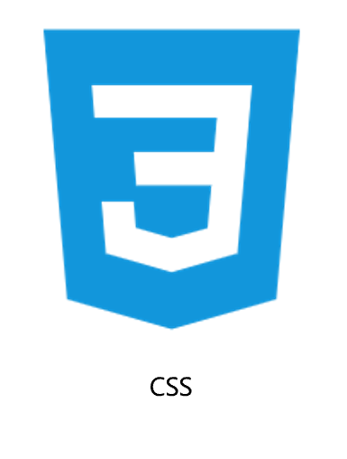
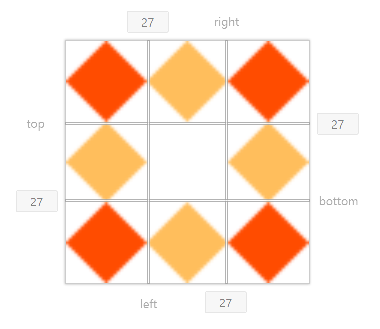

[TOC]


# CSS

****

***层叠样式表(Cascading Style Sheets)***

<center></center>


## 🍀写法

### 内嵌式

> <u>*css写在`<style>`标签里，`<style>`标签一般写在`<head>`标签里面，`title`标签下面*</u>
>
> 🥕使用场景: 小案例

### 外联式

> <u>*css写在一个单独的.css文件中，通过`<link rel="stylesheet" href=".css文件的路径"/>`标签引入*</u>
> 🥕使用场景: 项目中

### 行内式

> *<u>css写在标签的`style`属性中</u>*
> 🥕使用场景: 配合js使用


## ✨语法

```css
选择器 {
    css属性名: css属性值;
    ... 
}
```

### 注释

```css
/* css注释 */
```


## ⭐选择器

### 🔵基础选择器

#### 标签选择器

```css
标签名 {
	css样式
}
```

***<u>标签选择器选择的是一类标签</u>***

>  *选中所有的标签都生效css*


#### 类选择器

```css
.类名 {
	css样式
}
```

***<u>所有标签都有class属性，class属性值称之为类名</u>***

> *类名可以由`数字`，`字母`，`下划线`，`中划线`组成;  但不能以数字和中划线开头*
>
>  *一个标签可以同时拥有多个类名，类名之间以空格隔开*
>
> *类名可以重复，一个选择器可以同时选择多个标签*


#### ID选择器

```css
#id属性值{
	css样式
}
```

***<u>所有标签上都有id属性</u>***

> *`id`值在一个页面中是唯一的，不可重复的*
>
>  *一个标签只允许有一个`id`属性值*
>
> *一个id选择器只能选中一个标签*


#### 通配符选择器

```css
* {
	css样式
}
```

***<u>找到页面中所有的标签，设置样式</u>***


### 🟣关系选择器

#### 后代选择器

```css
选择器1 选择器2 {
	css
}
```

<u>***在选择器1中选择满足选择器2的所有元素***</u>

> *选择器以选择器之间通过 `空格` 隔开*


#### 子代选择器

```css
选择器1 > 选择器2 {
	css
}
```

**<u>在选择器1中选择满足选择器2的所有子元素</u>**

> *选择器与选择器之间通过 `>` 隔开*


#### 并集选择器

```css
选择器1,选择器2 {
	css
}
```

***<u>选择匹配选择器1或者匹配选择器2的所有元素</u>***

> *选择器与选择器之间通过 `，`隔开*
>
> *每组选择器通常一行写一个，提高代码的可读性*


#### 交集选择器

```css
选择器1选择器2 {
	css
}
```

<u>**选择同时满足选择器1选择器2的所有元素**</u>

> *选择器与选择器之间没有东西分割*
>
> *交集选择器中如果存在标签选择器，则标签选择器必须写在最前面*


#### 相邻选择器

```css
选择器1 + 选择器2 {
    css
}
```

> *选择器与选择器之间通过 `+` 隔开*
>
> *选择紧贴在选择器1元素之后第一个选择器2元素，选择器1元素与选择器2必须同属一个父级*


#### 兄弟选择器

```css
选择器1 ~ 选择器2 {
    css
}
```

> 选择器与选择器之间通过 `~` 隔开
>
> *选择选择器1元素后面的所有兄弟选择器2元素，选择器1元素与选择器2元素必须同属一个父级*


### 🔴伪类选择器

#### 💡说明

1. 作用 : **根据元素的HTML中的结构关系查询元素**

2. 优势 : **减少对于HTML中类的依赖，有利于保持代码整洁**

3. 场景 : **常用于查询某父级选择器中的子元素**

   

#### 子元素选择器

|             语法              |                      作用                       |
| :---------------------------: | :---------------------------------------------: |
|    ***`E:first-child{}`***    |  <u>匹配父元素中第一个子元素，而且是E元素</u>   |
|    ***`E:last-child{}`***     | <u>匹配父元素中最后一个子元素，而且是E元素</u>  |
|   ***`E:nth-child(n){}`***    |   <u>匹配父元素中第n个子元素，而且是E元素</u>   |
| ***`E:nth-last-child(n){}`*** | <u>匹配父元素中倒数第n个字元素，而且是E元素</u> |


#### 类型子元素选择器

|             语法              |                    作用                     |
| :---------------------------: | :-----------------------------------------: |
|    ***`E:first-of-type`***    |   <u>匹配同级兄弟元素中的第一个E元素</u>    |
|    ***`E:last-of-type`***     |  <u>匹配同级兄弟元素中的最后一个E元素</u>   |
|   ***`E:nth-of-type(n)`***    |   <u>匹配同类型中的第n个同级兄弟元素E</u>   |
| ***`E:nth-last-of-type(n)`*** | <u>匹配同类型中的倒数第n个同级兄弟元素E</u> |


#### 🧮n的可套用公式

> **`2n/even`**     			 :	偶数
>
> **`2n+1/2n-1/odd`** 	:	奇数
>
> **`-n+number`**    		:    前number个
>
> **`n+number`**     		:    后number个


## 📄文本

### 字体样式

- ###### 字体大小

  - > ```css
    > font-size: number(px);
    > ```
    >
    > ​		*<u>单位像素</u>*
    >
    > ❕***<span style='color: red;'>最小值 12px</span>***

- ###### 字体粗细

  - > ```css
    > font-weight: [可选];
    > ```
    >
    >   ​		**`normal`**	:  标准的字符(400/默认)
    >
    > ​      **`bold`**		 :  粗体(700)
    >
    > ​      **`bolder`** 	:  更粗
    >
    > ​      **`lighter`** 	:  更细
    >
    > ​      **`100 ~ 900`** : 由粗到细

- ###### 字体样式

  - > ```css
    > font-style: [可选];
    > ```
    >
    > ​	  **`normal`**	:  标准的字体(默认)
    >
    > ​      **`italic`**		:  斜体
    >
    > ​      **`oblique`**  :  倾斜

- ###### 文字阴影

  - > ```css
    > test-shadow: h-shadow v-shadow [可选];
    > ```
    >
    > ​		**`h-shadow`**	:	水平阴影的位置(必选)
    >
    > ​		**`v-shadow`**	:	垂直阴影的位置(必选)
    >
    > ​		**`blur`**		:	模糊的距离(可选)
    >
    > ​		**`color`**	  :	阴影的颜色(可选)

- ###### 字体类型

  - > ```css
    > font-family: [可选];
    > ```
    >
    > ​	STXingkai / STXinwei / FZShuTi / ......

- ###### 复合属性

  - > ```css
    > font: style weight size/line-height family;
    > ```
    >
    > ​	<u>*可省略前两个(默认值)*</u>
    >
    > ​	<u>*复合属性，可以设置单独或者连写形式*</u>
    >
    > ​	<u>*可以把单独的样式写在连写的下面*</u>


### 样式层叠

```css
p{
    font-size: 20px;
    color: aqua;
    color: brown;
}
```


> ❕*<u>如果给同一个标签设置相同的属性时，此样式会层叠(覆盖) 后面的会覆盖前面的</u>*


### 文本样式

- ###### 文本缩进

  - > ```css
    > text-indent: number(单位);
    > ```
    >
    > ​		**`px`**    :  像素
    >
    > ​       **`em`**  :  字数(推荐)

- ###### 文本水平对齐

  - > ```css
    > text-align: [可选];
    > ```
    >
    > ​	        **`left`**		 :  左对齐(默认)
    >
    > ​	        **`right`**	  :  右对齐
    >
    > ​	        **`center`**  :  居中对齐
    >
    > ​			  **`justify`**  :  两端对齐
    >
    > **作用标签**
    >
    > ​	*<u>`文本`，`a`，`span`，`input`，`img`</u>*

- ###### 文本字符间距

  - > ```css
    > letter-spacing: number(单位);
    > ```
    >
    > ​		**`px`**    :  像素
  
- ######  文本修饰

  - > ```css
    > text-decoration: [可选];
    > ```
    >
    > ​	   **`none`**        	   :  标准的文本(默认)，可定义清除`<a>`标签的下划线
    >
    > ​      **`underline`** 	   :  下划线 
    >
    > ​      **`overline`**    	  :  上划线
    >
    > ​      **`line-through`**  :  删除线
    >
    > ​      **`blink`** 				 :  闪烁


### 文本修剪

> ```css
> text-overflow: [可选];
> ```
>
> ​		**`clip`**	:	修剪文本
>
> ​		**`ellipsis`**	:	显示省略符号来代表被修剪的文本
>
> ​		**`string`**	  :	使用给定的字符串来代表被修剪的文本


### 文本行高

> ```css
> line-height: number(单位);
> ```
>
> ​		 **`px`**    	:  像素
>
> ​        **`部数`**	:  当前标签`font-size`的属性值的部数
>
> ❕**可以使用  `line-height:1;` 取消上下间距**


### 文本换行

> ```css
> white-space: [可选];
> ```
>
> ​		**`normal`**	 :	<u>序列的空格合并为一个</u>，<u>内部是否换行由换行规则决定</u>(**默认**)
>
> ​		**`pre`**	:	原封不动的保留你输入时的状态，空格、换行都会保留，文字不换行
>
> ​		**`nowrap`**	:		合并空白符序列，文本不会换行
>
> ​		**`pre-wrap`**	:		保留空白符序列，但是正常地进行换行
>
> ​		**`pre-line`**	  :		合并空白符序列，但是保留换行符


### 文本行数

> ```css
> -webkit-line-clamp: <number>;
> ```
>
> ​			**`number`** 	:	块元素显示的文本的行数


### 颜色扩展

- 字体颜色

  - ```css
    color: 颜色;
    ```

- 背景颜色

  - ```css
    background-color: 颜色;
    ```


### 🌈颜色取值

|           表达            |                取值                 |
| :-----------------------: | :---------------------------------: |
|        **关键字**         |    *`red`，`green`，`blue`，...*    |
|    **rgb表示法0~255**     | *`rgb(0,0,0)`，`rgb(255,0,0)`，...* |
| **rgba表示法 a透明度0~1** |    *`rgba(255,255,255,0)`，...*     |
|    **十六进制表示法**     |     *`#000000`，`#ff0000`，...*     |

```html
<div style="color:aqua;">关键字</div>
<div style="color:rgb(255, 20, 4)">rgb表示法</div>
<div style="color:rgba(34, 234, 34, 1)">rgba表示法</div>
<div style="color:#3A94FD">十六进制表示法</div>
```


## 🌄背景

### 背景颜色

> ```css
> background-color: 颜色;
> ```
>
> ​		关键字(**`red`**)
>
> ​		十六进制值(**`#ff0000`**)
>
> ​		rgb码(**`rgb(255,0,0)`**)
>
> ​		透明(**`transparent`**)**默认值**


### 背景图片

> ```css
> background-image: [可选];
> ```
>
> ​		**`url('图片的URL')`**   :   元素设置背景图像
>
> ​		**`none`**    :   不显示背景图像(**默认值**)
>
> *默认水平和垂直方向平铺*
>
> *背景图片不会撑开盒子的*


### 背景平铺

> ```css
> background-repeat: [可选];
> ```
>
> ​	   **`repeat`**    	:	在垂直方向和水平方向重复(默认)
>
> ​      **`repeat-x`**	 :	在水平方向重复
>
> ​      **`repeat-y`**    :	在垂直方向重复
>
> ​      **`no-repeat`**  :	仅显示一次


### 背景位置

> ```css
> background-position: x y;
> ```
>
> ​		**`(l/c/r) (l/b/r/c)`** :  关键字
>
> ​	        <u>*如果只规定了一个关键词，那么第二个值将是 `center` *</u>
>
> ​      **`% %`**  :  百分比
>
> ​	        *<u>如果值仅规定了一个值，另一个值将是 50%</u>*
>
> ​      **`px px`**  :  像素
>
> ​	        <u>*如果值仅规定了一个值，另一个值将是 50%*</u>


### 背景大小

> ```css
> background-size: x y;
> ```
>
> ​		**`px px`**  :  像素
>
> ​      **`% %`**  :  百分比
>
> ​      **`cover`**  :  背景图像扩展至足够大，以使背景图像完全覆盖背景区域
>
> ​      **`contain`**  :  宽度和高度完全适应内容区域
>
> ​	        <u>*如果只设置一个值，则第二个值会被设置为 auto*</u>


### 背景起源

>```css
>background-origin: [可选];
>```
>
>​		**`border-box`**	  :	背景相对于边框进行定位
>
>​		**`padding-box`**	:	背景相对于填充框定位
>
>​		**`content-box`**	:	背景相对于内容框定位


### 背景剪辑

> ```css
> background-clip: [可选];
> ```
>
> ​		**`border-box`**	:	背景延伸到边框的外边缘
>
> ​		**`padding-box`**	:	背景延伸到填充的外边缘
>
> ​		**`content-box`**	:	背景剪切在内容框中
>
> ​		**`text`**	:	背景剪切在前景文本内


### 复合属性

> ```css
> background: color image repeat position/size;
> ```
>
> ***复合属性，取值之间以空格隔开***
>
> |          拆分属性           |                   说明                   |
> | :-------------------------: | :--------------------------------------: |
> |   **`background-color`**    |                 背景颜色                 |
> |  **`background-position`**  |              背景图像的位置              |
> |    **`background-size`**    |              背景图片的尺寸              |
> |   **`background-repeat`**   |             如何重复背景图像             |
> |   **`background-origin`**   |            背景图片的定位区域            |
> | **`background-attachment`** | 背景图像是否固定，随着页面的其余部分滚动 |
> |   **`background-image`**    |             需使用的背景图像             |
> |    **`background-clip`**    |              背景图像的剪辑              |


## 💠显示模式

### 块级元素

> ```css
> block
> 比如: div,p,h1~h2,ul,li,dl,dt,dd,form,header,nav,footer...
> ```
>
>  ​     *独占一行*
>
> ​    *宽度默认是父元素的宽度，高度默认由内容撑开*
>
> ​    *可设置高宽*


### 行内元素

> ```css
> inline
> 比如: a,span,b,u,i,s,string,ins,em,del...
> ```
>
> ​	*一行可显示多个*
>
> ​    *高宽默认由内容撑开*
>
> ​    *不可以设置高宽*


### 行内块元素

> ```css
> inline-block
> 比如: input,textarea,button,select,img...
> ```
>
> ​	*一行可以显示多个*
>
> ​    *可以设置高宽*


### 🌀显示模式转换

> ```css
> display: [可选]; 
> ```
>
> ​	  **`none`** 	:  元素不会被显示
>
> ​      **`block`**   :  素将显示为块级元素(前后会带有换行符)
>
> ​      **`inline`**   :  元素显示为行内元素(没有换行符)
>
> ​      **`inline-block`**  :  元素显示为行内块元素


## 🎐CSS特性

### 继承性

> <u>*子元素默认继承父元素的样式(`颜色`，`字体样式`，`文本对齐方式`，`行高`...)*</u>


### 层叠性

> <u>*当样式冲突时，只有当选择器优先级相同时，才能通过层叠性判断结果*</u>
>
> ​		*给同一个标签设置不同的样式，此时样式会叠加共同作用在标签上*
>
> ​      *给同一个标签设置相同的样式，此时写在最后的样式会覆盖生效在标签上*


### 优先性

$$
公式: 
继承 < 通配符选择器 < 标签选择器 < 类选择器 < id选择器 < 行内样式 < !important
$$

> *<u>不同选择器具有不同的优先级，优先级高的选择器样式会覆盖优先级低的选择器的样式</u>*
>
> ​	*`!important`写在属性值的后面，以空格隔开*
> 
> ​    *`!important`不能提升继承的优先级*
> 
>​    *开发中不建议使用`!important`*


### 🔅叠加计算

$$
权重叠加计算公式:
( 行内样式的个数, id选择器的个数, 类选择器的个数, 标签选择器的个数 )
$$

> *<u>如果是复合选择器，此时需要通过权重叠加计算方法，判断最终选择器的优先级</u>*
>
> ​	❕❕**比较规则**
> 
> ​	   *先比较第一级数字，如果比较结果出来，之后统统不看*
> 
>​      *如果第一级数字存在相同，再去比较第二级数字，如果比较结果出来，之后统统不看*
> 
>​      *以此类推，直到比较结果出来...*
> 
>​      *如果最终数字都相同，则比较层叠性*


## 📦盒子模型


***	页面中的每一个标签，都可以看做是一个 “盒子”，通过盒子的视角更方便的进行布局***


### 🧱构成

- > **`context`**  ： <u>*内容区域*</u>

- > **`padding`** ： <u>*内边距区域*</u>

- > **`border`**   ： *<u>边距区域</u>*

- > **`margin`**   ：*<u>外边距区域</u>*


### 盒子内容


> *可以通过`width`，`height`来设置盒子内容的宽高*


### ⬜盒子边框


```css
border: border-width, border-style, border-color;
```

- ###### 边框的宽度

  - > ```css
    > border-width: [可选];
    > ```
    >
    > ​		 **`thin`**    	:   细边框
    >
    > ​        **`medium`**  :  中等边框
    >
    > ​        **`thick`**     :  粗边框
    >
    > ​        **`length`**   :  自定义边框宽度

- ###### 边框的样式

  - > ```css
    > border-style: [可选];
    > ```
    >
    > ​		 **`none`** 	:  无边框
    >
    > ​       **`dotted`**  :  点状边框
    >
    > ​       **`dashed`** :  虚线
    >
    > ​       **`solid`** 	 :  实线
    >
    > ​       **`double`** :  双实线

- ###### 边框的颜色

  - ```css
    border-color: 颜色;
    ```


#### 单独设置盒子的边框

```css
border-方向名: border-width, border-style, border-color;
/*
	border-top	  : 上边框
	border-bottom : 下边框
	border-left	  : 左边框
	border-right  : 右边框
*/
bodder-边框属性: [border-width/border-style/border-color];
/*
	border-width  : 边框的宽度
	border-style  : 边框的样式
	border-color  : 边框的颜色
*/
```


#### 设置盒子指定位置边框的属性

```css
border-方向名-属性: 属性值;
```


### 盒子尺寸

$$
盒子尺寸 = width / height + (border-width*4)
$$


### 🔲盒子内边框


> ```css
> padding: [可选];
> ```
>
> ​		*4个数值*  :   **上，右，下，左**
>
> ​		*3个数值*  :	**上，左右，下**
>
> ​		*2个数值*  :	**上下，左右**
>
> ​		*1个数值*  :	**上下左右**
>
> ❕***单位:*** **`%`，`px`，`auto`**
>
> ❕***<u>数值之间使用空格隔开</u>***
>
> ​	*不允许使用负值*
>
> ​    *顺时针方法设置*


#### 单个方向设置内边距

- ###### *设置上内边距*

  - ```css
    padding-top: number;
    ```

- ###### *设置下内边距*

  - ```css
    padding-bottom: number;
    ```

- ###### *设置左内边距*

  - ```css
    padding-left: number;
    ```

- ###### *设置右内边距*

  - ```css
    padding-right: number;
    ```

  

#### 盒子内减

> ```css
> box-sizing: border-box;
> ```
>
> *通过从已设定的宽度和高度分别减去边框和内边距才能得到内容的宽度和高度*


### 🔳盒子外边框


> ```css
> margin: [可选];
> ```
>
> ​		*4个数值*  :   **上，右，下，左**
>
> ​		*3个数值*  :	**上，左右，下**
>
> ​		*2个数值*  :	**上下，左右**
>
> ​		*1个数值*  :	**上下左右**
>
> ❕***单位:***  **`%`，`px`，`auto`**
>
> ❕***<u>数值之间使用空格隔开</u>***
>
> ​	*不允许使用负值*
>
> ​    *顺时针方法设置*


#### 单个方向设置外边距

- *设置上外边距*

  - ```css
    margin-top: number;
    ```

- *设置下外边距*

  - ```css
    margin-bottom: number;
    ```

- *设置左外边距*

  - ```css
    margin-left: number;
    ```

- *设置右外边距*

  - ```css
    margin-right: number;
    ```

  

#### 清除默认盒子内外边距

```css
* {
	padding: 0;
	margin: 0;
}
```


#### 水平居中

> ```css
> margin : 0 auto;
> ```
>
> *一般对于固定宽度的盒子，如果盒子没有设置宽度，会默认占满父元素的宽度*


#### ❔外边距合并问题

> ❗***<u>垂直布局的 块级元素的 上下的`margin`会合并，结果取两者之间的最大值</u>***


#### ❔外边距塌陷问题

> ❗***<u>互相嵌套的 块级元素的 子元素的`margin-top` 会作用在父元素上，会导致父元素一起往下移</u>***


##### 解决方法

1. > *给父元素设置 **`border-top`** 或者 **`padding-top`***

2. > *给父元素设置 **`overflow: hidden;`***

3. > *转换行内块元素*

4. > *设置浮动*


### ❓行内元素的内外边距问题

> ❗***无法通过 `margin` 或 `padding` 修改行内元素的垂直位置****
>
> ​		*内元素的 **`margin-top/bottom`** 的无法生效*
>
>   ​       *行内元素的 **`padding-top/bottom`** 的无法生效*


### ⬛盒子阴影

***设置盒子阴影***

> ```css
> box-shadow: h-shadow v-shadow [可多选];
> ```
>
> ​      **`h-shadow`** 	:  水平阴影的位置(**必需**)，允许负值
>
> ​      **`v-shadow`** 	:  垂直阴影的位置(**必需**)，允许负值
>
> ​      **`blur`**   			 :  模糊度(**可选**)
>
> ​      **`spread`**  		:  阴影大小(**可选**)
>
> ​      **`color`**  			:  阴影颜色(**可选**)
>
> ​      **`inset`**  			:  将外部阴影改为内部阴影(**可选**)
>
> ❕***按照顺序设置***


## ◽伪元素

***一般页面中的非主体内容可以使用伪元素***


### 种类

- ```css
  ::before : 在父元素内容的最前面添加一个伪元素
  ```

- ```css
  ::after  : 在父元素内容的最后添加一个伪元素
  ```

  

> ❕*必须设置**`content`***属性才能生效
>
> ❕*伪元素默认是行内元素*


### 元素与伪元素的区别

1. **元素** : *HTML设置的标签*
2. **伪元素** : *CSS 模拟出标签效果*


### 伪元素选择器

|          语法           |                   作用                   |
| :---------------------: | :--------------------------------------: |
|    ***`E::after`***     | <u>选择E元素内的`::after`的子伪元素</u>  |
|    ***`E::before`***    | <u>选择E元素内的`::before`的子伪元素</u> |
| ***`E::first-letter`*** |      <u>选择E元素内的第一个文字</u>      |
|  ***`E::first-line`***  |      <u>选择E元素内的第一行文字</u>      |


## 🔆标准流

***<u>标准流 又称“<span style='color:red;'>文档流</span>”</u>，是浏览器在渲染显示网页内容时默认采用的一套排版规则，规定了应该以何种方式排列元素***

> ***浏览器解析行内/行内块标签的时候，应标签换行会产生一个空白的距离***


### 常见标准流排版规则

1. **块级元素 ：** *从上往下，垂直布局，独占一行*
2. **行内/行内块元素：**  *从左往右，水平布局，空间不过自动换行*


## ⛅浮动

> ```css
> float: [可选];
> ```
>
> ​	   **`left`** 	:  元素向**左浮动**
>
> ​      **`right`**  :  元素向**左浮动**
>
> ​      **`none`**  :  元素不浮动(**默认**)


### 特点

- ***会脱离标准流，在标准流中不占位置***
- ***会覆盖标准流中的元素***
- ***下一个浮动会在是上一个浮动元素后面左右浮动***
- ***浮动的标签时顶对齐的***
- ***浮动后的标签具有行内块属性***
- ***无法水平居中***


### 清除浮动

> ❕*如果子元素浮动了，此时子元素不能撑开标准流的块级父元素*

1. **额外标签法**

   1. *给父元素的最后添加一个块级元素(**可以是伪元素**)*

   2. *给添加的块级元素设置 **<u>`clear:both;`</u>***

   3. ```css
      // 补全:为了兼容性IE
      height: 0;
      visibility: hidden;
      ```

2. **双伪元素清除法**

   1. ```css
      .clearfix::before,
      .clearfix::after{
      	content: '';
      	display: table;
      }
      .clearfix::after{
      	clear: both;
      }
      ```

3. ***给父元素设置 `overflow:hidden;`***


## 🔰定位

***可以让元素自由的摆放在网页的任何位置***


> ```css
> position: [可选];
> ```
>
> ​		**`absolute`** 	:  生成**绝对定位**的元素，*相对于浏览器窗口进行定位*
>
> ​		**`relative`**		:  生成**相对定位**的元素，*相对于其正常位置进行定位*
>
> ​		**`fixed`**			 :  生成**固定定位**的元素
>
> ​		**`static`**			:  没有定位(**默认**)
>
> ​		**`sticky`**			:  生成**粘性定位**的元素，*相对于浏览器窗口进行定位*


### 偏移

***设置定位方式，任何通过偏移值来设置元素的具体位置***

> ```css
> left    : 左间距
> right   : 右间距
> top     : 上间距
> bottom  : 下间距
> ```
>
> *如果 `left`与`right` 都有，以`left`为准*
>
> *如果 `top`与`bottom` 都有，以`top`为准*


### 🔍相对定位

```css
position: relative;
```

***生成相对定位的元素，相对于其正常位置进行定位***    

> ​    *占有原来的位置*
>
> ​    *依然具有标签的原有的特点*
>
> ​    *参照原来的位置而移动位置*


### 🔎绝对定位

```css
 position: absolute;
```

**先找到以定位的元素，如果有这个元素就以这个父级参照; **

***如果有父级，但是父级没有定位，就以浏览器为参照，如果有这个元素就以这个父级参照***

> ​      *在页面中不占位置*
>
> ​      *参照浏览器可视区域镜进行移动*
>
> ​      *会改变标签的显示模式,具由行内块特点*


### 📍固定定位

```css
position: fixed;
```

***相当于浏览器进行位置移动,将盒子固定在屏幕的某个位置***

> ​    *在页面中不占位置*
>
> ​    *具备行内块特征*
>
> ​	*不会随着文档页面滚动而滚动*


### 🍙粘性定位

```css
position: sticky;
```

***粘性定位可以被认为是相对定位和固定定位的混合体，当它最接近的滚动祖先是视口时。粘性定位的元素被视为相对定位，直到它超过指定的阈值，此时它被视为固定，直到它到达其父级的边界***

> ​    *占有原来的位置*
>
> ​    *具备行内块特征*
>
> ​	*不会随着文档页面滚动而滚动*


### 💡子绝父相

***子元素使用绝对定位，父元素只有使用定位不管是绝对/相对，子元素都会参照父元素的位置移动***

> *绝对定位查找父级的方式;  就进原则的父级(逐个往上查找父级直到浏览器窗口)*


### ⏹定位居中

***<u>使用子绝父相，让子元素在父元素内水平居中</u>***

- ***水平居中***

  - ```css
    /* 方法一 */
    position: absolute;
    left: 50%;
    margin-left: 盒子宽度-50%像素;
    /* 方法二 */
    position: relative;
    margin: 0 auto;
    ```

- ***垂直居中***

  - ```css
    position: absolute;
    top: 50%;
    margin-top: 盒子高度-50%像素;
    ```

- ***水平垂直居中***

  - ```css
    position: absolute;
    top: 50%;
    left: 50%;
    /* 位移设置自己宽度高度的50% */
    transform: translate(-50%,-50%);
    ```


## 🎇CSS书写顺序

1. ***定位/浮动/`display`***
2. ***盒子模型***
3. ***文本属性***


## 📚层级关系

***不同布局方式元素的层级关系***
$$
标准流 > 浮动 > 定位
$$
 ***不同定位之间的层级关系***

> ​    *相对/绝对/固定 默认创建相同*
>
> ​    *默认情况下，写在下面的的元素会覆盖上面的元素*


### *设置层级优先级*

> ```css
>  z-index : number;
> ```
>
> ***设置元素的堆叠顺序，高堆叠顺序的元素会堆叠顺序较低的元素的前面***
>
> ​    *可有负值*
>
> ​    *默认值 `0`*
>
> ​    *该属性必须配合定位才有效*


## 📏垂直对齐

***基线: 浏览器文字类型元素排版使用对齐的基线(`baseline`)，处理 行内/行内块 元素默认使用对齐的基线***


> ```css
> vertical-align: [可选];
> ```
>
> ***属性设置元素的垂直对齐方式***
>
> ​      **`baseline`**	:  基线对齐(**默认**)
>
> ​      **`top`**			  :  顶部对齐
>
> ​      **`middle`** 	 :  中部对齐
>
> ​      **`bottom`** 	:  底部对齐


## 🔼光标类型

***设置光标在元素上要显示的光标的类型***

> ```css
> cursor: [可选];
> ```
>
> ​      **`default`**	:  箭头(**默认**)
>
> ​      **`pointer`**	:  小手
>
> ​      **`text`**   		:  文本
>
> ​      **`crosshair`** :  十字线
>
> ​      **`move`**   	:  可被移动
>
> ​      **`wait`**     	:  程序正忙
>
> ​      **`help`**        :  问号


## ⚪边框圆角

> ```css
> border-radius: [可选];
> ```
>
> ​		**4个数值** : *上左，上右，下右，下左*
>
> ​		**3个数值** : *上左，上右下左，下右*
>
> ​		**2个数值** : *上左下右，上右下左*
>
> ​		**1个数值** : *四周*
>
> ***设置盒子圆角边框***
>
> ​    *顺时针设置属性*
>
> ​    *属性是一个简写属性，用于设置四个 `border--radius` 属性*
>
> ​	 ***取值: `px`，`%`***


## 🛑溢出显示

***控制 内容溢出部分 的显示效果***

> ```css
>  overflow: [可选];
> ```
>
> ​      	**`visible`** 	:  会呈现在元素框之外(**默认**)
>
> ​      	**`hidden`**   :  溢出部分隐藏
>
> ​      	**`scroll`** 	 :  无论是否溢出，都显示滚动条
>
> ​      	**`auto`**   	 :  根据是否溢出，自动显示和隐藏滚动条


## 🍳显示隐藏

***设置元素是否可见***

1. > ```css
   > visibility: [可选];
   > ```
   >
   > ​      **`visible`**  	:  **可看**(**默认**)
   >
   > ​      **`hidden`** 	:  **隐藏**，但是仍占据其本来的空间

2. > ```css
   > display: [可选];
   > ```
   >
   > ​      **`none`**     :   **不占位置隐藏**
   >
   > ​      **`block / inline / inline-block`**  :  **显示**


## 🔘透明属性

***设置元素(包括内容)的透明级别***

```css
opacity: 0.0(完全透明) ~ 1.0(完全不透明);
```


## 🦄精灵图

### 精灵图的使用

1. 创建盒子，设置盒子的尺寸大小
2. 将精灵图设置为盒子的背景图片
3. 修改背景图位置 ***`background-position: x y;`***


### 设置背景图像的起始位置

> 
>
> ```css
> background-position: x(水平) y(垂直);
> ```
>
> ​      ***`关键字(t/c/b) 关键字(l/c/r)`***
>
> ​        		*<u>只规定了一个关键词，那么第二个值将是"`center`"</u>*
>
> ​      **`% %`** 	:  ***百分比***
>
> ​      **`px px`**	:  ***像素***
>
> ​        		*<u>只规定了一个值，另一个值将是 50%</u>*
>
> ❕***可负值***


## ⬜边框图像

***一个简写属性，设置盒子绘制边框图像***



> ```css
> border-image: source slice / width / outset repeat;
> ```
>
> |     属性     |      作用      |
> | :----------: | :------------: |
> | **`source`** |  *边框图形源*  |
> | **`slice`**  | *边框图像切片* |
> | **`width`**  | *边框图像宽度* |
> | **`outset`** | *边框图像开头* |
> | **`repeat`** | *边框图像重复* |
>
> :grey_exclamation::grey_exclamation: <u>***如果<span style=color:red;>边框样式</span>是 `none`或 <span style=color:red;>边框宽度</span>是 `0`，则浏览器不会呈现`边框图像`***</u>


## 🔃过渡

***一个简写属性，设置四个过渡属性，过滤通常配合<u>`hover`</u>使用***

> ```css
> transition: property duration [可多选];
> ```
>
> ​      **`property`** :	 *<u>定义应用过渡效果的 CSS 属性名称列表</u>*，**列表以逗号分隔**
>
> ​     	 		**<samp>all</samp>**   	 :  *所有属性都将获得过渡效果*
>
> ​      			**<samp>none</samp>**   :  *没有属性会获得过渡效果* 
>
> ​      **`duration`** :	 *<u>完成过渡效果需要多少秒(`s`)或毫秒(`ms`)</u>*
>
> ​      **`timing-function`** :  *<u>速度效果的速度曲线</u>*
>
> ​				 **<samp>linear</samp>**  :   *相同速度开始至结束*
>
> ​        		**<samp>ease</samp>**   :   *慢速开始，然后变快，然后慢速结束*
>
> ​        		**<samp>ease-in</samp>** :  *以慢速结束*
>
> ​        		**<samp>ease-in-out</samp>** :   *以慢速开始和结束*
>
> ​        		**<samp>cubic-bezier(n,n,n,n)</samp>** :   *自定义速度 `0 ~ 1` 之间*
>
> ​      **`delay`**  : *<u>过渡效果开始之前需要等待的时间，以秒(`s`)或毫秒(`ms`)计</u>*


## 🔖骨架标签

```css
<!-- 文档类型声明 -->
<!DOCTYPE html>
<!-- 标识网页使用的语言
        en : 英文
        zh-CN : 简体中文
 -->
<html lang="en">
<head>
    <!-- 标签网页使用的字符编码 -->
    <meta charset="UTF-8">
    <!-- 兼容IE -->
    <meta http-equiv="X-UA-Compatible" content="IE=edge">
    <!-- 兼容移动端 -->
    <meta name="viewport" content="width=device-width, initial-scale=1.0">
    <title>骨架标签</title>
</head>
<body>
</body>
</html>
```


## 🎈SEO三大标签

1. ***网页标题标签 : <u>tiltie</u>***

   1. ```css
      <title>标签</title>
      ```

2. ***网页描述标签 : <u>description</u>***

   1. ```css
      <meta name="description" content="网页描述标签">
      ```

3. ***网页关键字标签 : <u>keywords</u>***

   1. ```css
      <meta name="keywords" content="网页关键字标签">
      ```


## 🚩标题图标

***显示网页标题左侧的小图标，常用<u>.ico</u>格式的图标***

```css
<link rel="shortcut icon" href="logo.ico" type="image/x-icon">
```


## 🔄平面转换

***向元素应用 2D 或 3D 转换，改变盒子的平面内的形状(位移，旋转，缩放)***


> ```css
> transform: [可选];
> ```
>
> ​      **`translate(x,y)`** :	 *<u>水平`x`，`y`的值位移</u>*
>
> ​      		  **取值:**
>
> ​         				*`px`，`%`(参照盒子自身的尺寸)*
>
> ​        		**设置某个方向:**
>
> ​				         ***<samp>translateX(x)</samp>** :  位移 `X` 轴的值*
>
> ​         				***<samp>translateY(y)</samp>** :  位移 `Y` 轴的值*
>
> ​      **`rotate(deg)`** :  *<u>设置 2D 旋转</u>*
>
> ​        		**取值:**
>
> ​          				*<samp>deg(`角度`，`可负数`)</samp>*
>
> ​      **`scale(x,y)`** :   *<u>设置 2D 缩放转换</u>**；**`值大于1放大,小于1缩小`*
>
> ​        		**取值:**
>
> ​          				*轴的`缩放倍数`，`可负数`，`小数`*				
>
> ❕*只设置一个值，表示`x轴`与`y轴`<samp>等比例缩放</samp>*


### 多重转换

```css
transform: 位移 旋转;
```


## 🔽转换原点

***设置改变被转换元素的原点，默认原点在盒子中心点，<u>该属性必须与 `transform` 属性一同使用</u>***

> ```css
> transform-origin:  x-axis(原点水平位置) y-axis(原点垂直位置);
> ```
>
> **取值:**
>
> ​		**`(top/bottom/left/right/center)`** :  *方向名词*
>
> ​		**`px`** :  *像素*
>
> ​      **`%`**  :  *百分比，参照盒子自身的尺寸*


### 🌅渐变背景

> ```css
> background-image: linear-gradient(
> 	color1,
> 	color2,
> 	color..
> );
> ```
>
> ​		**`linear-gradient(...)`**	:	线性渐变
>
> ​		**`radial-gradient(...)`**	:	径向梯度
>
> ​		**`repeating-linear-gradient(...)`**	:	重复线性渐变组成
>
> ​		**`repeating-radial-gradient(...)`**:	重复径向梯度
>
> ​		**`conic-gradient(...)`**	:	圆锥梯度
>
> ​		**`repeating-conic-gradient(...)`**	:	重复圆锥梯度
>
> ***设置背景颜色逐渐变化的效果，多个颜色使用 “`,`” 隔开***


## ⏫空间转换

<u>***空间: 是从坐标轴角度定义的。***</u>

<u>***`x`，`y` 和 `z`  三条坐标轴构成了一个立体空间，`z`轴位置与视线方向相同。***</u>

<u>***空间转换也叫做3D转换***</u>


> ```css
> transform: [可选];
> ```
>
> ​			**`translate3d(x，y，z)`**  :   *定义 3D 转换*
>
> ​			**`translateX(x)`**  :   *定义转换，只是用 `X 轴`的值*
>
> ​			**`translateY(y)`**  :   *定义转换，只是用 `Y 轴`的值*
>
> ​			**`translateZ(z)`**  :   *定义 3D 转换，只是用 `Z 轴的`值*
>
> **取值:**
>
> ​	**`px`**	:  像素
>
> ​	**`%`**	 :  百分比
>
> ❕❕***`z轴`是视线方向，移动效果应该是距离的近或远，电脑屏幕是平面，默认无法观察近远效果***
>
> ❗❗***需父元素必须设置`perspective`属性才可见效***

 

### 👁‍🗨透视距离

***透视距离也称之为<span style='color:red;'>视距</span>(人的眼睛到屏幕的距离)，属性定义 3D 元素距视图的距离***


> ```css
> perspective: [可选];
> ```
>
> ​        **`number`**   :   元素距离视图的距离*(800~1200)*，以`像素`计 
>
> ​        **`none`** 		:   不设置透视(**默认**)
>
> ❗***设置在使用<u>3D转换</u>的元素的父元素内***


## 🔁空间旋转

> ```css
> transform: [可选];
> ```
>
> ​			**`rotate3d(x,y,z,number)`** :   **定义 3D 旋转**
>
> ​						**`x`，`y`，`z`** :   *取值范围(`0~1`)*   
>
> ​			**`rotateX(x)`** :  **`X 轴`的 3D 旋转**
>
> ​			**`rotateY(y)`** :  **`Y 轴`的 3D 旋转**
>
> ​			 **`rotateZ(z)`** :  **`Z 轴`的 3D 旋转**
>
> ❕*<u>**单位: `deg`**</u>*


### 左手法则

> *<u>**判断旋转方向:  <span style='color:red;'>左手握住旋转轴，拇指指向正则方向，手指弯曲方向为旋转正值方向</span>**</u>*


## 🎲立体呈现


> ```css
> transform-style: [可选];
> ```
>
> ***属性规定如何在 3D 空间中呈现被嵌套的元素***
>
> ​			**`flat`**	:   *代表子元素处于 <u>2D 平面内呈现</u>*
>
> ​			**`preserve-3d`**	:  *代表子元素处于 <u>3D 立体呈现</u>*


## 🔎空间缩放

> ```css
> transform: [可选];
> ```
>
> ​			**`scale3d(x,y,z)`**  :   定义 3D 缩放转换
>
> ​						**取值:**  *`倍数`*
>
> ​    		**`scaleX(x)`**  :   设置 `X 轴`的值来定义缩放转换
>
> ​    		**`scaleY(y)`**  :   设置 `Y 轴`的值来定义缩放转换
>
> ​    		**`scaleZ(z)`**  :   设置 `Z 轴`的值来定义 3D 缩放转换


## 🧸动画

***实现多个状态间的变化过程，动画过程可控<u>(<span style='color:red;'>重复播放,最终画面,是否暂停</span>)</u>***


### 🍓实现步骤

1. ##### 定义动画

   1. ```css
      @keyframes 动画名称 {
      	from{}
      	to{}
      }
      /* 两个动画(动画的开始状态和盒子默认样式一致,则可省略from) */
      ```

   2. ```css
      @keyframes 动画名称 {
      	0%{}
      	10%{}
      	15%{}
          ...
      	100%{}
      }
      /* 多个动画(动画总时长的百分比) */
      ```

2. ##### 使用动画

   1. > ```css
      > animation: animation-name animation-duration [可选];
      > ```
      >
      > ​		**`animation-name` ** :  *<u>**需要绑定到选择器的 <samp>keyframe</samp> 名称**</u>*
      >
      > ​				**<samp>动画名称</samp>**  :  *规定需要绑定到选择器的 <samp>keyframe</samp> 的名称*
      >
      > ​				**<samp>none</samp>** :  *规定无动画效果*
      >
      > ​		**`animation-duration`** :  *<u>**动画时长。默认值是 `0`，意味着没有动画效果**</u>*
      >
      > ​		**`animation-timing-function`** :  *<u>**动画度曲线**</u>*
      >
      > ​				 **<samp>linear</samp>**  :   *相同速度开始至结束*
      >
      > ​        		**<samp>ease</samp>**   :   *慢速开始，然后变快，然后慢速结束*
      >
      > ​        		**<samp>ease-in</samp>** :  *以慢速结束*
      >
      > ​        		**<samp>ease-in-out</samp>** :   *以慢速开始和结束*
      >
      > ​        		**<samp>cubic-bezier(n,n,n,n)</samp>** :   *自定义速度 `0 ~ 1` 之间*
      >
      > ​				 **<samp>steps(n)</samp>** :  *将动画分成`n等分`动画*
      >
      > ​		**`animation-delay`** : *<u>**延迟时间，以秒或毫秒计。默认值是 `0`**</u>*
      >
      > ​		**`animation-iteration-count`** :  *<u>**播放次数**</u>*
      >
      > ​				 ***<samp>n</samp>*** ：*定义动画播放次数的数值*
      >
      > ​				 **<samp>infinite</samp>** : *无限次播放动画*
      >
      > ​		**`animation-direction`** :  *<u>**定义是否应该轮流反向播放动画**</u>*
      >
      > ​				**<samp>normal</samp>** : *正常播放动画(**默认**)*
      >
      > ​				**<samp>alternate</samp>** : *轮流反向播放动画*
      >
      > ​				**<samp>alternate-reverse</samp>** ：*轮流反复播放动画*
      >
      > ​		 **`animation-fill-mode`**   ： ***执行完毕的状态***
      >
      > ​				 **<samp>backwards</samp>** ：*回到原来的状态*
      >
      > ​				 **<samp>forwards</samp>** :  *保持最后一帧*
      >
      > ​		**`animation-play-state` :  **<u>暂停动画</u>**
      >
      > ​				 **<samp>paused</samp>**  : *暂停*
      >
      > ​				 **<samp>running</samp>**  :  *播放*
      >
      > ❕***动画名称与动画时长必须赋值***
      >
      > ❕***取值不分先后顺序***
      >
      > ❕***如果有两个时间值，第一个代表动画时长，第二个代表延迟时间***


### 🍃属性

|          拆分属性           |     说明     |
| :-------------------------: | :----------: |
|      `animation-name`       |   动画名称   |
|    `animation-duration`     |   动画时长   |
|      `animation-delay`      |   延迟时间   |
|    `animation-fill-mode`    | 执行完毕状态 |
| `animation-timing-function` |   速度曲线   |
| `animation-iteration-count` |   重复次数   |
|    `animation-direction`    |   执行方向   |
|   `animation-play-state`    |   暂停动画   |


### 多组动画

```css
animation:
	动画1,
	动画2,
	...
;
```


### 逐帧动画


***使用`steps`实现逐帧动画***

1. **准备显示区域**
   1. *设置盒子大小是一张小图的尺寸*，背景为当前精灵图
2. **定义动画**
   1. 改变背景图片的位置*(移动距离就是精灵图的宽度)*
3. **使用动画**
   1. *添加速度曲线`steps(n)`，`n`是精灵图上小图个数*
   2. *添加无限重复效果*


## 📏calc()

> *==**css函数()**==**允许您在指定 CSS 属性值时执行计算。它可以在允许`<长度><频率><角度><时间><百分比><数>`的任何地方使用***


### 语法

> ```css
> calc(表达式);
> 
> // 例
> width: calc(100% - 80px);
> ```
>
> *该函数将单个表达式作为其参数，并将表达式的结果用作值。表达式可以是使用以下运算符使用标准运算符*
>
> *<span style=color:red;>优先规则</span>组合的任何简单表达式*


## ⚪round()

> ***`round()` 该函数返回一个数字<span style=color:red;>四舍五入</span>之后的整数***


### 语法

> ~~~css
> round(十进制数);
> 
> // 例
> width: round(10% - 1.5);
> ~~~
>
> *`-0.5` 舍入为负零；`0.4` 舍入为正零*


## BFC

> *==**BFC即block formatting contexts（`块级格式化上下文`）**==，它是一个独立的渲染区*
>
> *域，具有 BFC 特性的元素可以看作是隔离了的独立容器，容器里面的元素不会在布局上影响*
>
> *到外面的元素，并且 BFC 具有普通容器所没有的一些特性*


## 💿倒影

> ```css
> box-reflect: direction [可选];
> ```
>
> ​		`direction` :	方向，`above,below,right,left`
>
> ​		`length`	:	反射的间隙大小
>
> ​		`image`	:	反射的背景
>
> :grey_exclamation:**<span style=color:red;>*倒影不占空间*</span>**


## 🚫禁止选中

> ~~~css
> user-select: [可选];
> ~~~
>
> ​		`auto`	:	根据浏览器规则走<b>(默认)</b>
>
> ​		`none`	:	禁止选取文本
>
> ​		`text`	:	文本可被用户选取
>
> ​		`all`	:	单击选中
>
> ❕***设置是否允许选取元素的文本***


## ▫▫▫终

<center><b><i><u>- 我想成为你刻骨铭心之人 -</u></i></b></center>

