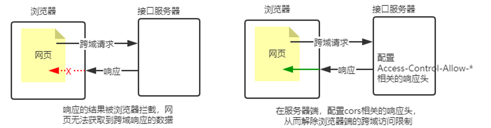
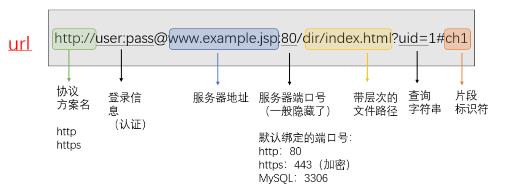
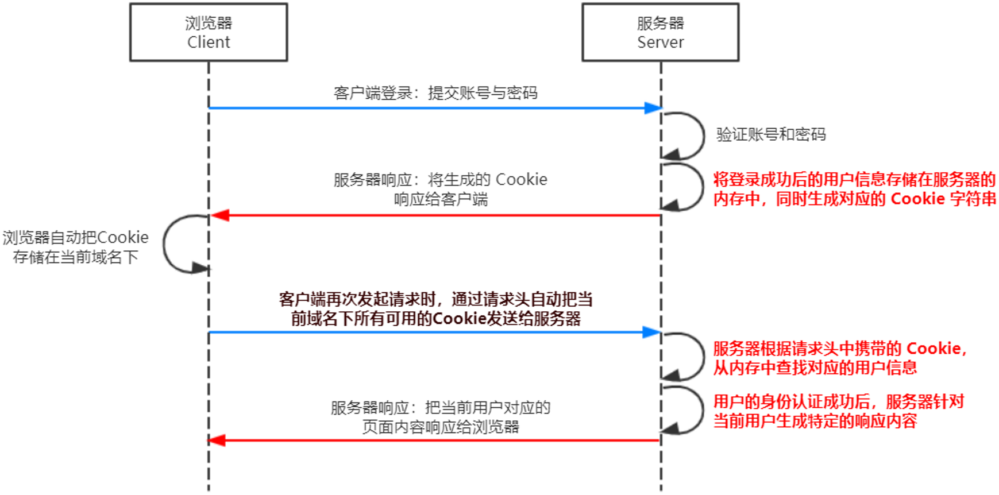
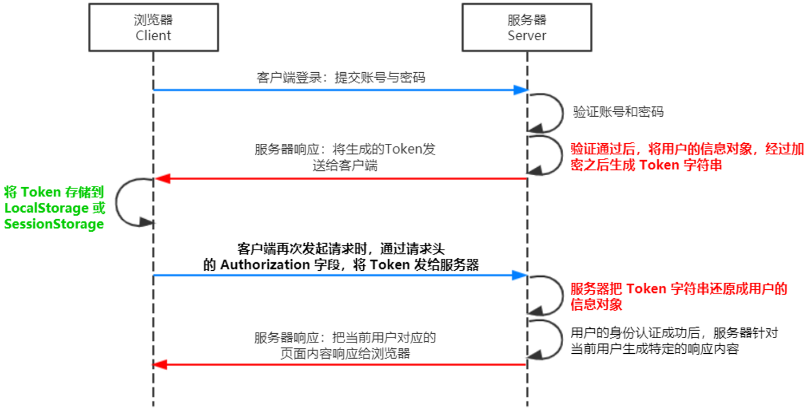

[TOC]

# 🪁Axios

🔗[Axios](https://www.axios-http.cn/docs/intro)

*==**`Axiso` 是专注于<span style=color:red;>网络数据请求</span>的库，<span style=color:red;>使用简单</span>，<span style=color:red;>轻量级</span>，只专注于网络数据请求**==*


## npm 安装

```cmd
npm i axios
```


## get()

> ```javascript
> axios.get(url?key=value=).then(function(response){},function(err){})
> ```
>
> **`url` :  服务器地址**
>
> ​		**==`key=value=`== :  参数字符串，多个参数`&`连接**
>
> **`function(response){}` :  请求成功时执行的回调函数**
>
> ​		**==response== :  响应内容**
>
> **`function(err){}` :  请求失败时执行的回调函数**
>
> ​		**==err==  :  错误信息**

```javascript
// 方式1
// axios.get(`http://localhost:8080/TestRequest/user/queryUsers?id=1`)
// 方式2
axios.get(`http://localhost:8080/TestRequest/user/queryUsers`,{
 	params: {
        id: 1
    }   
}).then(res => {
    console.log(res.data);
}, err => {
    console.warn(err);
});
```


## post()

>```javascript
>axios.post(url,{kay:values}).then(function(response){},function(err){})
>```
>
>**`url` :  服务器地址**
>
>​		**==`{kay:value}`== : 参数对象，多个参数`,`连接**
>
>**`function(response){}` :  请求成功时执行的回调函数**
>
>​		**==response== :  响应内容**
>
>**`function(err){}` :  请求失败时执行的回调函数**
>
>​		**==err==  :  错误信息**

```javascript
axios.post(`http://localhost:8080/TestRequest/user/queryUsers`, { id: 1 })
.then(res => {
    console.log(res.data);
}, err => {
    console.warn(err);
});
```


## axios()

> ```javascript
> axios({config}).then(function(response){},function(err){})
> ```
>
> **`config` :  配置 `axios` 请求**
>
> ​		**`method` : 请求类型**
>
> ​		**`url` : 服务器地址**
>
> ​		**`data` : `POST`请求数据，数据以对象`{}`形式**
>
> ​		**`params` : `GET`请求数据，数据以对象`{}`形式**

```javascript
// get
axios({
    method: 'GET',
    url: 'http://localhost:8080/TestRequest/user/queryUsers',
    params: {
        id: 2
    }
}).then(res => {
    console.log(res.data);
}, err => {
    console.warn(err);
});

// axios(post)
axios({
    method: 'POST',
    url: 'http://localhost:8080/TestRequest/user/postAxios',
    data: {
        id: 1
    },
}).then(res => {
    console.log(res.data);
}, err => {
    console.warn(err);
});
```


## 拦截器

==***处理请求或响应之前截获***==

```js
// 请求发送之前的拦截器
axios.interceptors.request.use(function (config) {
    return config;
}, function (error) {
    return Promise.reject(error);
});

// 请求完成之后的拦截器
axios.interceptors.response.use(function (response) {
    return response;
}, function (error) {
    return Promise.reject(error);
}
                                
// 删除拦截器
const myInterceptor = axios.interceptors.request.use(function () {/*...*/});
axios.interceptors.request.eject(myInterceptor);
```


## 默认配置

+ `axios.defaults.baseURL`	：配置默认请求根路径
+ `axios.defaults.headers.common['Authorization']` ：配置默认请求头
+ `axios.defaults.headers.post['Content-Type']` ：配置`POST`请求的默认请求头


# 🪐同源策略

> *==**如果两个页面的<span style=color:red;>协议</span>，<span style=color:red;>域名</span>和<span style=color:red;>端口</span>都相同，则两个页面具有<span style=color:red;>相同的源</span>**==*
>
> ==**<span style=color:red;>同源策略</span>（`Same origin policy`）是<span style=color:red;>浏览器</span>提供的一个<span style=color:red;>安全功能</span>**==


## 🍀概念

> :grey_exclamation:*==<span style=color:red;><u>同源策略限制了从同一个源加载的文档或脚本任何与来自另一个源的资源进行互相</u></span>==*
>
> *==这是一个用于隔离潜在恶意文件的重要安全机制==*


# 🌌跨域

## 🍀概念

> :grey_exclamation:==*两个`ULR`的<span style=color:red;>协议</span>，<span style=color:red;>域名</span>，<span style=color:red;>端口</span>中<u>至少一个不相同</u>，就是<span style=color:red;>跨域</span>*==
>
> *==出现跨域的根本原因：<span style=color:red;>**浏览器的同源策略**</span>不允许非同源的 `URL` 之间进行资源的交互==*


> :grey_exclamation:==***浏览器跨域请求成功，服务器也可以成功响应数据，但是响应回来的数据会被浏览器的<span style=color:red;>同源策略</span>拦截，让页面无法接收数据***==


## 解决方案

1. ==***JSONP* **==: ***一种<span style=color:red;>临时解决方案</span>，兼容性好，<u>只支持 `GET` 请求</u>***
2. ==***CORS***==: ***<span style=color:red;>W3C 标准，属于跨域 `Ajax` 的根本解决方案</span>，支持 `GET` 和 `POST `请求***


### **JSONP**

> :grey_exclamation:==***JSONP***==*`(JSON with Padding)` 是 `JSON` 的一种<span style=color:red;>"使用模式"</span>*
>
> ***可用于解决主流浏览器的跨域数据访问的问题***


#### 原理

> **实际上 `<script>`标签 中的 `src` 属性中可以放的不止 `JS` 这一种文件类型，也可以是一个网站地址**
>
> :grey_exclamation:==**通过`<script>`标签的`src`属性，请求跨域的接口，并通过<span style=color:red;>函数调用</span>的形式，接收跨域接口响应的数据**==


#### 简单使用

```html
// 函数必须声明在 jsonp 的前面
<script>
    function success(data) {
        console.log(data);
    }
</script>

// jsonp
<script src="http://localhost:8080/TestRequest/user/jsonp?callback=success&id=1"></script>
```


#### 封装函数

```javascript
// 封装 jsonp 函数
function jsonp(options) {
    const script = document.createElement('script');
    // 创造一个独一无二的函数名
    const myFn = 'myJsonp' + Math.random().toString().replace('.', '');
    // 全局创建此函数，以便后面执行 script 中代码的时候能找到 myFn
    window[myFn] = options.success;
    // 拼接参数
    let params = '';
    for (let k in options.data) params += '&' + k + '=' + options.data[k];
    // 拼接请求地址
    script.src = options.url + '?callback=' + myFn + params;
    document.body.appendChild(script);
    script.onload = () => {
        document.body.removeChild(script);
    }
}

// 调用 jsonp()
jsonp({
    url: 'http://localhost:8080/TestRequest/user/jsonp',
    data: {
        id: 1
    },
    success: function (data) {
        console.log(data);
    }
});
```


#### 接口

> :grey_exclamation:==***如果项目中已经配置了 `CORS` 跨域资源共享，为了防止冲突，必须在配置 `CORS` 中间件之前声明 `JSONP` 的接口***==

```js
app.get('/api/jsonp', (req, res) => {
    // 获取函数名称
    const callback = req.query.callback;
    // 服务器数据
    const data = req.query;
    // 拼接函数调用的字符串,并响应
    res.send(`${callback}(${JSON.stringify(data)})`);
});
```


### **CORS**

> :grey_exclamation:==***CORS***==*`(Cross-Origin Resource Sharing)`* *<span style=color:red;>**跨域资源共享**</span>，**由一系列 `HTTP `响应头组成，***
>
> ***这些<span style=color:red;>HTTP 响应头决定浏览器是否阻止前端`JS`代码跨域获取资源</span>***
>
> ###### :grey_exclamation:*使用 `CORS` 的时候，客户端的代码不需要修改，在服务端作相应的配置皆可*




#### 响应头

|             响应头字段             |                             作用                             |
| :--------------------------------: | :----------------------------------------------------------: |
| **`Access-Control-Allow-Origin`**  | **指定允许访问该资源的外域 `URL`，可用<span style=color:skyblue>通配符`*`</span>** |
| **`Access-Control-Allow-Headers`** |                        **预检请求头**                        |
| **`Access-Control-Allow-Methods`** |             **指明请求所允许使用的 `HTTP` 方法**             |


#### 🔅分类

+ ###### ==***简单请求`（simple request）`***==：*只会发生一次请求*

+ ###### ==***非简单请求`（not-so-simple request）`***==：*会发生两次请求，`OPTION`预检请求成功之后，才会发起真正的请求*


##### 简单请求

> :grey_exclamation:==***简单请求发送一次请求，数据拿回来，但是被浏览器同源策略拦截了***==
>
> ❗<span style=color:red;>**满足条件**</span>
>
> 1. ==***请求方式：`GET`、`POST`、`HEAD` 三者之一***==
>
> 2. ==***`HTTP`的头信息不超出以下几种字段***==
>
>    + ```txt
>      Accept、Accept-Language、Content-Language、DPR、
>      Downlink、Save-Data、Viewport-Width、Width
>      ```
>
>    + ```txt
>      Content-Type:
>      只限于三个值application/x-www-form-urlencoded、multipart/form-data、text/plain
>      ```


##### 非简单请求

>==***会在正式通信之前，增加一次`HTTP`查询请求，称为<span style=color:red;>预检</span>请求`	(preflight)`，只有<span style=color:red;>预检</span>通过后才再发送一次请求用于数据传输***==
>
>❗❗==***浏览器发送`OPTION` 请求先询问服务器，当前网页所在的域名是<span style=color:red;>否在服务器的许可名单</span>之中，以及<span style=color:red;>可以使用哪些`HTTP`动词和头信息字段</span>。只有得到肯定答复，浏览器才会发出正式的请求，否则就报错***==
>
>❗<span style=color:red;>**满足条件**</span>
>
>1. ==***请求方式为 `GET`、`POST`、`HEAD` 之外的请求类型***==
>2. ==***请求头中包含自定义头部字段***==
>3. ==***发送 `application/json` 格式的数据***==


#### 🌟支持跨域

+ **简单请求**

  + ```js
    // 服务器设置响应头：Access-Control-Allow-Origin = ‘域名’ 或 ‘*’
    res.setHeader('Access-Control-Allow-Origin', '*');
    ```

+ **非简单请求**

  + ```js
    /*
    	“预检”请求时，允许请求方式则需服务器设置响应头: Access-Control-Request-Method
    	“预检”请求时，允许请求头则需服务器设置响应头: Access-Control-Request-Headers
    */
    if (req.method == 'OPTIONS') {
    	res.setHeader('Access-Control-Allow-Methods', 'POST');
    	res.setHeader('Access-Control-Allow-Headers', 'Content-Type');
    }
    ```


#### Express 解决跨域

+ ##### *自定义中间件函数*

  + ```js
    // 挂载全局中间件
    app.use((req, res, next) => {
        // 简单请求解决
        res.setHeader('Access-Control-Allow-Origin', '*');
        // 非简单请求的解决
        if (req.method == 'OPTIONS') {
            res.setHeader('Access-Control-Allow-Methods', '*');
            res.setHeader('Access-Control-Allow-Headers', 'Content-Type');
        }
        next();
    });
    ```

+ ##### *第三方中间件*

  + ```cmd
    # 安装
    npm install cors
    ```

  + ```js
    // 引入 cors 第三方模块解决跨域
    const cors = require('cors');
    
    // 挂载全局中间件
    app.use(cors());
    ```


#### Koa 解决跨域

+ ##### *自定义组件*

  + ```js
    // 挂载组件
    app.use(async (ctx, next) => {
        // 简单请求解决
        ctx.set('Access-Control-Allow-Origin', '*')
        // 非简单请求的解决
        if (ctx.method == 'OPTIONS') {
            ctx.set('Access-Control-Allow-Methods', '*');
            ctx.set('Access-Control-Allow-Headers', 'Content-Type');
            ctx.status = 200;
        } else {
            await next();
        }
    });
    ```

+ ##### *第三方中间件*

  + ```cmd
    # 安装
    npm i koa2-cors
    ```

  + ```js
    // 引入 koa2-cors 模块
    const cors = require('koa2-cors');
    
    // 配置解决跨域的组件
    app.use(cors());
    ```


# ⭐HTTP

==***`Hyper Text Transfer Protocol`***==***协议[ <span style=color:skyblue;>超文本传输协议</span> ] ，协详规定了浏览器和万维网服务器之间互相通信的规则***


## 通信协议

***<span style=color:red;>通信协议</span>`(Communication Protocol)` 是指通信的双方完成通信所<span style=color:red;>必须遵守</span>的<span style=color:skyblue;>规则和预定</span>***


## 交互模型

***`HTTP 协议`采用 <span style=color:red;>请求/响应</span> 的交互模型***


## IP 地址

***<span style=color:red;>IP 地址</span> 就是互联网上每台计算机的唯一地址，因此 <span style=color:red;>IP 地址具有唯一性</span>***

> :grey_exclamation:***`IP 地址的格式`：通常用 `点分十进制`表示成`（127.0.0.1）`的形式，其中`127.0.0.1` 每个都是 `0~255` 之间的十进制整数***

+ ###### ==***互联网中每台 `Web` 服务器，都有自己的 `IP` 地址***==

+ ==***本地的电脑既是一台服务器，也是一个客户端***==

+ ==***`127.0.0.1` 代表本地服务器的 `IP`***==


## 域名

***是一套<span style=color:red;>字符型</span>的<span style=color:red;>地址方案</span>，即所谓的<span style=color:red;>域名（Domain Name）地址</span>***

> :grey_exclamation:***<span style=color:red;>IP地址</span>和<span style=color:red;>域名</span>是<span style=color:red;>一一对应的关系</span>，这份对应关系存放在一种叫做<span style=color:red;>域名服务器(DNS，Domain name server)</span>的电脑中***
>
> :grey_exclamation:*<span style=color:red;>**域名服务器就是提供** **`IP`** **地址和域名之间的转换服务的服务器**</span>*

+ ==***`127.0.0.1` 对应的域名是 `localhost`***==


## 端口号

***每个 `web` 服务都对应一个<span style=color:red;>唯一</span>的端口号。客户端发送过来的网络请求，通过端口号，可以被准确地交给对应的 `web` 服务进行处理***

<center></center>

+ ==***每个端口号不能同时被多个 `web` 服务占用***==
+ ==***`80` 端口号可以被省略***==


## URI - URL

### URI - 统一资源标志符

> ==***URI***==`（Uniform Resource Identifier，统一资源标志符) `，是一个用于 <span style=color:red;>**标识某一互联网资源名称的字符串**</span>。该种标识允许用户对网络中（一般指万维网）的资源通过特定的协议<span style=color:red;>**进行交互操作**</span>

:grey_exclamation:==**请求`url`**==：`protocol://host[:port]/path/[?query]#fragment`

|      组成      |             说明              |
| :------------: | :---------------------------: |
| **`protocol`** |         **通信协议**          |
|     `host`     |        **主机(域名)**         |
|   **`port`**   |          **端口号**           |
|   **`path`**   |           **路径**            |
|  **`query`**   |    **查询字符串，`&`隔开**    |
| **`fragment`** | **片段，`#`后面是片段标识符** |




### URL - 统一资源定位符

> ==***URL***==`(Uniform Resource Locator，统一资源定位符）`是 `URI` 最常见的形式。<span style=color:red;>URL是一种URI</span>，它标志一个互联网资源，并指定对其进行操作或获取该资源的方法。可能通过对 <span style=color:red;>**主要访问手段的描述，也可能通过网络 *<u>“位置”</u>* 进行标志**</span>。


## 请求报文

**<span style=color:skyblue;>客户端发起的请求</span>叫做 <span style=color:red;>HTTP请求</span>，<span style=color:skyblue;>客户端发送到浏览器的信息</span>，叫做 <span style=color:red;>HTTP 请求报文(请求信息)</span>**


### 🍀组成

1. ###### 请求行 ：==[请求方式]  [请求**`url`**]  [请求协议/版本]==

   + > ==**请求方式**==：<span style=color:skyblue;>**<u>HTTP协议常用的有2种请求方式</u>**</span>
     >
     > ​		<span style=color:skyblue;>**GET**</span> ：*请求参数在请求行中，在`url`后<span style=color:red;><u>(通常用于获取服务端资源)</u></span>*
     >
     > ​		<span style=color:skyblue;>**POST**</span> ：*请求参数在请求体中<span style=color:red;>(通常用于向服务端提交数据)</span>*

2. ###### 请求头 ：==“**请求头名称 : 请求头值**” 形式==

   + |      请求头名称       |              请求头值              |
     | :-------------------: | :--------------------------------: |
     |      **`Host`**       |        **请求的服务器域名**        |
     |   **`User-Agent`**    |        **浏览器的版本信息**        |
     |  **`Content-Type`**   |      **发送服务器的数据格式**      |
     | **`Content-Length`**  |          **请求体的大小**          |
     |     **`Accept`**      |       **接收响应的数据格式**       |
     | **`Accept-Language`** |         **支持的语言环境**         |
     | **`Accept-Encoding`** |         **支持的压缩格式**         |
     |   **`Connection`**    |     **客户端与服务端连接方式**     |
     |     **`Referer`**     | **当前页面是从哪个页面跳转过来的** |
     |     **`Cookie`**      |     **用于客户端存储少量信息**     |

3. ###### 空行 ：==分割 `POST`请求的 <span style=color:red;>请求头</span>与<span style=color:red;>请求体</span>的==

4. ###### 请求体 ：==封装 `POST` 方式的请求参数的==

> :grey_exclamation::grey_exclamation:***<span style=color:red;>只有 `POST`请求才有请求体，`GET` 请求没有请求体</span>***


## 响应报文

**<span style=color:red;>响应报文</span>就是<span style=color:skyblue;>服务器响应给客户端的信息内容</span>，也叫<span style=color:red;>响应信息</span>**


### 🍀组成

1. ###### 响应行 ：==[协议/版本] [响应状态码] [状态码描述]==

   + | 状态码 | 类别                                 |            原因描述            |
     | :----: | :----------------------------------- | :----------------------------: |
     | `1xx`  | ***Informational**（==信息==）*      |     **接受的请求正在处理**     |
     | `2xx`  | ***Success**（==成功==）*            |      **请求正常处理完毕**      |
     | `3xx`  | ***Redirection**（==重定向==）*      | **需要进行附加操作以完成请求** |
     | `4xx`  | ***Client Error**（==客户端错误==）* |     **服务器无法处理请求**     |
     | `5xx`  | ***Server Error**（==服务器错误==）* |     **服务器处理请求出错**     |

2. ###### 响应头：==“**响应头名称 : 响应头值**” 形式==

   + |         响应头名称          |               响应头值               |
     | :-------------------------: | :----------------------------------: |
     |     **`Content-Type`**      |         **响应体的数据格式**         |
     |    **`Content-Length`**     |         **响应体的数据大小**         |
     |         **`Date`**          |            **响应的时间**            |
     | **`Content-Dispositionch`** | **以给定名称的文件把响应保存到磁盘** |

3. ###### 空行 ：==分割<span style=color:red;>请求头</span>与<span style=color:red;>请求体</span>的==

4. ###### 响应体 ：==存放服务器响应给客户端的资源内容==


## 💡请求方式

❗*==**用来<span style=color:red;>表明要对服务器上的资源执行的操作</span>**==*

|     方法      | 描述                                                         |
| :-----------: | :----------------------------------------------------------- |
|   **`get`**   | **<span style=color:red;>(查询)</span>发送请求来获得服务器上的资源，请求体中不会包括请求数据，请求数据放在`url`后面** |
|  **`post`**   | **<span style=color:red;>(新增)</span>向服务器提交资源，数据被包含在请求体中提交给服务器** |
|   **`put`**   | **<span style=color:red;>(修改)</span>向服务器提交资源，并使用新提交的资源，替换掉服务器对应的旧资源** |
| **`delete`**  | **<span style=color:red;>(删除)</span>请求服务器删除指定的资源** |
|  **`head`**   | **请求方式与 `GET`请求相同，但没有响应体**                   |
| **`options`** | **获取`HTTP`服务器支持的`HTTP`请求方式，允许客户端查看服务器的性能** |
| **`connect`** | **建立一个客户端到由目标资源标识的服务器的隧道**             |
|  **`trace`**  | **沿着目标资源的路径执行一个信息环回测试，主要用于测试或诊断** |
|  **`patch`**  | **是对 `PUT` 请求的补充，用来对已知资源进行局部更新**        |


## 📗请求状态码

**:grey_exclamation:*<span style=color:red;>响应状态码</span>（`HTTP Status Code`），也属于 `HTTP` 协议的一部分，用来标识响应的状态***

| 状态码 | 类别                                 |            原因描述            |
| :----: | :----------------------------------- | :----------------------------: |
| `1xx`  | ***Informational**（==信息==）*      |     **接受的请求正在处理**     |
| `2xx`  | ***Success**（==成功==）*            |      **请求正常处理完毕**      |
| `3xx`  | ***Redirection**（==重定向==）*      | **需要进行附加操作以完成请求** |
| `4xx`  | ***Client Error**（==客户端错误==）* |     **服务器无法处理请求**     |
| `5xx`  | ***Server Error**（==服务器错误==）* |     **服务器处理请求出错**     |


### 2xx系列状态码

>:grey_exclamation:*==**表示**<span style=color:red;>**服务器已成功接收请求并进行处理**</span>==*

|  状态码   | English         |                             描述                             |
| :-------: | --------------- | :----------------------------------------------------------: |
| **`200`** | ==**OK**==      |                         **请求成功**                         |
| **`201`** | ==**Created**== | **<span style=color:red;>更新</span>或<span style=color:red;>创建</span>请求资源成功** |


### 3xx系列状态码

> :grey_exclamation:*==**表示<span style=color:red;>服务器要求客户端需要进行附加操作以完成请求</span>**==*

|  状态码   | English                   | 描述                                                         |
| :-------: | :------------------------ | ------------------------------------------------------------ |
| **`301`** | ==**Moved Permanently**== | **<span style=color:red;>永久移动</span>，请求的资源以被永久移动到新`URI`，返回新的`URI`，浏览器会自动重定向到新`URI`，以后所有请求使用新`URI`** |
| **`302`** | ==**Found**==             | **<span style=color:red;>临时移动</span>，与`301`类型，不过资源只是临时被移动，应继续使用原`URI`** |
| **`304`** | ==**Not Modified**==      | **<span style=color:red;>未修改</span>，所请求的资源未修改，不会返回任何资源，没有响应体，客户端通过缓存访问资源** |


### 4xx系列状态码

> :grey_exclamation:==***表示<span style=color:red;>客户端的请求有非法内容，从而导致服务器无法处理请求</span>***==

|  状态码   | English                                         | 描述                                                         |
| :-------: | ----------------------------------------------- | ------------------------------------------------------------ |
| **`400`** | ==**Bad Request**==                             | **<span style=color:red;>语义错误，请求参数参数</span>**     |
| **`401`** | ==**Unauthorized**==                            | **当前请求需要用户验证**                                     |
| **`403`** | ==**Forbidden**==                               | **服务器拒接执行**                                           |
| **`404`** | ==<span style=color:red;>**Not Found**</span>== | <span style=color:red;>**服务器无法找到请求的资源页面**</span> |
| **`408`** | ==**Request Timeout**==                         | <span style=color:red;>**请求超时，服务器等待客户端发送请求时间过长**</span> |


### 5xx系列状态码

> :grey_exclamation:==***表示<span style=color:red;>服务器处理请求出错误</span>***==

|  状态码   | English                       | 描述                                                         |
| :-------: | ----------------------------- | ------------------------------------------------------------ |
| **`500`** | ==**Internal Server Error**== | **<span style=color:red;>服务器内部错误</span>，无法处理请求** |
| **`501`** | ==**Not Implemented**==       | **<span style=color:red;>服务器不支持该请求方式</span>**     |
| **`503`** | ==**Service Unavailable**==   | **<span style=color:red;>系统超载或维护</span>，服务器暂时无法处理请求** |


# 🌍Web 开发模式

1. ##### 基于<span style=color:red;>服务端渲染</span>的传统 `Web` 开发模式

2. ##### 基于<span style=color:red;>前后端分离</span>的新型 `Web` 开发模式


## 服务端渲染的**Web** 开发模式

==***<span style=color:red;>服务端渲染的概念</span>：服务器发送给客户端的 `HTML` 页面，是在服务器通过字符串的拼接，动态生成的***==


### 优缺点

|      优点       |               缺点               |
| :-------------: | :------------------------------: |
| **前端耗时少**  |       **占用服务器端资源**       |
| **有利于`SEO`** | **不利于前后端分离，开发效率低** |


## 前后端分离的**Web** 开发模式

==***<span style=color:red;>前后端分离的概念</span>：前后端分离的开发模式，依赖于 `Ajax` 技术，后端只负责提供 `API`接口，前端使用 `Ajax`调用接口***==


### 优缺点

|             优点             |         缺点         |
| :--------------------------: | :------------------: |
|       **提升开发效率**       | **不利于** **`SEO`** |
| **减轻了服务器端的渲染压力** |                      |
|         **异步加载**         |                      |


## 💳前后端的身份认证

==***身份认证`（Authentication）`又称 <span style=color:red;>身份验证</span> 、<span style=color:red;>鉴权</span>，是指<span style=color:red;>通过一定的手段，完成对用户身份的确认</span>***==


### 不同开发模式下的身份验证

1. ###### *<span style=color:red;>服务端渲染</span>推荐使用 <span style=color:skyblue;>`Session` 认证机制</span>*

2. ###### *<span style=color:red;>前后端分离</span>推荐使用 <span style=color:red;>`JWT` 认证机制</span>*


### Session 认证机制

💡==***`Session` 认证机制需要配合 `Cookie` 才能实现。由于 `Cookie` 默认不支持跨域访问，所以，当涉及到前端跨域请求后端接口的时候，需要做很多额外的配置，才能实现跨域 `Session` 认证***==

> :grey_exclamation:==***当前端请求后端接口<span style=color:red;>不存在跨域问题的时候，推荐使用 `Session `身份认证机制</span>***==




### JWT 认证机制

***`JWT（JSON Web Token）`是目前最流行的<span style=color:red;>跨域认证解决方案</span>***




#### 组成

> ```js
> Header.Payload.Signature
> ```
>
> ###### 		**`Header`**	:	头部，<span style=color:skyblue>**安全性相关**</span>
>
> ###### 		`Payload`	:	有效荷载，<span style=color:red>**真正有效信息**</span>
>
> ###### 		**`Signature`**	:	签名，<span style=color:skyblue>**安全性相关**</span>

<center></center>


#### 使用方式

==***将服务器返回的 `JWT` 字符串储存在 `localStorage` 或 `sessionStorage` 中***==

> :grey_exclamation:==***<u>客户端每次与服务器通信，都要将这个 `JWT` 的字符串放在 `HTTP` 请求头的 `Authorization` 字段中，从而进行身份认证</u>***==

```js
Authorization: Bearer <token>
```


## RESTful 架构

***简单来说就是<span style=color:red;>`url`地址中只包含名词代表资源，使用`http`动词表示动作进行操作资源</span>***

```js
POST /api  		// => 表示新增数据
UPDATE /api		// => 表示修改数据
DELETE /api		// => 表示删除数据
GET /api		// => 表示获取数据
```


# 🌀WebSocket

<center></center>

> ==***`WebSocket` 是 `HTML5` 下一种新的协议<span style=color:red;>（`websocket`协议本质上是一个基于`tcp`的协议）</span>，不属于`http`无状态协议，协议名为`ws`***==***==
>
> ==***一个<span style=color:red;>持久化</span>的协议，它实现了浏览器与服务器<span style=color:red;>全双工通信</span>，能更好的节省服务器资源和带宽并达到实时通讯的目的***==


## 🍀原理


==***`websocket`约定了一个通信的规范，通过一个握手的机制，客户端和服务器之间能建立一个类似`tcp`的连接，从而方便它们之间的通信***==


## 🤝建立握手

>:grey_exclamation:==***`WebSocket`连接必须由浏览器发起，因为请求协议是一个标准的`HTTP`请求***==
>
>:grey_exclamation:*==**`WebSocket`在建立握手时，数据是通过`HTTP`传输的。但是建立之后，在真正传输时候是不需要`HTTP`协议的**==*


### ▶请求

❗==***`HTTP`协议的握手请求 `Request` 的请求头***==

```request
GET /chat HTTP/1.1
Host: localhost
Upgrade: websocket
Connection: Upgrade
Sec-WebSocket-Key: client-random-string
Sec-WebSocket-Version: 13
```

+ ###### *`GET` 请求的地址不是类似`/path/`，而是一个以`ws://`开头的地址*

+ ###### *请求头 `Upgrade: websocket` 和 `Connection: Upgrade` 表示该连接将要被转换为 `WebSocket` 连接*

+ ###### *`Sec-WebSocket-Key` 是用于标识这个连接，并非用于加密数据*

+ ###### *`Sec-WebSocket-Version` 指定了 `WebSocket` 的协议版本*


### ◀响应

❗==***服务器返回`Response`的响应头中包含以下信息，表示已经接受到请求， 并成功建立`Websocket`连接***==

```response
HTTP/1.1 101 Switching Protocols
Upgrade: websocket
Connection: Upgrade
Sec-WebSocket-Accept: server-random-string
```

+ ###### *`101` 响应状态码表示本次连接的 `HTTP` 协议即将被更改为 `Upgrade: websocket`指定的`WebSocket`协议*


## 创建

```js
// 1.创建对象
let socket = new WebSocket('ws://localhost:8089'); // ws://服务器地址

// 2.监听事件
// 连接因错误而关闭时触发
socket.onerror = err => {
    console.error(err);
}

// 连接打开时触发
socket.onopen = () => {
    // WebSocket.readyState : 连接的当前状态
    console.info('连接成功,状态为:', socket.readyState); 
    // 向服务端发送信息
    socket.send('Hello Server!');
} 

// 接收数据时触发
socket.onmessage = e => {
    // 接收服务端发送信息
    console.log(e.data);
}

// 连接关闭时触发
socket.onclose = () => {
    console.warn('连接关闭,状态为:', socket.readyState);
}
```


## 🔵事件

|     事件      |            作用            |
| :-----------: | :------------------------: |
|  **`error`**  | **连接因错误而关闭时触发** |
|  **`open`**   |     **连接打开时触发**     |
| **`message`** |     **接收数据时触发**     |
|  **`close`**  |     **连接关闭时触发**     |


## 方法

|          方法           |            作用            |
| :---------------------: | :------------------------: |
| **`WebSocket.close()`** |        **关闭连接**        |
| **`WebSocket.send()`**  | **将要传输的数据排入队列** |


## 🟠状态

|  Value  |      State       |          Description           |
| :-----: | :--------------: | :----------------------------: |
| **`0`** | ***CONNECTING*** |   **已创建，但连接尚未打开**   |
| **`1`** |    ***OPEN***    | **连接已打开并准备好进行通信** |
| **`2`** |  ***CLOSING***   |     **连接正在关闭过程中**     |
| **`3`** |   ***CLOSED***   |    **连接已关闭或无法打开**    |


# 🔅Fetch

==***`Fetch`被称之为下一代 `Ajax`技术，内部采用 `Promise`方式来处理数据***==


## 🍓特点

+ ###### `API`语法简明易用

+ ###### 采用模块化设计，`API`分散与多个对象中

+ ###### 通过数据流`(Stream对象)`处理数据，可分块读取数据，有利于提高网络性能


## 简单使用

```javascript
// fetch 的 get方式请求
fetch('http://localhost:8080/TestRequest/user/queryUsers')
.then(res => {
    console.log(res); // Response 对象
    return res.json(); // 一个异步操作,表示取出的内容,装换为JSON对象
}).then(data => { // 经过 res.json() 处理之后的数据
    console.log(data);
}).catch(err => { // 捕获异常信息
    console.warn(err);
});
```


### get

>```javascript
>fetch(url)
>```
>
>:grey_exclamation:*`fetch()`接受一个 `URL` 字符串作为参数，默认向该网址发出 `GET` 请求，返回一个 `Promise` 对象*

```javascript
// 使用 await 封装 fetch
async function getData() {
    try {
        let res = await fetch(url);
        let data = await res.json();
        return data;
    } catch (error) {
        console.error(error);
    }
}
```


### post

> ```javascript
> fetch(url,request)
> ```
>
> :grey_exclamation:*`fetch()`的第一个参数是 `URL`，还可以接受第二个参数 `Request`，作为配置对象，定制发出 `HTTP` 请求*

```javascript
const res = await fetch(url, {
    method: 'POST',
    headers: {
        'Content-Type': 'application/x-www-form-urlencoded; charset=UTF-8' // post
    },
    body: 'id=1'
});
const json = await res.json();
```


#### 提交 JSON 数据

```javascript
const res = await fetch(url, {
    method: 'POST',
    headers: {
        'Content-Type': 'application/json;charset=utf-8' // json
    },
    body: JSON.stringify({ id: 1 })
});
const json = await res.json();
```


#### 提交 FormData 数据

```javascript
const form = new FormData();
form.append('id', 1);
const res = await fetch(url, {
    method: 'POST',
    body: form
});
const json = await res.json();
```


## Headers API

==**操作标头**==

|               方法               |                          作用                          |
| :------------------------------: | :----------------------------------------------------: |
| **`Headers.append(name,value)`** |                       *添加标头*                       |
|   **`Headers.set(key,value)`**   | *将指定的键名设置为新的键值，如果该键名不存在则会添加* |
|      **`Headers.get(key)`**      |               *根据指定的键名，返回键值*               |
|      **`Headers.has(key)`**      |         *返回一个布尔值，表示是否包含某个标头*         |
|    **`Headers.delete(kay)`**     |                       *删除标头*                       |
|       **`Headers.keys()`**       |         *返回一个遍历器，可以依次遍历所有键名*         |
|      **`Headers.values()`**      |         *返回一个遍历器，可以依次遍历所有键值*         |
|     **`Headers.entries()`**      |        *返回一个遍历器，可以依次遍历所有键值对*        |
|     **`Headers.forEach()`**      |      *依次遍历标头，每个标头都会执行一次参数函数*      |


## 🔶Request API

### <span style=font-family:consolas,Microsoft YaHei>method，headers，body</span>

+ **`method`**	:	==**请求使用的方法**==
+ **`headers`**	:	==**请求的头信息**==
+ **`body`**	:	==**`POST` 请求的数据体**==


### <span style=font-family:consolas,Microsoft YaHei>cache</span>

==**指定如何处理缓存**==

|        value         |                             作用                             |
| :------------------: | :----------------------------------------------------------: |
|    **`default`**     |           ***默认值**，先在缓存里面寻找匹配的请求*           |
|    **`no-store`**    |             *直接请求远程服务器，并且不更新缓存*             |
|     **`reload`**     |              *直接请求远程服务器，并且更新缓存*              |
|    **`no-cache`**    | 将服务器资源跟本地缓存进行比较，有新的版本才使用服务器资源，否则使用缓存 |
|  **`force-cache`**   |     *缓存优先，只有不存在缓存的情况下，才请求远程服务器*     |
| **`only-if-cached`** |      *只检查缓存，如果缓存里面不存在，将返回`504`错误*       |


### <span style=font-family:consolas,Microsoft YaHei>mode</span>

==**指定请求的模式**==

|       value       |                             作用                             |
| :---------------: | :----------------------------------------------------------: |
|    **`cors`**     |                  ***默认值**，允许跨域请求*                  |
| **`same-origin`** |                       *只允许同源请求*                       |
|   **`no-cors`**   | *请求方法只限于 `GET`、`POST` 和 `HEAD`，并且只能使用有限的几个简单标头，<br>不能添加跨域的复杂标头，相当于提交表单所能发出的请求* |


### <span style=font-family:consolas,Microsoft YaHei>credentials</span>

==**指定是否发送 `Cookie`**==

|       value       |                          作用                           |
| :---------------: | :-----------------------------------------------------: |
| **`same-origin`** | ***默认值**，同源请求时发送 `Cookie`，跨域请求时不发送* |
|   **`include`**   |     *不管同源请求，还是跨域请求，一律发送 `Cookie`*     |
|    **`omit`**     |                      *一律不发送*                       |


### <span style=font-family:consolas,Microsoft YaHei>redirect</span>

==**指定 `HTTP` 跳转的处理方法**==

|    value     |                             作用                             |
| :----------: | :----------------------------------------------------------: |
| **`follow`** |           ***默认值**，`fetch()`跟随 `HTTP` 跳转*            |
| **`error`**  |               *如果发生跳转，`fetch()`就报错*                |
| **`manual`** | *`fetch()`不跟随 HTTP 跳转，<br>但是`response.url`属性会指向新的 `URL`，`response.redirected`属性会变为`true`，<br>自己决定后续如何处理跳转* |


### <span style=font-family:consolas,Microsoft YaHei>integrity</span>

==**指定一个哈希值，用于检查 `HTTP` 回应传回的数据是否等于这个预先设定的哈希值**==

> *下载文件时，检查文件的 `SHA-256` 哈希值是否相符，确保没有被篡改*


### <span style=font-family:consolas,Microsoft YaHei>referrer</span>

==**用于设定`fetch()`请求的`referer`标头**==

> *可以为任意字符串，也可以设为空字符串（即不发送`referer`标头）*


### <span style=font-family:consolas,Microsoft YaHei>referrerPolicy</span>

==**设定`Referer`标头的规则**==

|                 value                 |                             作用                             |
| :-----------------------------------: | :----------------------------------------------------------: |
|   **`no-referrer-when-downgrade`**    | ***默认值**，总是发送`Referer`标头，<br>除非从 `HTTPS` 页面请求 `HTTP` 资源时不发送* |
|           **`no-referrer`**           |                    *不发送`Referer`标头*                     |
|             **`origin`**              |              *标头只包含域名，不包含完整的路径*              |
|    **`origin-when-cross-origin`**     |  *同源请求`Referer`标头包含完整的路径，跨域请求只包含域名*   |
|           **`same-origin`**           |           *跨域请求不发送`Referer`，同源请求发送*            |
|          **`strict-origin`**          | *`Referer`标头只包含域名，<br>`HTTPS` 页面请求 `HTTP` 资源时不发送`Referer`标头* |
| **`strict-origin-when-cross-origin`** | *同源请求时`Referer`标头包含完整路径，<br>跨域请求时只包含域名，<br>`HTTPS` 页面请求 `HTTP` 资源时不发送该标头* |
|           **`unsafe-url`**            |            *不管什么情况，总是发送`Referer`标头*             |


## 🔷Response API

### 属性

+ **`ok`**

  + > 返回一个布尔值，表示请求是否成功，`true`对应 `HTTP` 请求的状态码 `200` 到 `299`，`false`对应其他的状态码

+ **`status`**

  + > 返回一个数字，表示 `HTTP` 回应的状态码

+ **`statusText`**

  + > 返回一个字符串，表示 `HTTP` 回应的状态信息

+ **`url`**

  + > 返回请求的 `URL`。如果 `URL` 存在跳转，该属性返回的是最终 `URL`

+ **`redirected`**

  + > 返回一个布尔值，表示请求是否发生过跳转

+ **`body`**

  + > 返回一个 `ReadableStream` 对象，可以用来分块读取内容

+ **`type`**

  + |        value         |                             说明                             |
    | :------------------: | :----------------------------------------------------------: |
    |     **`basic`**      |                    *普通请求，即同源请求*                    |
    |      **`cors`**      |                          *跨域请求*                          |
    |     **`error`**      |                          *网络错误*                          |
    |     **`opaque`**     |                   *发出的是简单的跨域请求*                   |
    | **`opaqueredirect`** | *`fetch()`请求的`redirect`属性设为`manual`，<br>响应的状态为 0，标头为空，正文为空，尾部为空* |

    


### 方法

|        方法         |              作用               |
| :-----------------: | :-----------------------------: |
|    **`text()`**     |        *返回文本字符串*         |
|    **`json()`**     |       *返回 `JSON` 对象*        |
|    **`blob()`**     |    *返回二进制 `Blob` 对象*     |
|  **`formData()`**   |   *返回 `FormData` 表单对象*    |
| **`arrayBuffer()`** | *返回二进制 `ArrayBuffer` 对象* |
|    **`clone()`**    |   *创建`Response`对象的副本*    |


## ⭐封装拦截器

🔗[fetchs](./js/fetchs.js)


### 导入

```js
import fetchs from './fetchs.js';
```


### 基本使用

```js
// 请求发送之前的拦截器
fetchs.interceptors.request.use(function (config) {
    console.log('在请求发送之前执行的回调函数...', config);
    return config;
});

// 请求完成之后的拦截器
fetchs.interceptors.response.use(function (response) {
    console.log('在请求完成之后执行的回调函数...', response);
    return response;
});

// 发起请求
fetchs('http://localhost:8080/TestRequest/user/queryUsers').then(async res => {
    let data = await res.json();
    console.log(data); // { /* ... */ }
});

// 执行结果
在请求发送之前执行的回调函数... {method: 'GET', …}
在请求完成之后执行的回调函数... Response {type, url, redirected, …}
{ … }
```


### 删除拦截器

```js
/*
	fetchs.interceptors.request.eject(reqIntercept);  // 删除请求发送之前的拦截器
    fetchs.interceptors.response.eject(resIntercept); // 删除请求完成之后的拦截器
*/

let reqIntercept = fetchs.interceptors.request.use(function () {/*...*/});
fetchs.interceptors.request.eject(reqIntercept); // 删除拦截器
```


# ▫▫▫终

<center><b><i><u>- 我想成为你刻骨铭心之人 -</u></i></b></center>
