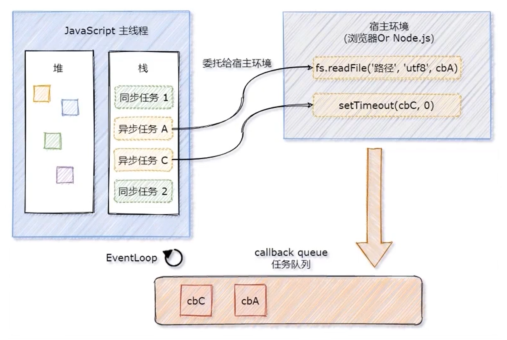

[TOC]

# JavaScript

****

==***`JavaScript` 是一门<span style=color:red;>单线程执行</span>的编程语言***==

***客户端脚本语言：不需要编译，直接就可以被浏览器解析执行***

<center></center>


## 🍀*概念*

==**运行在客户端游览器中，每一个浏览器都有*`JavaScript`*的解析引擎**==


## 🧩组成

$$
JavaScript  =   ECMAScript  ➕  JavaScript(BOM➕DOM)
$$


<center></center>

## *ECMAScript*

==***客户端脚本语言标准***==


### 🔆基本语法

+ ###### 🔖与 `html` 的结合方式

  1. ###### 1️⃣内部`js`	:	定义**`<script>`**，标签体内容就是**`js`**代码

  2. ###### 2️⃣外部`js` 	:	定义**`<script>`**，通过**`src`**属性引入外部的**`js`**文件

  3. ###### 3️⃣行内`js`

     + ```html
       <input type="button" value="点" onclick="javascript:alert('js行内脚本')"/> 
       ```

  4. ###### ❗注意

     + ❗*<span style=color:red;>`<script>`标签可以放在`html`文件中的任意位置，但是定义的位置会影响执行顺序</span>*
     + ❗*<span style=color:red;>`<script>`标签可以定义多个**`<script>`**标签可以定义多s个</span>*

+ ###### 🍁注释

  + ```javascript
    // 单行注释
    /* 多行注释 */
    ```


### 💡JavaScript作用域

+ <span style=color:red;>**全局作用域**</span>
+ <span style=color:red;>**局部作用域**</span>

```html
<script>
    // 全局作用域(整个script标签/js文件)
    function fun() {
        // 局部作用域(只在函数内部起作用)
    }
</script>
```


## 🌲数据类型

+ ###### *基本数据类型*

+ ###### *引用数据类型*


### 🍃基本数据类型

> :grey_exclamation:<span style=color:red;>**存储变量时存储的是值本身**</span>

+ **`number`**	:	**数字**

  + >1. ###### 整型
    >
    >2. ###### 小数
    >
    >3. ###### `NaN(not a number)` : 一个不是数字的数字
    >
    >```javascript
    > // 八进制,数字前加 0
    >var num1 = 010;
    >num1 // 8
    >
    >// 十六进制,数字前面加 0x
    >var num2 = 0x9;
    >num2 // 9
    >```

+ **`String`**	:	**字符串**

  + |  转义符  |   解释   |
    | :------: | :------: |
    | **`\n`** | *换行符* |
    | **`\\`** |  *斜杠*  |
    | **`\‘`** | *单引号* |
    | **`\"`** | *双引号* |
    | **`\t`** |  *缩进*  |
    | **`\b`** |  *空格*  |

+ **`boolean`	:	布尔**

  + >1. ###### `true` : 真
    >
    >2. ###### `false` : 假

+ **`null` :  空**

+ **`undefined` :  未定义**

  + >***如果一个变量没有初始值,则会被默认赋值为`undefined`***


### 🍂引用数据类型

> <span style=color:red;>**通过** **`new`** **关键字创建的对象，在存储时变量存储的仅仅是地址**</span>

+ ###### 对象

  + ```javascript
    /*
    对象的定义:对象属性是 name:value 对，由逗号分隔
    	a -- key
    	"aaa" -- value
    */
    var xxr = {firstName:"Bill", lastName:"Gates"};
    xxr // [object Object]
    typeof(xxr) // object
    
     //两种方式访问对象的属性
    xxr.firstName
    xxr["lastName"]
    ```

+ ###### 数组

  + ```javascript
    var aar = ['a',1,"ABC"];
    aar // a,1,ABC  
    typeof arr // object
    ```


## EventLoop

==***`JavaScript` 主线程从<span style=color:red;>任务队列</span>中读取异步任务的回调函数，放到执行栈中依次执行，<u>这个过程是循环不断的，所以整个的这种运行机制又称为 <span style=color:red;>`EventLoop`（事件循环）</span></u>***==

<center></center>


### 同步任务

==***同步任务`(synchronous)`***==

+ *又叫做<span style=color:red;>非耗时任务</span>，指的是在主线程上排队执行的那些任务*
+ *只有前一个任务执行完毕，才能执行后一个任务*


### 异步任务

==***异步任务`(asynchronous)`***==

+ *又叫做<span style=color:red;>耗时任务</span>，异步任务由 `JavaScript` 委托给宿主环境进行执行*

+ *当异步任务执行完成后，会通知 `JavaScript` 主线程执行异步任务的回调函数*


## 🍉宏队列与微队列

<center></center>

>     ❗==***`js`是单线程运行的，从头到尾顺序执行，如果是<span style=color:red;><u>同步代码立即执行</u></span>；如果是<u><span style=color:red;>异步事件，按类型分别放入宏队列和微队列排队执行</span>*</u>**==

***`JS`中用来<span style=color:red;>存储待执行回调函数的队列包含 `2` 个不同特定的列队</span>***

+ <span style=color:red;>**宏队列**：用来保存待执行的宏任务（回调）</span>，比如：==***`定时器`回调/`DOM`事件回调/`ajax`回调***==

+ <span style=color:red;>**微队列**：用来保存待执行的微任务（回调）</span>，比如：==***`Promise`回调/`Mutation`回调/`I/O` 操作/`UI` 渲染***==

```javascript
log = (...arg) => console.log(...arg);

Promise.resolve().then(() => log("p1")) // 微队列1
log('同步1'); // 同步1
setTimeout(() => { // 宏队列
    log('st..同步..'); // 同步
    Promise.resolve().then(() => log("st...p1")); // 微队列
}, 0);
Promise.resolve().then(() => log("p2")) // 微队列2
log('同步2'); // 同步2

// 执行结果
同步1
同步2
p1
p2
st..同步..
st...p1
```


### 宏队列与微队列的执行顺序

<center></center>

> :grey_exclamation:==***每一个宏任务执行完之后，都会检查是否存在待执行的微任务； 如果有，则执行完所有微任务之后，再继续执行下一个宏任务***==


### js 异步的执行机制

1. ###### 1️⃣*`JS`引擎首先必须 ==**先执行所有的初始化同步任务代码**==*

2. ###### 2️⃣*第二步 ==**将所有的微任务一个一个取出来执行**==*

3. ###### 3️⃣*最后再 ==**取出宏任务执行**==*




