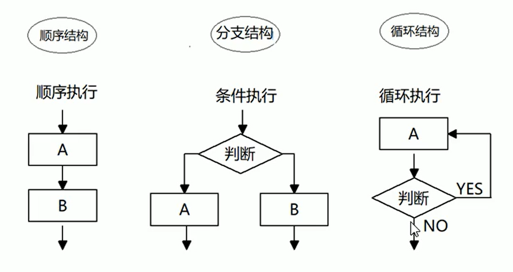
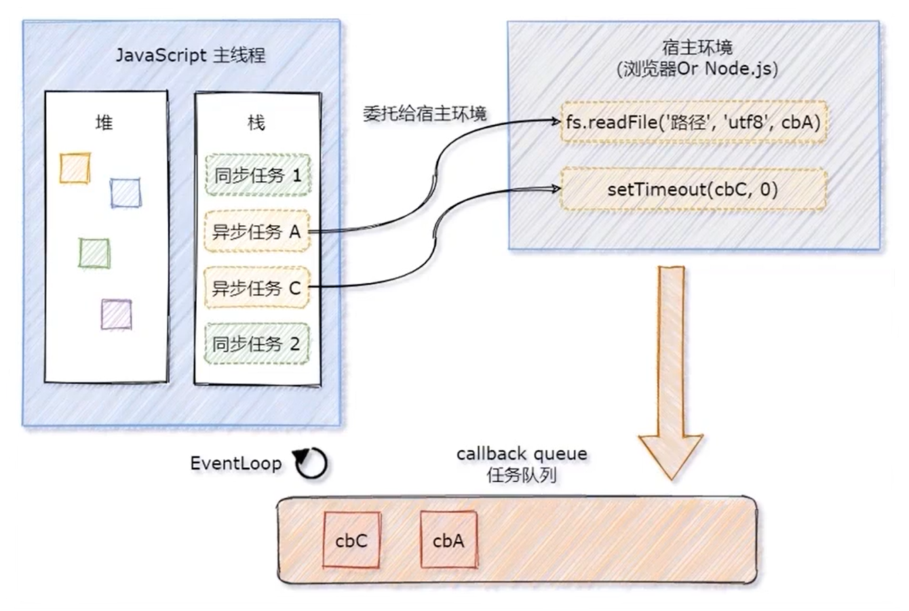

[TOC]

# JavaScript

****

==***`JavaScript` 是一门<span style=color:red;>单线程执行</span>的编程语言***==

***客户端脚本语言：不需要编译，直接就可以被浏览器解析执行***

<center></center>


## 🍀*概念*

==**运行在客户端游览器中，每一个浏览器都有*`JavaScript`*的解析引擎**==

<center></center>


## 🧩组成

$$
JavaScript  =   ECMAScript  ➕  JavaScript(BOM➕DOM)
$$

<center></center>


<center></center>

## *ECMAScript*

==***客户端脚本语言标准***==


### 🔆基本语法

+ ###### 🔖与 `html` 的结合方式

  1. ###### 1️⃣内部`js`	:	定义**`<script>`**，标签体内容就是**`js`**代码

  2. ###### 2️⃣外部`js` 	:	定义**`<script>`**，通过**`src`**属性引入外部的**`js`**文件

  3. ###### 3️⃣行内`js`

     + ```html
       <input type="button" value="点" onclick="javascript:alert('js行内脚本')"/> 
       ```

  4. ###### ❗注意

     + ❗*<span style=color:red;>`<script>`标签可以放在`html`文件中的任意位置，但是定义的位置会影响执行顺序</span>*
     + ❗*<span style=color:red;>`<script>`标签可以定义多个**`<script>`**标签可以定义多个</span>*

+ ###### 🍁注释

  + ```javascript
    // 单行注释
    /* 多行注释 */
    ```


### 💡JavaScript作用域

+ <span style=color:red;>**全局作用域**</span>
+ <span style=color:red;>**局部作用域**</span>

```html
<script>
    // 全局作用域(整个script标签/js文件)
    function fun() {
        // 局部作用域(只在函数内部起作用)
    }
</script>
```


## 🌲数据类型

+ ###### *基本数据类型*

+ ###### *引用数据类型*


### 🍃基本数据类型

> :grey_exclamation:<span style=color:red;>**存储变量时存储的是值本身**</span>

+ **`number`**	:	**数字**

  + >1. ###### 整型
    >
    >2. ###### 小数
    >
    >3. ###### `NaN(not a number)` : 一个不是数字的数字
    >
    >```javascript
    > // 八进制,数字前加 0
    >var num1 = 010;
    >num1 // 8
    >
    >// 十六进制,数字前面加 0x
    >var num2 = 0x9;
    >num2 // 9
    >```

+ **`String`**	:	**字符串**

  + |  转义符  |   解释   |
    | :------: | :------: |
    | **`\n`** | *换行符* |
    | **`\\`** |  *斜杠*  |
    | **`\‘`** | *单引号* |
    | **`\"`** | *双引号* |
    | **`\t`** |  *缩进*  |
    | **`\b`** |  *空格*  |

+ **`boolean`	:	布尔**

  + >1. ###### `true` : 真
    >
    >2. ###### `false` : 假

+ **`null` :  空**

+ **`undefined` :  未定义**

  + >***如果一个变量没有初始值，则会被默认赋值为`undefined`***


### 🍂引用数据类型

> <span style=color:red;>**通过** **`new`** **关键字创建的对象，在存储时变量存储的仅仅是地址**</span>

+ ###### 对象

  + ```javascript
    /*
    对象的定义:对象属性是 name:value 对，由逗号分隔
    	a -- key
    	"aaa" -- value
    */
    var xxr = {firstName:"Bill", lastName:"Gates"};
    xxr // [object Object]
    typeof(xxr) // object
    
     //两种方式访问对象的属性
    xxr.firstName
    xxr["lastName"]
    ```

+ ###### 数组

  + ```javascript
    var aar = ['a',1,"ABC"];
    aar // a,1,ABC  
    typeof arr // object
    ```


## 💠变量

### 🧿强类型和弱类型

+ ###### 强类型语言(`Java`)

  > **在开辟变量存储空间时，就定义了固定存储数据的数据类型**

+ ###### 弱类型语言(`JavaScript`)

  > **在开辟变量存储空间时，不定义固定存储数据的数据类型，可以存储任意数据**


### 💡使用

~~~javascript
<!-- var 变量名称 = 初始化值 -->

var num ; // 定义一个默认值为 unfefined
num = 1; // 赋值数字1  
alert(num);

name = "123"; // 赋值字符串"123"
~~~


### 📏获取变量的类型

+ **`typeof(变量名称)`**
+ **`typeof 变量名称`**
+ :grey_exclamation:<u>*`null` 获取的类型为 `object`*</u>


## ➗运算符

### ➕一元运算符

+ ###### `++` 自增 `--` 自减

+ ###### `+` 正号 `-` 负号

~~~javascript
/*
	+ 正号(一元加法) - 负号(一元减法)
*/

// 一元加法本质上对数字无任何影响:
var iNum = 20 ;
iNum = +iNum;
document.write(iNum+"<br/>");

// 一元减法法 将正数换为负数
iNum = -iNum;
document.write(iNum+"<br/>");

// 尽管一元加法对数字无作用，但对字符串却有有趣的效果，会把字符串转换成数字
var sNum = "30";
document.write(typeof(sNum)+"<br/>"); // string
sNum = +sNum;
document.write(typeof(sNum)+"<br/>"); // number

// 一元减法法，会把字符串转换成数字(负数)
var str = "40";
str = -str;
document.write(str+" == "+typeof(str)+"<br/>");

// + - 按照字面值装换,如果字面值不是数字 ,则装换NaN(不是数字的数字)
var c = +"abc";
document.write(typeof(c)+"<br/>"); // 打印类型
document.write(c+"<br/>"); // 打印结果
document.write(c - 1 + "<br/>"); // NaN跟任何数运算都是NaN

// boolean 装换 number
var flag = true;
flag = +flag;
document.write(flag+"<br/>"); // true 得到number值 1

flag = -false;
document.write(flag+"<br/>"); // false 得到number值 0

document.write(typeof(flag)+"<br/>");

// undefined
var def = -undefined;
document.write(def+"<br/>"); // nudefined 的number值 NaN

// null
var obj = null ;
obj = -obj;
document.write(obj+"<br/>"); // null 无论 + - 得number值 0
~~~


### ➗算数运算符

> **`+`(加)  `-`(减)  `*`(乘)  `/`(除)  `%`(取余)**


### ⭕赋值运算符

|  **`*=`**  |    **乘法/赋值**    |
| :--------: | :-----------------: |
|  **`/=`**  |    **除法/赋值**    |
|  **`%=`**  |    **取模/赋值**    |
|  **`+=`**  |    **加法/赋值**    |
|  **`-=`**  |    **减法/赋值**    |
| **`<<=`**  |    **左移/赋值**    |
| **`>>=`**  | **有符号右移/赋值** |
| **`>>>=`** | **无符号右移/赋值** |


### ❕比较运算符

> **`>`(大于)  `>=`(小于等于)  `<`(大于)  `<=`(大于等于)  是 `==`(等于)  `===`(全等于) `!=`(不等于)**

~~~javascript
var a = 3;
var b = 4;
var c = '5';

// 类型相同
document.write((a > b) +"<br/>"); // false

// 字符 比较 字符 (按位逐一比较)
document.write(("abc" < "abd")+"<br/>"); // true
/*
比较过程
	a < a false
	d < b false
	c < d true
*/
document.write(("abc" > c)+"<br/>"); // true
document.write((c > "abc" ) +"<br/>"); // false

// 数值 比较 字符串 
/*
类型不相同:
	类型不同,比较先进行类型装换,在比较
*/
document.write((b < c) +"<br/>"); // true

// 如果想要在无需类型转的情况下比较 就使用 全等号(===)
/*
在比较前,先比较类型是否相同,相同则继续比较值,反之直接返回false
*/
document.write((c === 5)+"<br/>"); // false

// number 比较 NaN (NaN无论参与什么比较结果为NaN)
document.write((a == NaN)+"<br/>"); // false
document.write((null >= NaN)+"<br/>"); // false

/*
undefined 与 null 的区别
Undefined 与 null 的值相等，但类型不相等
*/
document.write(typeof(undefined)+"<br/>"); // undefined
document.write(typeof(null)+"<br/>"); // object

document.write((undefined == null)+"<br/>"); // true
document.write((undefined === null)+"<br/>"); // false
~~~


### 💲逻辑运算符

+ **`&&` (并且)**

+ **`||`  (或者)**

+ **`!`  (非)**

  > ~~~javascript
  > !(非) 其他类型装换boolean
  > 1.number (0或NaN为假,其他为真)
  > 2.strong (空字符串"" 为false,其他都为true)
  > 3.null （为false）
  > 4.undefined （为false）
  > 5.对象 (所有对象都为true)
  > ~~~

~~~javascript
// number值0
var size = 0;
document.write(!!size+"<br/>");
// number值NaN
size = NaN;
document.write(!!size+"<br/>");
// number值非0非NN
size = 1;
document.write(!!size+"<br/>");

if (1) {
    document.write(" ----- if1 ----- <br/>");
}

// string
str = "";
document.write(!!str+"<br/>");

str = '123';
document.write(!!str+"<br/>");

if ("A") {
    document.write(" ----- if2 ----- <br/>");
}

// null
var str = null;
document.write(!!str+"<br/>");

//undefined
var k ;
document.write(!!k+"<br/>");

if(!undefined){
    document.write(" ----- if3 ----- <br/>");
}

var b = false; // boolean
var s = "red";   // 字符串
var i = 0;      // number
var ie = 345;   // 对象
var o = new Object; // 对象

document.write("b 的逻辑值是"+ (!!b) +"<br/>"); // false
document.write("sR 的逻辑值是"+(!!s) +"<br/>"); // true
document.write("i 的逻辑值是"+ (!!i) +"<br/>"); // false
document.write("ie 的逻辑值是"+(!!ie)+"<br/>"); // true
document.write("o 的逻辑值是"+ (!!o) +"<br/>"); // true

/* 
表达式1 && 表达式2
	第一个表达式为true, 则返回 表达式2
    第一个表达式为false,则返回 表达式1
*/
var flag = 123 && 456;
document.write(flag+'<br>'); // 456

/* 
表达式1 || 表达式2
	第一个表达式为true, 则返回 表达式1
	第一个表达式为false,则返回 表达式2
*/
flag = 0 || NaN;
document.write(flag+'<br>'); // NaN

flag = (2-1) && 2;
document.write(flag+'<br>'); // 2

flag = 2 && 0 || 3;
document.write(flag+'<br>'); // 3
~~~


### ❔三元运算符

~~~javascript
条件推断语句 ? 结果true执行 : 结果false执行;
~~~


### ✨运算符优先级

| 优先级  |     运算符     |          顺序           |
| :-----: | :------------: | :---------------------: |
| ***1*** |   **小括号**   |        **`()`**         |
| ***2*** | **一元运算符** |      **`++,--,!`**      |
| ***3*** | **算数运算符** | **先 `*,/,%` 后 `+,-`** |
| ***4*** | **关系运算符** |     **`>,>=,<,<=`**     |
| ***5*** | **相等运算符** |   **`==,!=,===,!==`**   |
| ***6*** | **逻辑运算符** |   **先 `&&` 后 `||`**   |
| ***7*** | **赋值运算符** |         **`=`**         |
| ***8*** | **逗号运算符** |         **`,`**         |


## 💧特殊的语法

> **❕️`;`可省略不写<span style=color:red;>(不推荐使用)</span>**
>
> **❕ 定义变量时 `var` 可以省略不写**
>
> + <span style=color:black;>`var`不省略时 定义的变量是局部的</span>
> + <span style=color:black;>`var` 省略时 定义的变量是全局的<i style=color:red;>(不推荐使用)</i></span>

~~~javascript
var id = 1
alert(id)
    
a = "a";
alert(a);

// 使用function函数定义的一个方法(fun)
function fun() {
    c = "全局的";
    var d = "局部的"
    document.write(d);
}

// 调用方法
fun();
   
alert(c); // 访问到了

alert(d); // 访问不到
~~~


## 💫流程控制语句

==***主要有三种结构，分别是<span style=color:red;>顺序结构</span>，<span style=color:red;>分支结构</span>和<span style=color:red;>循环结构</span>，这三种结构代表三种代码执行的顺序***==

<center></center>


### 🔀分支结构

+ **`if .. else ..`**

  ~~~javascript
  if (条件判断) {
      // ..
  } else if (条件判断) { // 多个条件使用else if
      // ...
  } else { // 如果条件都不满足就执行else
      // ...
  }
  ~~~

+ **`switch`**

  ~~~javascript
  <!-- key : (在js中接收的参数为任意类型) -->
  switch (key) {
      case value:
          // ..
          break; // 必须写,否则会发生switch贯穿
      case value2: // 多个条件
          // ..
          break;
      default: // 如果条件都不满足就执行default
          // ..
          break;
  }
  ~~~


### 🔄循环结构

+ **`while`**

  ~~~javascript
  while (条件判断) {
      // 循环体
  }
  ~~~

+ **`do..while`**

  ~~~javascript
  do {
      // 循环体
  } while (条件判断);
  // do..while 先执行一次循环体,再判断条件
  ~~~

+ **`for`**

  ~~~javascript
  for (let index = 0; index < array.length; index++) {
      // 循环体
  }
  ~~~

  


### 🥕关键字

+ ***`continue`***

  > ==***用于立即跳出本次循环，继续下一次循环***===

+ ***`break`***

  > ==***结束整个循环体***==


## ⭐对象

==***对象是由<span style=color:red;>属性</span>的<span style=color:red;>方法</span>组成的***==

+ <span style=color:black>事物的**行为**，在对象中用**方法**类表示(常用动词)事物的**特征**，在对象中用**属性**类代表<i style=color:skyblue;>(常用名词)</i></span>
+ <span style=color:black>事物的**行为**，在对象中用**方法**类表示<i style=color:skyblue;>(常用动词)</i></span>


### 🔔关键字

+ ***`new`***

  > ==<u>*通过 `new` 关键字可以创建构造对象<i style=color:red;>(实例化)</i>*</u>==

+ ***`instanceof`***

  > ==*<u>判断要测试的对象</u>*==


### ⬜Object

> ==***自定义对象***==
>
> + **创建**
>
>   1. ~~~javascript
>      var obj = {};
>      ~~~
>
>   2. ~~~javascript
>      var obj = new Object();
>      ~~~
>
>   3. ~~~javascript
>      function Object() {} // 构造函数
>      ~~~
>
> <span style=color:red;>**❕对象里的属性和方法前面必须添加`this`**</span>

~~~javascript
// 构造对象
function Stu(uname, age) {
    this.name = uname; // 对象的属性
    this.age = age;
    this.info = function(msg) { // 对象的方法
        return msg;
    }
}

// 使用构造函数创建对象并使用
var stu = new Stu('双双','1'); // 创建
// --------- 对象类型 ---------
stu; // object
// --------- 获取对象中的属性 ---------
stu.name; // 双双
stu['age']; // 1
// --------- 使用对象中的方法 ---------
stu.info('双双是一个小学生'); // 双双是一个小学生
~~~


### 🔳Function

> ==***`function`是一个函数(方法)，对象***==
>
> - <span style=color:black;>`function` 关键词进行定义，其后是函数名和括号 `()`</span>
> - <span style=color:black;>函数名可包含字母、数字、下划线和美元符号<i style=color:red;>(规则与变量名相同)</i></span>
> - <span style=color:black;>圆括号可包括由逗号分隔的参数</span>
> - <span style=color:black;>方法名不可以是函数名</span>
> - <span style=color:black;>方法里可以写`return`指定参数，不写默认返回`undefined`</span>

+ **方式一**

  + >~~~javascript
    >var fun = new Function(参数列表,方法体); // 不符合链接
    >~~~

    ~~~javascript
    // 创建方式(1)
    var fun = new Function("a","b","c","document.write(a+b+c)");
    // 调用方法
    fun(1,2,3);
    // 返回方法的参数列表的个数 没有返回0
    document.write("<br/>"+fun.length+"<br/>"); // 3
    ~~~

+ **方式二**

  + > ~~~javascript
    > funtion 方法名称 (参数列表) {
    >     // 方法体
    > }
    > ~~~

    ~~~javascript
    // 创建方式(2)
    function fun2(value) {
        document.write(value);
    }
    // 调用方法
    fun2("hh"); // hh
    ~~~

+ **方式三**

  + > ~~~javascript
    > var 方法名 = function (参数列表) {
    >     // 方法体
    > };
    > ~~~

    ~~~javascript
    // 创建方式(3)
    var fun3 = function(value) {
        return value + "";
    };
    // 使用
    document.write(fun3("bbb")+"<br/>"); // bbb
    ~~~

    


#### call

> ~~~javascript
> call(thisObj, arg1, arg2, ...)
> ~~~
>
> ==**`call()` *方法是预定义的* `JavaScript` *方法***==
>
> <span style=color:black;>❕*它可以用来调用所有者对象作为参数的方法*</span>
>
> <span style=color:black;>❕*通过`call()`，您能够使用属于另一个对象的方法*</span>

~~~javascript
/* 参数:
	thisObject : 调用方法的对象
    arg1,arg2,... : 可选参数列表
*/
let person = {
    getString: function() {
        return `[id:${this.id}, username:${this.username}]`
    }
    ,getName: function(msg) {
        console.log(`${msg}${this.username}`);
    }
}

let person1 = {
    id: 1,
    username: 'keke'
}

let person2 = {
    id: 2,
    username: 'dudu'
}

person.getString.call(person1); // [id:2, username:keke]
person.getString.call(person2); // [id:1, username:dudu]

// call() 方法可接受参数
person.getName.call(person2,'窝的名字:'); // 窝的名字:dudu
~~~


#### apply

> ~~~javascript
> apply(thisObj, args)
> ~~~
>
> ==**`apply()` *与* `call()` *相似***==
>
> <span style=color:black;>❕*不同的的是方法第二个参数接收的数组*</span>

~~~javascript
/* 参数:
	thisObj : 调用方法的对象
    args : 参数数组
*/
let arr = [2, 34, 5.5, 8, 1, -1];
Math.max.apply(null, arr); // 34
Math.min.apply(null, arr); // -1

// 使用 apply 将数组追加到另一个数组
let array = ['2', null];
array.push.apply(array, arr);
array; // ['2', null, 2, 34, 5.5, 8, 1, -1]
~~~


#### bind

> ~~~javascript
> bind(thisArg, arg1, arg2, ...)
> ~~~
>
> ==**bind() *方法创建一个新的函数***==
>
> <span style=color:black;>*返回一个原函数的拷贝，并拥有指定的* `this` *值和初始参数*</span>
>
> <span style=color:black;>*在 `bind()` 被调用时，这个新函数的 `this` 被指定为 `bind()` 的第一个参数*</span>
>
> <span style=color:black;>*而其余参数将作为新函数的参数，供调用时使用*</span>

~~~javascript
/* 参数:
  thisArg : 调用绑定函数时作为this参数传递给目标函数的值
  arg1,arg2,... : 调用绑定函数时作为this参数传递给目标函数的值
*/

let module = {
    x : 7,
    getX: function() {
        console.log(this.x);
    }
};

let unboundGetX = module.getX;
unboundGetX(); // undefined

let boundGetX = unboundGetX.bind(module); // 创建一个新的函数,将 this 绑定到 module 对象
boundGetX(); // 7

// 设置时间
let date = new (Date.bind.apply(Date, [null, 2022, 7, 3]));
date; // Wed Aug 03 2022 00:00:00 GMT+0800 (中国标准时间)
~~~


#### 🔑属性

>**`length`** **: 表示参数的个数**


#### 🔔注意

1. **方法定义 : <span style=color:red;>形参的类型不需定义，返回值类型不需定义</span>**
2. **方法是一个对象，可以重新覆盖方法**
3. **方法的调用只与方法名有关，和参数列表无关**
4. **方法声明中有一个隐藏的内置对象(`arguments`伪数组)，封装了所有实际参数**
5. **调用方法的名称<span style=color:red;>(实际参数列表)</span>和<span style=color:red;>参数列表</span>无关**


### Array

> ==***`Array`数组，数组中元素的类型是可变的，长度可变***==
>
> <span style=color:black;>**❗通过`new`创建`Array`数组时，只有一个，那么它代表将要创建数组的长度**</span>

+ **创建**

  1. ~~~javascript
     var arr = new Array(元素列表);
     ~~~

  2. ~~~javascript
     var arr = new Array(数组长度);
     ~~~

  3. ~~~javascript
     var arr = [元素列表]; //推荐使用
     ~~~

~~~javascript
// 创建方式
var arr1 = new Array(1,2,"3");
var arr2 = new Array(3);
var arr3 = ['A','B','C']; 
// 判断要测试的对象
document.write((arr1 instanceof Array)+"<br/>"); // true
document.write((arr2 instanceof Array)+"<br/>"); // true
document.write((Array.isArray(arr3))+"<br/>"); // true

// 打印数组
document.write(arr1+"<br/>"); // 1,2,3
document.write(arr2+"<br/>"); // ,,
document.write(arr3+"<br/>"); // ABC

// 创建元素类型不同的数组
var arr4 = [1,"2",3.33,true];
document.write(arr4+"<br/>"); // 1,2,3.33,true

// 注意
arr4[7] = "lash";
document.write(arr4[7]+"<br/>"); // lash
document.write(arr4+"<br/>"); // 1,2,3.33,true,,,,las
document.write(arr4.length+"<br/>"); // 8

var ar7 = new Array(3);
document.write(ar7+"<br/>"); // ,,
document.write(ar7.length+"<br/>"); // 3
~~~


#### 方法

+ **`join()`** **: 方法也可将所有数组元素结合为一个字符串**
+ **`push()`** **: 向 指定数组<span style=color:red;>(在数组结尾处)</span>添加一个新元素 返回新数组长度**
+ :grey_exclamation:**`length`** **:** **属性向数组添加新元素**
+ ◽◽◽◽◽◽


#### 🔑属性

> **`length`** **: 表示数组的长度**


### Boolean

> ==**布尔**==

+ **创建**

~~~javascript
new Boolean(value);	// 构造函数
Boolean(value);		// 转换函数
~~~


### Date

> ==**日期**==

+ **创建**

  1. ~~~javascript
     new Date();
     ~~~

  2. ~~~javascript
     new Date(year, month, day, hours, minutes, seconds, milliseconds); //按此顺序
     ~~~

  3. ~~~javascript
     new Date(milliseconds);
     ~~~

  4. ~~~javascript
     new Date(date string);
     ~~~


### Math

> ==***`Math` 是一个<span style=color:red;>内置对象</span>，它具有数学常量和函数的属性和方法***==
>
> :grey_exclamation:<span style=color:black;>**它不是函数对象，的所有属性和方法都是静态的，无需创建，直接 `Math.方法名()`**</span>

~~~javascript
Math.random().toString(36).slice(2).substr(0, 4); // 随机4位数验证码
Math.random().toString(16).substr(2, 6); // 随机16进制颜色
~~~


#### 方法

+ **`round(x)`** **: 把数四舍五入为最接近的整数**
+ **`random()`** **: 返回 `0 ~ 1` 之间的随机数<span style=color:red;>(含头不含尾)</span>**
+ **`ceil(x)`** **: 对数进行上舍入**
+ **`floor(x)`** **: 对数进行下舍入**
+ ◽◽◽◽◽◽


#### 🔑属性

>**`PI`** **: 返回圆周率<span style=color:red;>(约等于3.14159)</span>**
>
>◽◽◽◽◽◽


## EventLoop

==***`JavaScript` 主线程从<span style=color:red;>任务队列</span>中读取异步任务的回调函数，放到执行栈中依次执行，<u>这个过程是循环不断的，所以整个的这种运行机制又称为 <span style=color:red;>`EventLoop`（事件循环）</span></u>***==

<center></center>


### 同步任务

==***同步任务`(synchronous)`***==

+ *又叫做<span style=color:red;>非耗时任务</span>，指的是在主线程上排队执行的那些任务*
+ *只有前一个任务执行完毕，才能执行后一个任务*


### 异步任务

==***异步任务`(asynchronous)`***==

+ *又叫做<span style=color:red;>耗时任务</span>，异步任务由 `JavaScript` 委托给宿主环境进行执行*

+ *当异步任务执行完成后，会通知 `JavaScript` 主线程执行异步任务的回调函数*


## 🍉宏队列与微队列

<center></center>

>     ❗==***`js`是单线程运行的，从头到尾顺序执行，如果是<span style=color:red;><u>同步代码立即执行</u></span>；如果是<u><span style=color:red;>异步事件，按类型分别放入宏队列和微队列排队执行</span>*</u>**==

***`JS`中用来<span style=color:red;>存储待执行回调函数的队列包含 `2` 个不同特定的列队</span>***

+ <span style=color:red;>**宏队列**：用来保存待执行的宏任务（回调）</span>，比如：==***`定时器`回调/`DOM`事件回调/`ajax`回调***==

+ <span style=color:red;>**微队列**：用来保存待执行的微任务（回调）</span>，比如：==***`Promise`回调/`Mutation`回调/`I/O` 操作/`UI` 渲染***==

```javascript
log = (...arg) => console.log(...arg);

Promise.resolve().then(() => log("p1")) // 微队列1
log('同步1'); // 同步1
setTimeout(() => { // 宏队列
    log('st..同步..'); // 同步
    Promise.resolve().then(() => log("st...p1")); // 微队列
}, 0);
Promise.resolve().then(() => log("p2")) // 微队列2
log('同步2'); // 同步2

// 执行结果
同步1
同步2
p1
p2
st..同步..
st...p1
```


### 宏队列与微队列的执行顺序

<center></center>

> :grey_exclamation:==***每一个宏任务执行完之后，都会检查是否存在待执行的微任务； 如果有，则执行完所有微任务之后，再继续执行下一个宏任务***==


### js 异步的执行机制

1. ###### 1️⃣*`JS`引擎首先必须 ==**先执行所有的初始化同步任务代码**==*

2. ###### 2️⃣*第二步 ==**将所有的微任务一个一个取出来执行**==*

3. ###### 3️⃣*最后再 ==**取出宏任务执行**==*




