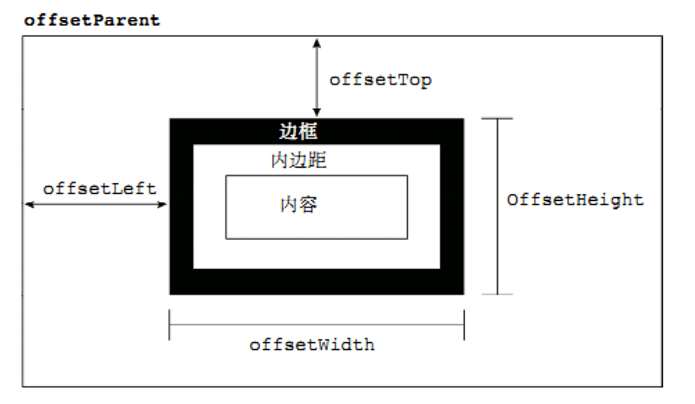

[TOC]

# JavaScript

****

==***`JavaScript` 是一门<span style=color:red;>单线程执行</span>的编程语言***==

***客户端脚本语言：不需要编译，直接就可以被浏览器解析执行***

<center></center>


## 🍀*概念*

==**运行在客户端游览器中，每一个浏览器都有*`JavaScript`*的解析引擎**==

<center></center>


## 🧩组成

$$
JavaScript  =   ECMAScript  ➕  JavaScript(BOM➕DOM)
$$

<center></center>


<center></center>

## *ECMAScript*

==***客户端脚本语言标准***==


### 🔆基本语法

+ ###### 🔖与 `html` 的结合方式

  1. ###### 1️⃣内部`js`	:	定义**`<script>`**，标签体内容就是**`js`**代码

  2. ###### 2️⃣外部`js` 	:	定义**`<script>`**，通过**`src`**属性引入外部的**`js`**文件

  3. ###### 3️⃣行内`js`

     + ```html
       <input type="button" value="点" onclick="javascript:alert('js行内脚本')"/> 
       ```

  4. ###### ❗注意

     + ❗*<span style=color:red;>`<script>`标签可以放在`html`文件中的任意位置，但是定义的位置会影响执行顺序</span>*
     + ❗*<span style=color:red;>`<script>`标签可以定义多个**`<script>`**标签可以定义多个</span>*

+ ###### 🍁注释

  + ```javascript
    // 单行注释
    /* 多行注释 */
    ```


### 💡JavaScript作用域

+ <span style=color:red;>**全局作用域**</span>
+ <span style=color:red;>**局部作用域**</span>

```html
<script>
    // 全局作用域(整个script标签/js文件)
    function fun() {
        // 局部作用域(只在函数内部起作用)
    }
</script>
```


## 🌲数据类型

+ ###### *基本数据类型*

+ ###### *引用数据类型*


### 🍃基本数据类型

> :grey_exclamation:<span style=color:red;>**存储变量时存储的是值本身**</span>

+ **`number`**	:	**数字**

  + >1. ###### 整型
    >
    >2. ###### 小数
    >
    >3. ###### `NaN(not a number)` : 一个不是数字的数字
    >
    >```javascript
    > // 八进制,数字前加 0
    >var num1 = 010;
    >num1 // 8
    >
    >// 十六进制,数字前面加 0x
    >var num2 = 0x9;
    >num2 // 9
    >```

+ **`String`**	:	**字符串**

  + |  转义符  |   解释   |
    | :------: | :------: |
    | **`\n`** | *换行符* |
    | **`\\`** |  *斜杠*  |
    | **`\‘`** | *单引号* |
    | **`\"`** | *双引号* |
    | **`\t`** |  *缩进*  |
    | **`\b`** |  *空格*  |

+ **`boolean`	:	布尔**

  + >1. ###### `true` : 真
    >
    >2. ###### `false` : 假

+ **`null` :  空**

+ **`undefined` :  未定义**

  + >***如果一个变量没有初始值，则会被默认赋值为`undefined`***


### 🍂引用数据类型

> <span style=color:red;>**通过** **`new`** **关键字创建的对象，在存储时变量存储的仅仅是地址**</span>

+ ###### 对象

  + ```javascript
    /*
    对象的定义:对象属性是 name:value 对，由逗号分隔
    	a -- key
    	"aaa" -- value
    */
    var xxr = {firstName:"Bill", lastName:"Gates"};
    xxr // [object Object]
    typeof(xxr) // object
    
     //两种方式访问对象的属性
    xxr.firstName
    xxr["lastName"]
    ```

+ ###### 数组

  + ```javascript
    var aar = ['a',1,"ABC"];
    aar // a,1,ABC  
    typeof arr // object
    ```


## 💠变量

### 🧿强类型和弱类型

+ ###### 强类型语言(`Java`)

  > **在开辟变量存储空间时，就定义了固定存储数据的数据类型**

+ ###### 弱类型语言(`JavaScript`)

  > **在开辟变量存储空间时，不定义固定存储数据的数据类型，可以存储任意数据**


### 💡使用

~~~javascript
<!-- var 变量名称 = 初始化值 -->

var num ; // 定义一个默认值为 unfefined
num = 1; // 赋值数字1  
alert(num);

name = "123"; // 赋值字符串"123"
~~~


### 📏获取变量的类型

+ **`typeof(变量名称)`**
+ **`typeof 变量名称`**
+ :grey_exclamation:<u>*`null` 获取的类型为 `object`*</u>


## ➗运算符

### ➕一元运算符

+ ###### `++` 自增 `--` 自减

+ ###### `+` 正号 `-` 负号

~~~javascript
/*
	+ 正号(一元加法) - 负号(一元减法)
*/

// 一元加法本质上对数字无任何影响:
var iNum = 20 ;
iNum = +iNum;
document.write(iNum+"<br/>");

// 一元减法法 将正数换为负数
iNum = -iNum;
document.write(iNum+"<br/>");

// 尽管一元加法对数字无作用，但对字符串却有有趣的效果，会把字符串转换成数字
var sNum = "30";
document.write(typeof(sNum)+"<br/>"); // string
sNum = +sNum;
document.write(typeof(sNum)+"<br/>"); // number

// 一元减法法，会把字符串转换成数字(负数)
var str = "40";
str = -str;
document.write(str+" == "+typeof(str)+"<br/>");

// + - 按照字面值装换,如果字面值不是数字 ,则装换NaN(不是数字的数字)
var c = +"abc";
document.write(typeof(c)+"<br/>"); // 打印类型
document.write(c+"<br/>"); // 打印结果
document.write(c - 1 + "<br/>"); // NaN跟任何数运算都是NaN

// boolean 装换 number
var flag = true;
flag = +flag;
document.write(flag+"<br/>"); // true 得到number值 1

flag = -false;
document.write(flag+"<br/>"); // false 得到number值 0

document.write(typeof(flag)+"<br/>");

// undefined
var def = -undefined;
document.write(def+"<br/>"); // nudefined 的number值 NaN

// null
var obj = null ;
obj = -obj;
document.write(obj+"<br/>"); // null 无论 + - 得number值 0
~~~


### ➗算数运算符

> **`+`(加)  `-`(减)  `*`(乘)  `/`(除)  `%`(取余)**


### ⭕赋值运算符

|  **`*=`**  |    **乘法/赋值**    |
| :--------: | :-----------------: |
|  **`/=`**  |    **除法/赋值**    |
|  **`%=`**  |    **取模/赋值**    |
|  **`+=`**  |    **加法/赋值**    |
|  **`-=`**  |    **减法/赋值**    |
| **`<<=`**  |    **左移/赋值**    |
| **`>>=`**  | **有符号右移/赋值** |
| **`>>>=`** | **无符号右移/赋值** |


### ❕比较运算符

> **`>`(大于)  `>=`(小于等于)  `<`(大于)  `<=`(大于等于)  是 `==`(等于)  `===`(全等于) `!=`(不等于)**

~~~javascript
var a = 3;
var b = 4;
var c = '5';

// 类型相同
document.write((a > b) +"<br/>"); // false

// 字符 比较 字符 (按位逐一比较)
document.write(("abc" < "abd")+"<br/>"); // true
/*
比较过程
	a < a false
	d < b false
	c < d true
*/
document.write(("abc" > c)+"<br/>"); // true
document.write((c > "abc" ) +"<br/>"); // false

// 数值 比较 字符串 
/*
类型不相同:
	类型不同,比较先进行类型装换,在比较
*/
document.write((b < c) +"<br/>"); // true

// 如果想要在无需类型转的情况下比较 就使用 全等号(===)
/*
在比较前,先比较类型是否相同,相同则继续比较值,反之直接返回false
*/
document.write((c === 5)+"<br/>"); // false

// number 比较 NaN (NaN无论参与什么比较结果为NaN)
document.write((a == NaN)+"<br/>"); // false
document.write((null >= NaN)+"<br/>"); // false

/*
undefined 与 null 的区别
Undefined 与 null 的值相等，但类型不相等
*/
document.write(typeof(undefined)+"<br/>"); // undefined
document.write(typeof(null)+"<br/>"); // object

document.write((undefined == null)+"<br/>"); // true
document.write((undefined === null)+"<br/>"); // false
~~~


### 💲逻辑运算符

+ **`&&` (并且)**

+ **`||`  (或者)**

+ **`!`  (非)**

  > ~~~javascript
  > !(非) 其他类型装换boolean
  > 1.number (0或NaN为假,其他为真)
  > 2.strong (空字符串"" 为false,其他都为true)
  > 3.null （为false）
  > 4.undefined （为false）
  > 5.对象 (所有对象都为true)
  > ~~~

~~~javascript
// number值0
var size = 0;
document.write(!!size+"<br/>");
// number值NaN
size = NaN;
document.write(!!size+"<br/>");
// number值非0非NN
size = 1;
document.write(!!size+"<br/>");

if (1) {
    document.write(" ----- if1 ----- <br/>");
}

// string
str = "";
document.write(!!str+"<br/>");

str = '123';
document.write(!!str+"<br/>");

if ("A") {
    document.write(" ----- if2 ----- <br/>");
}

// null
var str = null;
document.write(!!str+"<br/>");

//undefined
var k ;
document.write(!!k+"<br/>");

if(!undefined){
    document.write(" ----- if3 ----- <br/>");
}

var b = false; // boolean
var s = "red";   // 字符串
var i = 0;      // number
var ie = 345;   // 对象
var o = new Object; // 对象

document.write("b 的逻辑值是"+ (!!b) +"<br/>"); // false
document.write("sR 的逻辑值是"+(!!s) +"<br/>"); // true
document.write("i 的逻辑值是"+ (!!i) +"<br/>"); // false
document.write("ie 的逻辑值是"+(!!ie)+"<br/>"); // true
document.write("o 的逻辑值是"+ (!!o) +"<br/>"); // true

/* 
表达式1 && 表达式2
	第一个表达式为true, 则返回 表达式2
    第一个表达式为false,则返回 表达式1
*/
var flag = 123 && 456;
document.write(flag+'<br>'); // 456

/* 
表达式1 || 表达式2
	第一个表达式为true, 则返回 表达式1
	第一个表达式为false,则返回 表达式2
*/
flag = 0 || NaN;
document.write(flag+'<br>'); // NaN

flag = (2-1) && 2;
document.write(flag+'<br>'); // 2

flag = 2 && 0 || 3;
document.write(flag+'<br>'); // 3
~~~


### ❔三元运算符

~~~javascript
条件推断语句 ? 结果true执行 : 结果false执行;
~~~


### ✨运算符优先级

| 优先级  |     运算符     |          顺序           |
| :-----: | :------------: | :---------------------: |
| ***1*** |   **小括号**   |        **`()`**         |
| ***2*** | **一元运算符** |      **`++,--,!`**      |
| ***3*** | **算数运算符** | **先 `*,/,%` 后 `+,-`** |
| ***4*** | **关系运算符** |     **`>,>=,<,<=`**     |
| ***5*** | **相等运算符** |   **`==,!=,===,!==`**   |
| ***6*** | **逻辑运算符** |   **先 `&&` 后 `||`**   |
| ***7*** | **赋值运算符** |         **`=`**         |
| ***8*** | **逗号运算符** |         **`,`**         |


## 💧特殊的语法

> **❕️`;`可省略不写<span style=color:red;>(不推荐使用)</span>**
>
> **❕ 定义变量时 `var` 可以省略不写**
>
> + <span style=color:black;>`var`不省略时 定义的变量是局部的</span>
> + <span style=color:black;>`var` 省略时 定义的变量是全局的<i style=color:red;>(不推荐使用)</i></span>

~~~javascript
var id = 1
alert(id)
    
a = "a";
alert(a);

// 使用function函数定义的一个方法(fun)
function fun() {
    c = "全局的";
    var d = "局部的"
    document.write(d);
}

// 调用方法
fun();
   
alert(c); // 访问到了

alert(d); // 访问不到
~~~


## 💫流程控制语句

==***主要有三种结构，分别是<span style=color:red;>顺序结构</span>，<span style=color:red;>分支结构</span>和<span style=color:red;>循环结构</span>，这三种结构代表三种代码执行的顺序***==

<center></center>


### 🔀分支结构

+ **`if .. else ..`**

  ~~~javascript
  if (条件判断) {
      // ..
  } else if (条件判断) { // 多个条件使用else if
      // ...
  } else { // 如果条件都不满足就执行else
      // ...
  }
  ~~~

+ **`switch`**

  ~~~javascript
  <!-- key : (在js中接收的参数为任意类型) -->
  switch (key) {
      case value:
          // ..
          break; // 必须写,否则会发生switch贯穿
      case value2: // 多个条件
          // ..
          break;
      default: // 如果条件都不满足就执行default
          // ..
          break;
  }
  ~~~


### 🔄循环结构

+ **`while`**

  ~~~javascript
  while (条件判断) {
      // 循环体
  }
  ~~~

+ **`do..while`**

  ~~~javascript
  do {
      // 循环体
  } while (条件判断);
  // do..while 先执行一次循环体,再判断条件
  ~~~

+ **`for`**

  ~~~javascript
  for (let index = 0; index < array.length; index++) {
      // 循环体
  }
  ~~~

+ **`for .. in`**

  ~~~javascript
  for (let key in obj) { // 遍历对象
      // 循环体
  }
  ~~~

  


### 🥕关键字

+ ***`continue`***

  > ==***用于立即跳出本次循环，继续下一次循环***==

+ ***`break`***

  > ==***结束整个循环体***==


## ⭐对象

==***对象是由<span style=color:red;>属性</span>的<span style=color:red;>方法</span>组成的***==

+ <span style=color:black>事物的**行为**，在对象中用**方法**类表示(常用动词)事物的**特征**，在对象中用**属性**类代表<i style=color:skyblue;>(常用名词)</i></span>
+ <span style=color:black>事物的**行为**，在对象中用**方法**类表示<i style=color:skyblue;>(常用动词)</i></span>


### 🔔关键字

+ ***`new`***

  > ==<u>*通过 `new` 关键字可以创建构造对象<i style=color:red;>(实例化)</i>*</u>==

+ ***`instanceof`***

  > ==*<u>判断要测试的对象</u>*==


### ⬜Object

> ==***自定义对象***==
>
> + **创建**
>
>   1. ~~~javascript
>      var obj = {};
>      ~~~
>
>   2. ~~~javascript
>      var obj = new Object();
>      ~~~
>
>   3. ~~~javascript
>      function Object() {} // 构造函数
>      ~~~
>
> <span style=color:red;>**❕对象里的属性和方法前面必须添加`this`**</span>

~~~javascript
// 构造对象
function Stu(uname, age) {
    this.name = uname; // 对象的属性
    this.age = age;
    this.info = function(msg) { // 对象的方法
        return msg;
    }
}

// 使用构造函数创建对象并使用
var stu = new Stu('双双','1'); // 创建
// --------- 对象类型 ---------
stu; // object
// --------- 获取对象中的属性 ---------
stu.name; // 双双
stu['age']; // 1
// --------- 使用对象中的方法 ---------
stu.info('双双是一个小学生'); // 双双是一个小学生
~~~


### 🔳Function

> ==***`function`是一个函数(方法)，对象***==
>
> - <span style=color:black;>`function` 关键词进行定义，其后是函数名和括号 `()`</span>
> - <span style=color:black;>函数名可包含字母、数字、下划线和美元符号<i style=color:red;>(规则与变量名相同)</i></span>
> - <span style=color:black;>圆括号可包括由逗号分隔的参数</span>
> - <span style=color:black;>方法名不可以是函数名</span>
> - <span style=color:black;>方法里可以写`return`指定参数，不写默认返回`undefined`</span>

+ **方式一**

  + >~~~javascript
    >var fun = new Function(参数列表,方法体); // 不符合链接
    >~~~

    ~~~javascript
    // 创建方式(1)
    var fun = new Function("a","b","c","document.write(a+b+c)");
    // 调用方法
    fun(1,2,3);
    // 返回方法的参数列表的个数 没有返回0
    document.write("<br/>"+fun.length+"<br/>"); // 3
    ~~~

+ **方式二**

  + > ~~~javascript
    > funtion 方法名称 (参数列表) {
    >     // 方法体
    > }
    > ~~~

    ~~~javascript
    // 创建方式(2)
    function fun2(value) {
        document.write(value);
    }
    // 调用方法
    fun2("hh"); // hh
    ~~~

+ **方式三**

  + > ~~~javascript
    > var 方法名 = function (参数列表) {
    >     // 方法体
    > };
    > ~~~

    ~~~javascript
    // 创建方式(3)
    var fun3 = function(value) {
        return value + "";
    };
    // 使用
    document.write(fun3("bbb")+"<br/>"); // bbb
    ~~~

    


#### call

> ~~~javascript
> call(thisObj, arg1, arg2, ...)
> ~~~
>
> ==**`call()` *方法是预定义的* `JavaScript` *方法***==
>
> <span style=color:black;>❕*它可以用来调用所有者对象作为参数的方法*</span>
>
> <span style=color:black;>❕*通过`call()`，您能够使用属于另一个对象的方法*</span>

~~~javascript
/* 参数:
	thisObject : 调用方法的对象
    arg1,arg2,... : 可选参数列表
*/
let person = {
    getString: function() {
        return `[id:${this.id}, username:${this.username}]`
    }
    ,getName: function(msg) {
        console.log(`${msg}${this.username}`);
    }
}

let person1 = {
    id: 1,
    username: 'keke'
}

let person2 = {
    id: 2,
    username: 'dudu'
}

person.getString.call(person1); // [id:2, username:keke]
person.getString.call(person2); // [id:1, username:dudu]

// call() 方法可接受参数
person.getName.call(person2,'窝的名字:'); // 窝的名字:dudu
~~~


#### apply

> ~~~javascript
> apply(thisObj, args)
> ~~~
>
> ==**`apply()` *与* `call()` *相似***==
>
> <span style=color:black;>❕*不同的的是方法第二个参数接收的数组*</span>

~~~javascript
/* 参数:
	thisObj : 调用方法的对象
    args : 参数数组
*/
let arr = [2, 34, 5.5, 8, 1, -1];
Math.max.apply(null, arr); // 34
Math.min.apply(null, arr); // -1

// 使用 apply 将数组追加到另一个数组
let array = ['2', null];
array.push.apply(array, arr);
array; // ['2', null, 2, 34, 5.5, 8, 1, -1]
~~~


#### bind

> ~~~javascript
> bind(thisArg, arg1, arg2, ...)
> ~~~
>
> ==**bind() *方法创建一个新的函数***==
>
> <span style=color:black;>*返回一个原函数的拷贝，并拥有指定的* `this` *值和初始参数*</span>
>
> <span style=color:black;>*在 `bind()` 被调用时，这个新函数的 `this` 被指定为 `bind()` 的第一个参数*</span>
>
> <span style=color:black;>*而其余参数将作为新函数的参数，供调用时使用*</span>

~~~javascript
/* 参数:
  thisArg : 调用绑定函数时作为this参数传递给目标函数的值
  arg1,arg2,... : 调用绑定函数时作为this参数传递给目标函数的值
*/

let module = {
    x : 7,
    getX: function() {
        console.log(this.x);
    }
};

let unboundGetX = module.getX;
unboundGetX(); // undefined

let boundGetX = unboundGetX.bind(module); // 创建一个新的函数,将 this 绑定到 module 对象
boundGetX(); // 7

// 设置时间
let date = new (Date.bind.apply(Date, [null, 2022, 7, 3]));
date; // Wed Aug 03 2022 00:00:00 GMT+0800 (中国标准时间)
~~~


#### 🔑属性

>**`length`** **: 表示参数的个数**


#### 🔔注意

1. **方法定义 : <span style=color:red;>形参的类型不需定义，返回值类型不需定义</span>**
2. **方法是一个对象，可以重新覆盖方法**
3. **方法的调用只与方法名有关，和参数列表无关**
4. **方法声明中有一个隐藏的内置对象(`arguments`伪数组)，封装了所有实际参数**
5. **调用方法的名称<span style=color:red;>(实际参数列表)</span>和<span style=color:red;>参数列表</span>无关**


### Array

> ==***`Array`数组，数组中元素的类型是可变的，长度可变***==
>
> <span style=color:black;>**❗通过`new`创建`Array`数组时，只有一个，那么它代表将要创建数组的长度**</span>

+ **创建**

  1. ~~~javascript
     var arr = new Array(元素列表);
     ~~~

  2. ~~~javascript
     var arr = new Array(数组长度);
     ~~~

  3. ~~~javascript
     var arr = [元素列表]; //推荐使用
     ~~~

~~~javascript
// 创建方式
var arr1 = new Array(1,2,"3");
var arr2 = new Array(3);
var arr3 = ['A','B','C']; 
// 判断要测试的对象
document.write((arr1 instanceof Array)+"<br/>"); // true
document.write((arr2 instanceof Array)+"<br/>"); // true
document.write((Array.isArray(arr3))+"<br/>"); // true

// 打印数组
document.write(arr1+"<br/>"); // 1,2,3
document.write(arr2+"<br/>"); // ,,
document.write(arr3+"<br/>"); // ABC

// 创建元素类型不同的数组
var arr4 = [1,"2",3.33,true];
document.write(arr4+"<br/>"); // 1,2,3.33,true

// 注意
arr4[7] = "lash";
document.write(arr4[7]+"<br/>"); // lash
document.write(arr4+"<br/>"); // 1,2,3.33,true,,,,las
document.write(arr4.length+"<br/>"); // 8

var ar7 = new Array(3);
document.write(ar7+"<br/>"); // ,,
document.write(ar7.length+"<br/>"); // 3
~~~


#### 方法

+ **`join()`** **: 方法也可将所有数组元素结合为一个字符串**
+ **`push()`** **: 向 指定数组<span style=color:red;>(在数组结尾处)</span>添加一个新元素 返回新数组长度**
+ :grey_exclamation:**`length`** **:** **属性向数组添加新元素**
+ ◽◽◽◽◽◽


#### 🔑属性

> **`length`** **: 表示数组的长度**


### Boolean

> ==**布尔**==

+ **创建**

~~~javascript
new Boolean(value);	// 构造函数
Boolean(value);		// 转换函数
~~~


### Date

> ==**日期**==

+ **创建**

  1. ~~~javascript
     new Date();
     ~~~

  2. ~~~javascript
     new Date(year, month, day, hours, minutes, seconds, milliseconds); //按此顺序
     ~~~

  3. ~~~javascript
     new Date(milliseconds);
     ~~~

  4. ~~~javascript
     new Date(date string);
     ~~~


### Math

> ==***`Math` 是一个<span style=color:red;>内置对象</span>，它具有数学常量和函数的属性和方法***==
>
> :grey_exclamation:<span style=color:black;>**它不是函数对象，的所有属性和方法都是静态的，无需创建，直接 `Math.方法名()`**</span>

~~~javascript
Math.random().toString(36).slice(2).substr(0, 4); // 随机4位数验证码
Math.random().toString(16).substr(2, 6); // 随机16进制颜色
~~~


#### 方法

+ **`round(x)`** **: 把数四舍五入为最接近的整数**
+ **`random()`** **: 返回 `0 ~ 1` 之间的随机数<span style=color:red;>(含头不含尾)</span>**
+ **`ceil(x)`** **: 对数进行上舍入**
+ **`floor(x)`** **: 对数进行下舍入**
+ ◽◽◽◽◽◽


#### 🔑属性

+ **`PI`** **: 返回圆周率<span style=color:red;>(约等于3.14159)</span>**

+ ◽◽◽◽◽◽


### Number

> ==**数字**==

+ **创建**

  ~~~javascript
  new Number(value);	// 构造函数
  Number(value);		// 转换函数
  ~~~

+ **属性**

  ~~~javascript
  /* 数字最大值 */
  Number.MAX_VALUE; // 1.7976931348623157e+308
  /* 数字最小值 */
  Number.MIN_VALUE; // 5e-324
  ~~~

  


### Stirng

> ==**字符串**==

+ **创建**

  ~~~javascript
  new String(str); // 构造创建
  String(str);	 // 转换函数
  ~~~


### RegExp

> ==***<span style=color:red;>正则表达式</span>：是对字符串执行模式匹配的强大工具***==

+ **创建**

  ~~~javascript
  var reg = new RegExp("正则表达式"); // 构造创建
  var reg2 = /正则表达式/;	 // 隐式创建
  ~~~


#### 方法

+ **`test()` : 方法用于检测一个字符串是否匹配正则的文本**
+ **`exec()` : 检索字符串中指定的值,并返回找到的值**
+ **`match()` : 找到一个或多个正则表达式的匹配**
+ **`replace()` : 替换与正则表达式匹配的子串**
+ **`search()` : 检索与正则表达式相匹配的值**
+ ◽◽◽◽◽◽

~~~javascript
//创建
var reg1 = new RegExp("[0-9]");
var reg2 = /[a-z]/;

// 输出
reg1 // /[0-9]/
reg2 // /[a-z]/

// test(): 匹配返回true,反之false
reg1.test("a") // false
reg1.test("1") // true
~~~


#### 🍦修饰符

| 修饰符  |                            说明                            |
| :-----: | :--------------------------------------------------------: |
| **`i`** |                **执行对大小写不敏感的匹配**                |
| **`g`** | **执行全局匹配（查找所有匹配而非在找到第一个匹配后停止）** |
| **`m`** |                      **执行多行匹配**                      |


#### 🍧量词

|    修饰符    |                         说明                         |
| :----------: | :--------------------------------------------------: |
|   **`n+`**   |      **匹配<u>任何包含至少一个`n`</u>的字符串**      |
|  **`n\*`**   |     **匹配<u>任何包含零个或多个`n`</u>的字符串**     |
|   **`n?`**   |     **匹配<u>任何包含零个或一个`n`</u>的字符串**     |
|  **`n{x}`**  |      **匹配<u>包含`x`个`n`的序列</u>的字符串**       |
| **`n{x,y}`** |    **匹配<u>包含`x`至`y`个`n`的序列</u>的字符串**    |
| **`n{x,}`**  |    **匹配<u>包含至少`x`个`n`的序列</u>的字符串**     |
|   **`n$`**   |         **匹配<u>任何结尾为`n`</u>的字符串**         |
|   **`^n`**   |         **匹配<u>任何开头为`n`</u>的字符串**         |
|  **`?=n`**   |   **匹配<u>任何其后紧接指定字符串`n`</u>的字符串**   |
|  **`?!n`**   | **匹配<u>任何其后没有紧接指定字符串`n`</u>的字符串** |


#### 🍨边界词

| 边界符  |                说明                |
| :-----: | :--------------------------------: |
| **`^`** | **表示匹配行首的文本（以谁开始）** |
| **`$`** | **表示匹配行尾的文本（以谁结束）** |


#### 🧁预定义

|  边界符  |                             说明                             |
| :------: | :----------------------------------------------------------: |
| **`\d`** |          **匹配`0-9`之间的任一数字，相当于`[0-9]`**          |
| **`\D`** |         **匹配所有`0-9`以外的字符，相当于`[^0-9]`**          |
| **`\w`** |    **匹配任意的字母、数字和下划线，相当于`[A-Za-z0-9_]`**    |
| **`\W`** | **除所有字母、数字和下划线以外的字符，相当于`[^A-Za-z0-9_]`** |
| **`\s`** | **匹配空格（包括换行符、制表符、空格符等），相等于`[\t\r\n\v\f]`** |
| **`\S`** |         **匹配非空格的字符，相当于`[^\t\r\n\v\f]`**          |


### Global

> ==**全局对象**==
>
> :grey_exclamation:**<span style=color:black;>`Global`中封装的方法不需要对象就可以直接调用: `方法名()`</span>**


#### 🔑属性

+ **`Infinity`: 代表正的无穷大的数值**
+ **`java`: 代表 java.\* 包层级的一个 JavaPackage**
+ **`NaN`: 指示某个值是不是数字值**
+ **`Packages`: 根 JavaPackage 对象**
+ **`undefined`: 指示未定义的值**


### FormData

> ==**表单**==

+ **创建**

  ~~~javascript
  new FormData([表单对象]); // 构造函数
  ~~~


#### 方法

+ **存储数据**

  ~~~javascript
  append(key, value); // 添加键不唯一
  set(key, value);	   // 添加键唯一
  ~~~

+ **获取数据**

  ~~~javascript
  get(key);	 // 获取指定key的value
  getAll(key); // 获取指定kay的value(以数组返回)
  ~~~

+ **删除数据**

  ~~~javascript
  delete(key); // 删除指定key
  ~~~

  


### 🩺console

> ==**控制台**==

~~~javascript
console.log(obj); // 浏览器控制台输出信息
console.dir(obj); // 打印对象的内部属性
// ...
~~~


### ✖交叉观察器

> ==***`IntersectionObserver`接口提供了<span style=color:red;>一种异步观察目标元素</span>与<span style=color:red;>祖先元素</span>或顶级文档视口的交集变化的方法;<span style=color:red;>祖先元素或视区称为根</span>***==


#### 🟦构造函数

> ***<span style=color:black;>创建一个新对象，==<u>该对象将在检测到目标元素的可见性已超过一个或多个阈值时执行指定的回调函数</u>==</span>***


#### 🍀语法

> ~~~javascript
> new IntersectionObserver(callback[, options]);
> ~~~
>
> **`callback`<span style=color:black;>: 当目标元素的百分比可见时调用的函数</span>**
>
> ​       `entries`<span style=color:black;>: *`IntersectionObserverEntry`* 对象的数组</span>
>
> ​       `observer`<span style=color:black>: 为其调用回调的 *`IntersectionObserver`*</span>
>
> **`option`<span style=color:black;>: 自定义观察点的可选对象</span>**
>
> ​       `root`<span style=color:black;>: 元素或文档对象，预期目标的祖先，其边框将被视为视口</span>
>
> ​       `rootMargin`<span style=color:black;>: 一个字符串,指定在计算交集时要添加偏移量，默认值为`0px 0px 0px 0px`</span>
>
> ​       `threshold`<span style=color:black>: 单个数字或介于 `0.0` 和 `1.0` 之间的数字数组，指定观测目标的交集面积与总边界框面积的比率</span>


#### 🔲方法

|       **方法**       |          **作用**          |
| :------------------: | :------------------------: |
|  ***`observe()`***   |   **设置观察的目标元素**   |
| ***`unobserve()`***  | **停止观察特定的目标元素** |
| ***`disconnect()`*** |  **阻止对象观察任何目标**  |


#### 🔹IntersectionObserverEntry

|         **方法**         |            **作用**            |
| :----------------------: | :----------------------------: |
| **`boundingClientRect`** |   **返回目标元素的边界矩形**   |
|  **`intersectionRect`**  |     **返回目标的可见区域**     |
|     **`rootBounds`**     | **返回交集观察点根的边界矩形** |
|       **`target`**       |  **返回与根的交集发生的元素**  |
|        **`time`**        |   **返回交集发生记录的时间**   |


## 🛑预解析

> ==***<span style=color:red;>预解析</span>: `js`引擎会将 `js` 里面的所有的 `var` 还有 `function` 提升到当前作用域的最前面***==

+ **变量预解析(变量提升): <span style=color:red;>将所有的变量声明提升到当前的作用域的最前面</span>**
+ **函数预解析(函数提升): <span style=color:red;>将所有的函数声明提升到当前的作用域的最前面</span>**

~~~javascript
/* 函数提升
 解析: 通过函数预编译,将函数声明在最前面定义
 */
fun1(); // fun1
function fun1() {
    console.log('fun1');
}
/* 相当于以下代码
   function fun1() { ... }
   fun1();
 */

/* 变量提升
解析: 通过变量预编译,fun2变量定义在最前面; 未赋值还是一个为undefined的变量,
     而使用fun2()方法调用,相当于调用了一个不存在的fun2()函数,所以报错
 */
fun2(); // TypeError: fun2 is not a function
var fun2 = function () {
    console.log('fun2');
}
/* 相当于以下代码
var fun2;
fun();
fun2 = function() { ... }
*/
~~~


## 🔺堆栈

==:grey_exclamation:**堆栈空间分配区别**==

1. **栈(操作系统)：**由操作系统字符分配释放存放函数的参数值，局部变量的值等

   > ***<span style=color:red;>基本数据类型存放到栈里</span>***
   >
   > <left></left>

2. **堆(操作系统)：**存储复杂数据类型(对象)，一般由程序员分配释放，若程序员不释放，由垃圾回收机制回收

   > ***<span style=color:red;>引用数据类型存放到堆里</span>***
   >
   > <left></left>


## 🔹立即执行函数

>==***立即执行函数,不需要调用,立即执行的函数; 会独立创建了一个作用域，里面的使用变量都是局部变量***==

1. ~~~javascript
   /*  方式一 */
   (function(args){
   	// 函数体
   })(args) // 可传递参数
   ~~~

2. ~~~javascript
   /* 方式二 */
   !(function(args){
   	// 函数体
   })(args) // 可传递参数
   ~~~

3. ~~~javascript
   /* 方式三 */
   (function(args){
       // 函数体
   }(args)) // // 可传递参数
   ~~~


## 🍓JS加载机制

1. 1️⃣先执行*<span style=color:red;>执行栈中的同步任务</span>*
2. 2️⃣异步任务(回调函数)放入*<span style=color:red;>任务队列</span>*中
3. 3️⃣*<span style=color:red;>一旦执行栈中的所有同步任务执行完毕</span>*，系统就会*<span style=color:red;>按次序读取任务队列中的异步任务</span>*，于是被读取的异步任务结束等待，进入执行栈，开始执行

<center></center>


## 🎇EventLoop

==***`JavaScript` 主线程从<span style=color:red;>任务队列</span>中读取异步任务的回调函数，放到执行栈中依次执行，<u>这个过程是循环不断的，所以整个的这种运行机制又称为 <span style=color:red;>`EventLoop`（事件循环）</span></u>***==

<center></center>


### 📀同步任务

==***同步任务`(synchronous)`***==

+ *又叫做<span style=color:red;>非耗时任务</span>，指的是在主线程上排队执行的那些任务*
+ *只有前一个任务执行完毕，才能执行后一个任务*


### 💿异步任务

==***异步任务`(asynchronous)`***==

+ *又叫做<span style=color:red;>耗时任务</span>，异步任务由 `JavaScript` 委托给宿主环境进行执行*

+ *当异步任务执行完成后，会通知 `JavaScript` 主线程执行异步任务的回调函数*


## 🍉宏队列与微队列

<center></center>

>     ❗==***`js`是单线程运行的，从头到尾顺序执行，如果是<span style=color:red;><u>同步代码立即执行</u></span>；如果是<u><span style=color:red;>异步事件，按类型分别放入宏队列和微队列排队执行</span>*</u>**==

***`JS`中用来<span style=color:red;>存储待执行回调函数的队列包含 `2` 个不同特定的列队</span>***

+ <span style=color:red;>**宏队列**：用来保存待执行的宏任务（回调）</span>，比如：==***`定时器`回调/`DOM`事件回调/`ajax`回调***==

+ <span style=color:red;>**微队列**：用来保存待执行的微任务（回调）</span>，比如：==***`Promise`回调/`Mutation`回调/`I/O` 操作/`UI` 渲染***==

```javascript
log = (...arg) => console.log(...arg);

Promise.resolve().then(() => log("p1")) // 微队列1
log('同步1'); // 同步1
setTimeout(() => { // 宏队列
    log('st..同步..'); // 同步
    Promise.resolve().then(() => log("st...p1")); // 微队列
}, 0);
Promise.resolve().then(() => log("p2")) // 微队列2
log('同步2'); // 同步2

// => 执行结果
同步1
同步2
p1
p2
st..同步..
st...p1
```


### 🔁执行顺序

<center></center>

> :grey_exclamation:==***每一个宏任务执行完之后，都会检查是否存在待执行的微任务； 如果有，则执行完所有微任务之后，再继续执行下一个宏任务***==


### 🔄js异步的执行机制

1. ###### 1️⃣*==**`JS`引擎先执行所有的初始化同步任务代码**==*

2. ###### 2️⃣*==**将所有的微任务一个一个取出来执行**==*

3. ###### 3️⃣*==**取出宏任务执行**==*

<center></center>


## 🔹防抖

> ==**<span style=color:red;>策略`(debounce)`</span>是当事件触发后,延迟 `n` 秒后再执行回调,如果在这 `n` 秒内事件又被触发，则重新计时**==
>
> ❕❕***<span style=color:black;>如果事件被频繁触发,防抖策略能保证<u>只有最后一次触发生效</u>!,前面 `n` 次的触发都会失效</span>***

~~~html
<div class="box">
    <input type="text" class="txt" placeholder="3秒后验证信息">
    <span></span>
</div>
~~~

~~~javascript
const box = document.querySelector('.box'),
      _txt = document.querySelector('.txt'),
      reg = /^[\w]{5,}$/;

// 方式(1)
/* _txt.addEventListener('keyup', function () {
	this.timer && clearTimeout(this.timer);
    this.timer = setTimeout((function () {
    	// 业务代码 ...
        }).bind(this), 3000);
}); */


// 方式(2)
function debounce(fn, delay = 3000) {
    let timer = null; // timer 控制事件的触发
    return function (...args) {
        timer && clearTimeout(timer);
        timer = setTimeout(fn.bind(this, ...args), delay);
    }
}

_txt.addEventListener('keyup', debounce(function () {
    if (reg.test(this.value)) {
        box.classList.remove('err');
        box.classList.add('ok');
    } else {
        box.classList.remove('ok');
        box.classList.add('err');
    }
}));
~~~


## 🔸节流

> ==**<span style=color:red;>节流策略`(throttle)`</span>,可以减少一段时间内事件的触发频率**==
>
> <span style=color:black>**<span style=color:red;>节流阀</span>: <u>如果节流阀为空,表示可执行下一次操作;不为空，则表示不可执行下一次操作</u>**</span>
>
> ❕❕***<span style=color:black;>如果事件被频繁触发,节流策略能够<u>减少事件触发的频率</u>,是有选择的执行一些事件</span>***

~~~html
<div class="box">点击 2 秒切换颜色</div>
~~~

~~~javascript
const box = document.querySelector('.box');

// 方式(1)
/* box.addEventListener('click', function () {
	if (this.flag) return;
    this.flag = setTimeout(() => {
    	// 业务代码
        this.flag = null;
    }, 2000);
}); */


// 方式(2)
function throttle(fn, delay = 2000) {
    let flag = null; // 节流阀
    return function (...args) {
        if (flag) return;
        flag = setTimeout(() => {
            fn.call(this, ...args);
            flag = null;
        }, delay);
    }
}

box.addEventListener('click', throttle(function () {
    this.style.backgroundColor = `#${Math.random().toString(16).substr(2, 6)}`;
}));
~~~


<center></center>

# BOM

==***`Browser Object Model`(浏览器对象模型）***==


## 🍀概念

> <span style=color:red;>**将浏览器的各个组成部分封装成对象**</span>

<center></center>


## 🗼组成

+ **`Window`: 窗口对象**(顶级对象)
+ **`Navigetor`: 浏览器对象**
+ **`Screen`: 显示器屏幕对象**
+ **`History`:  历史记录对象**
+ **`Location`: 地址栏对象**


### 💻Window

>==**`window`对象不需要创建就可直接需要: <span style=color:red;>window.方法名()</span>**==
>
>==**`window`对象引用可以省略不写: <span style=color:red;>方法名()</span>**==
>
>:grey_exclamation:<span style=color:black;>**定义在全局作用域中的变量，函数都会变成 `window`对象的属性和方法**</span>


#### 🔲方法

##### 📺弹出框

+ **`alert()`: 方法用于显示带有一条指定消息和一个 `OK` 按钮的警告框**

  ~~~javascript
  alert("在对话框中显示的纯文本");
  ~~~

+ **`confirm()`: 显示带有一段消息以及确认按钮和取消按钮的对话框**

  ~~~javascript
  /*
  confirm("在对话框中显示的纯文本") 显示带有一段消息以及确认按钮和取消按钮的对话框
  */
  var flag = confirm("YON");
  flag // 点击确认返回true,	点击取消返回false
  ~~~

+ **`prompt()`: 显示可提示用户输入的对话框**

  ~~~javascript
  /*
  prompt("在对话框中显示的纯文本",输入文本) 
      用于显示可提示用户进行输入的对话框 ,第二参数的可以不写
  	返回第二个参数(string类型)
  */
  var value = prompt("kay", 123);
  value // 123
  ~~~

  


##### 🎬窗口

+ **`open()`：打开一个新的浏览器窗口或查找一个已命名的窗口**

  ~~~javascript
  /* 打开一个窗口，并返回一个新窗口的window对象
  	open() 没有参数的就是重新打开一个新的空窗口
  	open(url) 只有一个参数的是把那个参数当做网址打开
  	open(url, name) 两个参数(url地址, 新窗口名)
  	open(url, name, size) 三个参数(url地址, 新窗口名, 新窗口的大小)
  */
  var ope = document.getElementById("open");
  var wins = [];
  ope.onclick = function(){
      // open();  // 打开新窗口
      // open("http://www.baidu.com"); // 打开给定参数的网址
      // open("http://www.baidu.com","new");
      // open("http://www.baidu.com","new","width='500',height='300'");
      wins.push(open("http://www.baidu.com"));
  }
  ~~~

+ **`close()`：关闭浏览器窗口**

  ~~~javascript
  /* 关闭浏览器窗口, 只有通过 JavaScript 代码打开的窗口才能够由 JavaScript 代码关闭
  close() 
  关闭调用者的窗口
  */
  var clo = document.getElementById("close");
  clo.onclick = function(){
     wins.forEach(function(value){
          value.close();
     });
  }
  ~~~

  


##### ⏰定时器

|     定时器     | **调用方法**                              | **取消方法**            |
| :------------: | ----------------------------------------- | ----------------------- |
| **一次定时器** | **`setTimeout(回调函数[, 延迟毫秒数])`**  | **`clearTimeout(ID)`**  |
| **循环定时器** | **`setInterval(回调函数[, 间隔毫秒数])`** | **`clearInterval(ID)`** |

> <span style=color:black;>**<i style=color:skyblue;>一次定时器</i>: 在指定的毫秒数后调用函数，只执行一次**</span>
>
> <span style=color:black;>**<i style=color:skyblue;>循环定时器</i>：按照指定的周期（以毫秒计）来调用函数**</span>
>
> :grey_exclamation:==**定时器方法的共同处**==
>
> 1. <span style=color:black;>**第一个参数: 用的函数后要执行的 `JavaScript` 代码串**</span>
> 2. <span style=color:black;>**第二个参数: 毫秒数之后执行，延迟毫秒数默认`0`**</span>
> 3. <span style=color:black;>**回唯一标识, 用于关闭定时器**</span>

~~~javascript
// 第三个参数是第一个参数的形参
setTimeout(fun, 1000, 'one');
// 从第三个参数开始以此类推都是第一个参数的形参
setInterval(fun, 1000, 'cycle1', 'cycle2');

function fun(...args) {
    alert([...args].join(','));
}
~~~


##### ◽◽◽更多

|        方法         |              作用              |
| :-----------------: | :----------------------------: |
|    **`print()`**    |     **打印当前窗口的内容**     |
| **`scrollTo(x,y)`** |   **把内容滚动到指定的坐标**   |
| **`scrollBy(x,y)`** | **按照指定的像素值来滚动内容** |


#### 🔑属性

##### 获取其他的BOM对象

+ **`history`**
+ **`location`**
+ **`navigator`**
+ **`screen`**

~~~javascript
/* BOM
 var h = window.history
 	*window可以省略,例以下写法*
    h = history
*/
var h = history;
h // [object History]
~~~


##### 获取DOM对象

+ **`document`**

~~~javascript
// DOM
window.document.write("document<br/>"); // 获取 document 对象
document.write("document<br/>"); // 省略window对象引用
~~~


##### 💎特殊属性

+ **`name`**

  ~~~javascript
  window.name // ''
  ~~~

+ **`devicePixelRatio`**

  ~~~javascript
  // 获取窗口的物理像素比
  var dpr = window.devicePixelRatio || 1;
  ~~~

+ **`getSelection`**

  ~~~javascript
  // 双击禁止选中文本
  window.getSelection ? window.getSelection().removeAllRanges() : document.getSelection.empty();
  ~~~


### 🪐Location

> ==**地址栏对象: 不需创建,通过`window`获取**==

~~~javascript
window.location; 
location;
~~~


#### 🔲方法

|         方法          |                             作用                             |
| :-------------------: | :----------------------------------------------------------: |
| **`reload(boolean)`** | **重新加载当前文档**<span style=color:red;>(刷新当前页面:true强制刷新，默认false)</span> |
|   **`assign(URL)`**   | **方法可加载一个新的文档**<span style=color:red;>(重新打开的某个新页面)</span> |
| **`replace(newURL)`** | **可用一个新文档取代当前文档**<span style=color:red;>(打开一个新的页面把当前页面覆盖)</span> |

~~~html
<button id="btn1">重新加载当前文档</button>
<button id="btn2">加载新的文档</button>
<button id="btn3">用新的文档替换当前文档</button>
<script>
    // 刷新当前页面
    btn1.onclick = function(){
        location.reload();
    }
    // 重新打开的某个新页面
    btn2.onclick = function(){
        location.assign("https:www.baidu.com");
    }
    // 打开一个新的页面把当前页面覆盖
    btn3.onclick = function(){
        location.replace("https:www.baidu.com");
    }
</script>
~~~


#### 🔑属性

|      属性      |                             描述                             |
| :------------: | :----------------------------------------------------------: |
|   **`href`**   |                  **设置或返回完整的`URL`**                   |
|   **`host`**   |               **设置或返回<u>主机端口号</u>**                |
|   **`hash`**   | **设置或返回从井号(`#`)开始的`URL`(锚)，也叫<span style=color:red;>Hash地址</span>** |
| **`pathnaem`** |           **设置或返回当前`URL`的<u>路径部分</u>**           |
|   **`port`**   |            **设置或返回当前`URL`的<u>端口号</u>**            |
| **`protocol`** |             **设置或返回当前`URL`的<u>协议</u>**             |
|  **`search`**  |        **设置或返回从问号(`?`)开始的`URL`(查询部分)**        |


#### ◽◽◽更多

~~~javascript
// .../Location.html?id=123&name=linke
new URLSearchParams(location.search).get("id") // 指定url参数(123)
~~~


### 🕞History

> ==**历史对象: 不需创建,通过`window`获取**==

~~~javascript
window.history;
history;
~~~


#### 🔲方法

|      方法       |                             作用                             |
| :-------------: | :----------------------------------------------------------: |
|  **`back()`**   |                  **返回上一个历史记录页面**                  |
| **`forward()`** |                  **前进下一个历史记录页面**                  |
|   **`go(n)`**   | **方法可加载历史列表中的某个具体的页面**<br><span style=color:red;>(参数数字: 正数前进`n`条历史,负数回退`n`条历史,`n`是`0`则刷新)</span> |


#### 🔑属性

+ **`length`: 属性声明了当前窗口历史列表中的元素数量**

~~~javascript
history.length // 历史记录列表
~~~


## 💾本地存储

### 🍀特性

1. 数据存储在用户浏览器中
2. 设置，读取方便，甚至页面刷新不丢失数据
3. 容量比较大
   1. *`sessionStorage`约 **`5M`***
   2. *`localStorage`约 **`20M`***
4. 只能存储字符串，可将对象`JSON.stringify()`后存储


### 🌲sessionStorage

+ ***生命周期为关闭浏览器窗口***
+ ***在同一个窗口(页面)下数据可共享***
+ ***以键值对的形式存储使用***

*`CRUD`*

|                    方法                    |       作用       |
| :----------------------------------------: | :--------------: |
| ***`sessionStorage.setItem(key, value)`*** |   **存储数据**   |
|    ***`sessionStorage.getItem(key)`***     |   **获取数据**   |
|   ***`sessionStorage.removeItem(key)`***   |   **删除数据**   |
|       ***`sessionStorage.clear()`***       | **清空所有数据** |


### 🌳localStorage

+ ***声明周期永久生效，除非手动删除，否则关闭页面也会存在***
+ ***可以多窗口(页面)共享(同一浏览器可以共享)***
+ ***以键值对的形式存储使用***

*`CRUD`*

|                   方法                   |       作用       |
| :--------------------------------------: | :--------------: |
| ***`localStorage.setItem(key, value)`*** |   **存储数据**   |
|    ***`localStorage.getItem(key)`***     |   **获取数据**   |
|   ***`localStorage.removeItem(key)`***   |   **删除数据**   |
|       ***`localStorage.clear()`***       | **清空所有数据** |


## 🧭Cookie存储

### 🍀特性

+ *以键值对的形式存储使用*
+ *单条存储有大小限制`4KB`*
+ *数量限制<span style=color:red;>(一般浏览器，限制大概在50条左右)</span>*
+ *读取有域名限制: <span style=color:red;>不可跨域读取</span>，只能由来自写入`cookie`的<span style=color:red;>同一域名</span>的网页可进行读取*
+ *时效限制: 每个`cookie`都有时效，最短的有效期是<span style=color:red;>会话级别(就是当浏览器关闭，那么`cookie`立即销毁)</span>*


### 🌓cookie

~~~javascript
// 以键值对形式存储数据
document.cookie = 'key1=value1;';
document.cookie = 'key2=value2;';

// 获取所有 Cookie
document.cookie; // key1=value1; key2=value2

// 获取数据
let map = new Map(decodeURIComponent(cookies).split('; ').map(item => [item.split("=")[0], item.split("=")[1]]));
map.get('key1'); // value1
map.get('key2'); // value2
~~~


### 🌗cookieStore

*`CRUD`*

|                             方法                             |       作用       |
| :----------------------------------------------------------: | :--------------: |
| ***`cookieStore.set(name, value)`<br>`cookieStore.set(options)`*** |   **存储数据**   |
| ***`cookieStore.get(name)`<br>`cookieStore.get(options)`***  |   **获取数据**   |
| ***`cookieStore.getAll(name, value)`<br>`cookieStore.getAll(options)`*** | **获取所有数据** |
| ***`cookieStore.delete(name)`<br>`cookieStore.delete(options)`*** |   **删除数据**   |

> ==**❕❕方法返回值*`Promise`*对象**==
>
> <span style=color:red;>**`options` 参数以对象`{}`形式**</span>
>
> + <span style=color:black;>`name`: 具有 `Cookie` 名称的字符串`(必选)`</span>
> + <span style=color:black;>`value`: 具有 `Cookie` 值的字符串`(必选)`</span>
> + <span style=color:black;>`expires`: 包含 `Cookie` 到期日期</span>
> + <span style=color:black;>`domain`: 一个字符串，包含 `Cookie` 的域</span>
> + <span style=color:black;>`path`: 一个字符串，包含 `Cookie` 的路径</span>
> + <span style=color:black;>`sameSite`: 一个字符串</span>
>   + <span style=color:black;>`"strict"`: `Cookie` 将仅在第一方上下文中发送,不会与第三方网站发起的请求一起发送</span>
>   + <span style=color:black;>`"lax"`: `Cookie` 不会在正常的跨站点子请求上发送</span>
>   + <span style=color:black;>`"none"`: `Cookie` 将在所有情况下发送</span>


#### 🟩使用

~~~javascript
// 只有在https协议下才使用cookieStore
const isSupportCookieStore = typeof cookieStore === 'object' && location.protocol === 'https:';
~~~


## 💿URL编码解码

|   作用   |        方法         |
| :------: | :-----------------: |
| **编码** | ***`encodeURI()`*** |
| **解码** | ***`decodeURI()`*** |

~~~javascript
/* 一个中文字符 = 3组%xx */
encodeURI('我是霖刻') // %E6%88%91%E6%98%AF%E9%9C%96%E5%88%BB
decodeURI('%E9%9C%96%E5%88%BB') // 霖刻
~~~


<center></center>

# DOM

==***`Document Object Moidel`(文档对象模型)***==


## 🍀概念

> ==**称为文档树模型: 是一套操作`HTML`和`XML`文档的`API`**==
>
> :grey_exclamation:<span style=color:black;>可以把`HTML`和`XML`描述为一个文档树，树上的分支都可以看成一个对象，通过`DOM`可以添加、修改和移除文档上的某一部分</span>
>
> :heavy_exclamation_mark:<span style=color:red;>当网页被加载时，浏览器会创建页面的文档对象模型(`Document Object Model`)</span>
>
> ==***`HTML DOM`模型被结构化为对象树***==

<center></center>


## 🚩核心DOM模型

+ **`Docunment`: 文档对象**
+ **`Element`: 元素对象**
+ **`Attribute`: 属性对象**
+ **`Text`: 文本对象**
+ **`Comment`：注释对象**
+ **`Node`：节点对象**


### 🌳Document

> ==**在`HTML DOM`模型中可以使用`window`对象来获取**==

~~~javascript
window.document;
document;
~~~


#### 🔲方法

+ **获取`Element`对象**

  |              方法              |                  作用                   |
  | :----------------------------: | :-------------------------------------: |
  |     **`getElementById()`**     | **根据唯一的`id`的属性值获取元素对象**  |
  |   **`getElementsByName()`**    |   **根据`name`属性值获取元素对象数**    |
  |  **`getElementsByTagName()`**  |  **根据元素的名称获取元素的对象数组**   |
  | **`getElementsByClassName()`** | **根据`class`的属性值获取元素对象数组** |
  |     **`querySelector()`**      |  **根据指定选择器返回第一个元素对象**   |
  |    **`querySelectorALL()`**    | **根据指定选择器返回所有元素对象数组**  |

+ **创建其他`DOM`对象**

  |              方法              |                         作用                         |
  | :----------------------------: | :--------------------------------------------------: |
  |  **`createAttribute(name)`**   | **创建拥有指定名称的属性节点，并返回新的`Attr`对象** |
  |     **`createComment()`**      |                   **创建注释节点**                   |
  |     **`createElement()`**      |                   **创建元素节点**                   |
  |     **`createTextNode()`**     |                   **创建文本节点**                   |
  | **`createDocumentFragment()`** |                   **创建文档片段**                   |


#### 🔑属性

|         属性          |              描述              |
| :-------------------: | :----------------------------: |
|    **`referrer`**     | **返回链接上一个页面的`url`**  |
|       **`url`**       |    **返回当前页面的`url`**     |
|      **`body`**       |       **获取`body`元素**       |
| **`documentElement`** |       **获取`html`元素**       |
|   **`documentURI`**   |       **获取`url`地址**        |
|      **`forms`**      | **获取页面中所有的`form`元素** |

~~~javascript
document.body // <body>..</body>
document.documentElement // <html>..</html>
document.documentURI // file:///E:/JavaWeb/Leading%20End/JS_Data/Element.html
document.forms // HTMLCollection [form]
document.forms[0].text1 // <input type="button" id="text1" value="a标签添加属性" />
~~~


### 🍃Element

> ==**通过`window`对象来获取与创建**==


#### 🔲方法

|          方法           |        作用        |
| :---------------------: | :----------------: |
| **`removeAttribute()`** | **删除指定的属性** |
|  **`setAttribute()`**   |   **添加新属性**   |
|  **`getAttribute()`**   |  **获取指定属性**  |


#### 🔑属性

> ==**<span style=color:red;>❗❗`H5`规定自定义属性必须与`data-`开头为属性名并赋值</span>**==
>
> | :grey_exclamation:`H5`获取`data-`开头的自定义属性 |
> | :-----------------------------------------------: |
> |           **`element.dataset.keyname`**           |
> |         **`element.dataset['keyname']`**          |
>
> > ❕***<span style=color:black;>移除自定义属性，可以使用`delete`运算符</span>***
> >
> > ❕***<span style=color:black;>多个链接单词使用<i style=color:red;>驼峰命名法</i></span>***

~~~html
<html>
<body>
    <form action="#">
        <a data-index="1" data-list-item="11">一个超链接</a>
        <input type="button" id="text1" value="a标签添加属性" />
        <input type="button" id="text2" value="删除a标签属性" />
        <input type="button" id="text3" value="获取a标签属性" />
    </form>
    <script>
        // 获取指定a标签对象
        var ele_a = document.getElementsByTagName("a")[0];
        
        document.getElementById("text1").onclick = function () {
            // 给该对象添加属性
            // ele_a.setAttribute("href","https:baidu.cn");
            ele_a.href = "https:baidu.cn";
        }
        
        document.getElementById("text2").onclick = function () {
            // 删除对象属性
            ele_a.removeAttribute("href");
            // ele_a.href = "";
        }
        
        document.querySelector('#text3').onclick = function () {
            /* H5 获取自定义属性 
	            1.element.dataset.index
	            2.element.dataset['index']
            */
            alert(ele_a.dataset.index);
            console.log(ele_a.dataset['index']);
            
            // 多个链接单词使用 驼峰命名法
            console.log(ele_a.dataset.listItem);
            delete ele_a.dataset.listItem; // 删除自定义属性
            console.log(ele_a.dataset['listItem']);
        };

        console.log(document.body); // <body>..</body>
        console.log(document.documentElement); // <html>..</html>
        console.log(document.documentURI); // file:///E:/JavaWeb/Leading%20End/JS_Data/Element.html
        console.log(document.forms); // HTMLCollection [form]
        console.log(document.forms[0].text1); // <input type="button" id="text1" value="a标签添加属性" />
    </script>
</body>
</html>
~~~


### 🌱Node

> ==**所有`dom`对象都可以被认为是一个节点**==


#### 🔲方法

|                            方法                             |                             作用                             |
| :---------------------------------------------------------: | :----------------------------------------------------------: |
|               **`appendChild(所添加的节点)`**               |           **指定节点内的子节点列表末尾添加新节点**           |
|            **`removeChild(指定需要删除的节点)`**            |             **删除(并返回)当前节点的指定子节点**             |
|      **`replaceChild(指定新的节点,指定被替换的节点)`**      | **用新节点替换一个子节点<br><span style=color:red;>必须使用被替换的节点的父节点调用</span>** |
|   **`insertBefore(需要插入的节点对象,插入节点的子节点)`**   | **在指定的已有的子节点之前插入新节点<br/><span style=color:red;>必须使用被替换的节点的父节点调用</span>** |
| **`insertAdjacentHTML(插入的位置(字符串),插入解析的HTML)`** | **将文件解析`HTML`后插入到指定节点的指定位置中<br>*`beforebegin`(元素自身的前面)*<br>*`afterend`(元素自身的后面)*<br>*`afterbegin`(元素首个子节点的前面)*<br>*`beforeend`(元素末尾子节点的后面)*** |
|         **`cloneNode(是否隆所有后代(默认false))`**          |          **克隆指定节点,包括所有属性以及它们的值**           |
|               **`setPointerCapture(指针Id)`**               |     **捕获指针后，应用会触发与该指针关联的所有后续事件**     |
|                **`getBoundingClientRect()`**                | **获取元素到窗口四周的距离**<br> |


#### 🔑属性

|             属性             |                 描述                 |
| :--------------------------: | :----------------------------------: |
|       **`parentNode`**       |         **返回节点的父节点**         |
|       **`childNodes`**       |    **返回节点到子节点的节点列表**    |
|        **`children`**        |     **返回节点的所有子元素节点**     |
|       **`firstChild`**       |       **返回节点的首个子节点**       |
|       **`lastChild`**        |     **返回节点的最后一个子节点**     |
|   **`firstElementChild`**    |     **返回节点的首个子元素节点**     |
|    **`lastElementChild`**    |   **返回节点的最后一个子元素节点**   |
|      **`nextSibling`**       |     **返回节点的下一个兄弟节点**     |
|   **`nextElementSibling`**   |   **返回节点的下一个兄弟元素节点**   |
|    **`previousSibling`**     |     **返回节点的上一个兄弟节点**     |
| **`previousElementSibling`** |   **返回节点的上一个兄弟元素节点**   |
|       **`localName`**        |        **返回节点的本地名称**        |
|        **`nodeName`**        |    **返回节点的名称，根据其类型**    |
|       **`nodeValue`**        |  **设置或返回节点的值，根据其类型**  |
|     **`hasChildNodes`**      |       **判断元素是否有子节点**       |
|      **`textContent`**       | **设置或返回节点及其后代的文本内容** |
|       **`innerText`**        |    **设置或返回节点的纯文本内容**    |
|       **`outerHTML`**        | **设置或返回节点序列化的`HTML`片段** |
|         **`value`**          |         **返回文本框的内容**         |


#### 🧀元素创建方式

|               方式               |                        描述                        |
| :------------------------------: | :------------------------------------------------: |
|     ***`document.write()`***     |   **当文档流执行加载完毕，则它会覆盖页面的全部**   |
|    ***`document.innerHTML`***    | **创建多个元素效率高*(使用数组式拼接)*，结构复杂** |
| ***`document.createElement()`*** |         **创建多个元素效率偏低，结构清晰**         |


### 🔺三大系列 

#### 🔰元素偏移量

>==**<span style=color:red;>动态</span>获取元素的<span style=color:red;>位置(偏移)</span>，<span style=color:red;>盒子大小</span>*`(包括padding，边框，内容大小)`*等**==
>
>**❕❕<span style=color:black;><u>返回的数值都不带定位</u></span>**

|          属性          |                         作用                         |
| :--------------------: | :--------------------------------------------------: |
| ***`e.ffsetParent`***  |   **返回带<u>有定位的父元素</u>，反之返回`body`**    |
|  ***`e.offsetTop`***   | **返回元素的<u>垂直偏移</u>位置,以带有定位元素为准** |
|  ***`e.offsetLeft`***  | **返回元素的<u>水平偏移</u>位置,以带有定位元素为准** |
| ***`e.offsetWidth`***  |              **返回元素的<u>宽度</u>**               |
| ***`e.offsetHeight`*** |              **返回元素的<u>高度</u>**               |

<center></center>


#### 🔳元素可视化

>==**<span style=color:red;>动态</span>获取元素的<span style=color:red;>边框大小</span>，<span style=color:red;>元素大小</span>*`(包含padding,内容区域)`*等**==
>
>❕❕**<span style=color:black;><u>返回的数值都不带定位</u></span>**

|          属性          |              作用               |
| :--------------------: | :-----------------------------: |
|  ***`e.clientTop`***   | **返回元素<u>上边框</u>的大小** |
|  ***`e.clientLeft`***  | **返回元素<u>左边框</u>的大小** |
| ***`e.clientWidth`***  |  **返回元素的<u>宽度</u>大小**  |
| ***`e.clientHeight`*** |  **返回元素的<u>高度</u>大小**  |

<center></center>


#### 🛹元素滚动

> ==**<span style=color:red;>动态</span>获取元素的<span style=color:red;>滚动距离</span>，<span style=color:red;>内容大小</span>*`(只包含内容)`*等**==

|          属性          |                             作用                             |
| :--------------------: | :----------------------------------------------------------: |
| ***`e.scrollWidth`***  |                **返回元素的<u>整体宽度</u>**                 |
| ***`e.scrollHeight`*** |                **返回元素的<u>整体高度</u>**                 |
|  ***`e.scrollTop`***   | **返回<span style=color:red;>元素</span><u>上边缘与视图之间的距离</u>** |
|  ***`e.scrollLeft`***  | **返回<span style=color:red;>元素</span><u>左边缘与视图之间的距离</u>** |

<center></center>


#### 📄页面滚动

> ==**❕❕获取页面滚动的距离**==

|         属性          |                             作用                             |
| :-------------------: | :----------------------------------------------------------: |
| ***`w.pageYOffset`*** | **返回<span style=color:red;>页面</span><u>上边缘与视图之间的距离</u>** |
| ***`w.pageXOffset`*** | **返回<span style=color:red;>页面</span><u>左边缘与视图之间的距离</u>** |


### 🌟HTML DOM

#### 🎁标签体的设置和获取

+ ***`innerHTMl`***

~~~html
<div id="linke">一个div</div>
<script>
    // 绑定事件
    var ele = document.getElementById("linke");
    // 当点击鼠标时
    ele.onclick = function(){
        // 文本替换
        ele.innerHTML = "<input type='button' value='按钮'/>";
        // 追加文本
        ele.innerHTML += "<hr/>";
    }
</script>
~~~


#### 🎨控制元素样式

+ **`style`: 使用元素的`style`属性设置元素的样式**<span style=color:red;>(某个元素都有`style`属性)</span>

  + **`cssText`：获取所有`(字符串)`并设置多个行内样式**

    ~~~javascript
    var el = document.querySelector('.el');
    // style写法
    el.style.borderLeft = '1px';
    el.style.borderRight = '2px';
    el.style.padding = '5px';
    // classText写法
    el.style.cssText = 'border-left: 1px; border-right: 2px; padding: 5px;';
    ~~~

+ **`className`: 提前设置类`(class)`选择器,通过元素的`className`来设置`class`属性值**

+ **`classList`: 获取并设置多个`class`类,返回伪数组**

  + |          方法          |                  作用                   |
    | :--------------------: | :-------------------------------------: |
    |   **`add('类名')`**    |             **添加一个类**              |
    |  **`remove('类名')`**  |           **删除指定一个类**            |
    |  **`toggle('类名')`**  |     **切换类；有则删除，反之添加**      |
    | **`contains('类名')`** | **查询类；有则返回`true`，反之`false`** |


#### 🎮事件

> ==**`HTML DOM Event`：某些组件被执行了某些操作后，触发某些代码的执行**==


##### 🌲三要素

1. ==***事件源***==
2. ==***事件类型***==
3. ==***事件处理程序***==


#### 🎯事件句柄

> :heavy_exclamation_mark:==***事件函数中`this`对象：表示当前事件函数的调用者对象***==


##### 点击事件

|       事件       |                  描述                  |
| :--------------: | :------------------------------------: |
|  **`onclick`**   |          **鼠标点击某个对象**          |
| **`ondblclick`** | **当用户双击某个对象时调用的事件句柄** |

~~~html
<!-- 绑定事件的方式(2) -->

<h2 id="text">dudududu</h2>

<!-- <input type="button" value="换图片" onclick="fun()"/> -->
<!-- <input type="button" value="换字体" onclick="fun2()"/> -->
~~~

~~~javascript
function fun() {
    // 修改标签内的属性值
    var obj = document.getElementById("linke");
    obj.src = "index/shuangshuang.jpg";
}
function fun2() {
    // innerHTML 修改标签体的内容
    document.getElementById("text").innerHTML = "嘟嘟嘟嘟";
}

// 绑定事件方式(1)
var text = document.getElementById("text");
text.onclick = fun2;
~~~


##### 焦点事件

|     事件      |       描述       |
| :-----------: | :--------------: |
| **`onblur`**  | **元素失去焦点** |
| **`onfocus`** | **元素获得焦点** |


##### 加载事情

|          事件           |              描述              |
| :---------------------: | :----------------------------: |
|      **`onload`**       | **一张页面或一幅图像完成加载** |
|      **`onabort`**      |      **图像的加载被中断**      |
| **🔴`DOMContentLoaded`** |      **当`DOM`加载完成**       |
|    **`onpageshow`**     |        **页面加载完成**        |
|  **`onbeforeunload`**   |  **跳转、回退前进、关闭窗口**  |


##### 鼠标事件

|        事件         |                             描述                             |
| :-----------------: | :----------------------------------------------------------: |
|  **`onmousedown`**  |                      **鼠标按钮被按下**                      |
|   **`onmouseup`**   |                      **鼠标按键被松开**                      |
|  **`onmousemove`**  |                        **鼠标被移动**                        |
|  **`onmouseover`**  | **鼠标移到某元素之上**<span style=color:red;>(会冒泡)</span> |
|  **`onmouseout`**   |  **鼠标从某元素移开**<span style=color:red;>(会冒泡)</span>  |
| **`oncontextmenu`** |                         **鼠标右键**                         |
| **`onselectstart`** |                         **鼠标选中**                         |
| **`onmouseenter`**  | **鼠标移动到元素上**<span style=color:red;>(不会冒泡)</span> |
| **`onmouseleave`**  | **鼠标从某元素移开**<span style=color:red;>(不会冒泡)</span> |

> **==❕*`mouseover`与`mouseenter`的区别*==**
>
> + <span style=color:black;>**`over`: <u>鼠标经过自身盒子之上触发,经过子盒子还会触发</u>**</span>
> + <span style=color:black;>**`enter`: <u>鼠标只有经过自身盒子之上才触发,不会冒泡</u>**</span>


##### 键盘事件

|       事件       |             描述             |
| :--------------: | :--------------------------: |
| **`onkeydown`**  |    **某个键盘按键被按下**    |
|  **`onkeyup`**   |    **某个键盘按键被松开**    |
| **`onkeypress`** | **某个键盘按键被按下并松开** |

> ==**❕*`keypress`事件不能认识别功能键***==
>
> <span style=color:black;>**键盘事件的执行顺序: **</span>
> $$
> keydowm -> keypress -> keyup
> $$


##### 改变事件

|      事件      |           描述            |
| :------------: | :-----------------------: |
| **`onchange`** |    **域的内容被改变**     |
| **`oninput`**  | **`input`框内容发生改变** |
| **`onselect`** |      **文本被选中**       |
| **`onresize`** |    **窗口被调整大小**     |
| **`onscroll`** |      **元素被滚动**       |
| **`onwheel`**  |   **鼠标滚轮上下滚动**    |


##### 表单事件

|      事件      |        描述        |
| :------------: | :----------------: |
| **`onsubmit`** | **确认按钮被点击** |
| **`onreset`**  | **重置按钮被点击** |


##### 拖动事件

|       事件        |                  描述                  |
| :---------------: | :------------------------------------: |
|   **`ondrag`**    |             **元素被拖动**             |
|   **`ondrop`**    |    **元素被丢弃在有效的放置目标上**    |
| **`ondragstart`** |            **开始拖动元素**            |
|  **`ondragend`**  |            **拖动操作结束**            |
| **`ondragenter`** |    **拖动的元素进入有效的放置目标**    |
| **`ondragleave`** |    **拖动的元素离开有效的放置目标**    |
| **`ondragover`**  | **拖动的元素在有效的放置目标上被拖动** |

> ==:grey_exclamation:***`draggable`: 设置是否可以拖动`HTML`元素; 设置`true`(可以拖动元素)，反之`false`(无法拖动元素)***==


##### 触屏事件

| 触屏`touch`事件  |                         描述                         |
| :--------------: | :--------------------------------------------------: |
| **`touchstart`** |  **元素被<span style=color:red;>触摸</span>时触发**  |
| **`touchmove`**  | **在元素上<span style=color:red;>滑动</span>时触发** |
|  **`touchend`**  | **在元素上<span style=color:red;>移开</span>时触发** |

> :grey_exclamation:==***`touch`*对象代表一个触摸点**==


##### 其他事件

|         事件          |     描述     |
| :-------------------: | :----------: |
| **`ontransitionend`** | **过渡结束** |


#### 🧊事件注册与解绑

##### 🔺传统方式

> :grey_exclamation:==**注册事件的唯一性**==
>
> :grey_exclamation:==**最后注册的事件函数会覆盖之前的注册的事件函数**==
>
> :heavy_exclamation_mark:==**<u>传统解绑事件将事件赋值`null`</u>**==

~~~html
<button type="button" id="linke">传统方式注册事件</button>
~~~

~~~javascript
let ke = document.querySelector('#linke');
ke.onclick = function() {
    alert('传统注册111');
}
// 会将原有的事件覆盖
ke.onclick = function() {
    alert('传统注册222');
}

// 解绑事件
// ke.onclick = null;
~~~


##### 🔻监听方式

>:grey_exclamation:==**同一个元素可以注册多个监听器**==
>
>:grey_exclamation:==**按注册事件的顺序依次执行**==

|          |                          方法                          |                             参数                             |
| :------: | :----------------------------------------------------: | :----------------------------------------------------------: |
| **监听** |   **`addEventListener(type,listener[,useCapture])`**   | **`type`: 事件类型字符串(*不带`on`*)<br>`listener`: 事件处理函数<br>`useCsapture`: 可选,是否将要注册的事件侦听器注册为捕获侦听器(默认`false`)** |
| **解绑** | **`removeEventListener(type,listener[，useCapture])`** | **`type`: 删除事件监听器的事件类型字符串(*不带`on`*)<br/>`listener`: 删除的事件处理程序的事件监听函数<br/>`useCsapture`: 可选,是否将要删除的事件侦听器注册为捕获侦听器(默认`false`)** |

~~~html
<button type="button" id="linke">监听方式注册事件</button>
<button type="button" id="baili">监听方式解绑事件</button>
~~~

~~~javascript
let ke = document.querySelector('#linke');

function fun(){
    alert('触发linke的 [click] 事件处理函数');
}

// 监听事件
ke.addEventListener('click', function(){
    alert('方法监听注册111'); // 最先执行
});
ke.addEventListener('click', fun); // 不需要添加小括号
ke.addEventListener('click', ()=> {
    alert('方法监听注册222'); // 最后执行
});

// 解绑事件
document.querySelector('#baili').addEventListener('click', ()=>{
    ke.removeEventListener('click', fun);
    alert('解绑成功');
});
~~~


#### 🍄DOM事件流

> :grey_exclamation:==***<span style=color:red;>事件发生时</span>*会在元素节点之间按照*<span style=color:red;>指定的顺序传播</span>*，这个*<span style=color:red;>传播过程</span>*即*<span style=color:red;>`DOM`事件流</span>***==


##### 💡阶段

>==`DOM`事件分为**<span style=color:red;>3个阶段</span>**==
>
>1. **<span style=color:black;><big style=color:red;>捕获</big>阶段</span>**
>2. **<span style=color:black;><big style=color:red;>当前目标</big>阶段</span>**
>3. **<span style=color:black;><big style=color:red;>冒泡</big>阶段</span>**

<center></center>

~~~html
<div class="father">
    father盒子
    <div class="son">son盒子</div>
</div>
~~~

~~~javascript
/* 
	捕获阶段
        addEventListener()方法的第三个参数为true,则指定事件为捕获事件
        顺序: document -> html -> body -> 当前目标
    冒泡阶段
        addEventListener()方法的第三个参数为false,则指定事件为冒泡事件
        顺序: 当前目标 -> body ->  html ->  document
 */
// 该事件处于捕获阶段
document.querySelector('.father').addEventListener('click', ()=>{
    alert('.father的事件处理函数');
}, true);
document.querySelector('.son').addEventListener('click', ()=> {
    alert('.son的事件处理函数');
});
~~~


##### ❕注意

+ *`JS` 代码<span style=color:red;>只能执行捕获或冒泡其中一个阶段</span>*
+ *<span style=color:red;>`onclick`只能得到冒泡阶段</span>*
+ *`addEventListener()`方法的第三个可选参，表示使用**<span style=color:red;>事件冒泡`(false)`</span>**还是**<span style=color:red;>事件捕获`(true)`</span>***


#### ⚓事件委托

> ==***<span style=color:red;>🌟不是每个子节点设置事件监听器，而是将事件监听器设置在器父节点上，然后利用冒泡原理影响设置某个字节点</span>***==


#### 💧事件对象

|        对象         |                      描述                      |
| :-----------------: | :--------------------------------------------: |
|     **`event`**     | **<span style=color:red;>事件集合</span>对象** |
|  **`MouseEvent`**   | **<span style=color:red;>鼠标事件</span>对象** |
| **`KeyboardEvent`** | **<span style=color:red;>键盘事件</span>对象** |


##### 🔴event

> ==***<span style=color:red;>事件的对象</span><span style=color:black;>：<u>比如事件在其中发生的元素、键盘按键的状态、鼠标的位置、鼠标按钮的状态</u></span>***==
>
> ==❕简写"`e`"==


###### 🔑属性

|       属性       |                    描述                    |
| :--------------: | :----------------------------------------: |
|   **`button`**   | **返回当事件被触发时，哪个鼠标按钮被点击** |
|  **`keyCode`**   |  **返回被敲击的键生成的`Unicode`字符码**   |
|    **`code`**    |          **返回被敲击的键`code`**          |
|    **`key`**     |          **返回被敲击的键`key`**           |
|    **`type`**    |           **触发事件的事件名称**           |
|   **`target`**   |         **返回触发事件的元素对象**         |
|  **`bubbles`**   |            **事件是否冒泡类型**            |
| **`cancelable`** |      **是否取消与事件关联的默认动作**      |
| **`eventPhase`** |         **返回事件传播的当前阶段**         |
| **`persisted`**  |         **是否缓存中页面触发事件**         |

>:grey_exclamation:==*`target`返回<span style=color:red;>触发事件</span>的对象，`this`返回<span style=color:red;>注册事件</span>的对象*==


###### 🔲方法

|          方法           |             作用             |
| :---------------------: | :--------------------------: |
| **`preventDefault()`**  | **阻止与事件关联的默认动作** |
| **`stopPropagation()`** |      **阻止事件的传播**      |


##### 🟡MouseEvent

###### 🔑属性

|   鼠标事件对象    |                          事件触发时                          |
| :---------------: | :----------------------------------------------------------: |
| ***`e.clientX`*** | **鼠标相当于<span style=color:red;>浏览器窗口页面</span>的<u>水平坐标</u>** |
| ***`e.clientY`*** | **鼠标相当于<span style=color:red;>浏览器窗口页面</span>的<u>垂直坐标</u>** |
|  ***`e.pageX`***  | **鼠标相当于<span style=color:red;>文档页面</span>的<u>水平坐标</u>** |
|  ***`e.pageY`***  | **鼠标相当于<span style=color:red;>文档页面</span>的<u>垂直坐标</u>** |
| ***`e.screenX`*** | **鼠标相当于<span style=color:red;>屏幕</span>的<u>水平坐标</u>** |
| ***`e.screenY`*** | **鼠标相当于<span style=color:red;>屏幕</span>的<u>垂直坐标</u>** |

~~~javascript
 document.addEventListener('mouseover', (e)=> {
     // 1.client 返回鼠标在浏览器可视化页面的x,y坐标
     console.log('相对浏览器窗口页面的 X坐标['+e.clientX+'] Y坐标['+e.clientY+']');
     // 2.page 返回鼠标在文档页面的x,y坐标
     console.log('相对文档页面的 X坐标['+e.pageX+'] Y坐标['+e.pageY+']');
     // 3.screen 返回鼠标在屏幕的x,y坐标
     console.log('相对屏幕的 X坐标['+e.screenX+'] Y坐标['+e.screenY+']');
});
~~~


##### 🟢TouchEvent

###### 🔑属性

|       触屏事件对象       |                             描述                             |
| :----------------------: | :----------------------------------------------------------: |
|    ***`e.touches`***     | **返回<span style=color:red;>触摸屏幕</span>的所有触摸点列表** |
| ***`e.targetTouches`***  | **返回<span style=color:red;>触摸当前`DOM`元素</span>的所有触摸点列表** |
| ***`e.changedTouches`*** |   **返回<span style=color:red;>触摸点发生改变</span>列表**   |

~~~javascript
let touch = e.targetTouches[0]; // 第一个触屏点对象
console.log('1' + touch.clientX + '---' + touch.clientY);
console.log('2' + touch.pageX + '---' + touch.pageY);
console.log('3' + touch.screenX + '---' + touch.screenY);
console.log('4' + touch.radiusX + '---' + touch.radiusY);
console.log(touch.identifier); // 返回此对象的唯一标识符
~~~


## 📲click事件延时解决方案(移动)

> ==**<span style=color:red;>移动端 `click` 事件会有 `300ms` 的延时，原因是移动端双击屏幕会缩放页面</span>**==

1. **禁用缩放**：浏览器禁用默认的双击缩放行为并自动去除 `300ms` 的点击延时

   ~~~html
   <meta name="viewport" content="user-scalable=no">
   ~~~

2. **封装事件**：利用`touch`事件封装事件解决 `300ms` 延迟

   ~~~javascript
   //封装tap解决click 300ms 延时
   function tap(obj, callback) {
       let isMove = false;
       let startTime = 0; // 记录触摸时候的时间变量
       obj.addEventListener('touchstart', function (e) {
           startTime = Date.now(); // 记录触摸时间
       });
       obj.addEventListener('touchmove', function (e) {
           isMove = true;  // 看看是否有滑动，有滑动算拖拽，不算点击
       });
       obj.addEventListener('touchend', function (e) {
           if (!isMove && (Date.now() - startTime) < 150) {  // 如果手指触摸和离开时间小于150ms 算点击
               callback && callback(); // 执行回调函数
           }
           isMove = false;  // 取反 重置
           startTime = 0;
       });
   }
   
   //调用 
   tap(element, function() {
       // 执行代码 
   });
   ~~~

3. **`fastclick`插件**

   1. *引入🔗[fastclick.js](https://github.com/ftlabs/fastclick)*

   2. *按照语法使用*

      ~~~javascript
      // javaScript
      if ('addEventListener' in document) {
      	document.addEventListener('DOMContentLoaded', function() {
      		FastClick.attach(document.body);
      	}, false);
      }
      
      // jQuery
      $(function() {
          FastClick.attach(document.body);
      });
      ~~~


# ▫▫▫终

<center><b><i><u>- 我想成为你刻骨铭心之人 -</u></i></b></center>

