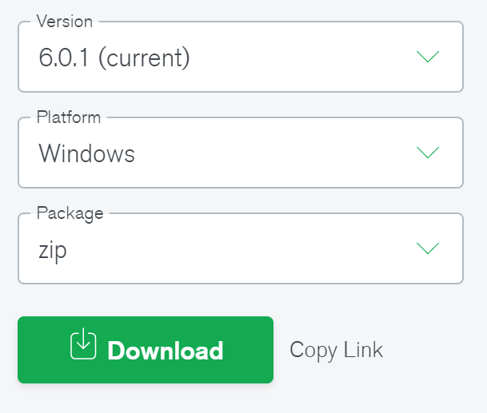
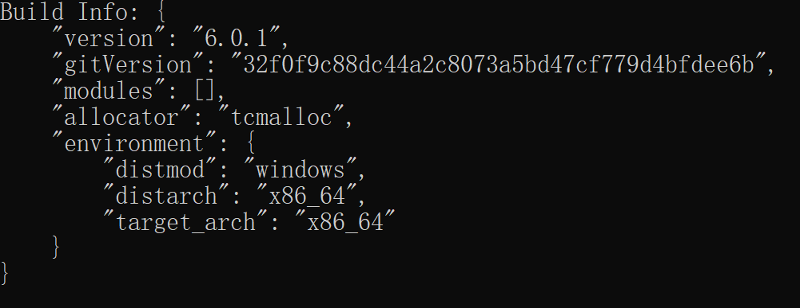

[TOC]


# MongoDB

****

***`MongoDN`是一个基于分布式文件存储的<span style=color:red;>非关系型数据库</span>，以 `JSON` 为数据模型***


<center></center>


## 🔧安装

🔗[MongoDB 官网](https://www.mongodb.com/)


### ✨步骤

1. ###### *安装对应操作系统的版本，推荐安装`zip`*

   + 

2. ###### *将`zip`解压后，将`<安装路径>\MongoDB\mongodb-6.0.1-winx64\bin`配置系统环境变量`(Path)`*

3. ###### *在`<安装目录>\MongoDB\mongodb-6.0.1-winx64\`下创建指定文件和目录*

   1. ###### *创建`data\db`目录*

   2. ###### *创建`log\mongodb.log`日志文件*

   3. ###### *创建`mongod.cfg`配置文件，并在其中配置其内容*

      + ```cfg
        systemLog:
          destination: file
          path: C:\Program Files\MongoDB\mongodb-6.0.1-winx64\log\mongodb.log
          logAppend: true
        storage:
          journal:
            enabled: true
          dbPath: C:\Program Files\MongoDB\mongodb-6.0.1-winx64\data\db
        ```

4. ###### *在安装`bin`目录下以管理员身份打开 `PowerShell `，并运行如下命令*

   + ```cmd
     mongod --config "mongod.cfg文件的地址" --install --serviceName "MongoDB" --journal
     ```

5. ###### *启动 `MongoDB` 服务*

   + ```cmd
     net start MongoDB // 启动服务
     net stop MongoDB  // 停止服务

6. ###### *检测是否安装成功，出现如似以下内容就说明安装成功*

   + ```cmd
     mongod --version
     ```

   + 

7. ###### *==**(可选)**==安装 `MongoDB Shell`，从`4.*.*`版本开始`MongoDB`不再提供内置客户端*

   + ###### 下载地址:🔗[MongoDB Shell](https://www.mongodb.com/try/download/shell)

   + ###### 在`zip`解压的`.exe`放到 `<MongoDB安装目录>\bin`内即可使用

8. ###### *==**(可选)**==安装`MongoDB`的专业客户端 [Studio 3T](https://studio3t.com/)*

   1. ###### 在任意处创建 `studio3t.bat`(内容如下)，双击运行即可重置使用时间

   2. ```bat
      @echo off
      ECHO Reset  Studio 3T use Date......
      REG DELETE "HKEY_CURRENT_USER\Software\JavaSoft\Prefs\3t\mongochef\enterprise" /f
      RMDIR /s /q %USERPROFILE%\.3T\studio-3t\soduz3vqhnnja46uvu3szq--
      RMDIR /s /q %USERPROFILE%\.3T\studio-3t\Lwm3TdTxgYJkXBgVk4s3
      RMDIR /s /q %USERPROFILE%\AppData\Local\t3\dataman\mongodb\app\AppRunner
      RMDIR /s /q C:\Users\Public\t3\dataman\mongodb\app\AppRunner
      RMDIR /s /q %USERPROFILE%\AppData\Local\Temp\t3\dataman\mongodb\app\AppRunner
      RMDIR /s /q %USERPROFILE%\AppData\Local\ftuwWNWoJl-STeZhVGHKkQ--
      RMDIR /s /q %USERPROFILE%\AppData\Local\Temp\ftuwWNWoJl-STeZhVGHKkQ--
      RMDIR /s /q %USERPROFILE%\.cache\ftuwWNWoJl-STeZhVGHKkQ--
      ECHO Reset OK,Click any key to quit......
      pause>nul
      exit
      ```


## 🍀术语

|       术语        |          说明           |
| :---------------: | :---------------------: |
|  ***datebase***   |       **数据库**        |
| ***collection***  |    **数据库表/集合**    |
|  ***document***   |     **数据行/文档**     |
|    ***field***    |     **数据字段/域**     |
|    ***index***    |        **索引**         |
| ***primary key*** | **自动设置`_id`为主键** |


## 🍀概念

> ***`MongoDB` 中的记录就是一个文档，它是一个由字段和值对`（field:value）`组成的数据结构。`MongoDB `文档类似于`JSON`对象，即一个文档认为就是一个对象。***


## ⭐基本命令

|           命令            |                作用                |
| :-----------------------: | :--------------------------------: |
|       ***`help`***        |            **查看帮助**            |
|   ***`use 数据库名`***    | **切换数据库，不存在就创建并切换** |
|     ***`show dbs`***      |         **查询所有数据库**         |
|  ***`show databases`***   |        **等价 `show dbs`**         |
|        ***`db`***         |      **查询当前使用的数据库**      |
|   ***`db.getName()`***    |           **等价 `db`**            |
|    ***`db.stats()`***     |      **查询当前数据库的状态**      |
|   ***`db.version()`***    |      **查询当前数据库的版本**      |
|   ***`db.getMongo()`***   | **查询当前数据库的连接机器的地址** |
| ***`db.dropDataBase()`*** |      **删除已持久化的数据库**      |
| ***`show collections`***  |     **查询当前数据中的所有表**     |


### 创建数据库

> ```mongodb
> use 数据库名
> ```
>
> ###### :grey_exclamation:*在 `MongoDB` 中，集合只有在内容插入之后才会真正创建*
>
> ***数据库名规则***
>
> + ###### 不能是空字符串
>
> + ###### 不能包含`空格`，`.`，`$`，`/`，`\`，`空字符`
>
> + ###### 应该全部小写
>
> + ###### 最大 `64` 字节


### ❗❗注意

> ==***💡`js`代码可与`mongodb`的命令结合使用***==


## 特殊库

1. ###### ==***admin***==

   + > ###### *`root` 数据库*

2. ==***local***==

   + > ***数据永远不会被复制，可以用来存储限于本地单台服务器的任意集合***

3. ##### ==***config***==

   + > ###### *当 `Mongo` 用于分片设置时，`config`数据库在内部使用，用于保存分片的相关信息*


## 📘集合操作

### 创建集合

> ```mongodb
> db.createCollection(name, options) // 显式创建
> db.name.drop() // 集合删除
> ```
>
> ​		**`name`**	:	集合名称
>
> ​		**`options`**	:	额外配置，**可选**
>
> ​				`size`	:	最大存储空间
>
> ​				`capped`	:	是否有上限
>
> ​				`max`	:	最大文档集合


​	

### 获取集合名

```mongodb
db.getCollection('集合名'); // 获取数据库中指定集合名
db.getCollectionNames(); // 获取数据库中所有集合名,返回数组
```


## 📑文档操作

### 文档插入

> ```mongodb
> db.集合名.save(document/array) 	// 方式1 单个/批量插入使用数组
> db.集合名.insert(document/array)	// 方式2 单个插入
> db.集合名.insertsMany([document1, document2, ..,]) // 批量插入
> ```
>
> ​		**`document`**	:	文档
>
> ​		**`array`**	:	数组
>
> ==❗***注意***==
>
> + ==***向集合中插入，如果集合不存在就<span style=color:red;>隐式创建</span>该集合***==
> + ==***`mongo` 中的数字，默认`double`类型***==
> + ==***整数使用 `NumberInt(整型数字)` 函数存储***==
> + ==***存储当前时间使用 `new Date()`***==
> + ==***插入的数据没有指定`_id`，会自动生成主键值***==


### 文档查询

> ```mongodb
> db.集合名称.find(<query>, <projection>) // 查询符合条件的所有数据
> db.集合名称.findOne(<query>, <projection>) // 查询符合条件的第一个数据
> db.集合名称.distinct(field)		// 查询去重后的字段
> ```
>
> ​		**`query`**	:	可使用查询运算符筛选，**可选**
>
> ​		**`projection`**	:	指定返回的文档字段，`1(显示) / 0(不显示)`，**可选**
>
> :grey_exclamation:***参数为空，默认查询所有文档数据***


### 文档更新

> ```smongodb
> db.集合名.update(query, update, options)
> ```
>
> ​		**`query`**	:	匹配修改数据条件
>
> ​		**`update`**	:	修改数据
>
> ​				`$set`	:	修改更新
>
> ​				`$inc`	:	在原列值上进行操作
>
> ​		**`options`**	:	额外配置，**可选**
>
> ​				`multi`	:	是否修改全部符合条件的数据，默认`false`
>
> :grey_exclamation:***<span style=color:red;>覆盖更新</span> : 没有使用 `$set`，其他字段会没有值`(null)`***
>
> :grey_exclamation:***<span style=color:red;>修改更新</span> : 使用 `$set` 进行更新，其他字段值不会变***


### 文档删除

> ```mongodb
> db.集合名.remove({/ ... /})
> ```
>
> ​		**`{...}`**	:	删除条件，空对象则删除全部


## 📃文档查询

### 统计查询

> ```mongodb
> db.集合名.count(query, options)
> ```
>
> ​		**`query`**	:	查询条件
>
> ​		**`options`**	:	额外配置，**可选**
>
> :grey_exclamation:***空参数，默认查询集合的所有记录条数***


### 分页查询

> ```mongodb
> db.集合名.find().skip(number).limit(number)
> ```
>
> ​			**`limit(number)`**	:	**方法**，查询前`number`条数据，默认值`20`
>
> ​			**`skip(number)`**	:	**方法**，查询跳过`number`条数据的的数据，默认值`0`


### 排序查询

> ```mongodb
> db.集合名.find().sort({ field: number,... })
> ```
>
> ​		**`number`**	:	指定排序方法，`1(升序) / -1(降序)`
>
> :grey_exclamation:***可指定多个`field`进行排序，当第一个`field`相同时，按照第二个`field`进行排序***


### 正则查询

> ```mongodb
> db.集合名.find({ field: /正则/ })
> ```
>
> :grey_exclamation:***与`js`正则完全一致***


### 比较查询

> ```mongodb
> db.集合名.find({ field: { 比较操作符: value } })
> ```
>
> | 比较操作符 |       作用        |
> | :--------: | :---------------: |
> | **`$gt`**  |   **大于 `>`**    |
> | **`$lt`**  |   **小于 `<`**    |
> | **`$gte`** | **大于等于 `>=`** |
> | **`$lte`** | **小于等于 `<=`** |
> | **`$ne`**  |  **不等于 `!=`**  |


### 模糊查询

> ```mongodb
> db.集合名.find({ field: { 操作符: [value, ...] } })
> ```
>
> |   操作符   |    作用    |
> | :--------: | :--------: |
> | **`$in`**  |  **包含**  |
> | **`$nin`** | **不包含** |


### 涵盖查询

> :grey_exclamation:==***当查询条件和查询的投影仅包含索引字段时，`MongoDB` 会直接从索引中返回结果，而不会扫描文档***==


### 条件查询

```mongodb
$and: [{ }, { }, ...] // 并且
$or: [{ }, { }, ...]	// 或者	
```


### ❕注意

+ ###### :grey_exclamation:*`skip()`，`limit()`，`sort()`三个方法在一起执行时，执行顺序为 `sort() -> skip() -> limit()`*


## 🔑索引

==***索引是<span style=color:red;>特殊的数据结构</span>，易于遍历的形式存储集合数据集的一小部分。索引存储特定字段或一组字段的值，按字段值排序。索引项的排序支持有效的相等匹配和基于范围的查询操作***==


### 🔅类型

+ ###### ***单字段索引***

+ ###### ***复合索引***

+ ###### *地理空间索引*

+ ###### ***文本索引***

+ ###### ***哈希索引***


### 查询索引

```mongodb
db.集合名.getIndexes();

// 查询结果
[
    {
        "v" : 2.0, // 索引版本号
        "key" : {
            "_id" : 1.0 // 表示索引是升序
        },
        "name" : "_id_" // 索引名称
    }
]
```


### 创建索引

> ```mongodb
> db.集合名.createIndex(keys, options)
> ```
>
> ​		**`keys`**	:	索引键，`1(升序) / -1(降序)`
>
> ​		**`options`**	:	额外配置，**可选**
>
> ​				`unique`	:	索引是否唯一，默认值`false`
>
> ​				`name`	:	索引名称
>
> ​				`v`	:	索引的版本号


### 删除索引

> ```mongodb
> db.集合名.dropIndex(index); // 删除指定索引
> db.集合名.dropIndexs();	 // 删除全部索引(_id除外)
> ```
>
> ​		**`index`**	:	指定使用删除的索引，`document/name`

​	


## 🔘执行计划

==***分析查询性能`(Analyze Query Performance)`，通常使用执行计划来查看查询的情况，耗费时间，是否基于索引查询等等***==

> ```mongodb
> db.集合名.find().explain(options);
> ```
>
> ​		**`options`**	:	额外配置，**可选**


## ▫▫▫终

<center><b><i><u>- 我想成为你刻骨铭心之人 -</u></i></b></center>

