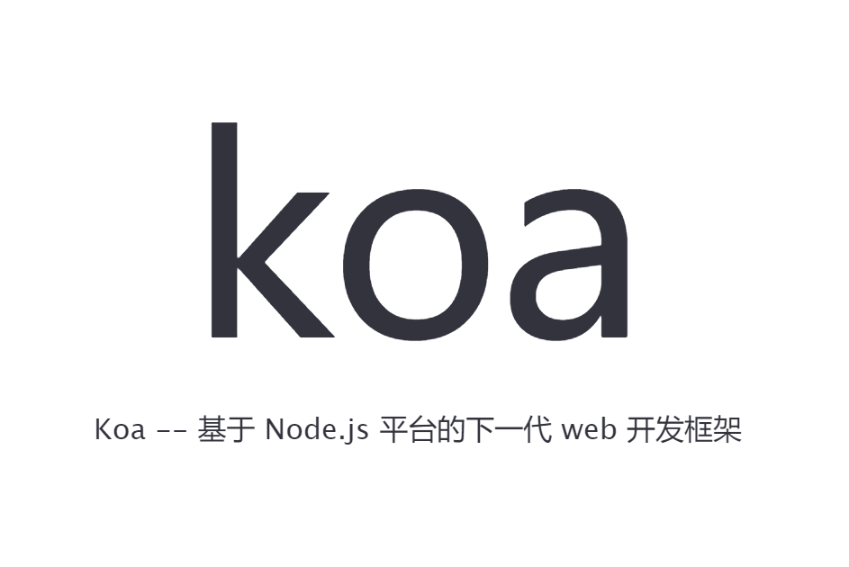
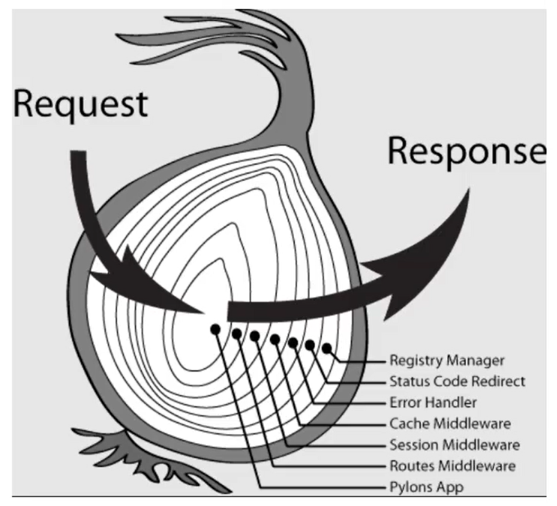

[TOC]

# 🔶Koa

****

<center></center>

+ 🔗[koa 官网](https://www.npmjs.com/package/koa)

+ 🔗[Koa 中文文档](https://koa.bootcss.com/)

<u>==***`Koa` 是下一代的 `Node.js` 的 `Web` 框架***==</u>


## 🌺注意

+ ###### *`Koa` 不提供内置的中间件*

+ ###### *`Koa` 不提供路由，而是把路由模块分离了`(koa/router)`*

+ ###### *添加了 `Context` 对象，作为请求的上下文对象*

+ ###### *采用 `async/await `异步流程控制*

+ ###### *`Koa `中间件采用洋葱模型*

  + 


## 模块安装

```cmd
npm i koa
```


## 创建基本 Web 服务器

```js
// 导入 koa 模块
const Koa = require('koa');

// 创建 web 服务
const app = new Koa();

/* 
挂载路由
	中间件通常带有两个参数 (ctx, next), ctx 是一个请求的上下文（context）,
	next 是调用执行下游中间件的函数. 在代码执行完成后通过 then 方法返回一个 Promise
*/
app.use((ctx, next) => {
    console.log(ctx.path, ctx.request.path);

    // ctx.response.body = "<b>Hello Koa ...</b>";
    ctx.body = "<b>Hello Koa ...</b>"; // 简写方式
})

// 启动 Web 服务器
app.listen(80, () => {
    console.log('koa server running at http://127.0.0.1');
});
```


## ❌错误处理

```js
app.on('error', (err, ctx) => {
    console.error('server error', err, ctx);
});
```


## 同步

```js
app.use(async (ctx, next) => {
  if (ctx.url === '/favicon.ico') return;
  console.log('one ...');
  let date = await next();
  console.log('four ...');
  ctx.body = { status: 0, date };
});

app.use(async (ctx, next) => {
  console.log('two ...');
  await new Promise((resolve, reject) => setTimeout(resolve, 1000));
  console.log('three ...');
  return Date.now();
});

// 访问 http://127.0.0.1/ 执行结果
one ...
two ...
three ...
four ...
{ "status": 0, "date": 1661588864118 }
```


## 🚩中间件

==***`Koa` 的中间件之间按照编码顺序在栈内依次执行，允许您执行操作并向下传递请求`（downstream）`，之后过滤并逆序返回响应`（upstream）`***==


### 模块安装

🔗[koajs/router - GitHub](https://github.com/koajs/router/blob/HEAD/API.md)

```cmd
npm i @koa/router
```


### 基本使用

```js
const Koa = require('koa');

// 导入 @koa/router 模块
const Router = require('@koa/router');

const app = new Koa();
// 创建路由对象
const router = new Router();

// 挂载路由接口
router.get('/', (ctx, next) => {
  // ctx.router available
});

// 挂载路由对象 allowedMethods()自动判断不合法的请求方式,并返回 405
app.use(router.routes()).use(router.allowedMethods());

app.listen(80, () => {
    console.log('koa server running at http://127.0.0.1');
});
```


### 设置多个中间件

```js
router.get(
    '/users/:id',
    (ctx, next) => {
        ctx.user = { id: 17, name: "Alex" };
        next();
    },
    ctx => {
        console.log(ctx.user); // => { id: 17, name: "Alex" }
    }
);
```


### HTTP 方法

> ###### *可链式调用*
>
> ```js
> router.get().post().put().del().all();
> ```

|    方法    |       说明       |
| :--------: | :--------------: |
| **`get`**  |     **获取**     |
| **`post`** |     **增加**     |
| **`put`**  |     **更新**     |
| **`del`**  |     **删除**     |
| **`all`**  | **匹配所有方法** |


### 嵌套路由

```js
const userRouter = new Router();
const router = Router();

// 1.注册路由组件
userRouter.get('/', (ctx, next) => {...});
router.use('/user', userRouter.routes(), userRouter.allowedMethods());

// 2.注册应用级组件
app.use(router.routes()).use(router.allowedMethods());
```


### 路由前缀

> ```js
> new Router({ prefix: prefixStr });
> router.prefix(prefixStr);
> ```
>
> ​		**`prefixStr`**	:	**路由前缀**(以斜杠`/`开头)，字符串

```js
// 方式1
const router = new Router({
  prefix: '/users'
});

// 方式2
router.prefix('/users');
```


### 重定向

> ```js
> router.redirect(source, destination, [code]);
> ctx.redirect(destination);
> ```
>
> ​		**`source `**	:	路由名称，**源**
>
> ​		**`destination`**	:	路由名称，**目的地**
>
> ​		**`code`**	:	`HTTP` 状态代码（默认`301`）

```js
// 方式1
router.redirect('/', '/index');

// 方式2
router.get('/', ctx => {
    ctx.redirect('/index'); // 设置重定向目的地
    ctx.status = 301; // 设置状态码
});
```


## 🌍cors

### 模块安装

```cmd
npm i koa2-cors
```


### 基本使用

```js
// 引入 koa2-cors 模块
const cors = require('koa2-cors');

// 配置解决跨域的组件
app.use(cors());
```


## 🎈静态资源

### 模块安装

🔗[koajs/static - GitHub](https://github.com/koajs/static)

```cmd
npm i koa-static
```


### 基本使用

```js
// 导入 koa-static 模块
const serve = require('koa-static');

// 托管静态资源
app.use(serve('public')); // 同一级目录下的public文件夹
```


## 🔴请求参数

+ ***获取路径中的参数***

  + ```js
    ctx.params		// { ... }
    ctx.querystring // page=1&limit=10	
    ```

+ ***获取请求体中的参数***

  + 🔗[koa-bodyparser](https://www.npmjs.com/package/koa-bodyparser)

    ```cmd
    # 安装 koa-bodyparser 模块
    npm i koa-bodyparser
    ```

  + ```js
    // 引入 koa-bodyparser 模块
    const bodyParser = require('koa-bodyparser');
    
    // 配置解析body请求参数的组件
    app.use(bodyParser());
    
    // 获取请求体中的参数(json/form)
    ctx.request.body // { ... }
    ```


## 🎹使用模版

### 模块安装

```cmd
npm i koa-views
```


### 基本使用

```js
// 导入 koa-views 模块,项目中必须要有模版包(ejs)
const views = require('koa-views');
const path = require('path');

/*
views(root, opts)
	root : 视图所在的位置,必须是绝对路径
	opts : 配置对象
		extension : 视图的默认扩展名
*/
app.use(views(path(_dirname, './views'), { extension: 'ejs' }));

// 渲染 ejs 模版
router.get('/index.html', async (ctx, next) => {
    await ctx.render('index', { title: 'INDEX-EJS' }); // 异步需要使用await
});
```


## 💡Cookie与Session

### 🍪cookie

```js
ctx.cookies.set(key, value[, options]); // 设置cookie
ctx.cookies.get(key[, options]); 		// 获取cookie
```


### 🌌session

#### 模块安装

```cmd
npm i koa-session-minimal
```


#### 基本使用

```js
// 导入 session 模块
const session = require('koa-session-minimal');

// 配置 session 组件
app.use(session({
    key: 'SESSION_ID', // 会话 Cookie 名称和存储密钥前缀,任意
    cookie: { // cookie 选项
        maxAge: 1000 * 60 * 60 // 设置会话过期(毫秒)
    }
}));

// 存储 session 数据
ctx.session.key = value;
// 获取 session 数据
ctx.session.key;
```


#### 使用MongoDB存储会话数据

🔗[koa2-session-mongo](https://www.npmjs.com/package/koa2-session-mongo)

##### 模块安装

```cmd
npm i koa2-session-mongo
```


##### 基本使用

```js
// 导入 mongo 模块
const MongoStore = require("koa2-session-mongo");

// 配置 mongo
app.use(
    session({
        store: new MongoStore({
            url: "mongodb://127.0.0.1", // requierd
            db: "database_name", // required
        }),
    })
);
```


## 🟠JWT

###  模块安装

```cmd
npm i jsonwebtoken
```


### 基本使用

```js
// 导入 jwt 模块
const jwt = require('jsonwebtoken');

// 定义用于加密和解密的密钥
const secretKey = 'linke 🌙';

// 生成 JWT 字符串
let jsonObj = { username: 'keke', password: '2306' };
let token = jwt.sign(jsonObj, secretKey, { expiresIn: '1h' }) // expiresIn设置过期时间

// 解析 JWT 字符串
jwt.verify(token, secretKey); // { /*...*/ }
```


## 📂multer

### 模块安装

```cmd
npm i --save @koa/multer multer
```


### 基本使用

```js
// 导入 multer 模块
const multer = require('@koa/multer');

// 配置 multer 对象
const upload = multer({
    storage: multer.diskStorage({
        destination: function (ctx, file, cb) {
            // 接收到文件后输出的保存路径（若不存在则需要创建）
            cb(null, './uploads');
        },
        filename: function (ctx, file, cb) {
            // 将保存文件名设置为 时间戳 + 文件原始名
            cb(null, Date.now() + "-" + file.originalname);
        }
    })
});

// 使用
router.post('/upload', upload.single('fileName'), ctx => {
   	// 获取文件信息
    console.log(ctx.file);
    // { fieldname, originalname, encoding, mimetype, destination, filename, path, size }
})
```


## 🍃MongoDB

### 模块安装

```cmd
npm i mongoose
```


### 基本使用

```js
// 1.导入 mongoose 模块
const mongoose = require('mongoose');

// 2.创建数据库连接
main().catch(err => console.log(err));
async function main() {
    await mongoose.connect('mongodb://localhost:27017/study');
}

// 3.接口定义字段,限制 users 集合的字段以及字段类型
const UserType = {
  username: String,
  password: String,
  age: Number
}

// 4.定义模块(对应数据库中(模型名+s)的集合)
const UserModel = mongoose.model('user', new mongoose.Schema(UserType));

// 查询 MongoDB 数据库中的数据
router.get('/list', async ctx => {
    let result = await UserModel.find({}, ['username', 'password']);
    ctx.body = result; // [{ "_id", "username", "password" },..]
});
```


## ▫▫▫终

<center><b><i><u>- 我想成为你刻骨铭心之人 -</u></i></b></center>

