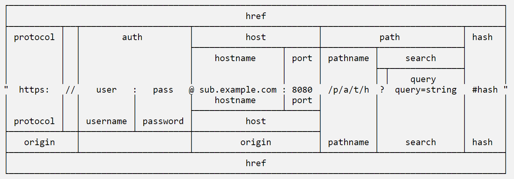
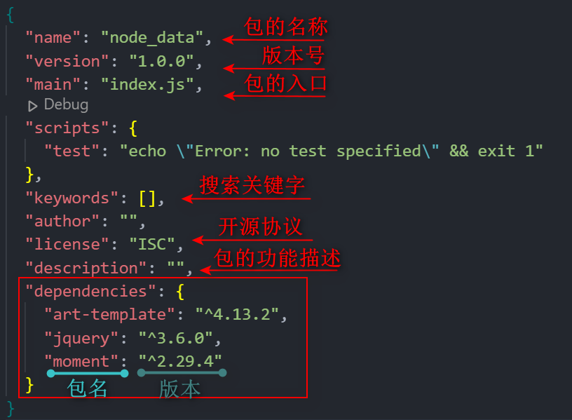
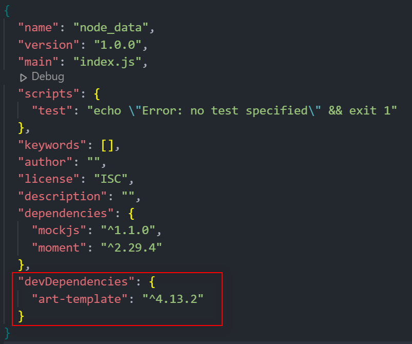
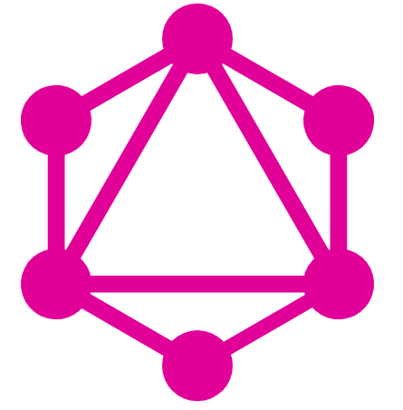
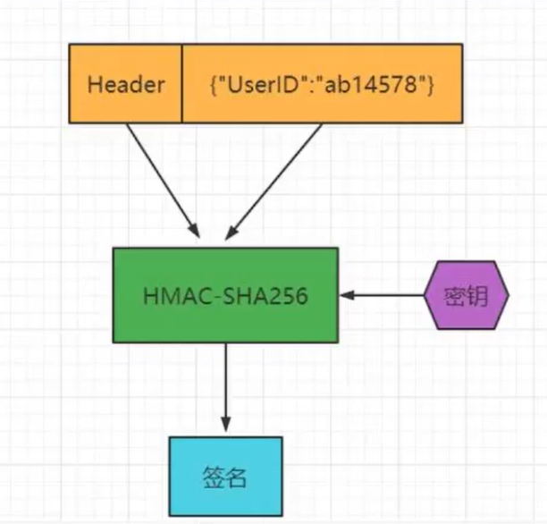
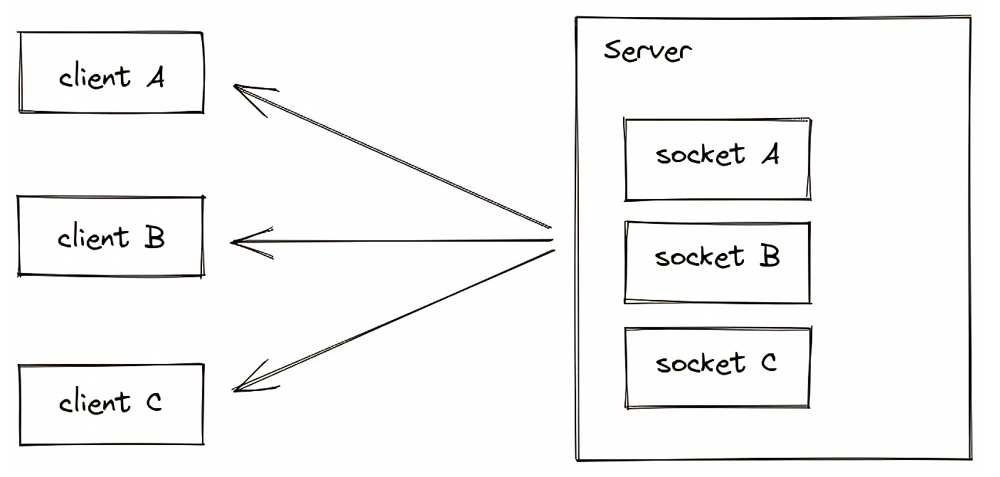

[TOC]

# Node

****

***`Node.js` 是一个基于 Chrome V8 引擎的 <span style=color:red;>JavaScript 运行环境</span>***

<center></center>


## 🍓安装

> 
>
> + ###### ==***LTS***==  :  <span style=color:red;>长期稳定版</span>
>
> + ###### ==***Current***==  :  <span style=color:red;>新特性尝鲜版</span>


### 查询版本号

```cmd
node --version
node -v # 简写
```


## 💡运行环境

:grey_exclamation:==**运行环境**==<u>是指**<span style=color:red;>代码正常运行所需的必要环境</span>**</u>


### 浏览器的运行环境

> 
>
> 1. ==***V8 引擎负责解析和执行 <span style=color:red;>JavaScript 代码</span>***==
> 2. ==***内置 `API` 是由<span style=color:red;>运行环境</span>提供的特殊接口，<span style=color:red;>只能在所属的运行环境中被调用</span>***==


### Node.js 的运行环境

> 
>
> 1. ==***<span style=color:red;>浏览器</span>是 JavaScript 的<span style=color:red;>前端运行环境</span>***==
> 2. ==***`Node.js` 是 JavaScript 的<span style=color:red;>后端运行环境</span>***==
> 3. ==***`Node.js` 中<span style=color:red;>无法调用 DOM 和 BOM 等浏览器内置 API</span>***==


### ⚪Node.js 环境中执行 js 代码

1. ###### 打开终端

2. ###### 输入 `node` <span style=color:skyblue;><u>要执行的 `js` 文件的路径</u></span>


## 📘模块化

> ==***<span style=color:red;>模块化</span>是指解决一个复杂问题时，自顶向下逐层把系统划分成若干模块的过程，<span style=color:skyblue;>模块是可组合、分解和更换的单元</span>***==
>
> ❕==***<span style=color:red;>遵守固定的规则</span>，把一个大文件拆成独立并互相依赖的多个小模块***==


### 好处

1. ###### *提高了代码的<span style=color:red;>复用性</span>*

2. ###### *提高了代码的<span style=color:red;>可维护性</span>*

3. ###### *可以实现<span style=color:red;>按需加载</span>*


### ⭐模块的加载机制

> ❗==***<span style=color:red;>模块在第一次加载后会被缓存</span>，不论是内置模块、用户自定义模块、还是第三方模块，它们都会优先从缓存中加载，从而提高模块的加载效率***==


#### 内置模块的加载机制

> ❗***<span style=color:red;>内置模块的加载优先级最高</span>***


#### 自定义模块的加载机制

> ❗==***自定义模块时，必须指定以 `./` 或 `../` 开头的<span style=color:red;>路径标识符</span>***==
>
> :grey_exclamation:==***如果没有指定 `./ `或 `../` 这样的路径标识符，则 `node` 会把它当作<span style=color:red;>内置模块</span>或<span style=color:red;>第三方模块</span>进行加载***==

🔻***导入自定义模块时，如果省略了文件的扩展名；则会<span style=color:red;>按顺序分别尝试加载</span>以下的文件***

1. ###### *按照`确切的文件名`进行加载*

2. ###### *补全 `.js` 扩展名进行加载*

3. ###### *补全 `.json` 扩展名进行加载*

4. ###### *补全 `.node` 扩展名进行加载*

5. ###### *`加载失败`，终端报错*


#### 第三方模块的加载机制

> ❗==***从当前模块的父目录开始，尝试从 `/node_modules` 文件夹中加载第三方模块***==
>
> :grey_exclamation:==***<span style=color:red;>如果没有找到对应的第三方模块，则移动到再上一层父目录中，进行加载，直到文件系统的根目录</span>***==


### 目录作为模块

> ==***当把目录作为模块标识符，有三种加载方式***==

1. ###### *在被加载的目录下查找一个叫做 `package.json` 的文件，并寻找 `main` 属性，作为 `require()` 加载的入口*

2. ###### *如果目录里没有 `package.json` 文件，或者 `main` 入口不存在或无法解析，则会试图加载目录下的 `index.js` 文件*

3. ###### *以上两步都失败了，则会在终端打印错误消息，报告模块的缺失：`Error: Cannot find module 'moduleName'`*


##  🌟Node.js中模块的分类

==***根据模块来源的不同，将模块分为了 `3` 大类***==

+ ###### *<span style=color:red;>内置模块</span>（内置模块是由 `Node.js` 官方提供的）*

+ ###### *<span style=color:red;>自定义模块</span>（用户创建的每个 `js` 文件，都是自定义模块）*

+ ###### *<span style=color:red;>第三方模块</span>（由第三方开发出来的模块，<span style=color:skyblue;>使用前需要先下载</span>）*


## 加载模块

> ==***使用 `require()` 方法，可以加载需要的<span style=color:red;>内置模块</span>、<span style=color:red;>自定义模块</span>、<span style=color:red;>第三方模块</span>进行使用***==
>
> :grey_exclamation:==***`require()` 方法加载其它模块时，会执行被加载模块中的代码***==
>
> ❗==***`require()` 方法导入模块时，导入的结果，永远以 `module.exports` 指向的对象为准***==

+ ```js
  const _this = require('../js/this'); // 加载自定义模块时,可省略.js 后缀
  ```


## 🎲模块作用域

❗==***自定义模块中定义的<span style=color:skyblue;>变量</span>、<span style=color:skyblue;>方法</span>等成员，<span style=color:red;>只能在当前模块内被访问</span>，这种<span style=color:red;>模块级别的访问限制</span>，叫做<span style=color:red;>模块作用域</span>***==


## 💠内置模块

==***内置模块是由`Node.js` 官方提供的***==


### fs 文件模块

==***`fs` 模块是 `Node.js` 官方提供的、用来操作文件的模块***==


#### 1️⃣导入模块

```js
// 异步 fs 模块
const fs = require('node:fs'); // 方式1
const fs = require('fs'); // 方式2

// 同步 fs 模块，所有方法都会返回一个 Promise对象
const fs = require('node:fs/promises'); // 方式1
const fs = require('fs').promises; // 方式12
```


#### 📄读取文件

> ```js
> // 异步方法
> fs.readFile(path, encode, callback);
> // 同步方法,出现错误需要 try ... catch ...
> fs.readFileSync(path, encode);// 返回值为读取内容
> ```
>
> ​		**`path`**	:	文件路径，字符串，**必选**
>
> ​		**`encode`**	:	读取文件的编码格式，**可选**
>
> ​		**`callback`**	:	读取完成后的回调函数，用来获取读取结果，**必选**
>
> ​				`err` 	:	成功为`null`；失败为`Error对象`
>
> ​				`data`	:	成功为`读取内容`；失败为`undefined`

```javascript
fs.readFile('../file/1.txt', 'UTF8', function (err, data) {
    if (err) return console.warn('文件读取失败:' + err.message);
    console.log('文件读取成功:' + data); // 若再许我年少时,一两黄金一两风
});
```


#### 📝写入文件

> ```js
> // 异步方法
> fs.writeFile(path, data, encode, callback); // 新内容会覆盖旧内容
> fs.appendFile(path, data, callback); // 追加文件内容
> // 同步方法,出现错误需要 try ... catch ...
> fs.writeFileSync(path, data, encode);
> fs.appendFileSync(path, data);
> ```
>
> ​		**`path`** 	:	文件路径，字符串，**必选**
>
> ​		**`data`**	:	写入内容，**必选**
>
> ​		**`encode`**	:	写入文件内容的编码格式，默认`utf8`，**可选**
>
> ​		**`callback`**	:	写入完成后的回调函数，**可选**
>
> ​				`err` 	:	成功为`null`；失败为`Error对象`
>
> :grey_exclamation:***方法可以创建文件，不能创建目录***
>

```js
// 写
fs.writeFile('../file/1.txt', '功成不必在我,功成必定有我', 'UTF8', function (err) {
    if (err) return console.warn('文件写入失败:' + err.message);
    console.log('文件写入成功');
});

// 追加
fs.appendFile('../file/2.txt', new Date().toLocaleString() + '\n', err => {
    if (err) return console.warn('追加文件内容失败:' + err.message);
    console.log('追加文件内容成功');
});
```


#### 创建目录

> ```js
> // 异步方法
> fs.mkdir(path[, options], callback);
> // 同步方法,出现错误需要 try ... catch ...
> fs.mkdirSync(path[, options]);
> ```
>
> ​		**`path`** 	:	目录路径，字符串，**必选**
>
> ​		**`options`**	:	配置对象，**可选**
>
> ​				`recursive`	:	是否递归创建多个目录，默认`false`
>
> ​		**`callback`**	:	创建完成后的回调函数，**可选**
>
> ​				`err` 	:	成功为`null`；失败为`Error对象`
>
> ###### :grey_exclamation:*创建不存在的目录，有则报错*

```js
fs.mkdir('../test', err => {
    if (err) return console.warn('创建文件或目录失败:' + err.message);
    console.log('创建文件或目录成功');
});
```


#### 重命名文件或目录

> ```js
> // 异步方法
> fs.rename(oldPath, newPath, callback);
> // 同步方法,出现错误需要 try ... catch ...
> fs.renameSync(oldPath, newPath);
> ```
>
> ​		**`oldPath`**	:	旧的文件或目录路径，字符串，**必选**
>
> ​		**`newPath`**	:	新的文件或目录路径，字符串，**必选**
>
> ​		**`callback`**	:	重命名完成后的回调函数，**可选**
>
> ​				`err` 	:	成功为`null`；失败为`Error对象`
>
> ###### :grey_exclamation:*新的文件或目录已存在，则会报错*

```js
fs.rename('../test', '../test1', err => {
    if (err) return console.warn('重命名文件或目录失败:' + err.message);
    console.log('重命名文件或目录成功');
});
```


####  删除文件或目录

> ```js
> // 异步方法
> fs.rmdir(path, callback);  // 删除空目录
> fs.unlink(path, callback); // 删除文件
> // 同步方法,出现错误需要 try ... catch ...
> fs.rmdirSync(path);
> fs.unlinkSync(path);
> ```
>
> ​		**`path`** 	:	需要删除的文件或目录路径，字符串，**必选**
>
> ​		**`callback`**	:	创建完成后的回调函数，**可选**
>
> ​				`err` 	:	成功为`null`；失败为`Error对象`
>
> ###### :grey_exclamation:***无法删除非空目录***

```js
// 删除目录
fs.rmdir('../test1', err => {
    if (err) return console.warn('删除目录失败:' + err.message);
    console.log('删除目录成功');
});

// 删除文件
fs.unlink('../file/1.txt', err => {
    if (err) return console.warn('文件删除失败:' + err.message);
    console.log('文件删除成功');
});
```


#### 获取文件详细

> ```js
> // 异步方法
> fs.stat(path, callback);
> isFile() // 判断是否是文件
> isDirectory() // 判断是否是目录
> // 同步方法,出现错误需要 try ... catch ...
> fs.statSync(path);
> ```
>
> ​		**`callback`**	:	获取文件或目录信息后的回调函数，**可选**
>
> ​				`err` 	:	成功为`null`；失败为`Error对象`
>
> ​				`data`	:	成功为`文件或目录的详细信息`；失败为`undefined`

```js
fs.stat('../file', (err, data) => {
    if (err) return console.warn('读取文件类型失败:' + err.message);
    console.log(data);	// 文件的详细信息 {...}
    console.log(data.isFile());		// false
    console.log(data.isDirectory());	// true
});
```


#### 获取子目录列表

> ```js
> // 异步方法
> fs.readdir(path, callback);
> // 同步方法,出现错误需要 try ... catch ...
> fs.readdirSync(path); // 返回子目录列表数组
> ```
>
> ​		**`callback`**	:	获取子目录列表后的回调函数，**可选**
>
> ​				`err` 	:	成功为`null`；失败为`Error对象`
>
> ​				`data`	:	成功为`子目录列表数组`；失败为`undefined`

```js
fs.readdir('../file', (err, data) => {
    if (err) return console.warn('获取子目录列表失败:' + err.message);
    console.log(data); // [ ..., ... ]
});
```


#### 判断文件或目录是否存在

```js
fs.existsSync('../file') // true
```


#### stream 流

:grey_exclamation:==***流式文件操作，用来写入或读取大文件***==

> ```js
> // 输入流
> fs.createReadStream(path, encode);
> // 输出流
> fs.createWriteStream(path, encode);
> ```
>
> ​		**`path`** 	:	文件路径，字符串，**必选**
>
> ​		**`encode`**	:	操作文件的编码格式，**可选**

```js
// 读取文件
const rs = fs.createReadStream('../file/1.txt', 'utf-8');

let data = '';
rs.on('data', chunk => data += chunk); // 监听文件读取
rs.on('end', () => console.log(data)); // 文件读取结束
rs.on('error', err => console.error(err.message)); // 文件读取失败

// 写入文件
const ws = fs.createWriteStream('../file/2.txt', 'utf-8');

ws.write(new Date().toLocaleString() + '\n'); // 写一部分
ws.write('linke'); // 写一部分
ws.end(); // 结束写入
```


### path 路径模块

==***`path` 模块是 `Node.js` 官方提供的、用来处理路径的模块***==


#### 1️⃣导入模块

```js
const path = require('node:path');  // 方式1
const path = require('path'); // 方式2
```


#### 🎹路径拼接

> ```js
> path.join(...paths);
> ```
>
> ​		**`...paths`**	:	多个路径片段
>
> ​		**`__dirname`**	:	<span style=color:red;>**关键字**</span>，表示当前文件所处的目录
>
> :grey_exclamation:***凡是涉及到路径拼接的操作，都要使用 `path.join()` 方法进行处理***

```js
path.join('/a', '/b/c', '../', './d', 'e') // \a\b\d\e

const filePath = path.join(__dirname, './01_hello.js');
filePath // E:\Node_Data\note\js\01_hello.js
```


#### 获取路径中的文件名

>```js
>path.basename(path, ext);
>```
>
>​		**`path`**	:	路径字符串，**必选**
>
>​		**`ext`**	:	移除路径最后指定部分，**可选**

```js
const filePath = 'E:\Node_Data\note\js\01_hello.js';

 path.basename(filePath) // 01_hello.js
path.basename(filePath, '.js') // 01_hello
```


#### 获取路径中的文件扩展名

>```js
>path.extname(path);
>```
>
>​		**`path`**	:	路径字符串

```js
const filePath = 'E:\Node_Data\note\js\01_hello.js';

path.extname(filePath) // .js
```


### http 模块

==***`http` 模块是 `Node.js` 官方提供的、用来创建 `web` 服务器的模块***==


#### 1️⃣导入模块

```js
const http = require('node:http'); // 方式1
const http = require('http'); // 方式2
```


#### 🌏创建 Wed 服务器

1. ###### 导入 `http` 模块

   + ```js
     const http = require('http');
     ```

2. ###### 创建 `web` 服务器

   + ```js
     const server = http.createServer();
     ```

3. ###### 监听 `request` 事件

   + ```js
     server.on('request', (req, res) => {
         console.log('Hello Web Server ..');
     });
     ```

4. ###### 启动服务器

   + ```js
     server.listen(80, () => {
         console.log('http server running at http://127.0.0.1');
     });
     ```


#### get/post

```js
switch (urlObj.pathname) {
    case '/get':
        return httpGet(data => res.end(data));
    case '/post':
        return httpPost(data => res.end(data));
    default:
        return res.end('404');
}

/* // get
  请求: 前端请求 ---> node 请求(get) --> 后端(get)
  响应: 前端请求 <--- node 请求(get) <-- 后端(get)
*/
function httpGet(callback) {
    let data = '';
    http.get('http://localhost:8080/TestRequest/user/queryUsers', res => {
        res.on('data', chunk => data += chunk);
        res.on('end', () => {
            // console.log(data);
            callback(data);
        })
    });
}

/* // post
  请求: 前端请求 ---> node 请求(post) --> 后端(post)
  响应: 前端请求 <--- node 请求(post) <-- 后端(post)
*/
function httpPost(callback) {
    let data = '';
    const options = { // 'http://localhost:8080/TestRequest/user/postAxios'
        hostname: 'localhost',
        port: '8080',
        path: '/TestRequest/user/postAxios',
        method: 'POST',
        headers: {
            'Content-Type': 'application/json;charset=utf-8'
        }
    }
    let req = http.request(options, res => {
        res.on('data', chunk => data += chunk);
        res.on('end', () => callback(data));
    });
    req.write(JSON.stringify({ id: 1 }));
    req.end();
}
```


#### request

==***请求对象***==

>**`url`**	:	客户端请求的 `URL`
>
>**`method`**	:	客户端的请求类型

```js
let str = `请求url:${req.url}, 请求方式method:${req.method}`;
str // 请求url:/, 请求方式method:GET
```


#### response

==***响应对象***==

>**`write(data)`**	:	设置响应体的内容
>
>**`end(data)`**	:	将内容响应给客户端
>
>**`setHeader(key, value)`**	:	设置响应头，可解决乱码问题
>
>**`writeHead(statusCode, headers)`**	:	设置响应

```js
res.setHeader('Content-Type', 'text/html; charset=utf-8'); // 设置内容的编码格式
res.end(str); // 将内容响应给客户端
res.writeHead(200, { 'Content-Type': 'text/html; charset=utf-8' }); // 响应状态码200,并设置响应头
```


#### 跨域请求

```js
// jsonp
return res.end(`${urlObj.searchParams.get('callback') ?? 'callback'}(${JSON.stringify(data)})`);

// cors
res.writeHead(200, {
    'Content-Type': 'application/json;charset=utf-8',
    'Access-control-allow-origin': '*'
});
```


### url 模块

==***`url` 模块是 `Node.js` 官方提供的、用来处理请求`url`的模块***==




#### 1️⃣导入模块

```js
const url = require('node:url'); // 方式1
const url = require('url'); // 方式2
```


#### 🌻基本使用

> ```js
> // 旧版
> parse(urlString[, flag])
> // 新版
> new URL(urlString[, base])
> ```
>
> ​		**`urlString`**	:	`url`字符串
>
> ​		**`flag`**	:	是否解析`url`字符串，默认`false`
>
> ​		**`base`**	:	要解析的基本 `URL`， 绝对`urlString`可忽略

```js
/* 请求url: http://127.0.0.1/user?id=1&name=linke */

// ---------------- 旧版 ----------------
const obj = url.parse(req.url, true);
obj.query		// { id: '1', name: 'linke' }
obj.pathname	// /user

// ---------------- 新版 ----------------
const urlObj = new URL(req.url, 'http://127.0.0.1');
urlObj.pathname		// /user
const params = urlObj.searchParams; // { 'id' => '1', 'name' => 'linke' }
params.get('id') // 1
```


#### 序列化url

> ```js
> // 旧版
> format(urlObject)
> // 新版
> format(URL[, options])
> ```
>
> ​		**`urlObject`**	:	需要转换的`url`对象
>
> ​		**`options`**	:	配置对象
>
> ​					`auth`	:	序列化是否包含用户名与密码，默认`true`
>
> ​					`fragment`	:	序列化是否包含片段，默认`true`
>
> ​					`search`	:	序列化否包含搜索查询，默认`true`
>
> ​					`unicode`	:	序列化是否对`Unicode`字符进行编码，默认`true`

```js
// ---------------- 旧版 ----------------
const urlObj = {
  protocol: "http",
  slashes: null,
  auth: null,
  host: '127.0.0.1:80',
  port: '80',
  hostname: "127.0.0.1",
  hash: null,
  search: '?id=1&name=linke',
  query: { id: '1', name: 'linke' },
  pathname: '/user',
  path: '/user?id=1&name=linke',
  href: '/user?id=1&name=linke'
}
url.format(urlObj) // http://127.0.0.1:80/user?id=1&name=linke

// ---------------- 新版 ----------------
const urlObject = new URL('http://2396@霖刻/user?id=1&name=linke');
url.format(urlObject, { unicode: true, search: false }) // http://2396@霖刻/user
```


#### 拼接url

> ```js
> // 旧版
> resolve(from, to)
> // 新版
> new URL(urlString[, base])
> ```
>
> ​		**`from`**	:	拼接·`url`字符串
>
> ​		**`to`**	:	拼接`url`字符串

```js
// ---------------- 旧版 ----------------
url.resolve('/one/two/three', 'four')	// /one/two/four
url.resolve('/one/', "two")		   // /one/two
url.resolve('http://127.0.0.1', '/user')	// http://127.0.0.1/user
url.resolve('http://127.0.0.1/', 'user')	// http://127.0.0.1/user
url.resolve('http://127.0.0.1?id=1', 'user') // http://127.0.0.1/user

// ---------------- 新版 ----------------
const urlObject = new URL('/user', 'http://127.0.0.1');
urlObject.href // http://127.0.0.1/user
```


#### 解码路径字符串

> ```js
> fileURLToPath(url)
> ```
>
> ​		**`url`**	:	`URL` 字符串或 `URL` 对象，必须是有效绝对路径

```js
const { fileURLToPath } = require('node:url');

fileURLToPath("file://01_hello.js") // \\01_hello.js\
```


#### 转换为文件 URL

> ```js
> pathToFileURL(path)
> ```
>
> ​		**`path`**	:	转换为文件 `URL` 的路径

```js
const { pathToFileURL } = require('node:url');

pathToFileURL(__dirname).href // file:///C:...
```


### querystring 模块

==***`url` 模块是 `Node.js` 官方提供的、用来处理请求`查询字符串`的模块***==


#### 1️⃣导入模块

```js
const querystring = require('node:querystring'); // 方式1
const querystring = require('querystring'); // 方式2
```


#### 🌻基本使用

```js
let str = 'id=1&name=linke';

// 转换对象
const params = querystring.parse(str); // { id: '1', name: 'linke' }

// 查询查询字符串
querystring.stringify(params) // id=1&name=linke
```


#### 编码解码

```js
const path = 'http://127.0.0.1/user?id=1&name=linke';

// 编码
const escStr = querystring.escape(path);
escStr // http%3A%2F%2F127.0.0.1%2Fuser%3Fid%3D1%26name%3Dlinke

// 解码
querystring.unescape(escStr) // http://127.0.0.1/user?id=1&name=linke
```


### event 模块

==***`event` 模块是 `Node.js` 官方提供的<span style=color:red;>事件机制模块</span>模块***==


#### 1️⃣导入模块

```js
const EventEmitter = require('node:events'); // 方式1
const EventEmitter = require('events'); // 方式2
```


#### 🌻基本使用

```js
const EventEmitter = require('node:events');

const event = new EventEmitter();

// 无参数自定义事件
// 绑定事件
event.on('public', () => {
    console.log('触发自定义 public 事件...');
})

// 触发指定事件
event.emit('public');

// 有参数自定义事件
event.on('class', (...arg) => {
	console.log('触发自定义 class 事件 args:' + arg);
});

setTimeout(() => event.emit('class', 1, 2, 3), 2000);

// 执行结果
触发自定义 public 事件...
触发自定义 class 事件 args:1,2,3
```


#### 其他方法

```js
once(): 添加单次监听器
removeListener() / off() : 从事件中移除事件监听器
removeAllListeners() : 移除事件的所有监听器
```


### zlip 模块

==***`zlip` 模块是 `Node.js` 官方提供的<span style=color:red;>压缩文件</span>模块***==


#### 1️⃣导入模块

```js
const zlib = require('node:zlib'); // 方式1
const zlib = require('zlib'); // 方式2
```


#### 🌻基本使用

```js
const fs = require("node:fs");
const zlib = require('node:zlib');

// 压缩文件
const rs = fs.createReadStream('../file/1.txt');
const ws = fs.createWriteStream('../file/1.zip');
// 创建 zip 压缩包 
rs.pipe(zlib.createGzip()).pipe(ws);


// 解压文件
const rs = fs.createReadStream('../file/1.zip');
const ws = fs.createWriteStream('../file/1.txt');
// 解压 zip 包
rs.pipe(zlib.createGunzip()).pipe(ws);
```


### crypto 模块

==***`crypto` 模块是 `Node.js` 官方提供的<span style=color:red;>通用的加密和哈希算法</span>模块***==


#### 1️⃣导入模块

```js
const crypto = require('node:crypto'); // 方式1
const crypto = require('crypto'); // 方式2
```


#### 🌻基本使用

```js
const crypto = require('node:crypto');

// md5
// const hash = crypto.createHash('md5');
// sha1
// const hash = crypto.createHash('sha1');
// hmac
const hash = crypto.createHmac('sha256', 'linke 🌙');

// 可任意多次执行 update()
hash.update('linke love shuangshuang');

// 设置转换格式
// console.log(hash.digest('hex'));
console.log(hash.digest('base64'));


// AES
let key = 'linke12345678910'; // 16*8 = 128
let iv = 'shuangshuang0703';

// 加密
function encrypt(key, iv, data) {
    let decipher = crypto.createCipheriv('aes-128-cbc', key, iv);
    return decipher.update(data, 'binary', 'hex') + decipher.final('hex');
}

// 解码
function decrypt(key, iv, crypted) {
    crypted = Buffer.from(crypted, 'hex').toString('binary');
    let decipher = crypto.createDecipheriv('aes-128-cbc', key, iv);
    return decipher.update(crypted, 'binary', 'utf-8') + decipher.final('utf-8');
}

let cryted = encrypt(key, iv, 'linke') // ...
decrypt(key, iv, cryted)  // linke
```


## :pencil2:自定义模块

### module

> ***每个 `js` 自定义模块中都有一个 `module` 对象，它里面<span style=color:red;>存储了和当前模块有关的信息</span>***

<center></center>


#### exports

> ==***在自定义模块中，可以使用 `module.exports` 对象，将模块内的成员共享出去***==
>
> :grey_exclamation:==***`require()` 方法导入自定义模块时，得到的就是 `module.exports `所指向的对象***==

```js
// this.js
const username = 'linke';
module.exports.age = 11;

// index.js
const _this = require('./this');
_this // { age: 11 }
```


### exportes

> ==***`Node` 提供了 `exports` 对象。默认情况下，`exports` 和 `module.exports` 指向同一个对象***==

```js
// this.js
const username = 'linke';
module.exports.age = 11;
exports.getName = function () {
    console.log(username);
}
module.exports === exports // true

// index.js
const _this = require('./this');
_this // { age: 11, getName: [Function (anonymous)] }
```


## 🔆CommonJS 规范

==***`Node.js `遵循了 `CommonJS` 模块化规范，`CommonJS` 规定了<span style=color:red;>模块的特性和各模块之间如何相互依赖</span>***==


### 🍁规定

1. ##### *每个模块内部，`module` 变量代表当前模块*

2. ##### *`module` 变量是一个对象，它的 `exports` 属性是对外的接口*

3. ##### *加载某个模块，其实是加载该模块的 `module.exports` 属性*


## 🌙ES模块化

> :grey_exclamation:==***在 `package.json` 文件中设置 `type` 属性值***==
>
> ❗==***如果项目设置`type`为`module`值，则无法使用 `CommonJS` 规范***==
>
> ```json
> "type": "module"
> ```


## 定时器

> ###### *`setTimeout(callback, delay)`	:	循环定时器*
>
> ###### *`setInterval(callback, delay)`	:	一次定时器*
>
> ###### ***`setImmediate(callback[, arg][, ...])`	:	立即执行定时器***

```js
// 循环定时器
let timer = setInterval(() => {
    console.log('interval');
}, 1000);

// 一次定时器
setTimeout(() => {
    console.log('timeout');
    clearInterval(timer);
}, 0);

// 立即执行定时器
setImmediate(() => {
    console.log('immediate');
});


// 执行结果
immediate
timeout
```


## ✨npm与包

### 💼包

==***`Node.js` 中的<span style=color:red;>第三方模块</span>又叫做<span style=color:red;>包</span>***==


### npm

==***`Node Package Manager` 包管理工具***==

> ❗❗***包下载网址🔗https://www.npmjs.com/*** 


#### 🧬结构


+ ###### *`node_modules` 文件夹用来存放所有已安装到项目中的第三方包*

+ ###### *`package-lock.json` 配置文件用来记录 `node_modules `目录下的每一个包的下载信息*

+ ###### *`package.json` 的包管理配置文件，规定在项目根目录中*


### 🟢创建 package.json

> ==***可以在<span style=color:red;>执行命令时所处的目录</span>中，快速创建 `package.json` 这个包管理配置文件***==
>
> ```cmd
> npm init --yes
> npm init -y # 简写方式
> npm init # 设置详细配置
> ```
>
> :grey_exclamation:***只能在英文的目录下成功运行***
>
> :grey_exclamation:***运行 `npm install` 命令安装包的时候，自动把包的名称和版本号记录到 `package.json`中***
>
> ❗==***项目初始化，就执行该命令***==


#### dependencies

> ❕***记录项目使用 `npm install` 命令安装了的包***
>
> ==***如果某些包在<span style=color:red;>开发</span>和<span style=color:red;>项目上线之后</span>都需要用到，则把这些包记录到 `dependencies` 节点***==

<center></center>


#### devDependencies

> ==***如果某些包<span style=color:red;>只在项目开发阶段</span>会用到，在<span style=color:red;>项目上线之后不会用到</span>，则把这些包记录到 `devDependencies` 节点中***==

<center></center>


#### 包的锁定版本

<center></center>

> ###### ***`^`**	:	表示会将包安装为 `number.*.*`版本*
>
> ###### ***`~`**	:	表示会将包安装为`number.number.*`版本*
>
> ###### ***`*`**	:	表示会将包安装为`最新`版本*


### ➕安装包

> ```cmd
> npm install 包名 # 自动安装最新版本的包
> npm i 包名 # 简写方式
> npm i 包名@num1.num2.num3 # 安装指定版本的包
> npm i 包名 --save # 兼容版本 或者 -S
> npm i 包名 --legacy-peer-deps # 忽视依赖冲突,依赖不会覆盖(推荐)
> npm i 包名 --force # 无视依赖冲突,冲突时覆盖掉原先的版本
> ```
>
> :grey_exclamation:==***同时安装多个包使用<span style=color:red;>空格</span>隔开***==
>
> :grey_exclamation:==***包的版本号是以 <span style=color:red;>点分十进制</span> 形式进行定义***==
>
> ​		**`num1`**	:	<span style=color:red;>**大版本**</span>
>
> ​		**`num2`**	:	<span style=color:skyblue;>**功能版本**</span>
>
> ​		**`num3`**	:	<span style=color:purple;>**Bug修复版本**</span>


#### 一次性安装所有的包

> :grey_exclamation:***可以运行 `npm install` 命令（或 `npm i`）一次性安装所有的依赖包***
>
> ```cmd
> npm install
> npm i
> ```
>
> 1️⃣==***执行 `npm install` 命令时，`npm` 包管理工具会先读取 `package.json` 中的 `dependencies` 节点***==
>
> 2️⃣==***读取到记录的所有依赖包名称和版本号之后，`npm` 包管理工具会把这些一次性下载到项目中***==


#### 将包记录到 **devDependencies**

```cmd
npm install --save-dev 包名 # 完整写法
npm i -D 包名	# 简写
```


### ➖卸载包

>```cmd
>npm uninstall 需要卸载的包名 # 全写
>npm uni 需要卸载的包名		# 简写
>```
>
>:grey_exclamation:==***`npm uninstall` 命令执行成功后，会把卸载的包，自动从 `package.json` 的 `dependencies` 中移除掉***==


### 💱更新包

```cmd
npm update 包名@指定包的版本 # 默认更新最新版本
```


### ⭕查询包

> ❕==***查询项目所依赖的包***==
>
> ```cmd
> npm list
> npm ls
> npm info 包名 # 查询包详细信息
> npm outdated # 检查包是否过时
> ```


### 切换 **npm** 的下包镜像源

==***<span style=color:red;>镜像（Mirroring）</span>是一种文件存储形式，一个磁盘上的数据在另一个磁盘上存在一个完全相同的副本即为镜像***==

```cmd
# 查询当前的下包镜像源
npm config get registry
# 将下包镜像源切换为淘宝镜像源
npm config set registry=https://registry.npmmirror.com/
# 重新查询当前的下包镜像源是否切换成功
npm config get registry
```


### nrm

==***可以安装 `nrm `这个小工具，可以快速查看和切换下包的镜像源***==

```cmd
# 安装 nrm 为全局可用工具
npm i -g nrm
# 查询版本号
nrm -V
# 查询所有可用的镜像源
nrm ls
# 将npm下包镜像源切换为 taobao 镜像
nrm use taobao
```


### yarn

> :grey_exclamation:==***速度快，`yarn` 缓存每个下载过的包，所以再次使用是无需重复下载***==
>
> :grey_exclamation:==***`yarn` 会通过算法校验每个安装包的完整性***==

```cmd
# 安装 yarn 为全局可用工具
npm i -g yarn

# 初始项目
yarn init -y

# 安装包
yarn add 包 # 默认安装最新版本
yarn add 包@包版本
yarn add 包 --dev

# 更新包
yarn upgrade 包@b包版本 # 默认更新最新版本

# 卸载包
yarn remove 包

# 安装项目全部依赖
yarn i
```


### 包的分类

+ ###### 项目包

+ ###### 全局包


#### 🔲项目包

> ==***安装到项目的 `node_modules` 目录中的包，都是项目包***==
>
> :grey_exclamation:**项目包又分为两：**
>
> + ###### *<span style=color:red;>开发依赖包</span>（被记录到 `devDependencies` 节点中的包，只在开发期间会用到）*
>
> + ###### *<span style=color:red;>核心依赖包</span>（被记录到 `dependencies` 节点中的包，在开发期间和项目上线之后都会用到）*

```cmd
npm i -D 包名	# 开发依赖包(被记录到 devDependencies 节点中)
npm i 包名	# 核心依赖包(被记录到 dependencies 节点中)
```


#### 🔳全局包

> ==***在执行 `npm install` 命令时，如果提供了 `-g` 参数，则会把包安装为<span style=color:red;>全局包</span>***==
>
> :grey_exclamation:==***全局包会被安装到 `C:\Users\用户目录\AppData\Roaming\npm\node_modules` 目录下***==
>
> ❗==***只有<span style=color:red;>工具性质的包</span>，才有全局安装的必要性***==

```cmd
npm i -g 包名			# 全局安装指定的包
npm uninstall -g 包名	# 卸载全局安装的包
```


### 包的结构规范


1. ###### ==***包必须以<span style=color:red;>单独的目录</span>而存在***==
2. ###### ==***包的顶级目录下要必须包含 `package.json` 包管理配置文件***==
3. ==***`package.json` 中必须包含 `name`，`version`，`main` 这三个属性***==


#### 模块化拆分

> 1. ==***将不同的功能进行模块化拆分***==
> 2. ==***在 `index.js` 中，导入被拆分模块，得到需要向外共享的方法***==
> 3. ==***在 `index.js` 中，使用 `module.exports` 把对应的方法共享出去***==


#### 说明文档

==***包根目录中的 `README.md` 文件，是<span style=color:red;>包的使用说明文档</span>***==

+ ###### *安装方式*

+ ###### *导入方式*

+ ###### *开源协议*

+ ###### *各个模块帮助*


### 发布包

1. 1️⃣==***将下包的服务器地址</span>切换为 `npm` 的<span style=color:red;>官方服务器</span>***==
2. 2️⃣==***可以在终端中执行 `npm login` 命令***==
3. 3️⃣==***在包的根目录运行 `npm publish 包名` 命令***==


#### 删除已发布的包

> ```cmd
> npm unpublish --force 包名
> ```
>
> ❕==***`npm unpublish` 命令只能删除 <span style=color:red;>`72` 小时以内发布</span>的包***==
>
> ❕==***`npm unpublish` 删除的包，在 <span style=color:red;>`24` 小时内</span>不允许重复发布***==


## 📍IP 地址

```js
// 获取客户端的真实ip地址
let hostname = req.headers['x-forwarded-for'] || req.connection.remoteAddress ||
    req.socket.remoteAddress || req.connection.socket.remoteAddress;

hostname // ::ffff:192.168.1.1
```


# 🔆第三方模块

## 🎆GraphQL

==***`GraphQL` 是一个用于 `API` 的查询语言，是一个使用基于类型系统来执行查询的服务端运行时（类型系统由你的数据定义）***==

<center></center>


### 模块安装

🔗[GraphQL](https://graphql.org/code/#javascript)

```cmd
npm i graphql
# 结合 Express模块 使用
npm i express-graphql
```


### GraphQL 与 RESTful 的区别

|            RESTful             |          GraphQL           |
| :----------------------------: | :------------------------: |
| ***一个接口只能返回一个资源*** | ***一次可以获取多个资源*** |
| ***用不同的`url`来区分资源***  |    ***用类型区分资源***    |


### 基本使用

+ ==***GraphQL.js***==

  + ```js
    // 1.导入 graphql 模块
    const { graphql, buildSchema } = require('graphql');
    
    // 2.使用 Graphql schema 语法构建一个 schema
    const schema = buildSchema(`
    	type Query {
        	username: String
        	count: Int
        }
    `);
    
    // 3.定义 schema 的 resolver
    const root = {
    	username() { // 方法返回值必须与 schema 中定义的 username 类型一致
            return 'linke';
      },
        count() {
            return 11;
      }
    }
    
    // 4.查询,方法返回一个 Promise 对象
    graphql({
        schema,
        source: '{ username, count }', // 需要查询的数据
        rootValue: root
    }).then(res => {
        console.log(res);
        // { data: [Object: null prototype] { username: 'linke', count: 11 } }
    });
    ```

+ ==***Express 结合使用***==

  + ```js
    // 导入 express 模块
    const express = require('express');
    // 导入 express-graphql 模块
    const { graphqlHTTP } = require('express-graphql');
    // 导入 graphql 模块
    const { buildSchema } = require('graphql');
    // 导入 mongoose 模块
    const mongoose = require('mongoose');
    
    // 创建服务
    const app = express();
    
    // 创建数据库连接
    main().catch(err => console.log(err));
    async function main() {
        await mongoose.connect('mongodb://localhost:27017/study');
    }
    
    // 定义模块
    const UserModel = mongoose.model('user',
    	new mongoose.Schema({
        	id: String,
    	    username: String,
        	password: String
    	})
    )
    
    // 使用 Graphql schema 语法构建一个 schema,定义查询的语句和类型
    const schema = buildSchema(`
    	type Users {
        	id: String
    	    username: String
        	password: String
        }
    	type Query {
      		username: String
    	    count: Int
    	    getUsers: [Users]
        }
    `);
    
    // 定义 schema 的 resolver,查询对应的处理函数
    const root = {
        username() {
            return 'linke';
        },
        count() {
            return 11;
        },
        getUsers() { // 查询数据库
    		return UserModel.aggregate([
                { $project: { id: "$_id", _id: 0, username: 1, password: 1 } }
            ]);
        }
    }
    
    // 挂载 Graphql 中间件
    app.use('/graphql', graphqlHTTP({
        schema,
        rootValue: root,
        graphiql: true // 开启浏览器 GraphQL IDE 调试工具
    }));
    
    // 启动 Web 服务
    app.listen(80, () => {
        console.log('express server running at localhost/graphql');
    });
    ```
    
  + ***访问 `localhost/graphql`接口***
  
    + 
  
  + ***使用 `fetch` 访问***
  
    + ```javascript
      fetch('http://localhost/graphql', {
          method: 'POST',
          headers: {
      		'Content-Type': 'application/json',
              'Accept': 'application/json'
          },
          body: JSON.stringify({ query: '{ username, count }' })
      }).then(async res => {
          let result = await res.json();
          console.log(result); // { data: {username: 'linke', count: 11} }
      })
      ```


### 类型和字段

==***每个 `GraphQL` 服务都定义了一组类型，这些类型完全描述了您可以在该服务上查询的可能数据集。然后，当查询传入时，将针对该架构对其进行验证和执行***==


#### 查询和突变类型

:grey_exclamation:==***`GraphQL` 中两种特殊类型***==

> ```js
> schema {
>        query: Query
>     	mutation: Mutation
> }
> ```
>
>  + ###### *`Query` 严格来说是一种对象类型*
>
>  + ###### *`Query` 是所有查询的入口点*
>
>  + ###### *`Query` 类型必须提供,且唯一*
>
>  + ###### *`Mutation` 可以在类型上定义字段，这些字段可用作您可以在查询中调用的根突变字段*

```graphql
# {} 默认执行的是 query
# query {} 匿名查询
# query 昵称 {} 可以给这次查询起名
query getUser {}

# mutation {} 匿名修改
# mutation 昵称 {} 可以给这次修改起名
mutation addUser {}
```


#### 标量类型

+ *`Int`：有符号的 `32` 位整数*
+ *`Float`：有符号的双精度浮点值*
+ *`String`：`UTF‐8` 字符序列*
+ *`Boolean`：布尔类型`true / false`*
+ *`ID`：`ID`标量类型表示唯一标识符*

```js
const schema = buildSchema(`
	# Query 严格来说是一种对象类型
  	# Query 是所有查询的入口点
  	# Query 类型必须提供,且唯一
  	type Query {
    	id: ID
	    username: String
    	count: Int
	    money: Float
	    isFlag: Boolean
    }
`);

const root = {
    id() {
        return 1;
    },
    username() {
        return 'linke';
    },
    count() {
        return 11;
    },
    money() {
        return '123.456'; // 可隐式转换
    },
    isFlag() {
        return true;
    }
}

// 挂载 Graphql 中间件
app.use('/graphql', graphqlHTTP({
    schema,
    rootValue: root,
    graphiql: true
}));

// IDE 查询命令 { id username count money isFlag }
{
    "data": {
    	"id": "1",
	    "username": "linke",
	    "count": 11,
    	"money": 123.456,
        "isFlag": true
    }
}
```


#### 对象类型

> ```js
> # 自定义对象类型
> type ObjName {}
> # 使用
> type Query {
>     obj: ObjName
> }
> ```
>
> <span style=color:red;>:grey_exclamation:***对象必须在使用之前就定义***</span>

+ *数组类型，可定义对象数组*

  + ```js
    type Query {
        type User {
    	    name: String
        	password: String
      	}	
        # 定义数组
        array: [String]
    	# 对象数组
        users: [User]
    }
        
    const root = {
        array() {
            return [1, 2, 3];
        }
        users() {
            return [
                {
    	        	name: 'xixi',
        	    	password: '20220825'
                },
                {
            		name: 'xiaoxiao',
    		        password: '20220825'
                }
            ]
        }
    }
    
    // IDE 查询命令 { array   users { name password } }
    {
        "data": {
        	"array": [
          		"1",
          		"2",
          		"3"
            ]
            "users": [
                {
                    "name": "xixi",
                    "password": "20220825"
                },
                {
                    "name": "xiaoxiao",
                    "password": "20220825"
                }
            ]	
     	}
    }
    ```

+ *自定义对象类型，可嵌套*

  + ```js
    const schema = buildSchema(`
    	# 对象类型
    	type User {
    	    name: String
        	password: String
    	}
    
    	# 嵌套对象
      	type Grade {
      		id: ID
        	user: User
      	}
    
    	type Query {
        	id: ID
    	    user: User
        	grade: Grade
        }
    `);
    
    const root = {
        id() {
            return 1;
        },
        user() {
          return {
              name: 'dudu',
              password: '20030906'
          }
        },
        grade() {
            return {
                id: '001',
                user: {
                    name: 'keke',
                    password: '20050703'
                }
            }
        }
    }
    
    // IDE 查询命令 { id user { name password } grade { id user { name password } } }
    {
        "data": {
            "id": "1",
            "user": {
                "name": "dudu",
                "password": "20030906"
            },
            "grade": {
                "id": "001",
                 "user": {
                     "name": "keke",
                     "password": "20050703"
                 }
            }
        }
    }
    ```


#### 非空类型

> **在类型后紧跟`!`表示该字段*<span style=color:red;>不可为空</span>***
>
> ```js
> String!  	# 表示该字段不可为 null
> [String]!	# 表示数组不可为 null
> [String!]!	# 表示数组不可为 null,并且数组内元素也不能为 null
> ```


#### 参数和输入类型

>```js
># 定义参数对象
>input InpName {}
># 使用
>type Mutation {
>    add(obj: InpName!): Int
>}
>```
>
>+ *参数可使用**`!`**作用符*
>+ *参数可指定默认值*
>+ *可自定义参数，参数对象必须使用`input`定义*

```js
const schema = buildSchema(`
	# 对象类型
	type User {
	    name: String
    	password: String
    }	

	type Query {
	    # 参数,并且 id 不能为 null
	    queryById(id: ID!): [String]
	    # 设置默认值
    	queryByName(id: ID,name: String = "dudu"): User
	}
	
	# 参数对象 必须使用 input 定义
    input userName {
    	name: String
  	}	
	
  	type Mutation {
    	addUser(user: userName!): User
    }
`);

const root = {
    queryById({ id }) {
        console.log(id); // '1'
        return [id, 'name', 'age'];
    },
    queryByName(args) {
        console.log(args); // { id: '1', name: 'dudu' }
        return {
            name: args.name,
            password: '000001'
        }
    },
    addUser(args) {
        console.log(args); // { user: [Object: null prototype] { name: 'test' } }
        return {
            name: 'test',
            password: '000001'
        }
    }
}

// IDE 查询命令 query getUser { queryById(id: 1) queryByName(id: 1) { name password } }
{
    "data": {
        "queryById": [
            "1",
            "name",
            "age"
        ],
        "queryByName": {
            "name": "dudu",
            "password": "000001"
        }
    }
}

// IDE 查询命令 utation addUser { addUser(user: {name: "test"}) { name }}
{
    "data": {
        "addUser": {
            "name": "test"
        }
    }
}
```


### 变量

> ```js
> field: $variableName
> ```
>
> ==***字段的参数是动态的，通过 `variables`设置字段参数值***==

```js
{
    query:
    `query getUserById($id: ID!) {
        queryByName(id: $id) { # $开头表示变量
          name
          password
        }
    }`,
    variables: { // 使用 variables 定义变量值
        id: 1
    }
}
```


### 指令

==***指令可以附加到字段或片段包含，并且可以以服务器所需的任何方式影响查询的执行***==

+ *`@include(if: Boolean)`仅当参数为 `true` 时，才在结果中包含此字段*
+ *`@skip(if: Boolean)`如果参数为 `true`，就跳过此字段*

```js
{
    query:
    `query hello($withFriends: Boolean!) {
    	hello {
        	name
	        friends @include(if: $withFriends) {
    	        name
        	}
    	}
	}`,
    variables: {
        withFriends: false
    }
}

// IDE 查询结果
{
  "data": {
    "hello": {
      "name": "linke"
    }
  }
}
```


## 🍞ejs

==***`EJS` 是一套简单的模板语言，帮你利用普通的 `JavaScript` 代码生成 `HTML` 页面***==

<center></center>


### 模块安装

[EJS 中文文档](https://ejs.bootcss.com/)

```cmd
npm i ejs
```


### 基本使用

```js
// 配置模版引擎
app.set('views', './views'); // 配置模块文件的目录
app.set('view engine', 'ejs'); // 配置模版引擎

let data = {
    title: 'TITLE',
    flag: true,
	array: [1, 2, 3, 4, 5, 6, 7],
    html: '<b>strong</b>'
}

// 渲染模版引擎,第二个参数如果不需要可省略
res.render('index', data); // 自动寻找到 ./views 文件夹下的 index.ejs
```


### 标签含义

|   标签    |                             含义                             |
| :-------: | :----------------------------------------------------------: |
| **`<%`**  | **<span style=color:red;>脚本</span>标签，用于流程控制，无输出** |
| **`<%_`** |                    **删除其前面的空格符**                    |
| **`<%=`** |                **输出转义 `HTML` 标签到模板**                |
| **`<%-`** |                  **输出非转义的数据到模板**                  |
| **`<%#`** |               **注释标签，不执行、不输出内容**               |
| **`<%%`** |                     **输出字符串 `<%`**                      |
| **`%>`**  |                       **一般结束标签**                       |
| **`-%>`** |                   **删除紧随其后的换行符**                   |
| **`_%>`** |                **将结束标签后面的空格符删除**                |

```ejs
<h1>INDEX</h1>
<!-- 输出标签 -->
<%= title %>

<!-- if -->
<% if (flag) { %>
<h3>hello vip</h3>
<% } %>

<!-- forEach -->
<ul>
    <% array.forEach(val=> { %>
    <li>
        <%= val %>
    </li>
    <% }); %>
</ul>

<!-- %=  -->
<%=html%>
<!-- %-  -->
<%-html%>

<%# 注释 %>
```


### 包含(include)

==***相对于模板路径中的模板片段包含进来，可忽略 `.ejs`后缀***==

> ```ejs
> include(path[, data]);
> ```
>
> ​		**`path`**	:	模版文件的路径，字符串，**必选**
>
> ​		**`data`**	:	转入模版文件的数据对象，**可选**

```ejs
<%- include('./header'); %>
```


### 渲染html

```js
// 引入 ejs 模块
const ejs = require('ejs');

// 配置模版引擎
app.set('views', './views'); // 配置模块文件的目录
app.set('view engine', 'html'); // 配置模版引擎
app.engine('html', ejs.renderFile); // 支持直接渲染 html 文件
```


## 🐬MySQL

***`MySQL`是一个<span style=color:red;>关系型数据库</span>管理系统***

<center></center>


### 模块安装

🔗[mysql](https://www.npmjs.com/package/mysql)

🔗[mysql2](https://www.npmjs.com/package/mysql2)

```cmd
npm i mysql2
```


### 建立连接

```js
// 导入 mysql 第三方模块
const mysql = require('mysql2'); // 异步
const mysql = require('mysql2/promise'); // 导入 mysql 同步模块

// 建立与 MySQL 数据库的连接
const pool = mysql.createPool({
    host: '127.0.0.1',  // 数据库的 IP 地址
    port: '3306',		// 端口号,默认3306(可省略)
    user: 'root',       // 用户名
    password: '200396', // 密码
    database: 'study',  // 使用的数据库
    connectionLimit: 10	// 创建连接池个数
}).promise();
```


​	


### 基本使用

>```js
>query(sqlString, callback)
>query(sqlString, values, callback)
>query(options, callback)
>query(options, values, callback)
>```
>
>###### 		**`sql`**	:	`sql`字符串
>
>###### 		**`values`**	:	替代占位符`[]/object`或 <u>单个占位符时可使用值替代</u>
>
>###### 		**`options`**	:	配置
>
>###### 		**`callback`**	:	回调函数
>
>​				**`err`**	:	发出错误时的错误信息对象
>
>​				**`results`**	:	执行`sql`语句的结果
>
>​				**`fields`**	:	每个字段的详细信息

```js
// select
pool.query('SELECT * FROM `users`', (err, results, fields) => {
    if (err) return console.log(err.message); //出现错误时的错误信息对象
    console.log(results); // sql执行结果
    // console.log(fields); // 字段信息
});
```


#### 简洁方式

+ ###### <span style=font-family:consolas,Microsoft YaHei>insert</span>

  + ```js
    // insert
    let sql = 'INSERT INTO `users` (`username`, `password`) VALUES(?, ?)'; // ? 表示占位符
    pool.query(sql, ['小小', '789'], (err, results) => { // 与数组形式依次为 ? 占位符赋值
        if (err) return console.log(err.message);
        console.log(results.affectedRows);
    });
    
    // insert 便捷方式(如果数据对象的每个属性和数据表的字段一一对应,即可使用该方式)
    let obj = { username: '依依', password: '789' };
    pool.query('INSERT INTO `users` SET ?', obj, (err, results) => { // 将对象替换占位符的值
        if (err) return console.log(err.message);
        console.log(results.affectedRows);
    });
    ```

+ ###### <span style=font-family:consolas,Microsoft YaHei>update</span>

  + ```js
    // update
    let sql = 'UPDATE `users` SET username=?, password=? WHERE id=?';
    pool.query(, ['dudu', '000', 1], (err, results) => {
        if (err) return console.log(err.message);
        console.log(results.affectedRows);
    });
    
    // update 便捷方式(数组依次为占位符的位置)
    let obj = { username: 'keke', password: '999' };
    pool.query('UPDATE `users` SET ? WHERE id=?', [obj, 2], (err, results) => {
        if (err) return console.log(err.message);
        console.log(results.affectedRows);
    });
    ```


## 🍃Mongoose

### 模块安装

🔗[Mongoose](https://mongoosejs.com/docs/)

```cmd
npm i mongoose
```


### 创建连接

```js
// 引入 mongoose 模块
const mongoose  = require('mongoose');

// 连接 MongoDB 数据库
main().catch(err => console.log(err));
async function main() {
    await mongoose.connect('mongodb://localhost:27017/study');
    // connect('mongodb://ip地址:端口号/使用的数据库');
}

// 接口定义字段
const Schema = mongoose.Schema;
// 限制 users 集合的字段以及字段类型
const UserType = {
  username: String,
  password: String,
  age: Number
}

// 定义模块(对应数据库中(模型名+s)的集合)
const userModel = mongoose.model('user', new Schema(UserType));
```


### 基本使用

+ ###### *增加数据*

  + ```js
    let data = { username: '1', password: '123', age: '12' };
    
    // create(数据)
    UserModel.create(data).then(data => {
        console.log(data); // { username, password, age, _id, __v }
    }).catch(err => console.log(err));
    ```

+ ###### *更新数据*

  + ```js
    // updateMany(条件,数据) // 批量更新,参数空默认全部
    // updateOne(条件,数据)  // 单个更新,参数空默认首个
    
    let data = { username: '2', password: '234', age: '23' };
    
    UserModel.updateOne({ _id: req.params.id }, data).then(data => {
        console.log(data); // { acknowledged, modifiedCount, upsertedId, upsertedCount, matchedCount }
    }).catch(err => console.log(err));
    ```

+ ###### *删除数据*

  + ```js
    // deleteMany(条件) // 批量删除,参数空默认全部
    // deleteOne(条件)  // 单个删除,参数空默认首个
    
    UserModel.deleteOne({ _id: req.params.id }).then(data => {
        console.log(data); // { acknowledged, deletedCount }
    }).catch(err => console.log(err));
    ```

+ ###### *查询数据*

  + ```js
    // find(条件,字段)	  // 批量查询,参数空默认全部
    // findOne(条件,字段) // 单个查询,参数空默认首个
    
    UserModel.find({}, ['username', 'age']).then(data => {
        console.log(data); // [{...}, {...}]
    }).catch(err => console.log(err));
    ```


### 查询方法

+ ###### *`sort(number)`	:	排序*

+ ###### *`skip(number)`	:	跳过*

+ ###### *`limit(number)`	:	获取*

+ ***`aggregate([{ $project: { id: "$_id"])`	:	起别名***


## 🔴Session

### 模块安装

🔗[express-session](https://www.npmjs.com/package/express-session)

```cmd
npm i express-session # session
npm i connect-mongo	# MongoDB会话存储
```


### 中间件

```js
// 导入 session 第三方模块
const session = require('express-session');
// 导入 connect-mongo 第三方模块
const MongoStore = require('connect-mongo');

// 配置并挂载全局中间件
app.use(session({
    name: 'linke',			// 设置key名称,任意可选
    secret: 'keyboard cat',	// 设置签名密钥,内容可以任意填写
    resave: true,			// 重新设置session后是否保存会话
    saveUninitialized: true,// 是否自动保存未初始化的会话
    cookie: {
        maxAge: 1000 * 60 * 60,		// 设置cookie过期时间（单位‘毫秒’）
        secure: false		// 是否只有 https 协议才能访问 cookie(默认false)
    },
    rolling: true,	// true(超时前刷新,cookie重新计时,默认值); false(超时前按第一次刷新开始计时)
    store: MongoStore.create({
        mongoUrl: 'mongodb://localhost/test-session', // 用于存储session的数据库的连接字符串
        ttl: 1000 * 60 * 60, // 会话的最大生存期（单位‘毫秒’）,如果尚未设置默认值(14天)
        crypto: { // 加密相关选项
            secret: 'linke' // 使用敏感会话数据时加密,内容任意
        }
    })
}));
```


### 基本使用

+ ###### *`req.session`*

  + ```js
    let obj = { username: 'keke', password: '2396' };
    // 存储数据
    req.session.data = obj;
    // 获取数据
    req.session.data.username; // keke
    req.session.data.passwrod; // 2396
    // 获取全部数据
    req.session.data; // { username: 'keke', password: '2396' }
    ```

+ ###### *`req.session.destroy`*

  + ```js
    req.session.destroy();
    req.session.destroy(function(err) {
    	// 销毁会话后执行的回调函数
    })
    ```


## 🟠JWT



### 模块安装

```cmd
npm i jsonwebtoken # 生成 JWT 字符串
npm i express-jwt # 将 JWT 字符串解析还原成 JSON 对象
npm i jsonwebtoken express-jwt # 简写方式
```


### 中间件

```js
// 导入 JWT 字符串的包
const jwt = require('jsonwebtoken');

// 导入解析还原 JWT 字符串的包
const { expressjwt: expressJWT } = require("express-jwt");

// 定义用于加密和解密的密钥
const secretKey = 'linke 🌙';
```


### 基本使用

+ > ###### *生成 `JWT` 字符串*
  >
  > ```js
  > jwt.sign(payload, secretOrPrivateKey, [options, callback])
  > ```
  >
  > ###### 						**`payload`**	:	`JSON` 的对象
  >
  > ###### 						**`secretOrPrivateKey`**	:	加密密钥
  >
  > ###### 						**`options`**	:	配置
  >
  > ###### 						**`callback`**	:	回调函数
  >
  > ```js
  > jwt.sign(josnObj, secretKey, { expiresIn: '30s' }) // expiresIn设置过期时间
  > ```

+ ###### *解析 `JWT` 字符串*

  + ```js
    // 方式1 : verify(jwtString, secretOrPrivateKey)
    jwt.verify(token, secretKey); // { /*...*/ }
    
    // 方式2 : 配置并挂载需要将 JWT 字符串(Bearer token)还原为 JSON 对象的中间件
    app.use(
      expressJWT({ secret: secretKey, algorithms: ['HS256'] }) //使用 HS256密钥解析 JWT 字符串
        .unless({ path: [/^\/sign/] }) // 用正则指定不需要访问权限的路径
    );
    // 获取解析的数据,解析成功后，会将数据自动挂载到 req.auth 上
    req.auth // { /*...*/ }
    ```

+ ###### *捕获解析 `JWT` 失败后产生的错误*

  + ```js
    app.use((err, req, res, next) => {
        if (err.name === 'UnauthorizedError') 
            es.send({ status: 401, message: '无效的token' });
        res.send({ status: 500, message: '未知错误' });
    });
    ```


## 🧂bcryptjs

==***一款处理加盐`(Salt)`加密的包***==

> :grey_exclamation:==***所谓<span style=color:red;>加盐</span>，就是在加密的基础上再加点 <span style=color:red;>佐料</span>。这个 <span style=color:red;>佐料</span> 是系统随机生成的一个随机值，并且以随机的方式混在加密之后的密码中***==


### 模版安装

```js
npm i bcryptjs
```


### 中间件

```js
// 导入 bcryptjs 模块
const bcrypt = require('bcryptjs');
```


### 基本使用

+ > ###### 🔒加密
  >
  > ```js
  > bcrypt.hashSync(data, salt)
  > ```
  >
  > ###### 				**`data`**	:	要加密的数据
  >
  > ###### 				`salt`	:	用于哈希密码的盐；如果指定为数字，则将使用指定的轮数生成盐并将其使用
  >
  > ```js
  > // 原密码
  > const password = 'linke2396';
  > 
  > // 加密
  > const hashPassword = bcrypt.hashSync(password, 10);
  > hashPassword // $2a$10$TrXyXYYKfyP9EROfNGkJyeLZE/Hs73Gqu2VR5AXiE3Pp7hV2wp6iC
  > ```

+ > ###### 🔑校验
  >
  > ```js
  > bcrypt.compareSync(data, encrypted)
  > ```
  >
  > ###### 		       **`data`**	:	要比较的数据
  >
  > ###### 		      **`encrypted`**	:	要比较的数据
  >
  > ```js
  > // 原密码
  > const password = 'linke2396';
  > // 加盐过的密码
  > const hashPassword = '$2a$10$TrXyXYYKfyP9EROfNGkJyeLZE/Hs73Gqu2VR5AXiE3Pp7hV2wp6iCz';
  > 
  > // 校验
  > const isOk = bcrypt.compareSync(password, hashPassword);
  > isOk // true
  > ```


## 🚫Joi

==***JavaScript 的数据验证器***==


### 模块安装

🔗[https://joi.dev/api/](https://joi.dev/api/)

```cmd
npm i joi
```


### 基本使用

```js
/*
  string() 值必须是字符串
  alphanum() 值只能是包含 a-zA-Z0-9 的字符串
  min(length) 最小长度
  max(length) 最大长度
  required() 值是必填项，不能为 undefined
  pattern(正则表达式) 值必须符合正则表达式的规则
  ....
*/

//  用户名的验证规则
const username = joi
	.string()
	.min(1)
	.max(10)
	.regex(/^[\u4E00-\u9FA5A-Za-z0-9_]+$/)
	.exist();

// 密码的验证规则
const password = joi
	.string()
	.regex(/^(?=.*[A-Za-z])(?=.*\d)[A-Za-z\d]{5,}$/)
	.exist();
```


## ⛔express-joi

❗==***需要依赖 `Joi` 模块一起使用***==


### 模块安装

```cmd
npm i @escook/express-joi
```


### 基本使用

```js
const express = require('express')
const app = express()
// 导入 Joi 来定义验证规则
const Joi = require('joi')
// 1. 导入 @escook/express-joi
const expressJoi = require('@escook/express-joi')

// 解析 x-www-form-urlencoded 格式的表单数据
app.use(express.urlencoded({ extended: false }))

// 2. 定义验证规则
// 注意：如果客户端提交的某些参数项未在 schema 中定义，
// 此时，这些多余的参数项默认会被忽略掉
const userSchema = {
    // 2.1 校验 req.body 中的数据
    body: {
        username: Joi.string().alphanum().min(3).max(12).required(),
        password: Joi.string()
        .pattern(/^[\S]{6,15}$/)
        .required(),
        repassword: Joi.ref('password')
    },
    // 2.2 校验 req.query 中的数据
    query: {
        name: Joi.string().alphanum().min(3).required(),
        age: Joi.number().integer().min(1).max(100).required()
    },
    // 2.3 校验 req.params 中的数据
    params: {
        id: Joi.number().integer().min(0).required()
    }
}

// 3. 在路由中通过 expressJoi(userSchema) 的方式
//    调用中间件进行参数验证
app.post('/adduser/:id', expressJoi(userSchema), function (req, res) {
    const body = req.body
    res.send(body)
})

// 4.1 错误级别中间件
app.use(function (err, req, res, next) {
    // 4.1 Joi 参数校验失败
    if (err instanceof Joi.ValidationError) {
        return res.send({
            status: 1,
            message: err.message
        })
    }
  // 4.2 未知错误
    res.send({
        status: 1,
        message: err.message
    })
})

// 调用 app.listen 方法，指定端口号并启动web服务器
app.listen(3001, function () {
    console.log('Express server running at http://127.0.0.1:3001')
})
```


## 💎UUID

### 模块安装

```cmd
npm i uuid
```


### 基本使用

```js
// 导入 uuid 模块
const { v4: uuidv4 } = require('uuid');

// 生成随机唯一 ID
uuidv4() // dc6f1bde-b8ea-4252-93c6-2a04c5bcf721
```


## 📂multer

🔗[multer](https://www.npmjs.com/package/multer):==***主要用于处理`multipart/form-data`类型表单的上传文件***==


### 模块安装

```cmd
npm i multer
```


### 基本使用

```js
// 引入 multer 模块
const multer  = require('multer');

// 配置 multer 对象
const upload = multer({ 
    dest: 'uploads/' // 指定存储文件的目录路径
});

// 更多详细配置
multer({
    storage: multer.diskStorage({
        destination: function (req, file, cb) {
            // 接收到文件后输出的保存路径（若不存在则需要创建）
            cb(null, './images');
        },
        filename: function (req, file, cb) {
            // 将保存文件名设置为 时间戳 + 文件原始名
            cb(null, Date.now() + "-" + file.originalname);
        }
    }),
    limits: {
        //限制文件大小10kb
        fileSize: 3 * 1024 * 1024,
        //限制文件数量
        files: 1
    },
    fileFilter: function (req, file, cb) {
        // 限制文件上传类型，仅可上传png/jpeg格式图片
        if (file.mimetype == 'image/png' || file.mimetype == 'image/jpeg') {
            cb(null, true);
        } else cb(new Error('I don\'t have a clue!'));
    }
})

/* 
单个上传: single(fileName)
	fileName : 必须与form中 input:file 的name值一致
批量上传: upload.array(fileName, max) 
 	max : 最大限制文件数量,不写默认无限制,并且form中 input:file 需要设置 multiple 属性
*/
app.post('/upload', upload.single('fileName'), (req, res) => {
	// 获取存储完成的文件详细信息; (单个是对象/多个是数组)
	req.file; 
    // { fieldname, originalname, encoding, mimetype, destination, filename, path, size }
});
```


## 🪐ws

==***`ws` 是一个简单易用、速度极快且经过全面测试的 `WebSocket` 客户端和服务器实现***==


### 模块安装

🔗[ws](https://www.npmjs.com/package/ws)

```cmd
npm i ws
```


### 基本使用

```js
// 服务端
// WebSocket 响应
const wss = new WebSocketServer({ port: 8089 });
wss.on('connection', function connection(ws) {
    // 接收客户端发送的信息
    ws.on('message', function message(data) {
        console.log('received: %s', data);
    });

    // 向客户端发送的信息,send(String)
    ws.send('something');
});


// 客户端
let socket = new WebSocket('ws://localhost:8089');
// 连接因错误而关闭时触发
socket.onerror = err => {
    console.error(err);
}

// 接收数据时触发
socket.onmessage = e => {
    // 接收服务端发送信息
    console.log(e.data);
}

// 连接打开时触发
socket.onopen = () => {
    console.info('连接成功,状态为:', socket.readyState);
    // 向服务端发送信息
    socket.send('Hello Server!');
}
```


### 🎡Server broadcast

```js
// 引入模块
const { WebSocket, WebSocketServer } = require('ws');

// 创建服务
const wss = new WebSocketServer({ port: 8080 });

// 监听
wss.on('connection', function connection(ws, req, client) {
    ws.on('message', function message(data, isBinary) {
        // wss.clients.size
        wss.clients.forEach(function each(client) {
            // if (client !== ws && client.readyState === WebSocket.OPEN) { // 不包括自身
            if (client.readyState === WebSocket.OPEN) {
                client.send(data, { binary: isBinary });
            }
        });
    });
});
```


### 发送所有连接的客户端

```js
if (client !== ws && client.readyState === WebSocket.OPEN) { ... }
```

<center></center>


### 发送除发件人所有连接的客户端

```js
if (client.readyState === WebSocket.OPEN) { ... }
```

<center></center>


## 🛸socket.io

==***`Socket.IO` 是一个<span style=color:red;>库</span>，它支持客户端和服务器之间的<span style=color:red;>低延迟</span>、<span style=color:red;>双向</span>和<span style=color:red;>基于事件</span>的通信***==

<center></center>


### 模块安装

+ 🔗[socket.io](https://www.npmjs.com/package/socket.io)
+ 🔗[Socket.IO](https://socket.io/)

```cmd
npm i socket.io
```


### 📡服务器

#### 与 Express 结合

```js
// 创建服务
const app = require('express')();

// 初始化
const server = require('http').createServer(app);
const io = require('socket.io')(server);

// 监听
io.on('connection', socket => {
	// ...
});

// 启动
server.listen(3000);
```


#### 与 Koa 结合

```js
// 创建服务
const app = new (require('koa'))();

// 初始化
const server = require('http').createServer(app.callback());
const io = require('socket.io')(server);

// 监听
io.on('connection', () => {
    // ...
});

// 启动
server.listen(3000);
```


### 📟客户端

🔗[socketio/socket.io - GitHub ](https://github.com/socketio/socket.io#readme)

1. ***进入 client-dist 目录*** 

2. ***点击 socket.io.min.js 并复制***

3. ***在页面引入 socket.io.min.js***

   + ```html
     <!-- 引入 socket.io 客户端 -->
     <script src="./socket.io.min.js"></script>
     ```

4. ***连接服务器***

   + ```javascript
     const socket = io("ws://hostname:port"); // 参数不写默认 localhost
     ```

5. ***监听事件***


### 🔵事件

#### 发出事件

+ ###### *发送所有连接的客户端*

  + ```js
    io.emit(eventName, data);
    ```

+ ###### *发送除了发件人之外所有连接的客户端*

  + ```js
    socket.broadcast.emit(eventName, data);
    ```

```js
// 服务器
io.on("connection", (socket) => {
    socket.emit("hello", "world");
});

// 客户
socket.on("hello", (arg) => {
    console.log(arg); // world
});
```


#### 超时

```js
// socket.timeout(millisecond)
socket.timeout(5000).emit("event", (err, response) => {
    if (err) {
        // ...
    } else {
        console.log(response);
    }
});
```


#### 监听事件

```js
// on(eventName, listener)
socket.on("hello", (...args) => {
    // ...
});
```


##### 一次性侦听器函数

```js
// socket.once(eventName, listener)
socket.once("hello", (...args) => {
    // ...
});
```


##### 删除指定的侦听器

```js
// socket.off(eventName, listener)
const listener = (...args) => {
  console.log(args);
}

// on 绑定
socket.on("hello", listener);

// off 解绑
socket.off("hello", listener);
```


##### 删除所有侦听器

```js
// socket.removeAllListeners([eventName])
socket.removeAllListeners("hello"); // 删除所有指定事件名称的侦听器
socket.removeAllListeners(); // 删除所有的侦听器
```


## ▫▫▫终

<center><b><i><u>- 我想成为你刻骨铭心之人 -</u></i></b></center>

