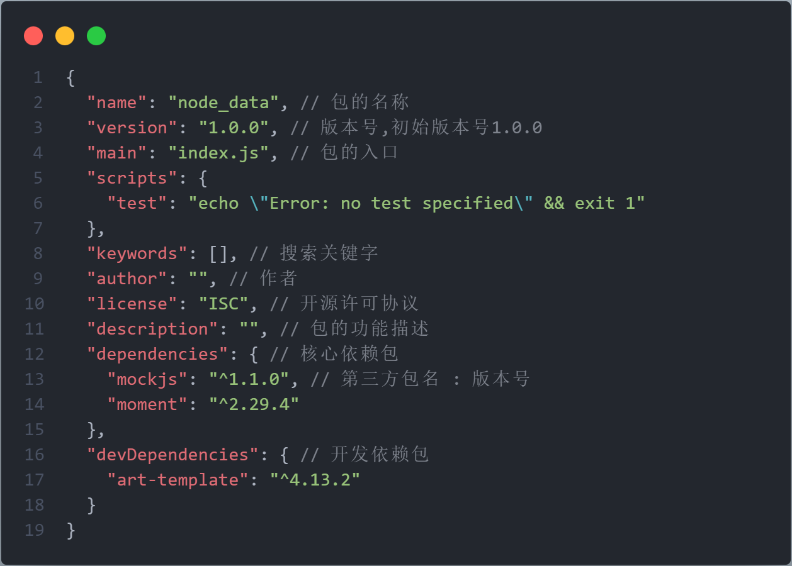

[TOC]

# Node

****

***`Node.js` 是一个基于 Chrome V8 引擎的 <span style=color:red;>JavaScript 运行环境</span>***

<center></center>


## 🍓安装

> 
>
> + ###### ==***LTS***==  :  <span style=color:red;>长期稳定版</span>
>
> + ###### ==***Current***==  :  <span style=color:red;>新特性尝鲜版</span>


### 查询版本号

```cmd
node -v
```


## 💡运行环境

:grey_exclamation:==**运行环境**==<u>是指**<span style=color:red;>代码正常运行所需的必要环境</span>**</u>


### 浏览器的运行环境

> 
>
> 1. ==***V8 引擎负责解析和执行 <span style=color:red;>JavaScript 代码</span>***==
> 2. ==***内置 `API` 是由<span style=color:red;>运行环境</span>提供的特殊接口，<span style=color:red;>只能在所属的运行环境中被调用</span>***==


### Node.js 的运行环境

> 
>
> 1. ==***<span style=color:red;>浏览器</span>是 JavaScript 的<span style=color:red;>前端运行环境</span>***==
> 2. ==***`Node.js` 是 JavaScript 的<span style=color:red;>后端运行环境</span>***==
> 3. ==***`Node.js` 中<span style=color:red;>无法调用 DOM 和 BOM 等浏览器内置 API</span>***==


### ⚪Node.js 环境中执行 js 代码

1. ###### 打开终端

2. ###### 输入 `node` <span style=color:skyblue;><u>要执行的 `js` 文件的路径</u></span>


## 📘模块化

> ==***<span style=color:red;>模块化</span>是指解决一个复杂问题时，自顶向下逐层把系统划分成若干模块的过程，<span style=color:skyblue;>模块是可组合、分解和更换的单元</span>***==
>
> ❕==***<span style=color:red;>遵守固定的规则</span>，把一个大文件拆成独立并互相依赖的多个小模块***==


### 好处

1. ###### *提高了代码的<span style=color:red;>复用性</span>*

2. ###### *提高了代码的<span style=color:red;>可维护性</span>*

3. ###### *可以实现<span style=color:red;>按需加载</span>*


## Node.js中模块的分类

==***根据模块来源的不同，将模块分为了 `3` 大类***==

+ ###### *<span style=color:red;>内置模块</span>（内置模块是由 `Node.js` 官方提供的）*

+ ###### *<span style=color:red;>自定义模块</span>（用户创建的每个 `js` 文件，都是自定义模块）*

+ ###### *<span style=color:red;>第三方模块</span>（由第三方开发出来的模块，<span style=color:skyblue;>使用前需要先下载</span>）*


## 加载模块

> ==***使用 `require()` 方法，可以加载需要的<span style=color:red;>内置模块</span>、<span style=color:red;>自定义模块</span>、<span style=color:red;>第三方模块</span>进行使用***==
>
> :grey_exclamation:==***`require()` 方法加载其它模块时，会执行被加载模块中的代码***==
>
> ❗==***`require()` 方法导入模块时，导入的结果，永远以 `module.exports` 指向的对象为准***==

+ ```js
  const _this = require('../js/this'); // 加载自定义模块时,可省略.js 后缀
  ```


## 🎲模块作用域

❗==***自定义模块中定义的<span style=color:skyblue;>变量</span>、<span style=color:skyblue;>方法</span>等成员，<span style=color:red;>只能在当前模块内被访问</span>，这种<span style=color:red;>模块级别的访问限制</span>，叫做<span style=color:red;>模块作用域</span>***==


## 💠内置模块

==***内置模块是由`Node.js` 官方提供的***==


### fs 文件模块

==***`fs` 模块是 `Node.js` 官方提供的、用来操作文件的模块***==


#### 1️⃣导入模块

```js
const fs = require('fs');
```


#### 📄读取文件

> ```js
> fs.readFile(path, encode, callback);
> ```
>
> ​		**`path`**	:	文件路径，字符串，**必选**
>
> ​		**`encode`**	:	读取文件的编码格式，**可选**
>
> ​		**`callback`**	:	读取完成后的回调函数，用来获取读取结果，**必选**
>
> ​				`err` 	:	成功为`null`；失败为`Error对象`
>
> ​				`data`	:	成功为`读取内容`；失败为`undefined`

```javascript
fs.readFile('../file/1.txt', 'UTF8', function (err, data) {
    if (err) return console.warn('文件读取失败:' + err.message);
    console.log('文件读取成功:' + data); // 若再许我年少时,一两黄金一两风
});
```


#### 📝写入文件

> ```js
> fs.writeFile(path, data, encode, callback);
> ```
>
> ​		**`path`** 	:	文件路径，字符串，**必选**
>
> ​		**`data`**	:	写入内容，**必选**
>
> ​		**`encode`**	:	写入文件内容的编码格式，默认`utf8`，**可选**
>
> ​		**`callback`**	:	写入完成后的回调函数，**可选**
>
> ​				`err` 	:	成功为`null`；失败为`Error对象`
>
> :grey_exclamation:***方法可以创建文件，不能创建目录***
>
> :grey_exclamation:***新内容会覆盖旧内容***

```js
fs.writeFile('../file/1.txt', '功成不必在我,功成必定有我', 'UTF8', function (err) {
    if (err) return console.warn('文件写入失败:' + err.message);
    console.log('文件写入成功');
});
```


### path 路径模块

==***`path` 模块是 `Node.js` 官方提供的、用来处理路径的模块***==


#### 1️⃣导入模块

```js
const path = require('path');
```


#### 🎹路径拼接

> ```js
> path.join(...paths);
> ```
>
> ​		**`...paths`**	:	多个路径片段
>
> ​		**`__dirname`**	:	<span style=color:red;>**关键字**</span>，表示当前文件所处的目录
>
> :grey_exclamation:***凡是涉及到路径拼接的操作，都要使用 `path.join()` 方法进行处理***

```js
path.join('/a', '/b/c', '../', './d', 'e') // \a\b\d\e

const filePath = path.join(__dirname, './01_hello.js');
filePath // E:\Node_Data\note\js\01_hello.js
```


#### 获取路径中的文件名

>```js
>path.basename(path, ext);
>```
>
>​		**`path`**	:	路径字符串，**必选**
>
>​		**`ext`**	:	移除路径最后指定部分，**可选**

```js
const filePath = 'E:\Node_Data\note\js\01_hello.js';

 path.basename(filePath) // 01_hello.js
path.basename(filePath, '.js') // 01_hello
```


#### 获取路径中的文件扩展名

>```js
>path.extname(path);
>```
>
>​		**`path`**	:	路径字符串

```js
const filePath = 'E:\Node_Data\note\js\01_hello.js';

path.extname(filePath) // .js
```


### http 模块

==***`http` 模块是 `Node.js` 官方提供的、用来创建 `web` 服务器的模块***==


#### 1️⃣导入模块

```js
const http = require('http');
```


#### 🌏创建 Wed 服务器

1. ###### 导入 `http` 模块

   + ```js
     const http = require('http');
     ```

2. ###### 创建 `web` 服务器

   + ```js
     const server = http.createServer();
     ```

3. ###### 监听 `request` 事件

   + ```js
     server.on('request', (req, resp) => {
         console.log('Hello Web Server ..');
     });
     ```

4. ###### 启动服务器

   + ```js
     server.listen(80, () => {
         console.log('http server running at http://127.0.0.1');
     });
     ```


#### request

==***请求对象***==

>**`url`**	:	客户端请求的 `URL`
>
>**`method`**	:	客户端的请求类型

```js
let str = `请求url:${req.url}, 请求方式method:${req.method}`;
str // 请求url:/, 请求方式method:GET
```


#### response

==***响应对象***==

>**`end(data)`**	:	将内容响应给客户端
>
>**`setHeader(key, value)`**	:	设置响应头，可解决乱码问题

```js
resp.setHeader('Content-Type', 'text/html; charset=utf-8'); // 设置内容的编码格式
resp.end(str); // 将内容响应给客户端
```


## :pencil2:自定义模块

### module

> ***每个 `js` 自定义模块中都有一个 module 对象，它里面<span style=color:red;>存储了和当前模块有关的信息</span>***

<center></center>


#### exports

> ==***在自定义模块中，可以使用 `module.exports` 对象，将模块内的成员共享出去***==
>
> :grey_exclamation:==***`require()` 方法导入自定义模块时，得到的就是 `module.exports `所指向的对象***==

```js
// this.js
const username = 'linke';
module.exports.age = 11;

// index.js
const _this = require('./this');
_this // { age: 11 }
```


### exportes

> ==***`Node` 提供了 `exports` 对象。默认情况下，`exports` 和 `module.exports` 指向同一个对象***==

```js
// this.js
const username = 'linke';
module.exports.age = 11;
exports.getName = function () {
    console.log(username);
}
module.exports === exports // true

// index.js
const _this = require('./this');
_this // { age: 11, getName: [Function (anonymous)] }
```


## 🔆CommonJS 规范

==***`Node.js `遵循了 `CommonJS` 模块化规范，`CommonJS` 规定了<span style=color:red;>模块的特性和各模块之间如何相互依赖</span>***==


### 🍁规定

1. ##### *每个模块内部，`module` 变量代表当前模块*

2. ##### *`module` 变量是一个对象，它的 `exports` 属性是对外的接口*

3. ##### *加载某个模块，其实是加载该模块的 `module.exports` 属性*


## npm与包

### 包

==***`Node.js` 中的<span style=color:red;>第三方模块</span>又叫做<span style=color:red;>包</span>***==


### npm

==***`Node Package Manager` 包管理工具***==

> ❗❗***包下载网址🔗https://www.npmjs.com/*** 


#### 🧬结构


+ ###### *`node_modules` 文件夹用来存放所有已安装到项目中的第三方包*

+ ###### *`package-lock.json` 配置文件用来记录 `node_modules `目录下的每一个包的下载信息*

+ ###### *`package.json` 的包管理配置文件，规定在项目根目录中*


### 创建 package.json

> ==***可以在<span style=color:red;>执行命令时所处的目录</span>中，快速创建 `package.json` 这个包管理配置文件***==
>
> ```cmd
> npm init -y
> ```
>
> :grey_exclamation:***只能在英文的目录下成功运行***
>
> :grey_exclamation:***运行 `npm install` 命令安装包的时候，自动把包的名称和版本号记录到 `package.json`中***


#### dependencies

> ❕***记录项目使用 `npm install` 命令安装了的包***

<center></center>


### 安装包

> ```cmd
> npm install 完整的包名 // 自动安装最新版本的包
> npm i 完整的包名 // 简写方式
> npm i 完整的包名@num1.num2.num3 // 安装指定版本的包
> ```
>
> :grey_exclamation:==***同时安装多个包使用<span style=color:red;>空格</span>隔开***==
>
> :grey_exclamation:==***包的版本号是以 <span style=color:red;>点分十进制</span> 形式进行定义***==
>
> ​		**`num1`**	:	<span style=color:red;>**大版本**</span>
>
> ​		**`num2`**	:	<span style=color:skyblue;>**功能版本**</span>
>
> ​		**`num3`**	:	<span style=color:purple;>**Bug修复版本**</span>


#### 一次性安装所有的包

> :grey_exclamation:***可以运行 `npm install` 命令（或 `npm i`）一次性安装所有的依赖包***
>
> ```js
> npm install
> npm i
> ```

