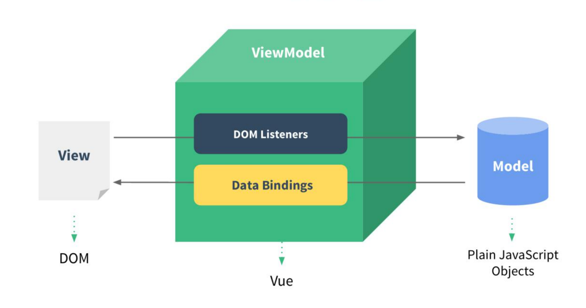

[TOC]

# Vue2

****

*==🔗[Vue.js - v2](https://v2.cn.vuejs.org/) **:** **渐进式 `JavaScript` 框架**==*

<center></center>


## 🍀概念

***`Vue` (读音 `/vjuː/`，类似于 `view`) 是一套<span style=color:red;>用于构建用户界面</span>的前端<span style=color:red;>框架</span>***


## 🔅特性

==***`vue` 框架的主要特性***==

1. <span style=color:red;>***数据驱动视图***</span>
2. <span style=color:red;>***双向数据绑定***</span>


### 数据驱动视图

> ==***`vue` 会监听数据的变化，从而自动重新渲染页面的结构***==
>
> + ###### *当页面数据发生变化时，页面会自动重新渲染*
>
> + ###### *数据驱动视图是<span style=color:red;>单向的数据绑定</span>*

<center></center>


### 双向数据绑定

> ==***在模板中的数据发生变化的时候，模型对象也要发生改变；模型对象中的数据改变时，视图中的数据也要发生改变***==

<center></center>


## 🚩MVVM

🎇==***`MVVM(Model-View-ViewModel)`，是一种软件架构设计模式，它是一种简化用户界面的事件驱动编程方式***==

> ***`MVVM` 是 `vue` 实现<span style=color:red;>数据驱动视图</span>和<span style=color:red;>双向数据绑定</span>的<u>核心原理</u>，<u>它把每个 `HTML` 页面都拆分成了三个部分</u>***
>
> + ==***`Model` :	表示当前页面渲染时所依赖的数据源***==
> + ==***`View` :	表示当前页面所渲染的 `DOM` 结构***==
> + ==***`ViewModel` :	表示 `vue` 的实例，它是 `MVVM` 的核心***==

<center></center>


### **:sunny:**工作原理

> ==***<span style=color:red;>`ViewModel` 作为 `MVVM` 的核心</span>，是它把当前页面的<span style=color:red;>数据源`(Model)`</span>和<span style=color:red;>页面的结构`(View)`</span>连接在了一起***==
>
> + ###### *当<span style=color:red;>数据源发生变化</span>时，会被 `ViewModel` 监听到，`VM` 会根据最新的数据源自动更新页面的结构*
>
> + ***当<span style=color:red;>模块的值发生变化</span>时，也会被 `VM` 监听到，`VM` 会把变化过后最新的值自动同步到 `Model` 数据源中***

<center></center>


## 基本使用

1. ###### *导入 `vue.js` 的 `script` 脚本文件*

   + ```html
     <!-- 1.导入 vue.js -->
     <script src="./vue.js"></script>
     ```

2. ###### *在页面声明一个即将被 `vue` 所控制的 `DOM` 区域*

   + ```html
     <!-- 2.声明一个即将被vue所控制的 DOM 区域(VIEW视图) -->
     <div id="app">
         {{username}}
     </div>
     ```

3. ###### *创建 `vm` 实例对象`(vue实例对象)`*

   + ```javascript
     // 3.创建 vm 实例对象(vue实例对象)
     const vm = new Vue({
         /*
         3.1设置当前 vm 实例所绑定的元素
         	vue 的绑定元素只支持双标签,不能使用html与body标签
     	    只会挂载第一个被css选择器选中的元素(推荐使用id选择器)
         */
         el: '#app',
         // 3.2 指定 Model数据源(Model模型)
         data: {
             username: 'linke'
         }
     });
     
     <!-- 执行结果 -->
     linke
     ```


## 🔳基础

### 💠指令

==***指令`（Directives）`是 `vue` 提供的模板语法，用于渲染页面的基本结构***==

+ ***<span style=color:red;>内容渲染</span>指令***
+ ***<span style=color:red;>属性绑定</span>指令***
+ ***<span style=color:red;>事件绑定</span>指令***
+ ***<span style=color:red;>双向绑定</span>指令***
+ ***<span style=color:red;>条件渲染</span>指令***
+ ***<span style=color:red;>列表渲染</span>指令***


#### 内容渲染指令

> ==***内容渲染指令用来渲染 `DOM` 元素的文本内容***==

+ **`v-text`** ：设置标签的文本值<span style=color:red;>(纯文本)</span>，会覆盖元素内默认的值
+ **`{{ }}`** ：插值表达式`(Mustache)`，只作用于文本节点中
+ **`v-html`** ：同 `v-text`，不同的是会将包含 `HTML` 标签的字符串渲染为页面的 `HTML` 元素

```html
<!-- 
v-text : 设置标签的文本值(纯文本)
	*会覆盖元素内默认的值*
{{}} : 插值表达式
	*会将对应的值渲染到元素内容的表达式中,保留表达式以外的值*
v-html : 插入html标签
	*同 v-text, 不同的是会将包含 HTML 标签的字符串渲染为页面的 HTML 元素*
-->
<div v-text="username"></div>
<div v-text="sex">female</div>
<div>age: {{age}}</div>
<div v-html="info"></div>
```

```javascript
data: {
     username: 'linke',
     sex: 'male',
     age: 19,
     info: '<h2>info ...</h2>'
}
```

```html
<!-- 执行结果 -->
linke
male
age: 19
info ...
```


####  属性绑定指令

> ==***为元素的属性动态绑定属性值，则需要用到 `v-bind` 属性绑定指令，简写形式`:`***==
>
> ```vue
> v-bind:属性	// 全写
> :属性			// 简写
> ```

```html
<input type="text" v-bind:value="username">
<div v-bind:class="cla"></div>
<div :data-index="index"></div>
```

```javascript
data: {
	username: 'linke',
    cla: 'box',
    index: 1
}
```

```html
<!-- 执行结果 -->
<input type="text" value="linke">
<div class="box"></div>
<div data-index="1">
```


#### 事件绑定指令

> ==***`vue` 提供了 `v-on` 事件绑定指令，用来对 `DOM` 元素绑定事件监听，简写形式`@`***==
>
> ==***通过 `v-on` 绑定的事件处理函数，需要在 `methods` 节点中进行声明***==
>
> ```vue
> v-on:事件名称(不包含on)	// 全写
> @事件名称(不包含on)		// 简写
> ```

+ **`(arg)`** ：可以使用`()`进行传递参数
+ **`event`** ：事件处理函数无参数时，默认传入一个事件对象`event`，简写`e`
+ **`$event`** ：<span style=color:red;>特殊参数变量</span>，用来表示原生的事件参数对象 `event`

```html
<div id="app">
    <p>count 值是: {{count}}</p>
    <button v-on:click="count-=1">-1</button>
    <button @click="fun">+1</button>
    <button @click="def(0, $event)">default</button>
</div>
```

```javascript
const vm = new Vue({
    el: '#app',
    data: {
        count: 0
    },
    methods: { // 在 methods 中声明事件处理函数
        fun(e) {
            console.log(e); // PointerEvent { ... }
            console.log(vm === this); // true
            // vm.count++; // 方式1
            this.count++; // 方式2
        },
        def(number, e) {
            console.log(e); // PointerEvent { ... }
            this.count = number;
        }
    }
});
```


#### 双向绑定指令

> ==***`v-model` 指令在元素上创建双向数据绑定，它会根据控件类型自动选取正确的方法来更新元素***==

+ **`.lazy`**	：将同步改为在 `change` 事件发生后再进行同步
+ **`.number`**	：输入值自动类型转化数值类型
+ **`.trim`**	：自动修剪输入值中的首尾空格

```html
<input v-model="message" placeholder="edit me">
<p>Message is: {{ message }}</p>
```

```javascript
data: {
    message: ''
}
```


#### 条件渲染指令

> ==***用来按需控制 `DOM` 的显示与隐藏***==

+ **`v-if,v-else-if,vi-else`** ：表达式值为`true` 元素存在`dom`树中；反之`false` 从`dom`树中删除
+ **`v-show`** ：表达式值为`true` 元素添加样式`style="display: none;"`； 反之`false` 清空 `style`样式

🍧***区别***

+ *`v-if` ：`false`不显示时，将内容直接从`Dom`去除，只需要一次渲染的就使用`v-if`*
+ *`v-show` ：`false`不显示时，将内容隐藏`("style="display: none;")`，反复切换内容；则使用`v-show`*

```html
<h2 v-if="flag">Login</h2><!-- v-if 与 v-else/v-else-if 之间不能出现任何元素 -->
<h2 v-else>Register</h2><!-- v-else/v-else-if 指令必须配合 v-if 指令一起使用 -->
<input type="text" v-show="flag" key="Login" placeholder="Login ...">
<input type="text" v-show="!flag" key="Register" placeholder="Register ...">
<button type="button" @click="flag=!flag">Toggle</button>
```

```javascript
data: {
    flag: true
}
```

```html
<!-- 执行结果 -->
<h2>Login</h2>
<input type="text" placeholder="Login ...">
<input type="text" placeholder="Register ..." style="display: none;">
```


#### 列表渲染指令

> ==***用来基于一个数组来循环渲染一个列表结构，渲染列表时推荐绑定唯一的 `:key`***==
>
> ```vue
> v-for="item in items" 				 // 方式1,可用 of 替代 in 渲染
> v-for="(item, index) in items"		 // 方式2,()可忽略
> v-for="(value, key, index) in items" // 方式3
> ```

+ **`items`**	：源数据**数组/对象**
+ **`(item,index)`**	：数组时表示`(元素,索引)`；对象时表示`(键值,键名)`
+ **`(value, key, index)`**	：对象时表示`(键值,键名,索引)`

```html
<ul>
    <!-- 推荐 id 为 key -->
    <li v-for="item,index in array" :key="item.id" :title="item.name">
        index={{index}}, id={{ item.id }}, name={{ item.name }}
    </li>
</ul>
```

```javascript
data: {
    array: [
        { id: 1, name: 'dudu' },
        { id: 2, name: 'keke' },
        { id: 3, name: 'huhu' },
        { id: 4, name: 'yiyi' }
    ]
}
```

```html
<!-- 执行结果 -->
<ul>
    <li title="dudu">index=0, id=1, name=dudu</li>
    <li title="keke">index=1, id=2, name=keke</li>
    <li title="huhu">index=2, id=3, name=huhu</li>
    <li title="yiyi">index=3, id=4, name=yiyi</li>
</ul>
```


#### Class 与 Style 绑定

> ==***`Vue` 对操作元素的 `class` 列表和内联样式做了专门的增强。表达式结果的类型除了字符串之外，还可以是对象或数组***==
>
> ```vue
> v-bind:[class/style]	// 全写
> :[class/style]			// 简写
> ```

+ ###### 🍎*对象语法*

  + ```html
    <!-- :class 基本使用 -->
    <div :class="{claname:isFlag}"></div>
    <!-- 另一种写法 -->
    <div :class="objCla"></div>
    <!-- class 会和 v-bind:class 的样式结合 -->
    <div class="cla1" v-bind:class="{claname:isFlag}"></div>
    
    <!-- :style 基本使用,style 会和 v-bind:style 的样式结合 -->
    <div style="color: red;" :style="{border:`solid red ${number}px`}"></div>
    <!-- 另一种写法 -->
    <div :style="objSty"></div>
    
    <!-- :class 可以与 :style 结合使用 -->
    <div :class="objCla" :style="{color:'skyblue'}"></div>
    ```

  + ```javascript
    data: {
        isFlag: true,
        objCla: { claname: false, cla1: true },
        number: 2,
        objSty: {
              border: "solid 2px pink",
              color: "#1E90FF",
              /*
               包含 “-” 必须使用字符 "" 引用起来 或者使用 *驼峰命名*
                  以下两种方式效果一致
              */
              "background-color": "#F0F8FF"
              // backgroundColor:"#F0F8FF"
        }
    }
    ```

  + ```html
    <!-- 执行结果 -->
    <div class="claname"></div>
    <div class="cla1"></div>
    <div class="cla1 claname"></div>
    
    <div style="color: red; border: 2px solid red;"></div>
    <div style="border: 2px solid pink; color: rgb(30, 144, 255); background-color: rgb(240, 248, 255);"></div>
    
    <div class="cla1" style="color: skyblue;"></div>
    ```

+ ###### 🍏*数组语法*

  + ```html
    <!-- :class 放置一个数组 -->
    <div :class="classs"></div>
    
    <!-- :style 放置一个数组 -->
    <div :style="styles"></div>
    ```
    
  + ```javascript
    data: {
        classs: ["cla1", "cla2"],
        styles: [
            {
                border: "dotted 2px pink",
                color: "#7B68EE",
            },
            {
                backgroundColor: "#ADFF2F"
            }
        ]
    }
    ```
  
  + ```html
    <!-- 执行结果 -->
    <div class="cla1 cla2"></div>
    
    <div style="border: 2px dotted pink; color: rgb(123, 104, 238); background-color: rgb(173, 255, 47);"></div>
    ```


#### 指令表达式

> :grey_exclamation:==***`vue` 提供的模板渲染语法还支持 `Javascript` 表达式的运算***==

```html
{{ number + 1 }}
{{ flag ? 'YES' : 'NO' }}
{{ msg.split('').reverse().join('') }}
<div :data-id="'index-' + id"></div>
```

```javascript
data: {
    number: 1,
    flag: true,
    msg: 'abcd',
    id: 1
}
```

```html
<!-- 执行结果 -->
2 YES dcba
<div data-id="index-1"></div>
```


### ➰特殊 attribute

+ **`key`**  ：用来作标识`(唯一)`的， 赋值的是变量需要加 **`:`** ，反之则不需要

  + > :grey_exclamation:==***有相同父元素的子元素必须有独特的 `key`；重复的 `key` 会造成渲染错误***==
    >
    > ==***值类型：`string/number`***==

+ **`ref`** ：用来给元素或子组件注册引用信息，引用信息将会注册在父组件的 `$refs` 对象上

  + >:grey_exclamation:==***每个组件都包含一个 `$refs` 对象，默认为空对象***==
    >
    >==***值类型：`string`***==
    >
    >+ ==***如果在普通的 `DOM` 元素上使用，引用指向的就是 `DOM` 元素***==
    >
    >+ ==***如果用在子组件上，引用就指向组件实例***==
    >
    >```vue
    ><div ref="txt"></div>
    ><Son ref="son"></Son>
    ><button type="button" @click="getRef">Get Ref</button>
    >```
    >
    >```js
    >export default {
    >    methods: {
    >        getRef() {
    >            console.log(this.$refs); // {box: div, son: VueComponent}
    >        },
    >    },
    >	components: {
    >	    Son,
    >    },
    >};
    >```


### 修饰符

> ❕==***修饰符是由点`.`开头的指令后缀来表示的，修饰符可以串联***==

+ ==***事件修饰符***==

  |   事件修饰符   |         作用         |
  | :------------: | :------------------: |
  |  **`.stop`**   |   **阻止事件冒泡**   |
  | **`.prevent`** | **阻止事件默认行为** |
  | **`.capture`** |   **事件捕获模式**   |
  |  **`.self`**   |   **元素自身触发**   |
  |  **`.once`**   |  **设置一次性事件**  |
  | **`.passive`** | **事件默认行为触发** |

+ *==**键修饰符**==*

  |   键修饰符    |         作用         |
  | :-----------: | :------------------: |
  | **`.enter`**  |      **回车键**      |
  |  **`.tab`**   |     **`tab`键**      |
  | **`.delete`** | **`删除`和`退格`键** |
  |  **`.esc`**   |     **`esc`键**      |
  | **`.space`**  |      **空格键**      |
  |   **`.up`**   |    **向上箭头键**    |
  |  **`.down`**  |    **向下箭头键**    |
  |  **`.left`**  |    **向左箭头键**    |
  | **`.right`**  |    **向右箭头键**    |

+ ==***系统修饰键***==

  |  系统修饰符  |      作用       |
  | :----------: | :-------------: |
  | **`.ctrl`**  |  **`Ctrl`键**   |
  |  **`.alt`**  |   **`Alt`键**   |
  | **`.shift`** |  **`Shift`键**  |
  | **`.meta`**  | **`Windows`键** |

+ ==***`.exact` 修饰符***==

  >***修饰符允许控制触发事件所需的系统修饰符的确切组合***
  >
  >```html
  ><!-- Ctrl+Shifts+[其他键]+点击 可以触发事件 -->
  ><button v-on:click.ctrl.shift="fun">Ctrl+shift+[key]+click</button>
  >
  ><!-- 必须精确到 Ctrl+Shifts+点击 才对触发事件 -->
  ><button v-on:click.ctrl.shift.exact="fun">Ctrl+shift+click</button>
  >```

+ ==***鼠标按钮修饰符***==

  | 鼠标按钮修饰符 |     作用     |
  | :------------: | :----------: |
  |  **`.left`**   | **鼠标左键** |
  |  **`.right`**  | **鼠标右键** |
  | **`.middle`**  | **鼠标中键** |

+ ==***自定义按键修饰符别名***==

  > ***可以通过全局对象定义自定义键修饰符别名：`config.keyCodes`***
  >
  > ***自定义按键触发，必须在`vue`实例化之前定义***
  >
  > ```js
  > // 可以使用 v-on:keyup.f1
  > Vue.config.keyCodes.f1 = 48; // 数字键0
  > ```


### 过滤器

> ==***`Vue` 允许你自定义过滤器`(Filters)`，被用于一些常见的文本格式化***==
>
> + ==***过滤器可以用在两个地方：<span style=color:red;>双花括号插值</span>和 `v-bind` 表达式***==
>
> + ==***过滤器应该被添加在 `JavaScript` 表达式的尾部，由 `管道符` 进行调用***==
>
> + ==***必须在 `filters`节点中定义过滤器函数***==
> + :grey_exclamation:==***过滤器函数必须要有返回值`(return)`***==
> + :grey_exclamation:==***过滤器可以串联 `{{ msg | filterA | filterB }}`***==
> + :grey_exclamation:==***当全局过滤器和局部过滤器重名时，会采用局部过滤器***==
> + :grey_exclamation:==***可以接收参数 `{{ msg | filterA(arg, ...) }}`，第一个参数为 `|`左边的值，第二个参数为`arg`，`...`因此类推***==
>
> <u><span style=color:red;>***❗在Vue3中已弃用***</span></u>

+ ###### *局部过滤器：只能在当前 `vue` 实例所挂载的 `el` 区域内使用*

  + ```html
    <!-- 在插值表达式中使用 管道符"|" 调用过滤器 -->
    <p>{{date | dateFormat}}</p>
    <!-- 在 v-bind 中使用 管道符"|" 调用过滤器 -->
    <div :text="date | dateFormat"></div>
    ```

    ```javascript
    data: {
        date: new Date(1662293838221)
    },
    filters: { // 定义过滤器
        dateFormat(value) {
            return value.toLocaleString();
        }
    }
    ```

    ```html
    <!-- 执行结果 -->
    <p>2022/9/4 20:17:18</p>
    <div text="2022/9/4 20:17:18"></div>
    ```

+ ###### *全局过滤器：所有 `vue` 实例之间都可使用*

  >```js
  >Vue.filter(filterName, callback);
  >```
  >
  >​		**`filterName`**	：全局过滤器**名称**
  >
  >​		**`callback`**	：全局过滤器**处理函数**

  + ```html
    <!-- 调用全局过滤器 -->
    <span>{{ text | capitalize }}</span>
    ```

  + ```javascript
    // 定义全局过滤器
    Vue.filter('capitalize', function (value) {
        if (!value) return;
        value = value.toString();
        return value.charAt(0).toUpperCase().concat(value.slice(1));
    });
    
    new Vue({
        // ...
    });
    ```

  + ```html
    <!-- 执行结果 -->
    <span>Linke</span>
    ```


### 侦听器

> ==***`watch` 侦听器用来监视数据的变化，从而针对数据的变化做特定的操作***==
>
> ```html
> <input type="text" v-model="username">
> ```
>
> ```javascript
> data: {
>        username: 'linke'
> },
> watch: { // watch 节点号定义监听器
>        // 监听 username 属性(属性名及方法名)的变化,第一个值为"改变之后的值",第二个值为"改变之前的值"
>        username(newVal, oldVal) { // 方式1(方法形式)
>            console.log(`username数据发生变化!! 旧值:${oldVal}, 新值:${newVal}`);
>        }
>        /*
>        username: { // 方式2(对象形式)
>        	handler(newVal, oldVal){ ... } 
>        }
>    	*/
> }
> ```

+ **`handler`**	：当监听的属性的值发生变化时，自动调用 `handler` 处理函数
+ **`immediate`**	：页面渲染完成之后，是否立即以表达式的当前值触发回调***(默认`false`)***
+ **`deep`**	：是否对对象内部值的变化进行监听

```html
<input type="text" v-model.number="age">
<input type="text" v-model.number="info.max">
<input type="text" v-model.number="info.min">
```

```javascript
data: {
    age: 19,
    info: {
        max: 100,
        min: 1
    }
},
watch: {
    age: {
        handler(newVal, oldVal) { // age 值发生变化时,自动触发 handler 回调
            console.log(`age数据发生变化!! 旧值:${oldVal}, 新值:${newVal}`);
            // age数据发生变化!! 旧值:undefined, 新值:19
        },
        immediate: true // 页面渲染完成之后,立即触发 handler 回调
    },
    info: {
        handler(newVal) {
            console.log(`info数据发生变化!! 新值:${JSON.stringify(newVal)}`);
        },
        deep: true // 监听对象属性的变化
    },
    'info.min'(newVal) { // 监听对象单个属性的变化
        console.log(`info.min数据发生变化!! 新值:${newVal}`);
    }
}
```


### 计算属性

> ==***计算属性指的是通过一系列运算之后，最终得到一个<span style=color:red;>属性值</span>***==
>
> ==***动态计算出来的属性值可以被<span style=color:red;>模板结构</span>或 `methods` 方法使用***==
>
> + :grey_exclamation:==***必须在 `computed` 节点中定义计算属性***==
> + :grey_exclamation:==***虽然计算属性在声明的时候被定义为方法，但是计算属性<span style=color:red;>本质是一个属性</span>***==
> + :grey_exclamation:==***计算属性<span style=color:red;>会缓存计算的结果</span>，只有计算属性<span style=color:red;>依赖的数据变化</span>时，才会重新进行运算***==

```html
<p>{{ xyz }}</p>
<h3>{{ position() }}</h3>
```

```javascript
data: {
    x: 1,
    y: 2,
    z: 3
},
computed: { // 必须在 computed 节点中定义计算属性
    xyz() { return `${this.x}px,${this.y}px,${this.z}px` }
},
methods: {
    position() {
        return `位置: ${this.xyz}`;
    }
}
```

```html
<p>1px,2px,3px</p>
<h3>位置: 1px,2px,3px</h3>
```


### $refs

> :grey_exclamation:==***`Vue` 实例对象的一个对象属性，持有注册过`ref`属性的所有 `DOM` 元素和组件实例***==


### 🔹this

==***`Vue` 中 `this`的指向***==

1. *`Vue`中生命周期钩子和自定义方法中的 `this` 指向当前的 `Vue` 实例，生命周期钩子的 `this` 上下文指向调用它的 `Vue` 实例*
2. *`Vue` 中回调函数中的 `this` 指向 `Vue` 实例*
   + *若回调函数为匿名函数，非严格模式下指向 `window`，严格模式下为 `undefined`*
3. *`Vue` 中 `addEventListener` 中的 `this` 也指向 `Vue` 实例*
4. *`Vue` 组件中的 `this` 指向当前组件的实例对象*

> :grey_exclamation:==***除了回调函数中的 `this` ，其它地方的 `this` 均指向 `Vue` 实例***==


#### 注意

❕==***`vue` 会将 `data` 对象中的成员平铺的 `vue` 实例中，可通过 `this.属性名`访问到 `data` 对象中的数据***==


## ⭐生命周期

<center></center>


### 过程

>:grey_exclamation:==*生命周期 `(Life Cycle)`是指一个组件从 <span style=color:red;>创建 </span>到  <span style=color:red;>销毁</span> 的整个阶段，强调的是一个<span style=color:red;>时间段</span>*==
>$$
>开始创建 —> 初始化数据 —> 编辑模板 —> 挂载DOM($el) —> UI渲染 —> 数据更新 —> 卸载
>$$
>


### ✨四大阶段

1. ==***初始化阶段***==
   + **`beforeCreate`** ：实例刚创建完成，此时还没有 `data` 和 `methods`属性
   + **`created`** ：`vue`实例`data`和`method`属性已经初始化完成，此时还没有编译模板

2. ==***实例挂载阶段***==
   + **`beforeMount`** ：挂载前，模板编译完成，此时 `el` 还没有挂载，`data`目前可见
   + **`mounted`** ：挂载完成后，模板编译完成

3. ==***数据更新阶段***==
   + **`beforeUpdate`** ： 数据更新时执行，`data`数据此时已经是最新的数据，`UI`界面还是旧的
   + **`updated`** ：数据更新完成后，界面和`data`里的数据此时都是最新的

4. ==***销毁阶段***==
   + **`beforeDestroy`** ： 实例准备销毁，此时`data`和`methods`方法都能用
   + **`destroyed`** ： 实例已销毁完成


### 生命周期钩子

> *每个 `Vue` 实例在都会经过四个阶段的过程，同时在这个过程中也会自动运行一些叫做<span style=color:red;>**生命周期钩子**</span>的函数*
>
> ==***<span style=color:red;>:grey_exclamation:不要在生命周期回调上使用箭头函数</span>***==

```js
new Vue({
    data: {
        number: 19
    },
    created: function () {
        // `this` 指向 vm 实例
        console.log('number is: ' + this.number)
    }
})

// => "number is: 19"
```


## 实例方法

### 生命周期方法

+ ***`$mount()`***

> ```js
> vm.$mount(elementOrSelector);
> ```
>
> ​		**`elementOrSelector`**	:  `CSS`选择器 / `DOM` 元素
>
> ==***如果 `Vue` 实例在实例化时没有收到 `el` 选项，则它处于<span style=color:red;>未挂载</span>状态，没有关联的 `DOM` 元素。可以使用 `vm.$mount()` 手动地挂载一个未挂载的实例***==

```html
<div id="app"></div>
```

```js
// 创建并挂载到 #app
new Vue().$mount('#app');
// 作用同上
new Vue({ el: '#app' });
```

+ ***`$forceUpdate()`***

>```js
>vm.$forceUpdate();
>```
>
>==***强制 `Vue` 实例重新渲染，仅影响实例本身和插入插槽内容的子组件***==

+ ***`vm.$destroy()`***

> ```js
> vm.$destroy();
> ```
>
> ==***完全销毁一个实例；清理它与其它实例的连接，解绑它的全部指令及事件监听器***==
>
> :grey_exclamation:==***最好使用 `v-if` 指令以数据驱动的方式控制子组件的生命周期***==

+ ***`vm.$nextTick()`***

> ```js
> vm.$nextTick([callback]);
> ```
>
> ==***将回调延迟到下次 `DOM` 更新循环之后执行，在修改数据之后立即使用这个方法，获取更新后的 `DOM`***==


### 事件方法

+ ***`vm.$on()`***

> ```js
> vm.$on(event, callback);
> ```
>
> ​		**`event`**	：事件名称字符串 / 数据名称数据
>
> ​		**`callback`**	：数据处理函数
>
> ==***监听当前实例上的自定义事件，事件可以由 `vm.$emit` 触发***==

```js
vm.$on('test', function (msg) {
    console.log(msg)
});

vm.$emit('test', 'linke')
```

+ ***`vm.$once()`***

> ```js
> vm.$once(event, callback);
> ```
>
> ==***监听一个自定义事件，但是只触发一次。一旦触发之后，监听器就会被移除***==

+ ***`vm.$off()`***

> ```js
> vm.$off([event, callback]);
> ```
>
> ==***移除自定义事件监听器***==
>
> 1. ==*如果没有提供参数，则移除所有的事件监听器*==
> 2. ==*如果只提供了事件，则移除该事件所有的监听器*==
> 3. ==*如果同时提供了事件与回调，则只移除这个回调的监听器*==

+ ***`vm.$emit()`*** 

> ```js
> vm.$emit(eventName, [...args])
> ```
>
> ​		**`eventName`**	:	事件名称字符串
>
> ​		**`...args`**	：附加参数，会传给监听器回调


## 🔧Vue CLI

***🔗[Vue CLI](https://cli.vuejs.org/zh/)是 `Vue.js` 开发的标准工具，简化了基于 `webpack` 创建工程化的 `Vue` 项目的过程***

<center></center>


### 单页面应用程序

> :grey_exclamation:==***<span style=color:red;>单页面应用程序</span>`（Single Page Application）`简称 `SPA`，顾名思义，指的是<span style=color:red;>一个 `Web` 网站中只有唯一的一个 `HTML` 页面</span>，所有的功能与交互都在这唯一的一个页面内完成***==


### 安装

```cmd
# NPM
npm i -g @vue/cli
# YARN
yarn global add @vue/cli
# 查询版本号
vue -V
```


### 🔷创建步骤

1. 1️⃣***在需要创建项目的目录终端中输入命令***

   + ```cmd
     vue create 项目的名称
     ```

2. 2️⃣***选择创建方式***

   + 

3. 3️⃣***创建自定义配置选项***

   + 

4. 4️⃣***选择安装 `Vue` 版本***

   + 

5. 5️⃣***创建 `CSS` 预处理器***

   + 

6. 6️⃣***创建插件的配置文件存储方式***

   + 

7. 7️⃣***是否将本次选项作为映射***

   + 

8. 8️⃣***选择项目的包管理工具***

   + 

9. 9️⃣***创建项目成功***
   + 


#### 项目结构


#### 运行流程

> ==***在工程化的项目中，<u>`vue` 通过 `main.js` 把 `App.vue` 渲染到 `index.html` 的指定区域中</u>***==

1. ***`App.vue` 用来编写待渲染的<span style=color:red;>模板结构</span>***
2. ***`index.html` 中需要预留一个 <span style=color:red;>`el` 区域</span>***
3. ***`main.js` 把 `App.vue` 渲染<span style=color:red;>(替换)</span>到了 `index.html` 所预留的区域中***


## 🔩组件

### 组件化开发

==***根据封装的思想，把页面上可重用的 `UI` 结构封装为组件，从而方便项目的开发和维护***==

> :grey_exclamation:==***`vue` 是一个支持组件化开发的前端框架，`vue` 中规定组件的后缀名是 `.vue`***==
>
> :grey_exclamation:==***组件可进行任意次数的复用***==
>
> :grey_exclamation:==***每个组件必须只有一个根元素***==


### 🧱组成

> :grey_exclamation:==***每个组件中必须包含 `template` 模板结构，而 `script` 行为和 `style` 样式是可选的组成部分***==

1. **`template`**  ：组件的<span style=color:red;>**模板结构**</span>
2. **`script`**  ：组件的 <span style=color:red;>**`JavaScript` 行为**</span>
3. **`style`**  ：组件的<span style=color:red;>**样式**</span>


#### **template**

> :grey_exclamation:==***每个组件对应的模板结构，需要定义到`<template>` 节点中***==
>
> + ***`template` 是 `vue` 提供的<span style=color:red;>容器标签</span>，只起到<span style=color:red;>包裹性质的作用</span>，<u>它不会被渲染为真正的 `DOM` 元素</u>***
> + ***`template` 中只能有<span style=color:red;>唯一的根节点(标签)</span>***

+ **`lang`**	：定义 `模版` 编写的语法`(pug, ...)`

```vue
// 默认模块语法为 html
<template>
<!-- 当前组件的 DOM 结构,必须定义到 template 标题内 -->
<!-- 组件的模版结构中只能有唯一一个根节点(标签) -->
</template>

// 更改模块语法为 pug
<template lang="pug"></template>
```


#### **script**

> :grey_exclamation:==***`vue` 规定在节点中封装组件的 `JavaScript` 业务逻辑***==

+ **`lang`**	：定义 `JS` 编写的语法`(ts, ...)`

```vue
// 默认 JavaScript 语法
<script>
// 默认导出(固定写法)
export default { };
</script>

// 更改 TypeScript 语法
<script lang="ts">
import Vue from 'vue';
export default Vue.extend({ });
</script>
```


#### **style**

> :grey_exclamation:==***`vue` 规定在节点中编写样式美化当前组件的 `UI` 结构***==

+ **`lang`**	：定义 `CSS` 编写的语法`(less, sass, ...)`

```vue
// 默认 css 语法
<style>
* {
    margin: 0;
    padding: 0;
}
</style>

// 更改 less 语法
<style lang="less"></style>
```


### 根组件

```js
// 导入 Vue 包
import Vue from 'vue'
// 导入 App.vue 根组件
import App from './App.vue'

// 创建 Vue 实例对象
new Vue({
    // render 函数中渲染的组件,叫做 "根组件"
    render: h => h(App),
}).$mount('#app')
// $mount('#app') 与 el: '#app' 作用一致
```


### :warning:组件中的 data

>:grey_exclamation:==***`vue` 规定组件中的 `data` 不能是对象，必须是一个函数***==
>
>```js
>export default {
>        data() {
>             return { // return 的值就是数据源
>                 username: "linke",
>             };
>        },
>};
>```


### 组件之间的关系

+ ==*<u>组件在被封装好之后</u>，<span style=color:red;>彼此之间是相互独立的</span>，不存在父子关系*==
+ ==*<u>在使用组件的时候</u>，<span style=color:red;>根据彼此的嵌套关系</span>，形成了<span style=color:skyblue;>父子关系</span>、<span style=color:skyblue;>兄弟关系</span>*==

<center></center>

<center></center>


### 组件的使用步骤

1. *使用 `import` 语法导入组件*

   + ```js
     import Header from "@/components/Header.vue"; // @ 表示 ./src 目录
     ```

2. *在 `components` 节点中注册组件*

   + ```js
     export default {
         components: {
             Header,
         },
     };
     ```

3. *以<span style=color:red;>标签形式使用</span>注册的组件*

   + ```vue
     <Header></Header>
     ```


### 🧮组件的组织

==***通常一个应用会以一棵嵌套的组件树的形式来组织***==

<center></center>


### 🎹组件的注册

+ ==***局部注册***==

  + ```js
    // 导入组件
    import ComponentA from '@/components/ComponentA.vue'
    import ComponentC from '@/components/ComponentC.vue'
    
    export default {
        components: { // components 节点中的组件都是局部组件
            ComponentA,
    		'ComponentB': ComponentC
            // ...
        },
    }
    ```

+ ==***全局注册***==

+ >```js
  >Vue.component(componentName, component);
  >```
  >
  >​        **`componentName`**  ：全局组件的**注册名称**
  >
  >​        **`component`**  ：需要全局注册的**组件**

  + ```js
    // 导入组件
    import ComponentA from '@/components/ComponentA.vue'
    
    // 注册之后可以用在任何新创建的 Vue 根实例的模板中
    Vue.component('ComponentA', ComponentA);
    ```


#### 组件名

1. ***W3C 规范** 规定自定义组件名<span style=color:red;> (字母全小写且必须包含一个连字符)</span>*
2. *或者使用 <span style=color:red;>(首字母大写命名) </span>定义一个组件名*


### Prop

==***`Prop` 是你可以在组件上注册的一些自定义属性***==

> *`HTML` 中的<span style=color:red;>属性名是大小写不敏感</span>的，所以浏览器会把所有大写字符解释为小写字符。这意味着当你使用 `DOM` 中的模板时，<span style=color:red;>`camelCase` (驼峰命名法)</span> 的 `prop` 名需要使用其等价的 <span style=color:red;>`kebab-case` (短横线分隔命名) </span>命名*
>
> ```js
> props: ["propA", "propB", "propC"] // 一个字符串数组
> ```

+ ❗ *`vue` 规定组件中封装的自定义属性是<span style=color:red;>只读</span>的，如果修改会出现以下错误：*


#### 单向数据流

> *所有的 `prop` 都使得其父子 `prop` 之间形成了一个**<span style=color:red;>单向下行绑定</span>**，父级 `prop` 的更新会向下流动到子组件中，但是反过来则不行，**<span style=color:red;>解决方式：</span>***
>
> + ==:grey_exclamation:***传递一个初始值，让子组件将其作为一个本地的 `prop` 数据来使用***==

```vue
<!-- 父组件(Linke) -->
<template>
	<button :class="cla" @click="count++">
        <span>Button {{ count }}</span>
    </button>
</template>

<script>
export default {
    props: ["cla", "init"], // props 是只读的,不能直接修改 props 的值,否则报错
    data() {
        return { // 将 props 值转存到 data 中,即可修改
            init: this.init
        };
	},
};
</script>
```

```vue
<!-- 
传递初始值的方式:
	(1) :key=value // 以原始数据类型传递
	(2) key=value // 以字符串形式传递
-->

<!-- 子组件1 (方式1) -->
<Linke :cla="'claOne'" :init="1"></Linke>

<!-- 子组件2 (方式2) -->
<Linke cla="claTwo" init="2"></Linke>
```

```js
<!-- 子组件1 vue实例 -->
props: {
  	init: 1
    cla: "claOne"
},
data: {
	count: 1
}

<!-- 子组件2 vue实例 -->
props: {
  	init: "2"
    cla: "claTwo"
},
data: {
	count: "2"
}
```


#### Prop 验证

> ==:grey_exclamation:***定制 `prop` 的验证方式，为 `props` 中的值提供一个带有验证需求的对象***==
>
> ```js
> props: {
>        propA: { /* 配置选项 */ },
>        propB: { /* 配置选项 */ },
>        propC: { /* 配置选项 */ },
> }
> ```

+ ###### *类型检查*

  + ```	js
     props: {
        // 基础的类型检查 (`null` 和 `undefined` 会通过任何类型验证)
        propA: Number,
        // 多个可能的类型
        propB: [String, Number],
        // 对象形式的类型检查
        propC: {
            type: String,
        }
    }
    ```

+ ###### *默认值*

  + ```js
    props: {
    	// 带有默认值的prop
        propA: {
            default: 19
    	},
    }
    ```

+ ###### *必填项*

  + ```js
    props: {
        // 必填的prop
    	propA: {
            required: true
    	},
    }
    ```

+ ###### *自定义验证函数*

  + ```js
    props: {
        // 自定义验证函数
        propA: {
            validator: function (value) {
                // 这个值必须匹配下列字符串中的一个
                return ['red', 'yellow', 'green'].includes(value)
            }
        }
    }
    ```


### 组件之间的样式冲突

==***默认情况下，写在 `.vue` 组件中的样式会全局生效，因此很容易造成多个组件之间的样式冲突问题***==


#### 原因

1. ###### ==*单页面应用程序中，所有组件的 `DOM` 结构，都是基于唯一的 `index.html` 页面进行呈现的*==

2. ==*每个组件中的样式，都会影响整个 `index.html` 页面中的 `DOM` 元素*==


#### 解决方式

1. ==*为每个组件分配唯一的自定义属性，通过属性选择器来控制样式的作用域*==

   + ```vue
     <template>
     	<div data-v-001>Component</div>
     </template>
     <style>
         /*
         每个组件的自定义属性是“唯一”的,以便通过属性选择器来控制样式的作用域
         */
         div[data-v-001] {
             color: darkblue;
         }
     </style>
     ```

2. ==*为 `style` 节点提供了 `scoped` 属性，会自动为组件分配随机唯一自定义属性，原理同上一致*==

   + ```vue
     <style scoped></style>
     ```


#### 样式穿透

> ==***当前组件的 `style` 节点添加了 `scoped` 属性，则当前组件的样式对其子组件是不生效的***==
>
> :grey_exclamation:==***如果想让某些样式对子组件生效，可以使用 `/deep/` 深度选择器***==

```vue
<style scoped>
/*
    不使用 /deep/ 时,生成的选择器为 
    	<CSS选择器>[data-v-xxx] { }
    使用 /deep/ 时,生成的选择器为
    	[data-v-xxx] <CSS选择器> { }
*/

/deep/ <CSS选择器> {
	// CSS ...
}
</style>
```


### 🔄组件之间的数据共享

#### :arrow_down:父向子共享

> ==***父向子共享数据  ：需要使用<span style=color:red;>自定义属性</span>***==

+ ==*父组件*==
  
  ```html
  <!-- 通过 Prop 向子组件传值 -->
  <Son :msg="message" :user="userinfo"></Son>
  ```
  
  ```js
  export default {
      data() {
          return {
              message: "Hello Vue ...",
              userinfo: { username: "linke", age: 19 },
          };
      },
  };
  ```
  
+ ==*子组件*==
  
  ```html
  <div>{{ msg }}</div>
  <div>{{ user }}</div>
  ```
  
  ```js
  export default {
      props: ["msg", "user"],
  };
  ```


#### :arrow_up:子向父共享

> ==***子向父共享数据 ：需要使用<span style=color:red;>自定义事件</span>***==

+ ==*子组件*==
  
  ```html
  <input type="text" v-model="text" />
  ```
  
  ```js
  export default {
  	data() {
      	return {
          	text: "",
  	    };
  	},
  	watch: {
      	text(newVal) {
              // 修改数据时,通过 $emit() 触发自定义事件
              this.$emit("textInput", newVal);
          },
      },
  }; 
  ```
  
+ ==*父组件*==

  ```html
  <!-- 绑定自定义事件 -->
  <Son @textInput="getText"></Son>
  ```

  ```js
  export default {
      data() {
          return {
              // 定义一个属性来接收子组件传递的数据
              textFromSon: "",
          };
      },
      methods: {
          // 自定义事件的处理函数
          getText(val) {
              this.textFromSon = val;
          },
      },
  };
  ```


#### :twisted_rightwards_arrows:兄弟组件共享

> ==***兄弟组件共享数据  ：使用 `EventBus` 方案***==

+ ==*创建 `eventBus.js` 模块*==

  + ```js
    /* eventBus.js 文件 */
    // 导入 Vue 模块
    import Vue from 'vue';
    
    // 向外共享 Vue 实例对象
    export default new Vue();
    ```

+ ==*在数据<span style=color:red;>发送方</span>，<span style=color:red;>触发自定义事件</span>*==

  + ```js
    import bus from "./eventBus.js";
    
    export default {
        data() {
            return {
                // 定义发送兄弟组件数据
                text: "",
            };
        },
        watch: {
            text(newVal) {
                // bus.$emit('事件名称', 要发送的数据)
                bus.$emit("textChange", newVal);
            },
        },
    };
    ```

+ ==*在数据<span style=color:red;>接收方</span>，<span style=color:red;>注册一个自定义事件</span>*==

  + ```js
    import bus from "./eventBus.js";
    
    export default {
        data() {
            return {
                // 定义变量接收兄弟组件传递的数据
                textFrom: "",
            };
        },
        created() {
            // 定义自定义数据 bus.$on('事件名称', 事件处理函数)
            bus.$on("textChange", (val) => {
                this.textFrom = val;
            });
        },
    };
    ```


### 动态组件

==***动态组件指的是<span style=color:red;>动态切换组件的显示与隐藏</span>***==

> :grey_exclamation:***`vue` 提供了一个内置的`<component>`组件，根据 `is` 的值，<span style=color:red;>来实现动态组件的渲染</span>***
>
> ```vue
> <!-- 组件会在 currentComponent 改变时改变 -->
> <component v-bind:is="currentComponent"></component>
> ```
>
> + **`is`**	:	已注册组件的名字或一个组件对象

```vue
<component v-bind:is="currentComponent"></component>
```

```js
export default {
    data() {
        return {
            currentComponent: "Left",
        };
    },
    components: {
        Left,
    },
};
```


#### keep-alive

==***包裹动态组件时，会缓存不活动的组件实例，而不是销毁组件***==

> :grey_exclamation:***`<keep-alive>` 是一个抽象组件：它自身不会渲染一个 `DOM` 元素，也不会出现在组件的父组件链中***
>
> ```vue
> <!-- 失活的组件将会被缓存 -->
> <keep-alive>
>     <!-- 动态组件的渲染 -->
>     <component :is="view"></component>
> </keep-alive>
> ```


##### Props

>+ **`include`**  ：只有名称匹配的组件会被缓存，`String/RegEx/Array`
>+ **`exclude`**  ：任何名称匹配的组件都不会被缓存，`String/RegEx/Array`
>+ **`max`**  ：最多可以缓存多少组件实例，`Number`
>
>❗==***`include`与 `exclude`不能同时使用***==
>
>:grey_exclamation:==<u>*匹配首先检查组件自身的 `name` 选项，如果 `name` 选项不可用，则匹配它的局部注册名称 (父组件 `components` 选项的键值)，匿名组件不能被匹配*</u>==
>
>```vue
><!-- 逗号分隔字符串 -->
><keep-alive include="a,b"><!-- component --></keep-alive>
>
><!-- 正则表达式 (使用 v-bind) -->
><keep-alive :include="/a|b/"><!-- component --></keep-alive>
>
><!-- 数组 (使用 v-bind) -->
><keep-alive :include="['a', 'b']"><!-- component --></keep-alive>
>```

```vue
<keep-alive include="MyName"><!-- component --></keep-alive>
```

```js
export default {
    /* 指定组件的 name 名称,可忽略(默认组件的注册名称) */
    name: "MyName",
};
```


##### 生命周期钩子

>:grey_exclamation:***当组件在 `<keep-alive>` 内被切换，它的 `activated` 和 `deactivated` 这两个生命周期钩子函数将会被对应执行***
>
>:grey_exclamation:***`activated` 和 `deactivated` 将会在 `<keep-alive>` 树内的所有嵌套组件中触发***
>
>+ **`activated`**	：组件被激活时触发`(组件第一次被创建时也会触发)`
>+ **`deactivated`**	：组件被缓存时触发

```vue
<keep-alive>
	<comp-a v-if="flag"></comp-a>
    <comp-b v-else></comp-b>
</keep-alive>
```

```js
// comp-a 组件
export default {
    activated() { // 组件激活时(组件第一次被创建时也会触发)
        console.log("组件被激活 activated");
    },
    deactivated() { // 组件缓存时
        console.log("组件被缓存 deactivated");
    },
};
```


### 插槽

> ==***插槽 `(Slot)`是组件的<span style=color:red;>内容的占位符</span>：<u>封装组件时，把不确定的部分定义为插槽</u>***==

<center></center>

