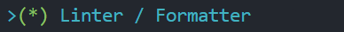

[TOC]

# Vue2

****

*==🔗[Vue.js - v2](https://v2.cn.vuejs.org/) **:** **渐进式 `JavaScript` 框架**==*

<center></center>


## 🍀概念

***`Vue` (读音 `/vjuː/`，类似于 `view`) 是一套<span style=color:red;>用于构建用户界面</span>的前端<span style=color:red;>框架</span>***


## 🔅特性

==***`vue` 框架的主要特性***==

1. <span style=color:red;>***数据驱动视图***</span>
2. <span style=color:red;>***双向数据绑定***</span>


### 数据驱动视图

> ==***`vue` 会监听数据的变化，从而自动重新渲染页面的结构***==
>
> + ###### *当页面数据发生变化时，页面会自动重新渲染*
>
> + ###### *数据驱动视图是<span style=color:red;>单向的数据绑定</span>*

<center></center>


### 双向数据绑定

> ==***在模板中的数据发生变化的时候，模型对象也要发生改变；模型对象中的数据改变时，视图中的数据也要发生改变***==

<center></center>


## 🔺MVVM

🎇==***`MVVM(Model-View-ViewModel)`，是一种软件架构设计模式，它是一种简化用户界面的事件驱动编程方式***==

> ***`MVVM` 是 `vue` 实现<span style=color:red;>数据驱动视图</span>和<span style=color:red;>双向数据绑定</span>的<u>核心原理</u>，<u>它把每个 `HTML` 页面都拆分成了三个部分</u>***
>
> + ==***`Model` :	表示当前页面渲染时所依赖的数据源***==
> + ==***`View` :	表示当前页面所渲染的 `DOM` 结构***==
> + ==***`ViewModel` :	表示 `vue` 的实例，它是 `MVVM` 的核心***==

<center></center>


### **:sunny:**工作原理

> ==***<span style=color:red;>`ViewModel` 作为 `MVVM` 的核心</span>，是它把当前页面的<span style=color:red;>数据源`(Model)`</span>和<span style=color:red;>页面的结构`(View)`</span>连接在了一起***==
>
> + ###### *当<span style=color:red;>数据源发生变化</span>时，会被 `ViewModel` 监听到，`VM` 会根据最新的数据源自动更新页面的结构*
>
> + ***当<span style=color:red;>模块的值发生变化</span>时，也会被 `VM` 监听到，`VM` 会把变化过后最新的值自动同步到 `Model` 数据源中***

<center></center>


## 基本使用

1. ###### *导入 `vue.js` 的 `script` 脚本文件*

   + ```html
     <!-- 1.导入 vue.js -->
     <script src="./vue.js"></script>
     ```

2. ###### *在页面声明一个即将被 `vue` 所控制的 `DOM` 区域*

   + ```html
     <!-- 2.声明一个即将被vue所控制的 DOM 区域(VIEW视图) -->
     <div id="app">
         {{username}}
     </div>
     ```

3. ###### *创建 `vm` 实例对象`(vue实例对象)`*

   + ```javascript
     // 3.创建 vm 实例对象(vue实例对象)
     const vm = new Vue({
         /*
         3.1设置当前 vm 实例所绑定的元素
         	vue 的绑定元素只支持双标签,不能使用html与body标签
     	    只会挂载第一个被css选择器选中的元素(推荐使用id选择器)
         */
         el: '#app',
         // 3.2 指定 Model数据源(Model模型)
         data: {
             username: 'linke'
         }
     });
     
     <!-- 执行结果 -->
     linke
     ```


## 🔳基础

### 💠指令

==***指令`（Directives）`是 `vue` 提供的模板语法，用于渲染页面的基本结构***==

+ ***<span style=color:red;>内容渲染</span>指令***
+ ***<span style=color:red;>属性绑定</span>指令***
+ ***<span style=color:red;>事件绑定</span>指令***
+ ***<span style=color:red;>双向绑定</span>指令***
+ ***<span style=color:red;>条件渲染</span>指令***
+ ***<span style=color:red;>列表渲染</span>指令***


#### 内容渲染指令

> ==***内容渲染指令用来渲染 `DOM` 元素的文本内容***==

+ **`v-text`** ：设置标签的文本值<span style=color:red;>(纯文本)</span>，会覆盖元素内默认的值
+ **`{{ }}`** ：插值表达式`(Mustache)`，只作用于文本节点中
+ **`v-html`** ：同 `v-text`，不同的是会将包含 `HTML` 标签的字符串渲染为页面的 `HTML` 元素

```html
<!-- 
v-text : 设置标签的文本值(纯文本)
	*会覆盖元素内默认的值*
{{}} : 插值表达式
	*会将对应的值渲染到元素内容的表达式中,保留表达式以外的值*
v-html : 插入html标签
	*同 v-text, 不同的是会将包含 HTML 标签的字符串渲染为页面的 HTML 元素*
-->
<div v-text="username"></div>
<div v-text="sex">female</div>
<div>age: {{age}}</div>
<div v-html="info"></div>
```

```javascript
data: {
     username: 'linke',
     sex: 'male',
     age: 19,
     info: '<h2>info ...</h2>'
}
```

```html
<!-- 执行结果 -->
linke
male
age: 19
info ...
```


####  属性绑定指令

> ==***为元素的属性动态绑定属性值，则需要用到 `v-bind` 属性绑定指令，简写形式`:`***==
>
> ```vue
> v-bind:属性	// 全写
> :属性			// 简写
> ```

```html
<input type="text" v-bind:value="username">
<div v-bind:class="cla"></div>
<div :data-index="index"></div>
```

```javascript
data: {
	username: 'linke',
    cla: 'box',
    index: 1
}
```

```html
<!-- 执行结果 -->
<input type="text" value="linke">
<div class="box"></div>
<div data-index="1">
```


#### 事件绑定指令

> ==***`vue` 提供了 `v-on` 事件绑定指令，用来对 `DOM` 元素绑定事件监听，简写形式`@`***==
>
> ==***通过 `v-on` 绑定的事件处理函数，需要在 `methods` 节点中进行声明***==
>
> ```vue
> v-on:事件名称(不包含on)	// 全写
> @事件名称(不包含on)		// 简写
> ```

+ **`(arg)`** ：可以使用`()`进行传递参数
+ **`event`** ：事件处理函数无参数时，默认传入一个事件对象`event`，简写`e`
+ **`$event`** ：<span style=color:red;>特殊参数变量</span>，用来表示原生的事件参数对象 `event`

```html
<div id="app">
    <p>count 值是: {{count}}</p>
    <button v-on:click="count-=1">-1</button>
    <button @click="fun">+1</button>
    <button @click="def(0, $event)">default</button>
</div>
```

```javascript
const vm = new Vue({
    el: '#app',
    data: {
        count: 0
    },
    methods: { // 在 methods 中声明事件处理函数
        fun(e) {
            console.log(e); // PointerEvent { ... }
            console.log(vm === this); // true
            // vm.count++; // 方式1
            this.count++; // 方式2
        },
        def(number, e) {
            console.log(e); // PointerEvent { ... }
            this.count = number;
        }
    }
});
```


#### 双向绑定指令

> ==***`v-model` 指令在元素上创建双向数据绑定，它会根据控件类型自动选取正确的方法来更新元素***==

+ **`.lazy`**	：将同步改为在 `change` 事件发生后再进行同步
+ **`.number`**	：输入值自动类型转化数值类型
+ **`.trim`**	：自动修剪输入值中的首尾空格

```html
<!-- 
双向绑定指令:
	v-model			简写
	v-model:value	全写
-->
<input v-model="message" placeholder="edit me">
<input v-model:value="message" placeholder="edit me">
<p>Message is: {{ message }}</p>
```

```javascript
data: {
    message: ''
}
```


#### 条件渲染指令

> ==***用来按需控制 `DOM` 的显示与隐藏***==

+ **`v-if,v-else-if,vi-else`** ：表达式值为`true` 元素存在`dom`树中；反之`false` 从`dom`树中删除
+ **`v-show`** ：表达式值为`true` 元素添加样式`style="display: none;"`； 反之`false` 清空 `style`样式

🍧***区别***

+ *`v-if` ：`false`不显示时，将内容直接从`Dom`去除，只需要一次渲染的就使用`v-if`*
+ *`v-show` ：`false`不显示时，将内容隐藏`("style="display: none;")`，反复切换内容；则使用`v-show`*

```html
<h2 v-if="flag">Login</h2><!-- v-if 与 v-else/v-else-if 之间不能出现任何元素 -->
<h2 v-else>Register</h2><!-- v-else/v-else-if 指令必须配合 v-if 指令一起使用 -->

<input type="text" v-show="flag" key="Login" placeholder="Login ...">
<input type="text" v-show="!flag" key="Register" placeholder="Register ...">
<button type="button" @click="flag=!flag">Toggle</button>

<!-- v-if 与 <template> 标签一起使用时不会渲染 <template> 标签 -->
<template v-if="flag">
    <div>Div</div>
</template>
```

```javascript
data: {
    flag: true
}
```

```html
<!-- 执行结果 -->
<h2>Login</h2>
<input type="text" placeholder="Login ...">
<input type="text" placeholder="Register ..." style="display: none;">
<div>Div</div>
```


#### 列表渲染指令

> ==***用来基于一个数组来循环渲染一个列表结构，渲染列表时推荐绑定唯一的 `:key`***==
>
> ```vue
> v-for="item in items" 				 // 方式1,可用 of 替代 in 渲染
> v-for="(item, index) in items"		 // 方式2,()可忽略
> v-for="(value, key, index) in items" // 方式3
> ```

+ **`items`**	：源数据**数组/对象/字符串**
+ **`(item,index)`**	：数组时表示`(元素,索引)`；对象时表示`(键值,键名)`；字符串时表示`(单字符,索引)`
+ **`(value, key, index)`**	：对象时表示`(键值,键名,索引)`

```html
<ul>
    <!-- 推荐 id 为 key -->
    <li v-for="item,index in array" :key="item.id" :title="item.name">
        index={{index}}, id={{ item.id }}, name={{ item.name }}
    </li>
</ul>
```

```javascript
data: {
    array: [
        { id: 1, name: 'dudu' },
        { id: 2, name: 'keke' },
        { id: 3, name: 'huhu' },
        { id: 4, name: 'yiyi' }
    ]
}
```

```html
<!-- 执行结果 -->
<ul>
    <li title="dudu">index=0, id=1, name=dudu</li>
    <li title="keke">index=1, id=2, name=keke</li>
    <li title="huhu">index=2, id=3, name=huhu</li>
    <li title="yiyi">index=3, id=4, name=yiyi</li>
</ul>
```


#### Class 与 Style 绑定

> ==***`Vue` 对操作元素的 `class` 列表和内联样式做了专门的增强。表达式结果的类型除了字符串之外，还可以是对象或数组***==
>
> ```vue
> v-bind:[class/style]	// 全写
> :[class/style]			// 简写
> ```

+ ###### 🍎*对象语法*

  + ```html
    <!-- :class 基本使用 -->
    <div :class="{claname:isFlag}"></div>
    <!-- 另一种写法 -->
    <div :class="objCla"></div>
    <!-- class 会和 v-bind:class 的样式结合 -->
    <div class="cla1" v-bind:class="{claname:isFlag}"></div>
    
    <!-- :style 基本使用,style 会和 v-bind:style 的样式结合 -->
    <div style="color: red;" :style="{border:`solid red ${number}px`}"></div>
    <!-- 另一种写法 -->
    <div :style="objSty"></div>
    
    <!-- :class 可以与 :style 结合使用 -->
    <div :class="objCla" :style="{color:'skyblue'}"></div>
    ```

  + ```javascript
    data: {
        isFlag: true,
        objCla: { claname: false, cla1: true },
        number: 2,
        objSty: {
              border: "solid 2px pink",
              color: "#1E90FF",
              /*
               包含 “-” 必须使用字符 "" 引用起来 或者使用 *驼峰命名*
                  以下两种方式效果一致
              */
              "background-color": "#F0F8FF"
              // backgroundColor:"#F0F8FF"
        }
    }
    ```

  + ```html
    <!-- 执行结果 -->
    <div class="claname"></div>
    <div class="cla1"></div>
    <div class="cla1 claname"></div>
    
    <div style="color: red; border: 2px solid red;"></div>
    <div style="border: 2px solid pink; color: rgb(30, 144, 255); background-color: rgb(240, 248, 255);"></div>
    
    <div class="cla1" style="color: skyblue;"></div>
    ```

+ ###### 🍏*数组语法*

  + ```html
    <!-- :class 放置一个数组 -->
    <div :class="classs"></div>
    
    <!-- :style 放置一个数组 -->
    <div :style="styles"></div>
    ```
    
  + ```javascript
    data: {
        classs: ["cla1", "cla2"],
        styles: [
            {
                border: "dotted 2px pink",
                color: "#7B68EE",
            },
            {
                backgroundColor: "#ADFF2F"
            }
        ]
    }
    ```
  
  + ```html
    <!-- 执行结果 -->
    <div class="cla1 cla2"></div>
    
    <div style="border: 2px dotted pink; color: rgb(123, 104, 238); background-color: rgb(173, 255, 47);"></div>
    ```


#### v-pre指令

>+ **`v-pre`**
>
>==***跳过这个元素和它的子元素的编译过程，跳过大量没有指令的节点会加快编译***==

```html
<h2 v-pre>{{ username }}</h2>
<h2>{{ username }}</h2>
```

```js
data: {
    username: 'Linke'
}
```

~~~html
<!-- 执行结果 -->
<h2>{{ username }}</h2>
<h2>Linke</h2>
~~~


#### v-cloak指令

> + **`v-cloak`**
>
> ==***本质是一个特殊的指令，不需要表达式，`Vue`实例创建完毕并渲染页面后，会自动删除 `v-cloak`***==

```css
[v-clock] {
    display: none;
}
```

```html
<div id="app" v-clock>
    {{ username }}
</div>
```

```js
// 模拟延迟效果
setTimeout(() => {
    new Vue({
        el: '#app',
        data: {
            username: 'linke'
        }
    })
}, 1000)
```


#### v-once指令

> + **`v-once`**
>
> ==***一个特殊的指令，不需要表达式，只渲染元素和组件<span style=color:red;>一次</span>，随后的重新渲染，元素/组件及其所有的子节点将被视为静态内容并跳过***==

```html
<h2 v-once>init_number: {{ number }}</h2>
<h2>number: {{ number }}</h2>
<button @click="number++">number++</button>
```

```js
data: {
    number: 0
}
```


#### 指令表达式

> :grey_exclamation:==***`vue` 提供的模板渲染语法还支持 `Javascript` 表达式的运算***==

```html
{{ number + 1 }}
{{ flag ? 'YES' : 'NO' }}
{{ msg.split('').reverse().join('') }}
<div :data-id="'index-' + id"></div>
```

```javascript
data: {
    number: 1,
    flag: true,
    msg: 'abcd',
    id: 1
}
```

```html
<!-- 执行结果 -->
2 YES dcba
<div data-id="index-1"></div>
```


### ➰特殊 attribute

+ **`key`**  ：用来作标识`(唯一)`的， 赋值的是变量需要加 **`:`** ，反之则不需要

  + > :grey_exclamation:==***有相同父元素的子元素必须有独特的 `key`；重复的 `key` 会造成渲染错误***==
    >
    > ==***值类型：`string/number`***==

+ **`ref`** ：用来给元素或子组件注册引用信息，引用信息将会注册在父组件的 `$refs` 对象上

  + >:grey_exclamation:==***每个组件都包含一个 `$refs` 对象，默认为空对象***==
    >
    >==***值类型：`string`***==
    >
    >+ ==***如果在普通的 `DOM` 元素上使用，引用指向的就是 `DOM` 元素***==
    >
    >+ ==***如果用在子组件上，引用就指向组件实例***==
    >
    >```vue
    ><div ref="txt"></div>
    ><Son ref="son"></Son>
    ><button type="button" @click="getRef">Get Ref</button>
    >```
    >
    >```js
    >export default {
    >    methods: {
    >        getRef() {
    >            console.log(this.$refs); // {box: div, son: VueComponent}
    >        },
    >    },
    >	components: {
    >	    Son,
    >    },
    >};
    >```


#### 🌸key的作用

:grey_exclamation:==***虚拟`DOM`中 `key` 的作用***==

> ==***`key` 是虚拟 `DOM` 对象的标识，当数据发生改变时，`Vue`会根据新数生成新的虚拟 `DOM`，然后进行新虚拟 `DOM` 与旧虚拟 `DOM` 的差异比较，比较规则：***==
>
> 1. ==*寻找与旧虚拟`DOM`相同的新虚拟`DOM`的`key`*==
>    + *如果虚拟`DOM`中内容没改变，直接使用之前的真实`DOM`*
>    + *反之虚拟`DOM`中内容改变，则生成新的真实`DOM`替换页面中之前的真实`DOM`*
> 2. ==*旧虚拟`DOM`中未寻找与新虚拟`DOM`相同的`key`*==
>    + *创建真实`DOM`渲染到页面*


### 修饰符

> ❕==***修饰符是由点`.`开头的指令后缀来表示的，修饰符可以串联***==

+ ==***事件修饰符***==

  |   事件修饰符   |             作用             |
  | :------------: | :--------------------------: |
  |  **`.stop`**   |       **阻止事件冒泡**       |
  | **`.prevent`** |     **阻止事件默认行为**     |
  | **`.capture`** |       **事件捕获模式**       |
  |  **`.self`**   |       **元素自身触发**       |
  |  **`.once`**   |      **设置一次性事件**      |
  | **`.passive`** |   **事件默认行为立即触发**   |
  | **`.native`**  | **监听组件根元素的原生事件** |

+ *==**键修饰符**==*

  |   键修饰符    |         作用         |
  | :-----------: | :------------------: |
  | **`.enter`**  |      **回车键**      |
  |  **`.tab`**   |     **`tab`键**      |
  | **`.delete`** | **`删除`和`退格`键** |
  |  **`.esc`**   |     **`esc`键**      |
  | **`.space`**  |      **空格键**      |
  |   **`.up`**   |    **向上箭头键**    |
  |  **`.down`**  |    **向下箭头键**    |
  |  **`.left`**  |    **向左箭头键**    |
  | **`.right`**  |    **向右箭头键**    |

+ ==***系统修饰键***==

  |  系统修饰符  |      作用       |
  | :----------: | :-------------: |
  | **`.ctrl`**  |  **`Ctrl`键**   |
  |  **`.alt`**  |   **`Alt`键**   |
  | **`.shift`** |  **`Shift`键**  |
  | **`.meta`**  | **`Windows`键** |

+ ==***`.exact` 修饰符***==

  >***修饰符允许控制触发事件所需的系统修饰符的确切组合***
  >
  >```html
  ><!-- Ctrl+Shifts+[其他键]+点击 可以触发事件 -->
  ><button v-on:click.ctrl.shift="fun">Ctrl+shift+[key]+click</button>
  >
  ><!-- 必须精确到 Ctrl+Shifts+点击 才对触发事件 -->
  ><button v-on:click.ctrl.shift.exact="fun">Ctrl+shift+click</button>
  >```

+ ==***鼠标按钮修饰符***==

  | 鼠标按钮修饰符 |     作用     |
  | :------------: | :----------: |
  |  **`.left`**   | **鼠标左键** |
  |  **`.right`**  | **鼠标右键** |
  | **`.middle`**  | **鼠标中键** |

+ ==***自定义按键修饰符别名***==

  > ***可以通过全局对象定义自定义键修饰符别名：`config.keyCodes`***
  >
  > ***自定义按键触发，必须在`vue`实例化之前定义***
  >
  > ```js
  > // 可以使用 v-on:keyup.f1
  > Vue.config.keyCodes.f1 = 48; // 数字键0
  > ```


### 过滤器

> ==***`Vue` 允许你自定义过滤器`(Filters)`，被用于一些常见的文本格式化***==
>
> + ==***过滤器可以用在两个地方：<span style=color:red;>双花括号插值</span>和 `v-bind` 表达式***==
>
> + ==***过滤器应该被添加在 `JavaScript` 表达式的尾部，由 `管道符` 进行调用***==
>
> + ==***必须在 `filters`节点中定义过滤器函数***==
> + :grey_exclamation:==***过滤器函数必须要有返回值`(return)`***==
> + :grey_exclamation:==***过滤器可以串联 `{{ msg | filterA | filterB }}`***==
> + :grey_exclamation:==***当全局过滤器和局部过滤器重名时，会采用局部过滤器***==
> + :grey_exclamation:==***可以接收参数 `{{ msg | filterA(arg, ...) }}`，第一个参数为 `|`左边的值，第二个参数为`arg`，`...`因此类推***==
>
> <u><span style=color:red;>***❗在Vue3中已弃用***</span></u>

+ ###### *局部过滤器：只能在当前 `vue` 实例所挂载的 `el` 区域内使用*

  + ```html
    <!-- 在插值表达式中使用 管道符"|" 调用过滤器 -->
    <p>{{date | dateFormat}}</p>
    <!-- 在 v-bind 中使用 管道符"|" 调用过滤器 -->
    <div :text="date | dateFormat"></div>
    ```

    ```javascript
    data: {
        date: new Date(1662293838221)
    },
    filters: { // 定义过滤器
        dateFormat(value) {
            return value.toLocaleString();
        }
    }
    ```

    ```html
    <!-- 执行结果 -->
    <p>2022/9/4 20:17:18</p>
    <div text="2022/9/4 20:17:18"></div>
    ```

+ ###### *全局过滤器：所有 `vue` 实例之间都可使用*

  >```js
  >Vue.filter(filterName, callback);
  >```
  >
  >​		**`filterName`**	：全局过滤器**名称**
  >
  >​		**`callback`**	：全局过滤器**处理函数**

  + ```html
    <!-- 调用全局过滤器 -->
    <span>{{ text | capitalize }}</span>
    ```

  + ```javascript
    // 定义全局过滤器
    Vue.filter('capitalize', function (value) {
        if (!value) return;
        value = value.toString();
        return value.charAt(0).toUpperCase().concat(value.slice(1));
    });
    
    new Vue({
        data: {
            text: 'linke'
        }
    });
    ```
    
  + ```html
    <!-- 执行结果 -->
    <span>Linke</span>
    ```


### 侦听器

> ==***`watch` 侦听器用来监视数据的变化，从而针对数据的变化做特定的操作***==
>
> ```html
> <input type="text" v-model="username">
> ```
>
> ```javascript
> data: {
>        username: 'linke'
> },
> watch: { // watch 节点号定义监听器
>        // 监听 username 属性(属性名及方法名)的变化,第一个值为"改变之后的值",第二个值为"改变之前的值"
>        username(newVal, oldVal) { // 方式1(方法形式)
>            console.log(`username数据发生变化!! 旧值:${oldVal}, 新值:${newVal}`);
>        }
>        /*
>        username: { // 方式2(对象形式)
>        	handler(newVal, oldVal){ ... } 
>        }
>    	*/
> }
> ```

+ **`handler`**	：当监听的属性的值发生变化时，自动调用 `handler` 处理函数
+ **`immediate`**	：页面渲染完成之后，是否立即以表达式的当前值触发回调***(默认`false`)***
+ **`deep`**	：是否对对象内部值的变化进行监听

```html
<input type="text" v-model.number="age">
<input type="text" v-model.number="info.max">
<input type="text" v-model.number="info.min">
```

```javascript
data: {
    age: 19,
    info: {
        max: 100,
        min: 1
    }
},
watch: {
    age: {
        handler(newVal, oldVal) { // age 值发生变化时,自动触发 handler 回调
            console.log(`age数据发生变化!! 旧值:${oldVal}, 新值:${newVal}`);
            // age数据发生变化!! 旧值:undefined, 新值:19
        },
        immediate: true // 页面渲染完成之后,立即触发 handler 回调
    },
    info: {
        handler(newVal) {
            console.log(`info数据发生变化!! 新值:${JSON.stringify(newVal)}`);
        },
        deep: true // 监听对象属性的变化
    },
    'info.min'(newVal) { // 监听对象单个属性的变化
        console.log(`info.min数据发生变化!! 新值:${newVal}`);
    }
}
```


### 计算属性

> ==***计算属性指的是通过一系列运算之后，最终得到一个<span style=color:red;>属性值</span>***==
>
> ==***动态计算出来的属性值可以被<span style=color:red;>模板结构</span>或 `methods` 方法使用***==
>
> + :grey_exclamation:==***必须在 `computed` 节点中定义计算属性***==
> + :grey_exclamation:==***虽然计算属性在简写声明的时候被定义为方法，但是<span style=color:red;>本质是一个属性</span>***==
> + :grey_exclamation:==***计算属性<span style=color:red;>会缓存计算的结果</span>，只有计算属性<span style=color:red;>依赖的数据变化</span>时，才会重新进行运算***==

```html
<p>{{ xyz }}</p>
<h3>{{ position() }}</h3>
```

```javascript
data: {
    x: 1,
    y: 2,
    z: 3
},
computed: { // 必须在 computed 节点中定义计算属性
    // 简写 get()
    xyz() { return `${this.x}px,${this.y}px,${this.z}px` }
    // 全写
    xyz: {
        get() {
            return // ....
        },
        set(value) {
            // ....
        }
    }
},
methods: {
    position() {
        return `位置: ${this.xyz}`;
    }
}
```

```html
<p>1px,2px,3px</p>
<h3>位置: 1px,2px,3px</h3>
```


### $refs

> :grey_exclamation:==***`Vue` 实例对象的一个对象属性，持有注册过`ref`属性的所有 `DOM` 元素和组件实例***==


### 🔹this

==***`Vue` 中 `this`的指向***==

1. *`Vue`中生命周期钩子和自定义方法中的 `this` 指向当前的 `Vue` 实例，生命周期钩子的 `this` 上下文指向调用它的 `Vue` 实例*
2. *`Vue` 中回调函数中的 `this` 指向 `Vue` 实例*
   + *若回调函数为匿名函数，非严格模式下指向 `window`，严格模式下为 `undefined`*
3. *`Vue` 中 `addEventListener` 中的 `this` 也指向 `Vue` 实例*
4. *`Vue` 组件中的 `this` 指向当前组件的实例对象*

> :grey_exclamation:==***除了回调函数中的 `this` ，其它地方的 `this` 均指向 `Vue` 实例***==


#### 注意

❕==***`vue` 会将 `data` 对象中的成员平铺的 `vue` 实例中，可通过 `this.属性名`访问到 `data` 对象中的数据***==


## ⭐生命周期

<center></center>


### 过程

>:grey_exclamation:==*生命周期 `(Life Cycle)`是指一个组件从 <span style=color:red;>创建 </span>到  <span style=color:red;>销毁</span> 的整个阶段，强调的是一个<span style=color:red;>时间段</span>*==
>$$
>开始创建 —> 初始化数据 —> 编辑模板 —> 挂载DOM($el) —> UI渲染 —> 数据更新 —> 卸载
>$$
>


### ✨四大阶段

1. ==***初始化阶段***==
   + **`beforeCreate`** ：实例刚创建完成，此时还没有 `data` 和 `methods`属性
   + **`created`** ：`vue`实例`data`和`method`属性已经初始化完成，此时还没有编译模板

2. ==***实例挂载阶段***==
   + **`beforeMount`** ：挂载前，模板编译完成，此时 `el` 还没有挂载，`data`目前可见
   + **`mounted`** ：挂载完成后，模板编译完成

3. ==***数据更新阶段***==
   + **`beforeUpdate`** ： 数据更新时执行，`data`数据此时已经是最新的数据，`UI`界面还是旧的
   + **`updated`** ：数据更新完成后，界面和`data`里的数据此时都是最新的

4. ==***销毁阶段***==
   + **`beforeDestroy`** ： 实例准备销毁，此时`data`和`methods`方法都能用
   + **`destroyed`** ： 实例已销毁完成


### 生命周期钩子

> *每个 `Vue` 实例在都会经过四个阶段的过程，同时在这个过程中也会自动运行一些叫做<span style=color:red;>**生命周期钩子**</span>的函数*
>
> ==***<span style=color:red;>:grey_exclamation:不要在生命周期回调上使用箭头函数</span>***==

```js
new Vue({
    data: {
        number: 19
    },
    created: function () {
        // `this` 指向 vm 实例
        console.log('number is: ' + this.number)
    }
})

// => "number is: 19"
```


## 实例方法

### 生命周期方法

+ ***`$mount()`***

> ```js
> vm.$mount(elementOrSelector);
> ```
>
> ​		**`elementOrSelector`**	:  `CSS`选择器 / `DOM` 元素
>
> ==***如果 `Vue` 实例在实例化时没有收到 `el` 选项，则它处于<span style=color:red;>未挂载</span>状态，没有关联的 `DOM` 元素。可以使用 `vm.$mount()` 手动地挂载一个未挂载的实例***==

```html
<div id="app"></div>
```

```js
// 创建并挂载到 #app
new Vue().$mount('#app');
// 作用同上
new Vue({ el: '#app' });
```

+ ***`$forceUpdate()`***

>```js
>vm.$forceUpdate();
>```
>
>==***强制 `Vue` 实例重新渲染，仅影响实例本身和插入插槽内容的子组件***==

+ ***`vm.$destroy()`***

> ```js
> vm.$destroy();
> ```
>
> ==***完全销毁一个实例；清理它与其它实例的连接，解绑它的全部指令及事件监听器***==
>
> :grey_exclamation:==***最好使用 `v-if` 指令以数据驱动的方式控制子组件的生命周期***==

+ ***`vm.$nextTick()`***

> ```js
> vm.$nextTick([callback]);
> ```
>
> ==***将回调延迟到下次 `DOM` 更新循环之后执行，在修改数据之后立即使用这个方法，获取更新后的 `DOM`***==


### 事件方法

+ ***`vm.$on()`***

> ```js
> vm.$on(event, callback);
> ```
>
> ​		**`event`**	：事件名称字符串 / 事件名称数组
>
> ​		**`callback`**	：数据处理函数
>
> ==***监听当前实例上的自定义事件，事件可以由 `vm.$emit` 触发***==

```js
vm.$on('test', function (msg) {
    console.log(msg)
});

vm.$emit('test', 'linke')
```

+ ***`vm.$once()`***

> ```js
> vm.$once(event, callback);
> ```
>
> ==***监听一个自定义事件，但是只触发一次。一旦触发之后，监听器就会被移除***==

+ ***`vm.$off()`***

> ```js
> vm.$off([event, callback]);
> ```
>
> ==***移除自定义事件监听器***==
>
> 1. ==*如果没有提供参数，则移除所有的事件监听器*==
> 2. ==*如果只提供了事件，则移除该事件所有的监听器*==
> 3. ==*如果同时提供了事件与回调，则只移除这个回调的监听器*==

+ ***`vm.$emit()`*** 

> ```js
> vm.$emit(eventName, [...args])
> ```
>
> ​		**`eventName`**	:	事件名称字符串
>
> ​		**`...args`**	：附加参数，会传给监听器回调


### 数据方法

+ ***`vm.$watch()`***

> ```js
> vm.$watch(expOrFn, callback, [options])
> ```
>
> ​		**`expOrFn`**	：表达式，`键路径字符串/函数`
>
> ​		**`callback`**	：回调函数，接收两个**可选**参数`(新值和旧值)`
>
> ​		**`options`**	：选项对象
>
> ==***观察 `Vue` 实例上的一个表达式或者一个函数计算结果的变化，表达式只接受简单的键路径。对于更复杂的表达式，用一个函数取代***==
>
> :grey_exclamation:==***返回一个取消观察函数，用来停止触发回调***==

```js
// 键路径
vm.$watch('user.username', function (newVal, oldVal) {
    // ...
})

// 函数
vm.$watch(
    function () {
        // 表达式 `this.a + this.b` 每次得出一个不同的结果时
        // 处理函数都会被调用
        // 这就像监听一个未被定义的计算属性
        return this.a + this.b
    },
    function (newVal, oldVal) {
        // ....
    }
)
```

+ ***`vm.$set()`***

> ~~~js
> vm.$set(target, propertyName/index, value)
> ~~~
>
> ==***这是全局 `Vue.set` 的别名***==


## 全局 API

### productionTip

```js
Vue.config.productionTip; // true
```

+ **类型**：`boolean`
+ **默认值**：`true`
+ **作用**：是否阻止 `vue` 在启动时生成生产提示


### set()

```js
Vue.set(target, propertyName/index, value);
```

+ `target` ：需要添加属性的vue对象
+ `propertyName/index` ：添加的属性名，或数组下标
+ `value` ：添加的属性值
+ **作用** ：向`Vue`对象中添加一个 `property`
+ **注意** ：*对象不能是 `Vue` 实例，或者 `Vue` 实例的根数据对象*


### extend()

```js
Vue.extend(options);
```

+ `options`	：组件配置对象
+ **作用**	：使用基础 `Vue` 构造器，创建一个子类
+ **注意**	：*`data` 选项是必须是函数，且没有 `el` 选项*

```js
// 当用于注册组件时,可简写 export default Vue.extend(options) 为 export default {options}
```


### use()

~~~js
Vue.use(plugin, options);
~~~

+ `plugin`	：安装的 `Vue` 插件
+ `options`	：安装插件的配置选项，根据所安装的插件是否可选参数
+ **作用**	：安装 `Vue` 插件
+ **注意**
  1. *插件为`Object`，必须提供 `install` 方法；插件为`Function`，它会被作为 `install` 方法*
  2. *当 `install` 方法被同一个插件多次调用，插件将只会被安装一次*
  3. *该方法需要在调用 `new Vue()` 之前被调用*


## 🔧Vue CLI

***🔗[Vue CLI](https://cli.vuejs.org/zh/)是 `Vue.js` 开发的标准工具，简化了基于 `webpack` 创建工程化的 `Vue` 项目的过程***

<center></center>


### SPA

> :grey_exclamation:==***`SPA` <span style=color:red;>单页面应用程序</span> `(Single Page Application)`，指的是<span style=color:red;>一个 `Web` 网站中只有唯一的一个 `HTML` 页面</span>，所有的功能与交互都在这唯一的一个页面内完成***==


### 安装

```cmd
# NPM
npm i -g @vue/cli
# YARN
yarn global add @vue/cli
# 查询版本号
vue -V
```


### 🔷创建步骤

1. 1️⃣***在需要创建项目的目录终端中输入命令***

   + ```cmd
     vue create 项目的名称
     ```

2. 2️⃣***选择创建方式***

   + <left></left>

3. 3️⃣***创建自定义配置选项***

   + <left></left>

4. 4️⃣***选择安装 `Vue` 版本***

   + <left></left>

5. 5️⃣***创建 `CSS` 预处理器***

   + <left></left>

6. 6️⃣***创建插件的配置文件存储方式***

   + <left></left>

7. 7️⃣***是否将本次选项作为映射***

   + <left></left>

8. 8️⃣***选择项目的包管理工具***

   + <left></left>

9. 9️⃣***创建项目成功***
   
   + <left></left>


#### 删除自定义配置

> :grey_exclamation:==***打开 `C:\Users\{用户目录}\.vuerc`文件，删除`presets`节点下的自定义配置即可***==


### 项目结构

<center></center>


#### **index.html**

```html
<head>
    <!-- ... -->
    <!-- BASE_URL 表示 public 目录路径 -->
    <link rel="icon" href="<%= BASE_URL %>favicon.ico">
    <!-- htmlWebpackPlugin.options.title 表示 package.json文件里的name节点值 -->
    <title><%= htmlWebpackPlugin.options.title %></title>
</head>

<body>
    <!-- 当浏览器不支持js时 noscript标签就会被渲染 -->
    <noscript>
        <strong>....</strong>
    </noscript>
    <!-- 容器 -->
    <div id="app"></div>
    <!-- built files will be auto injected -->
</body>
```


### 运行流程

> ==***在工程化的项目中，<u>`vue` 通过 `main.js` 把 `App.vue` 渲染到 `index.html` 的指定区域中</u>***==

1. ***`App.vue` 用来编写待渲染的<span style=color:red;>模板结构</span>***
2. ***`index.html` 中需要预留一个 <span style=color:red;>`el` 区域</span>***
3. ***`main.js` 把 `App.vue` 渲染<span style=color:red;>(替换)</span>到了 `index.html` 所预留的区域中***


### 📄查询默认配置

==***`Vue` 脚手架隐藏了所有 `webpack` 相关的配置，使用以下命令即可查询配置***==

~~~cmd
vue inspect > output.js
~~~


### 📑配置文件

==*[vue.config.js](https://cli.vuejs.org/zh/config/#vue-config-js) 是一个可选的配置文件，根目录中存在`package.json` 这个文件，那么它会被 `@vue/cli-service` 自动加载*==

~~~js
// vue.config.js

module.exports = {
    // 选项...
}
~~~


#### pages

==***项目入口配置***==

~~~js
pages: {
    index: {
        // page 的入口
        entry: 'src/main.js',
        // 模板来源
        template: 'public/index.html',
        // 在 dist/index.html 的输出
        filename: 'index.html',
        /* 当使用 title 选项时:
        template 中的 title 标签需要是 <title><%= htmlWebpackPlugin.options.title %></title> */
        title: 'Index Page'
    }
}
~~~


#### lintOnSave

==***语法检查配置***==

~~~js
lintOnSave: false // 关闭语法规范检查
~~~


#### devServer.proxyb

==***配置代理服务器***==

~~~js
devServer: {
    /* 方式(1)
    	缺点: 如果请求的资源本地存在，则请求本地
    */
    // proxy: 'http://localhost:5000' // 配置请求服务器地址
    // 方式(2)
    proxy: {
        '/api': { // 请求前缀
            target: 'http://localhost:5000', // 配置请求服务器地址
            ws: true, // 支持 websocket,默认值true
            changeOrigin: true, // 将基于名称的虚拟托管站点,默认值true
            pathRewrite: {'^/api': ''} // 重写目标的网址路径
        }
    }
}
~~~


## 🔩组件

### 组件化开发

==***根据封装的思想，把页面上可重用的 `UI` 结构封装为组件，从而方便项目的开发和维护***==

> :grey_exclamation:==***`vue` 是一个支持组件化开发的前端框架，`vue` 中规定组件的后缀名是 `.vue`***==
>
> :grey_exclamation:==***组件可进行任意次数的复用***==
>
> :grey_exclamation:==***每个组件必须只有一个根元素***==


### 🧱组成

> :grey_exclamation:==***每个组件中必须包含 `template` 模板结构，而 `script` 行为和 `style` 样式是可选的组成部分***==

1. **`template`**  ：组件的<span style=color:red;>**模板结构**</span>
2. **`script`**  ：组件的 <span style=color:red;>**`JavaScript` 行为**</span>
3. **`style`**  ：组件的<span style=color:red;>**样式**</span>


#### **template**

> :grey_exclamation:==***每个组件对应的模板结构，需要定义到`<template>` 节点中***==
>
> + ***`template` 是 `vue` 提供的<span style=color:red;>容器标签</span>，只起到<span style=color:red;>包裹性质的作用</span>，<u>它不会被渲染为真正的 `DOM` 元素</u>***
> + ***`template` 中只能有<span style=color:red;>唯一的根节点(标签)</span>***

+ **`lang`**	：定义 `模版` 编写的语法`(pug, ...)`

```vue
// 默认模块语法为 html
<template>
<!-- 当前组件的 DOM 结构,必须定义到 template 标题内 -->
<!-- 组件的模版结构中只能有唯一一个根节点(标签) -->
</template>

// 更改模块语法为 pug
<template lang="pug"></template>
```


#### **script**

> :grey_exclamation:==***`vue` 规定在节点中封装组件的 `JavaScript` 业务逻辑***==

+ **`lang`**	：定义 `JS` 编写的语法`(ts, ...)`

```vue
// 默认 JavaScript 语法
<script>
// 默认导出(固定写法)
export default { };
</script>

// 更改 TypeScript 语法
<script lang="ts">
import Vue from 'vue';
export default Vue.extend({ });
</script>
```


#### **style**

> :grey_exclamation:==***`vue` 规定在节点中编写样式美化当前组件的 `UI` 结构***==

+ **`lang`**	：定义 `CSS` 编写的语法`(less, sass, ...)`

```vue
// 默认 css 语法
<style>
* {
    margin: 0;
    padding: 0;
}
</style>

// 更改 less 语法
<style lang="less"></style>
```


### 根组件

```js
// 导入 Vue 包
import Vue from 'vue'
// 导入 App.vue 根组件
import App from './App.vue'

// 创建 Vue 实例对象
new Vue({
    // render 函数中渲染的组件,叫做 "根组件"
    render: h => h(App),
}).$mount('#app')
// $mount('#app') 与 el: '#app' 作用一致
```


### :warning:组件中的 data

>:grey_exclamation:==***`vue` 规定组件中的 `data` 不能是对象，必须是一个函数，每个实例可以维护一份被返回对象的独立的拷贝***==
>
>```js
>export default {
>        data() {
>             return { // return 的值就是数据源
>                 username: "linke",
>             };
>        },
>};
>```


### 组件之间的关系

+ ==*<u>组件在被封装好之后</u>，<span style=color:red;>彼此之间是相互独立的</span>，不存在父子关系*==
+ ==*<u>在使用组件的时候</u>，<span style=color:red;>根据彼此的嵌套关系</span>，形成了<span style=color:skyblue;>父子关系</span>、<span style=color:skyblue;>兄弟关系</span>*==

<center></center>

<center></center>


### 组件的使用步骤

1. *使用 `import` 语法导入组件*

   + ```js
     import Header from "@/components/Header.vue"; // @ 表示 ./src 目录
     ```

2. *在 `components` 节点中注册组件*

   + ```js
     export default {
         components: {
             Header,
         },
     };
     ```

3. *以<span style=color:red;>标签形式使用</span>注册的组件*

   + ```vue
     <Header></Header>
     ```


### 🧮组件的组织

==***通常一个应用会以一棵嵌套的组件树的形式来组织***==

<center></center>


### 🎹组件的注册

+ ==***局部注册***==

  + ```js
    // 导入组件
    import ComponentA from '@/components/ComponentA.vue'
    import ComponentC from '@/components/ComponentC.vue'
    
    export default {
        components: { // components 节点中的组件都是局部组件
            ComponentA,
    		'ComponentB': ComponentC
            // ...
        },
    }
    ```

+ ==***全局注册***==

+ >```js
  >Vue.component(componentName[, component]);
  >```
  >
  >​        **`componentName`**  ：全局组件的**注册名称**
  >
  >​        **`component`**  ：需要全局注册的**组件**

  + ```js
    // 导入组件
    import ComponentA from '@/components/ComponentA.vue'
    
    // 注册之后可以用在任何新创建的 Vue 根实例的模板中
    Vue.component('ComponentA', ComponentA);
    
    // 得到一个已注册的组件
    Vue.component('ComponentA') === ComponentA // true
    ```


#### 组件名

1. ***W3C 规范** 规定自定义组件名<span style=color:red;> **短横线命名法**(字母全小写且必须包含一个连字符)</span>*
2. *或者使用 <span style=color:red;>**大驼峰命名法**(首字母大写命名) </span>定义一个组件名*


### Prop

==***`Prop` 是你可以在组件上注册的一些自定义属性***==

> *`HTML` 中的<span style=color:red;>属性名是大小写不敏感</span>的，所以浏览器会把所有大写字符解释为小写字符。这意味着当你使用 `DOM` 中的模板时，<span style=color:red;>`camelCase` (驼峰命名法)</span> 的 `prop` 名需要使用其等价的 <span style=color:red;>`kebab-case` (短横线分隔命名) </span>命名*
>
> ```js
> props: ["propA", "propB", "propC"] // 一个字符串数组
> ```

+ ❗ *`vue` 规定组件中封装的自定义属性是<span style=color:red;>只读</span>的，如果修改会出现以下错误：*


#### 单向数据流

> *所有的 `prop` 都使得其父子 `prop` 之间形成了一个**<span style=color:red;>单向下行绑定</span>**，父级 `prop` 的更新会向下流动到子组件中，但是反过来则不行，**<span style=color:red;>解决方式：</span>***
>
> + ==:grey_exclamation:***传递一个初始值，让子组件将其作为一个本地的 `prop` 数据来使用***==

```vue
<!-- 父组件(Linke) -->
<template>
	<button :class="cla" @click="count++">
        <span>Button {{ count }}</span>
    </button>
</template>

<script>
export default {
    props: ["cla", "init"], // props 是只读的,不能直接修改 props 的值,否则报错
    data() {
        return { // 将 props 值转存到 data 中,即可修改
            init: this.init
        };
	},
};
</script>
```

```vue
<!-- 
传递初始值的方式:
	(1) :key=value // 以原始数据类型传递
	(2) key=value // 以字符串形式传递
-->

<!-- 子组件1 (方式1) -->
<Linke :cla="'claOne'" :init="1"></Linke>

<!-- 子组件2 (方式2) -->
<Linke cla="claTwo" init="2"></Linke>
```

```js
/* devtools 查询结果 */
// 子组件1 vue实例
props: {
  	init: 1
    cla: "claOne"
},
data: {
	count: 1
}

// 子组件2 vue实例
props: {
  	init: "2"
    cla: "claTwo"
},
data: {
	count: "2"
}
```


#### Prop 验证

> ==:grey_exclamation:***定制 `prop` 的验证方式，为 `props` 中的值提供一个带有验证需求的对象***==
>
> ❗==***支持的类型：`String，Number，Boolean，Array，Object，Date，Function，Symbol`***==
>
> ```js
> props: {
>     propA: { /* 配置选项 */ },
>     propB: { /* 配置选项 */ },
>     propC: { /* 配置选项 */ },
> }
> ```

+ ###### *类型检查*

  + ```	js
     props: { // 全写
        // 基础的类型检查 (`null` 和 `undefined` 会通过任何类型验证)
        propA: Number,
        // 多个可能的类型
        propB: [String, Number],
        // 对象形式的类型检查
        propC: {
            type: String,
        }
    }
    
    props: { // 简写
        propA: Number
    }
    ```

+ ###### *默认值*

  + ```js
    props: {
    	// 带有默认值的prop
        propA: {
            default: 19
    	},
    }
    ```

+ ###### *必填项*

  + ```js
    props: {
        // 必填的prop
    	propA: {
            required: true
    	},
    }
    ```

+ ###### *对象默认值*

  + ```js
    propA: {
        type: Object,
        // 对象或数组默认值必须从一个函数获取
        default: function () {
            return { message: 'hello vue.' }
        }
    }
    ```
  
+ ###### *自定义验证函数*

  + ```js
    props: {
        // 自定义验证函数
        propA: {
            validator(value) { // 固定函数名
                // 这个值必须匹配下列字符串中的一个
                return ['red', 'yellow', 'green'].includes(value)
            }
        }
    }
    ```
  


### 组件之间的样式冲突

==***默认情况下，写在 `.vue` 组件中的样式会全局生效，因此很容易造成多个组件之间的样式冲突问题***==


#### 原因

1. ###### ==*单页面应用程序中，所有组件的 `DOM` 结构，都是基于唯一的 `index.html` 页面进行呈现的*==

2. ==*每个组件中的样式，都会影响整个 `index.html` 页面中的 `DOM` 元素*==


#### 解决方式

1. ==*为每个组件分配唯一的自定义属性，通过属性选择器来控制样式的作用域*==

   + ```vue
     <template>
     	<div data-v-001>Component</div>
     </template>
     <style>
         /*
         每个组件的自定义属性是“唯一”的,以便通过属性选择器来控制样式的作用域
         */
         div[data-v-001] {
             color: darkblue;
         }
     </style>
     ```

2. ==*为 `style` 节点提供了 `scoped` 属性，会自动为组件分配随机唯一自定义属性，原理同上一致*==

   + ```vue
     <style scoped></style>
     ```


#### 样式穿透

> ==***当前组件的 `style` 节点添加了 `scoped` 属性，则当前组件的样式对其子组件是不生效的***==
>
> :grey_exclamation:==***如果想让某些样式对子组件生效，可以使用 `/deep/` 深度选择器***==

```vue
<style scoped>
/*
    不使用 /deep/ 时,生成的选择器为 
    	<CSS选择器>[data-v-xxx] { }
    使用 /deep/ 时,生成的选择器为
    	[data-v-xxx] <CSS选择器> { }
*/

/deep/ <CSS选择器> {
	// CSS ...
}
</style>
```


### 🔄组件之间的数据共享

#### :arrow_down:父向子共享

> ==***父向子共享数据  ：需要使用<span style=color:red;>自定义属性</span>***==

+ ==*父组件*==
  
  ```html
  <!-- 通过 Prop 向子组件传值 -->
  <Son :msg="message" :user="userinfo"></Son>
  ```
  
  ```js
  data() {
      return {
          message: "Hello Vue ...",
          userinfo: { username: "linke", age: 19 },
      };
  }
  ```
  
+ ==*子组件*==
  
  ```html
  <div>{{ msg }}</div>
  <div>{{ user }}</div>
  ```
  
  ```js
  export default {
      props: ["msg", "user"],
  };
  ```
  
  


#### :arrow_up:子向父共享

> ==***子向父共享数据 ：需要使用<span style=color:red;>自定义事件</span>***==

1. 🍊***方式一***

     + ==*子组件*==

   ~~~html
   <input type="text" v-model="text" />
   ~~~

   ~~~js
   data() {
       return {
           text: "",
       };
   },
   watch: {
       text(newVal) {
           // 修改数据时,通过 $emit() 触发自定义事件
           this.$emit("textInput", newVal);
       },
   }
   ~~~

     + ==*父组件*==

   ~~~html
   <!-- 绑定自定义事件 -->
   <Son @textInput="getText"></Son>
   ~~~

   ~~~js
   data() {
       return {
           // 定义一个属性来接收子组件传递的数据
           textFromSon: "",
       };
   },
   methods: {
       // 自定义事件的处理函数
       getText(val) {
           this.textFromSon = val;
       },
   }
   ~~~


2. 🍋***方式二***

   +  ==*子组件*==

   ~~~html
   <input type="text" v-model="text" @change="changeText"/>
   ~~~

   ~~~js
   props: ["getText"],
   data() {
       return {
           text: "",
       };
   },
   methods: {
       changeText() {
           this.getText(this.text);
       },
   }
   ~~~

   + ==*父组件*==

   ~~~html
   <!-- 传递自定义事件 -->
   <Son :getText="getText"></Son>
   ~~~

   ~~~js
   data() {
       return {
           textFromSon: "",
       };
   },
   methods: {
       // 自定义事件的处理函数
       getText(val) {
           this.textFromSon = val;
       },
   }
   ~~~


#### :twisted_rightwards_arrows:兄弟组件共享

> ==***兄弟组件共享数据  ：使用 `EventBus` 方案***==

1. 🥂***方式一***

   + ==*创建 `eventBus.js` 模块*==

     + ```js
       /* eventBus.js 文件 */
       // 导入 Vue 模块
       import Vue from 'vue';
       
       // 向外共享 Vue 实例对象
       export default new Vue();
       ```
   
   
      + ###### ==*在数据<span style=color:red;>发送方</span>，<span style=color:red;>触发自定义事件</span>*==
   
        + ```js
          import bus from "./eventBus.js";
          
          data() {
              return {
                  // 定义发送兄弟组件数据
                  text: "",
              };
          },
          watch: {
              text(newVal) {
                  // bus.$emit('事件名称', 要发送的数据)
                  bus.$emit("textChange", newVal);
              },
          }
          ```
   
   
      + ###### ==*在数据<span style=color:red;>接收方</span>，<span style=color:red;>注册一个自定义事件</span>*==
   
        + ```js
          import bus from "./eventBus.js";
          
          data() {
              return {
                  // 定义变量接收兄弟组件传递的数据
                  textFrom: "",
              };
          },
          created() {
              // 定义自定义数据 bus.$on('事件名称', 事件处理函数)
              bus.$on("textChange", (val) => {
                  this.textFrom = val;
              });
          }
          ```
   
2. 🍻***方式二***

   + ==*安装全局事件总线*==

     + ~~~js
       /* main.js */
       
       new Vue({
           render: h => h(App),
           beforeCreate() {
               // 安装全局事件总线
               Vue.prototype.$bus = this;
           }
       }).$mount('#app')
       ~~~

   + ==*在数据<span style=color:red;>发送方</span>，<span style=color:red;>触发自定义事件</span>*==

     + ~~~js
       data() {
           return {
               text: "",
           };
       },
       watch: {
           text(newVal) {
               this.$bus.$emit("textChange", newVal);
           },
       }
       ~~~

   + ==*在数据<span style=color:red;>接收方</span>，<span style=color:red;>注册一个自定义事件</span>*==

     + ~~~js
       data() {
           return {
               textFrom: "",
           };
       },
       created() {
           this.$bus.$on("textChange", (val) => {
               this.textFrom = val;
           });
       },
       beforeDestroy() {
           this.$bus.$off('textChange'); // 组件销毁解绑自定义事件
       }
       ~~~


#### PubSub JS

> ***`pubsubjs`是一个用脚本编写的<span style=color:red;>发布/订阅</span>库***


##### 安裝

~~~cmd
npm i pubsub-js
~~~


##### 基本使用

~~~js
// 引入 pubsub 模块
import PubSub from "pubsub-js";

/* -- 订阅 --
	subscribe(事件名, 事件处理函数);
		msg : 被触发的事件名称
		data : 事件触发时传递的参数
*/
let token = PubSub.subscribe('MY TOPIC', (msg, data) => {
    console.log( msg, data);
});


/* -- 发布 --
	publish(触发的事件名称, 额外传递的参数);
*/
PubSub.publish('MY TOPIC', 'hello world!');


/* -- 取消特定订阅 --
	unsubscribe(token);
*/
PubSub.unsubscribe(token);
~~~


### 混入

==***混入 `(mixin)` 提供了一种非常灵活的方式，来分发 `Vue` 组件中的可复用功能***==

+ ###### *局部混入*

+ ###### *全局混入*


#### 局部混入

~~~js
// 定义一个混入对象
const mixin = {
    created() {
        this.hello()
    },
    methods: {
        hello() {
            console.log('hello from mixin!')
        }
    }
}

// 定义使用混入对象的组件
const ComponentA = Vue.extend({
  mixins: [mixin] // 可混入多个
})
const ComponentB = Vue.extend({
  mixins: [mixin]
})

const componentA = new ComponentA() // => "hello from mixin!"
const componentB = new ComponentB() // => "hello from mixin!"
~~~


#### 全局混入

~~~js
// 为自定义的选项 'myOption' 注入一个处理器
Vue.mixin({
    created() {
        let myOption = this.$options.myOption
        if (myOption) {
            console.log(myOption)
        }
    }
})

new Vue({
    myOption: 'hello mixin!'
})

// => "hello mixin!"
~~~


#### 选项合并

> ==***当组件和混入对象含有同名选项时，这些选项将以恰当的方式进行<span style=color:red;>合并</span>，当合并发生冲突时以组件数据优先***==

~~~js
const mixin = {
    data() {
        return {
            message: 'hello',
            foo: 'abc'
        }
    }
}

new Vue({
    mixins: [mixin],
    data() {
        return {
            message: 'hello mixin',
            bar: 'def'
        }
    },
    created() {
        console.log(this.$data)
        // => { message: "hello mixin", foo: "abc", bar: "def" }
    }
})
~~~


#### 钩子合并

> ==***同名钩子函数将合并为一个数组，混入对象的钩子将在组件自身钩子之前调用***==

~~~js
const mixin = {
    created() {
        console.log('混入对象的钩子被调用')
    }
}

new Vue({
    mixins: [mixin],
    created() {
        console.log('组件钩子被调用')
    }
})

// => "混入对象的钩子被调用"
// => "组件钩子被调用"
~~~


### 插件

==***插件通常用来为 `Vue` 添加全局功能***==


#### 开发插件

> ==***Vue 插件应该暴露一个 `install` 方法，方法的第一个参数是 `Vue` 构造器，第二个参数是一个可选的选项对象***==

```js
// plugin.js
export default {
    install(Vue, options) {
        console.log('install方法执行');
        console.dir(Vue); // Vue(options)
        console.log(options); // {options: 'value'}

        // Vue.filter
        // Vue.mixin
        // Vue.directive
        // Vue.prototype.$myMethod
        // Vue ...
    }
}
```


#### 使用插件

~~~js
import plugin from 'plugin.js'

// 安装插件
Vue.use(plugin, { options: 'value' })
~~~


### 🧷动态组件

==***动态组件指的是<span style=color:red;>动态切换组件的显示与隐藏</span>***==

> :grey_exclamation:***`vue` 提供了一个内置的`<component>`组件，根据 `is` 的值，<span style=color:red;>来实现动态组件的渲染</span>***
>
> ```vue
> <!-- 组件会在 currentComponent 改变时改变 -->
> <component v-bind:is="currentComponent"></component>
> ```
>
> + **`is`**	:	已注册组件的名字或一个组件对象

```vue
<component v-bind:is="currentComponent"></component>
```

```js
export default {
    data() {
        return {
            currentComponent: "Left",
        };
    },
    components: {
        Left,
    },
};
```


#### keep-alive

==***包裹动态组件时，会缓存不活动的组件实例，而不是销毁组件***==

> :grey_exclamation:***`<keep-alive>` 是一个抽象组件：它自身不会渲染一个 `DOM` 元素，也不会出现在组件的父组件链中***
>
> ```vue
> <!-- 失活的组件将会被缓存 -->
> <keep-alive>
>     <!-- 动态组件的渲染 -->
>     <component :is="view"></component>
> </keep-alive>
> ```


##### Props

>+ **`include`**  ：只有名称匹配的组件会被缓存，`String/RegEx/Array`
>+ **`exclude`**  ：任何名称匹配的组件都不会被缓存，`String/RegEx/Array`
>+ **`max`**  ：最多可以缓存多少组件实例，`Number`
>
>❗==***`include`与 `exclude`不能同时使用***==
>
>:grey_exclamation:==<u>*匹配首先检查组件自身的 `name` 选项，如果 `name` 选项不可用，则匹配它的局部注册名称 (父组件 `components` 选项的键值)，匿名组件不能被匹配*</u>==
>
>```vue
><!-- 逗号分隔字符串 -->
><keep-alive include="a,b"><!-- component --></keep-alive>
>
><!-- 正则表达式 (使用 v-bind) -->
><keep-alive :include="/a|b/"><!-- component --></keep-alive>
>
><!-- 数组 (使用 v-bind) -->
><keep-alive :include="['a', 'b']"><!-- component --></keep-alive>
>```

```vue
<keep-alive include="MyName"><!-- component --></keep-alive>
```

```js
export default {
    /* 指定组件的 name 名称,可忽略(默认组件的注册名称) */
    name: "MyName",
};
```


##### 生命周期钩子

>:grey_exclamation:***当组件在 `<keep-alive>` 内被切换，它的 `activated` 和 `deactivated` 这两个生命周期钩子函数将会被对应执行***
>
>:grey_exclamation:***`activated` 和 `deactivated` 将会在 `<keep-alive>` 树内的所有嵌套组件中触发***
>
>+ **`activated`**	：组件被激活时触发`(组件第一次被创建时也会触发)`
>+ **`deactivated`**	：组件被缓存时触发

```vue
<keep-alive>
	<comp-a v-if="flag"></comp-a>
    <comp-b v-else></comp-b>
</keep-alive>
```

```js
// comp-a 组件
export default {
    activated() { // 组件激活时(组件第一次被创建时也会触发)
        console.log("组件被激活 activated");
    },
    deactivated() { // 组件缓存时
        console.log("组件被缓存 deactivated");
    },
};
```


### ⚓插槽

> ==***插槽 `(Slot)`是组件的<span style=color:red;>内容的占位符</span>，<u>封装组件时，可把不确定的部分定义为插槽</u>***==

<center></center>


#### 基本使用

> ==***`<slot>`元素定义插槽***==
>
> :grey_exclamation:==***如果组件的 `template` 中没有包含一个 `<slot>` 元素，则该组件起始标签和结束标签之间的任何内容都会被抛弃***==

```vue
<!-- 子组件(comp-a) -->
<div class="son-container">
    <!-- 定义插槽 -->
    <slot></slot>
</div>

<!-- 父组件 -->
<div class="father-container">
    <comp-a>
	    <!-- 插槽内可以包含任何模板代码 -->
		<strong>content</strong>
	</comp-a>
</div>

<!-- 渲染结果 -->
<div class="father-container">
    <div class="son-container">
        <strong>content</strong>
    </div>
</div>
```


#### 后备内容

> ==***为一个插槽设置具体的<span style=color:red;>后备</span> (也就是<span style=color:red;>默认</span>的) 内容是很有用的，它只会在没有提供内容的时候就会被渲染***==

```vue
<!-- comp-a 组件 -->
<div class="son-container">
    <slot>Default Content</slot>
</div>

<!-- 使用 -->
<div class="father-container">
    <comp-a></comp-a>
</div>

<!-- 渲染结果 -->
<div class="father-container">
    <div class="son-container">Default Content</div>
</div>
```


#### 具名插槽

> ==***多个插槽节点，则需要为每个插槽指定具体的 `name` 名称，这种带有具体名称的插槽叫做 <span style=color:red>具名插槽</span>***==
>
> :grey_exclamation:==***没有指定 `name` 名称的插槽， 会有隐含的名称叫做 `default`***==
>
> >***`v-slot`**  ：指令，向指定具名插槽提供内容*
> >
> >```vue
> >v-slot:插槽名	// 全写
> >#插槽名		// 简写
> >```
> >
> >+ `v-slot` 只能使用在 `<template>` 标签上
> >+ `<template>` 是一个虚拟标签，不会渲染为 `DOM` 元素
> >+ 任何没有被包裹在带有 `v-slot` 的 `<template>` 中的内容都会被视为默认插槽的内容

```vue
<!-- comp-a 组件 -->
<div class="son-container">
    <header>
        <slot name="header"></slot>
    </header>
    <main>
        <slot></slot>
    </main>
    <footer>
        <slot name="footer"></slot>
    </footer>
</div>

<!-- 使用 -->
<div class="father-container">
    <comp-a>
        <template v-slot:header>
			<strong>header content</strong>
        </template>
        <template>
			<strong>main content</strong>
        </template>
    	<template #footer>
			<strong>footer content</strong>
    	</template>
    </comp-a>
</div>

<!-- 渲染结果 -->
<div class="father-container">
    <div class="son-container">
        <header>
            <strong>header content</strong>
        </header>
        <main>
            <strong>main content</strong>
        </main>
        <footer>
            <strong>footer content</strong>
        </footer>
    </div>
</div>
```


#### 编译作用域

> ❗==***父级模板里的所有内容都是在父级作用域中编译的；子模板里的所有内容都是在子作用域中编译的***==

+ ==*子组件*==

```vue
<!-- comp-a 组件 -->
<div class="son-container">
    <header>
    	<slot name="header"></slot>
    </header>
    <footer>
    	<slot name="footer">{{ text }}</slot>
    </footer>
</div>
```

```js
data() {
    return {
        text: "Son",
    };
},
```

+ ==*父组件*==

```vue
<div class="father-container">
    <comp-a>
		<template #header>{{ text }}</template>
    	<template #footer></template>
    </comp-a>
</div>
```

```js
data() {
    return {
        text: "Father",
    };
},
```

+ ==*编译结果*==

```html
<div class="father-container">
    <div class="son-container">
        <header>Father</header>
        <footer>Son</footer>
    </div>
</div>
```


#### 作用域插槽

> :grey_exclamation:==***可以给插槽绑定 `props` 数据，这种带有 `props` 数据的叫做<span style=color:red;>作用域插槽</span>***==

```vue
<!-- comp-a 组件 -->
<div>
    <slot msg="Hello Vue." :txt="{ txt: 'TEXT' }"></slot>
</div>

<!-- 使用 -->
<comp-a>
    <!--  v-slot 来定义插槽 prop 的名字 -->
    <template v-slot:default="slotProps">
		<strong>{{ slotProps }}</strong>
    </template>
</comp-a>

<!-- 渲染结果 -->
<div>
    <strong>{ "msg": "Hello Vue.", "txt": { "txt": "TEXT" } }</strong>
</div>
```


#### 独占默认插槽

> ==***当被提供的内容只有默认插槽时，组件的标签才可以被当作插槽的模板来使用，直接可以把 `v-slot` 直接用在组件上***==

```vue
<!-- comp-a 组件 -->
<div>
    <slot :user="{ username: 'linke' }"><slot>
</div>
        
<!-- 使用 -->
<!-- <comp-a v-slot:default="slotProps"> -->
<!-- 缩写(缩写语法不能和具名插槽混用), #="slotProps" 语法是错误的 -->
<comp-a v-slot="slotProps">
    {{ slotProps.username }}
</comp-a>
```


#### 解构插槽

> :grey_exclamation:==***`v-slot` 的值实际上可以是任何能够作为函数定义中的参数的 `JavaScript` 表达式***==

```vue
<!-- comp-a 组件 -->
<div>
    <slot msg="Hello Vue." :txt="{ txt: 'TEXT' }"></slot>
</div>

<!-- 使用 ES6语法 解构插槽 -->
<comp-a v-slot:default="{ msg }">
	{{ msg }}
</comp-a>
```


## Vue与VueComponent的内置关系

~~~js
// 创建 Vue 根对象
const vc = Vue.extend({
    template: '<div></div>'
});

// 创建 Vue 组件对象
const vm = new Vue({
    el: '#app'
});

vc,vm // VueComponent(options), Vue

// VueComponent 于 Vue 的内置关系
vc.prototype.__proto__ === vm.__proto__ // true
~~~

<center></center>


## 🔵自定义指令

==***除了核心功能默认内置的指令，`Vue` 也允许注册自定义指令***==


### 分类

+ ###### *<span style=color:red;>局部</span>自定义指令*

+ ###### *<span style=color:red;>全局</span>自定义指令*


### 局部自定义指令

>==***在 `directives` 节点之中定义局部自定义指令***==

```js
export default {
    directives: { // 局部自定义指令的节点
        focus: { // 定义名为 focus 的指令,指向配置对象
            inserted: function (el) { // 当被绑定的元素插入到 DOM 中时
                el.focus(); // 聚焦元素
            },
        },
	},
};
```

```vue
<!-- 使用(需要加上 v- 前缀) -->
<input type="text" v-focus />
```


### 全局自定义指令

>```js
>Vue.directive(definitionName, [definition]);
>```
>
>​		**`definitionName`**	：全局自定义指令的名称
>
>​		**`definition`**	：全局自定义指令的配置对象
>
>==***注册或获取全局指令***==

```js
// 注册一个全局自定义指令 v-focus
Vue.directive('focus', {
    // 当被绑定的元素插入到 DOM 中时
    inserted: function (el) {
        // 聚焦元素
        el.focus()
    },
});
```


### 钩子函数

==***一个指令定义对象可以提供如下几个钩子函数 <span style=color:red;>(均为可选)</span>***==

:grey_exclamation:==***钩子函数中的 `this` 均指向 `window`***==

+ `bind`：只调用一次，指令第一次绑定到元素时调用
+ `inserted`：被绑定元素插入父节点时调用
+ `update`：所在组件的更新时调用
+ `componentUpdated`：指令所在组件的及其子组件全部更新后调用
+ `unbind`：只调用一次，指令与元素解绑时调用


### 钩子函数参数

==***指令钩子函数会被传入以下参数***==

+ `el`：当前指令所绑定的元素
+ `binding`：一个对象，包含以下属性
  + `name`：指令名，不包括 `v-` 前缀
  + `value`：指令的绑定值
  + `expression`：字符串形式的指令表达式
  + `arg`：传给指令的参数
  + `modifiers`：一个包含修饰符的对象
  + `oldValue`：指令绑定的前一个值

```js
data() {
    return {
        bgc: "skyblue",
    };
},
directives: { // 局部自定义指令的节点
    bgc: { // 定义名为 bgc 的指令,指向配置对象
        bind(el, binding) { // el 当前指令所绑定的元素
            el.style.backgroundColor = binding.value; // binding.value 指令的绑定值
        },
        update(el, binding) { // 所在组件的更新时调用
            el.style.backgroundColor = binding.value;
        },
    },
}
```

```vue
<div v-bgc="bgc">
    <button @click="() => (bgc = `#${Math.random().toString(16).substr(2, 6)}`)" >
        update bgc
    </button>
</div>
```


### 函数简写

:grey_exclamation:==***在 `bind` 和 `update` 时触发相同行为，而不关心其它的钩子时，可使用函数简写***==

```js
directives: {
    bgc(el, binding) { // 简写
        el.style.backgroundColor = binding.value;
    },
}
```


## 🎊过渡&动画

> ###### ==***`Vue` 提供了 `transition` 的封装组件，在下列情形中，可以给任何元素和组件添加进入/离开过渡***==
>
> + *条件渲染 `v-if`*
> + *条件展示 `v-show`*
> + *动态组件*
> + *组件根节点*

```html
<button v-on:click="show = !show">Toggle</button>
<transition name="fade">
    <p v-if="show">hello</p>
</transition>
```

~~~js
data: {
    show: true
}
~~~

~~~css
/* 进入与离开过渡动画生效的状态 */
.fade-enter-active, .fade-leave-active {
    transition: opacity .5s;
}

/* 进入过渡动画的开始状态 与 离开过渡动画的结束状态 */
.fade-enter, .fade-leave-to {
    opacity: 0;
}
~~~


### 过渡的类名

<center></center>

1. `v-enter`：<span style=color:red;>进入过渡的开始状态</span>，在元素被插入之前生效，在元素被插入之后的下一帧移除
2. `v-enter-active`：<span style=color:red;>进入过渡生效时的状态</span>，在元素被插入之前生效，在过渡/动画完成之后移除
3. `v-enter-to`：<span style=color:red;>进入过渡的结束状态</span>，在元素被插入之后下一帧生效，在过渡/动画完成之后移除
4. `v-leave`：<span style=color:red;>离开过渡的开始状态</span>，在离开过渡被触发时立刻生效，下一帧被移除
5. `v-leave-active`：<span style=color:red;>离开过渡生效时的状态</span>，在离开过渡被触发时立刻生效，在过渡/动画完成之后移除
6. `v-leave-to`：<span style=color:red;>离开过渡的结束状态</span>，在离开过渡被触发之后下一帧生效，在过渡/动画完成之后移除


### 类名前缀

> *对于过渡中切换的类名来说，如果没有一个名字的 `<transition>`，则 `v-` 是这些类名的默认前缀；*
>
> *如果你使用了 `<transition name="my-transition">`，那么 `v-enter` 会替换为 `my-transition-enter`*

~~~html
<transition name="linke">
    <!-- .... -->
</transition>
~~~

~~~css
.linke-enter-active {
    /* CSS ... */
}

.linke-leave-active {
    /* CSS ... */
}

/* ... */
~~~


### 初始渲染的过渡

> *可以通过 `appear` 属性设置节点在初始渲染的过渡*

~~~html
<transition appear>
  <!-- ... -->
</transition>
~~~


### 多个元素的过渡

> *多个元素的过渡，需要通过 `key` 属性设置唯一的值以此来标记区分*

~~~html
<transition appear>
    <h2 v-if="isShow" key="1">msg</h2>
    <h2 v-else key="2">info</h2>
</transition>
~~~


#### 重写多个过滤的元素

~~~html
<transition>
    <!-- 使用多个 v-if 的多个元素的过渡可以重写为绑定了动态 property 的单个元素过渡 -->
    <button v-bind:key="docState">
          {{ buttonMessage }}
    </button>
</transition>
~~~

~~~js
computed: {
    buttonMessage: function () {
        switch (this.docState) {
            case 'one': return '1'
            case 'two': return '2'
            case 'three': return '3'
        }
    }
}
~~~


### 过渡模式

> *`<transition>` 的默认同时生效的进入和离开的过渡，但是并不能满足所有要求，所以提供了`mode`属性来设置**过渡模式***

+ `in-out`：新元素先进行过渡，完成之后当前元素过渡离开
+ `out-in`：当前元素先进行过渡，完成之后新元素过渡进入

~~~html
<transition mode="out-in">
    <!-- ... the buttons ... -->
</transition>
~~~


### 列表过渡

> *使用 `<transition-group>` 组件，它会以一个真实元素呈现：默认为一个 `<span>`，也可以通过 `tag` 属性更换为其他元素*
>
> *内部元素**<span style=color:red;>需要</span>**提供唯一的 `key` 属性值*

~~~html
<transition-group tag="ul">
    <li v-for="item in 9" v-bind:key="item" v-show="isShow">
        {{ item }}
    </li>
</transition-group>
~~~

~~~js
data: {
    isShow: true
}
~~~


## 🟪ESLint

***[ESLint](http://eslint.cn/)是一个<span style=color:red;>代码检查工具</span>，用来检查你的代码是否符合指定的规范***

<center></center>


### Vue CLI 安装额外步骤

1. **1️⃣*选择 `ESLint` 安装***

   + <left></left>

2. **2️⃣*选择规范格式***

   + <left></left>

3. **3️⃣*选择附加功能***

   + <center></center>


### 配置文件

==***[ESLint Rules](http://eslint.cn/docs/rules/)：所有的规则默认都是禁用的***==

```js
module.exports = {
    root: true, // 当前项目使用这个配置文件, 不会往父级目录找.eslintrc.js文件
    env: { // 指定eslint启动环境(vuecli底层是node支持), browser: true也可以在浏览器设置
        node: true
    },
    extends: [ // 扩展配置
        'plugin:vue/essential', // vue里必须的规则
        '@vue/standard' // 使eslint继承@vue/cli脚手架里的 standard标准
    ],
    parserOptions: { // 对新语法使用eslint
        parser: '@babel/eslint-parser', // 使用@babel/eslint-parser 来解析新语法ES6
        requireConfigFile: false // 压制项目找不到 ESLint配置文件 的报错
    },
    rules: { // 自定义规则:  0.不启用这个规则  1.出现问题会有警告  2.出现问题会报错
        // 上线环境用打印就报警告, 开发环境关闭此规则
        'no-console': process.env.NODE_ENV === 'production' ? 'warn' : 'off',
        // debugger 可以终止代码执行
        'no-debugger': process.env.NODE_ENV === 'production' ? 'warn' : 'off',
        // 在 function的左括号之前使用一致的空格(关闭规则)
        'space-before-function-paren': ['warn', 'never'] 
    }
}
```


## 🚩路由

==***路由 `(router)`就是：<span style=color:red;>`Hash` 地址</span>与<span style=color:red;>组件</span>之间的<span style=color:red;>对应关系</span>***==


### 工作方式

<center></center>

1. *`URL` 地址栏中的 `Hash` 值发生了变化*
2. *路由监听了到 `Hash` 地址的变化*
3. *把当前 `Hash` 地址对应的组件渲染都浏览器中*


### 安装

*[Vue Router](https://router.vuejs.org/)：`Vue` 官方路由，只能结合 `vue` 项目进行使用，用于简便管理 `SPA` 项目中组件的切换*

```cmd
npm i vue-router@3		# vue2对应版本
npm i vue-router@next	# vue3对应版本
```


### Vue CLI 安装额外步骤

1. 1️⃣***选择 `Router` 安装***

   + <left></left>

2. 2️⃣***选择配置***

   + <left></left>


### 基本使用

1. ***创建路由模块 `src/router/index.js`***

   + ```js
     import Vue from 'Vue'
     // 1.导入 vue-router 模块
     import VueRouter from 'vue-router'
     
     // 1(2).导入组件
     import Header from '@/components/Header.vue'
     import Main from '@/components/Main.vue'
     import Footer from '@/components/Footer.vue'
     
     // 2.安装路由
     Vue.use(VueRouter)
     
     // 3.创建路由对象,并配置路由匹配规则
     const router = new VueRouter({
         routes: [ // 定义 "hash地址" 与 "组件" 之间的对应关系
             // path 表示匹配的 hash 地址, component 表示对应的路由组件
             { path: '/header', component: Header },
             { path: '/main', component: Main },
             { path: '/footer', component: Footer }
         ]
     })
     
     // 导出对象
     export default router
     ```

2. ***导入并挂载路由模块 `src/main.js`***

   + ```js
     import Vue from 'vue'
     import App from './App.vue'
     // 1.导入路由模块
     import router from '@/router'
     
     new Vue({
         render: h => h(App),
         // 2.挂载路由模块
         router
     }).$mount('#app')
     ```

3. ***声明路由链接和占位符***

   + ```vue
     <!-- <a> 也有效,但推荐使用 <router-link> 替换 <a> -->
     <!-- <a href="#/header">header</a> -->
     <!-- 1.定义路由链接 -->
     <router-link to="/header">header</router-link>
     <router-link to="/main">main</router-link>
     <router-link to="/footer">footer</router-link>
     
     <!-- 2.定义路由占位符 -->
     <router-view></router-view>
     ```


### 历史模式

~~~js
const router = new VueRouter({
    mode: 'history', // 设置历史模式(history), 默认哈希模式(hash)
    routes: [ ... ]
})
~~~


### 路由重定向

```js
// 配置路由时设置 redirec 属性即可重定向
const routes = [{ path: '/', redirect: '/home' }];
```


#### 相对重定向

```js
const routes = [
    {
        // 将 /users/123/posts 重定向到 /users/123/profile
        path: '/users/:id/posts',
        redirect: to => {
            return 'profile'
        },
    },
]
```


#### 别名

>==***可以给 `path` 定义别名，当访问的 `hash`地址为别名，就会访问 `path`***==
>
>:grey_exclamation:==***使用数组提供多个别名***==

```js
const routes = [{ path: '/', component: Home, alias: '/home' }];
```


### 命名路由

> ==***有时使用 `name` 名称标识路线会更方便链接到路由***==
>
> ❗==***`name` 值必须唯一***==

~~~js
const router = new VueRouter({
    routes: [
        {
            path: '/user/:userId',
            name: 'user', // 设置该路由的 name 属性
            component: User
        }
    ]
})
~~~

~~~vue
<router-link :to="{ name: 'user', params: { userId: 123 }}">User</router-link>
~~~

~~~js
router.push({ name: 'user', params: { userId: 123 } })
~~~


### 动态路由

#### 路径参数

>==***把 `Hash` 地址中可变的部分定义为路径参数，路径参数用冒号 `:` 表示***==
>
>+ *`params` ：从 `path` 中提取的已解码路径参数*

```js
const routes = [
    // 动态字段以冒号开始
    // 将 props 设置为 true, 则将 params 参数使用 props 形式传参
    { path: '/users/:id', component: User, props: true },
]
```

```html
<!-- User -->
<div>
    <div>{{ $route.params }}</div>
    <!-- { "id": "1" } -->
    <div>{{ this.$route }}</div>
    <!-- 路由的信息对象 { name, params, path, hash, query, ... } -->
    <div>{{ id }}</div>
    <!-- 1 -->
</div>
```

```js
export default {
    // 接收参数
    props: ['id']
}
```


#### 查询参数

> + *`query` ：从 `URL` 的 `search` 部分提取的已解码查询参数*

```vue
<!-- 方式(1) -->
<router-link to="/footer?id=1&username=linke">footer</router-link>

<!-- 方式(2)对象形式 -->
<router-link :to="{ path: '/footer', query: { id: 1, username: 'linke' } }">
    footer
</router-link>
```

```html
{{ $route.query }}
<!-- { "id": "1", "username": "linke" } -->
```


#### 路径名

> + *`path` ：获取编码 `URL` 的 `pathname` 部分*

```vue
<router-link to="/footer?id=1&username=linke">footer</router-link>
```

```html
{{ $route.path }}
<!-- "/footer" -->
```


#### 获取全部信息

> + *`fullPath` ：路由完整地址*

```vue
<router-link to="/footer?id=1&username=linke">footer</router-link>
```

```html
{{ $route.fullPath }}
<!-- "/footer?id=1&username=linke" -->
```


### 将数据传递到路由组件

> ==***配置 `props` 选项，不依赖 `$route` 获取传递的参数***==


#### 布尔模式

> ***设置为 `true` 时，将 `params` 参数使用 `props` 形式传参***

~~~js
routes: {
    {
        path: '/footer/:id',
        component: Footer,
        props: true
    }
}
~~~

~~~js
export default {
    // 接收参数
    props: ['id']
}
~~~


#### 对象模式

> ==***当数据是静态的时很有用***==

~~~js
routes: {
    {
        path: '/footer',
        component: Footer,
        props: {
            id: 1
        }
    }
}
~~~

~~~js
export default {
    // 接收参数
    props: ['id']
}
~~~


#### 函数模式

~~~js
routes: {
    {
        path: '/footer',
        component: Footer,
        props: route => ({ id: route.query.id })
    }
}
~~~

~~~js
export default {
    // 接收参数
    props: ['id']
}
~~~


### 嵌套路由

> ==***在一个路由的页面下，继续使用路由加载新的组件；可以将嵌套路由理解为父子路由***==

<center></center>

```js
const routes = [
    {
        path: '/user/:id',
        component: User,
        children: [
            {
                // 当 /user/:id/profile 匹配成功,将 UserProfile 渲染到 User 的 <router-view> 内部
                path: 'profile',
                component: UserProfile,
            },
            {
                // 当 /user/:id/posts 匹配成功,将 UserPosts 渲染到 User 的 <router-view> 内部
                path: 'posts',
                component: UserPosts,
            },
        ],
    },
]
```


#### 默认子路由

>==***如果 `children` 数组中，某个路由规则的 `path` 值为空字符串，则这条路由规则称之为<span style=color:red;>默认子路由</span>***==

```js
 const routes = [
     {
         path: '/user/:id',
         component: User,
         children: [
             // 当 /user/:id 匹配成功, 将 UserHome 渲染到 User 的 <router-view> 内部
             { path: '', component: UserHome },
         ],
     },
 ]
```


## 📡编程导航

### 导航

+ ***声明式导航：***==*使用 `<router-link>` 创建 `<a>` 标签来定义导航链接*==
+ ***编程式导航：***==*调用 `Router API` 中的方法来实现*==


### 导航到不同的位置

> :grey_exclamation:==***可以使用 `router.push` 这个方法会向 `history` 栈添加一个新的记录，当点击浏览器后退按钮时，会回到之前的 `URL`***==

|            声明式             |         编程式         |
| :---------------------------: | :--------------------: |
| **`<router-link :to="...">`** | **`router.push(...)`** |

```js
// 字符串路径
router.push('/users/username')

// 带有路径的对象
router.push({ path: '/users/username' })

// 带查询参数，结果是 /register?plan=private
router.push({ path: '/register', query: { plan: 'private' } })

// 带 hash，结果是 /user#home
router.push({ path: '/user', hash: '#home' })

// params 不能与 path 一起使用
router.push({ path: '/user', params: 'home' }) // -> /user
```


### 替换当前位置

> :grey_exclamation:==***`router.replace`方法作用类似于 `router.push`，不同的是不会向 `history` 添加新记录，而是取代了当前的记录***==

|                声明式                 |          编程式           |
| :-----------------------------------: | :-----------------------: |
| **`<router-link :to="..." replace>`** | **`router.replace(...)`** |

```js
router.push({ path: '/home', replace: true })
// 相当于
router.replace({ path: '/home' })
```

~~~vue
<!-- (另一种方式)可使用組件配置时添加 replace 属性即可替换当前 -->
<router-link replace to="/home">home</router-link>
~~~


### 横跨历史

> :grey_exclamation:==***`reouter.go `该方法采用一个整数作为参数，表示在历史堆栈中前进或后退多少步***==
>
> + **`router.forward()`** ：向前移动一条记录
> + **`router.back()`** ：返回一条记录

```js
// 向前移动一条记录，与 router.forward() 相同
router.go(1)

// 返回一条记录，与 router.back() 相同
router.go(-1)

// 前进 3 条记录
router.go(3)

// 如果没有那么多记录，则无效
router.go(-100)
```


## :stop_sign:导航守卫

> ==***导航守卫主要用来通过<span style=color:red;>跳转</span>或<span style=color:red;>取消</span>的方式守卫导航***==

<center></center>


### 全局前置守卫

>```js
>router.beforeEach(callback)
>```
>
>​		**`callback`**	：当路由发生跳转，在此之前触发该回调函数
>
>​				`to`	：即将要进入的目标路由的信息对象
>
>​				`from`	：当前导航正要离开的路由的信息对象
>
>​				`next`	：函数，调用 `next()` 表示放行
>
>​		**`return`**	：回调函数返回值如
>
>​				`false`	:	取消当前的导航
>
>​				`routerPath` ：路由地址，`String/Object`

```js
const router = new VueRouter({ ... })

// 注册一个全局前置守卫
router.beforeEach((to, from, next) => {
    console.log(to, from) // { name, params, path, hash, query, ... }

    // 放行路由
    next()
})
```


### 全局后置守卫

> ~~~js
> router.afterEach(callback)
> ~~~
>
> ==***与 `beforeEach` 不同的是，回调函数没有 next 参数，也不会影响导航***==

~~~js
const router = new VueRouter({ ... })

// 注册一个全局后置守卫
router.beforeEach((to, from) => {
    // ...
})
~~~


### next()

>```js
>next([args]);
>```
>
>​		`args`	：路由地址，`String/Object`，**可选**

```js
router.beforeEach((to, from, next) => {
    // 放行路由
    next()

    // 参数 false 取消导航
    // next(false)

    // 参数 一个路由字符串
    // return to.path === '/header' ? next() : next('/header')

    // 参数 一个路由对象
    // return to.path === '/main' ? next() : next({ path: '/main' })
})
```


### 路由元字段

~~~js
routes: [
    {
        path: '/home',
        component: Home,
        meta: { // 可将任意信息附加到路由
            requiresAuth: true
        }
    }
]
~~~

~~~js
route.meta.requiresAuth // true
~~~


### 路由独享的守卫

> ==***可以直接在路由配置上定义 `beforeEnter` 守卫，值类型：`fn/Array`***==

```js
const routes = [
    {
        path: '/users/:id',
        component: User,
        beforeEnter: (to, from, next) => {
            // ...
        },
    },
]
```


### 组件内路由守卫

- **`beforeRouteEnter`**	：<u>通过路由</u>**进入**组件时触发守卫
- **`beforeRouteLeave`**	：<u>通过路由</u>**离开**组件时触发守卫

~~~js
export default {
	// ...
    beforeRouteEnter(to, from, next) {
        // ...
    },
    beforeRouteLeave(to, from, next) {
        // ...
    }
}
~~~


## ▫▫▫终

<center><b><i><u>- 我想成为你刻骨铭心之人 -</u></i></b></center>

