[TOC]

# Vue3

****

*==🔗[Vue.js - v3](https://vuejs.org/)**:** **渐进式 `JavaScript` 框架**==*

<center></center>


## ⭐生命周期

<center>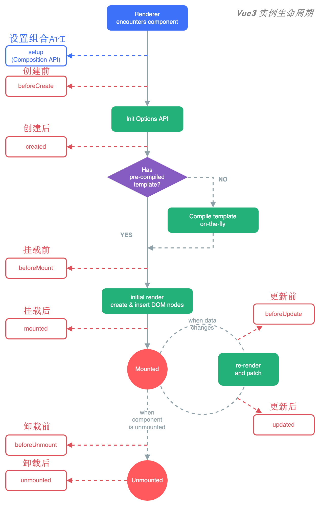</center>


### 🔅生命周期钩子

|  生命周期钩子函数   |                    执行时机                    |                   所属阶段                   |
| :-----------------: | :--------------------------------------------: | :------------------------------------------: |
| **`beforeCreate`**  |          ***实例初始化完成之后调用***          | ***<span style=color:red;>初始阶段</span>*** |
|    **`created`**    |    ***实例处理完所有状态相关的选项后调用***    | ***<span style=color:red;>初始阶段</span>*** |
|  **`beforeMount`**  |            ***实例被挂载之前调用***            | ***<span style=color:red;>挂载阶段</span>*** |
|    **`mounted`**    |            ***实例被挂载之后调用***            | ***<span style=color:red;>挂载阶段</span>*** |
| **`beforeUpated`**  |   ***响应式状态变更而更新其 `DOM`之前调用***   | ***<span style=color:red;>更新阶段</span>*** |
|    **`updated`**    | ***响应式状态变更而更新其 `DOM`完成之后调用*** | ***<span style=color:red;>更新阶段</span>*** |
| **`beforeUnmount`** |            ***实例被卸载之前调用***            | ***<span style=color:red;>卸载阶段</span>*** |
|   **`unmounted`**   |            ***实例被卸载之前调用***            | ***<span style=color:red;>卸载阶段</span>*** |


## 🔧Vue CLI

### 创建项目方式

- ==***基于命令行创建***==

  - ~~~cmd
    vue create 项目名称
    ~~~

- ==***基于可视化面板创建***==

  - ~~~cmd
    vue ui
    ~~~


### 🔷UI创建项目步骤

> ==***<span style=color:red;>UI本质</span>：可视化的面板采集到用户的配置信息后，在后台基于命令行的方式自动初始化项目***==

1. ***创建`Create`***

   + <left>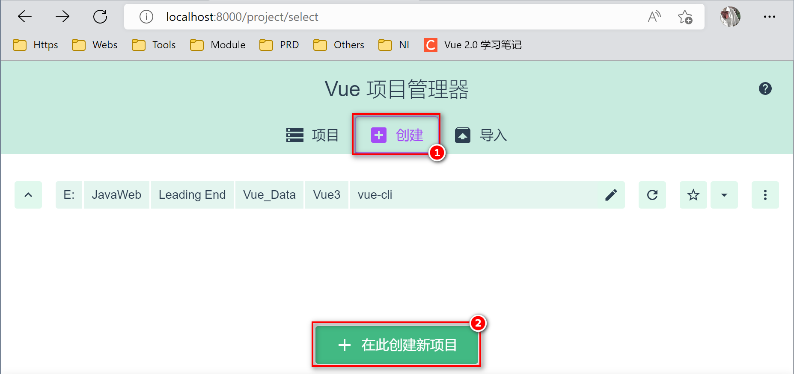</left>

2. ***详请`Details`***

   + <left>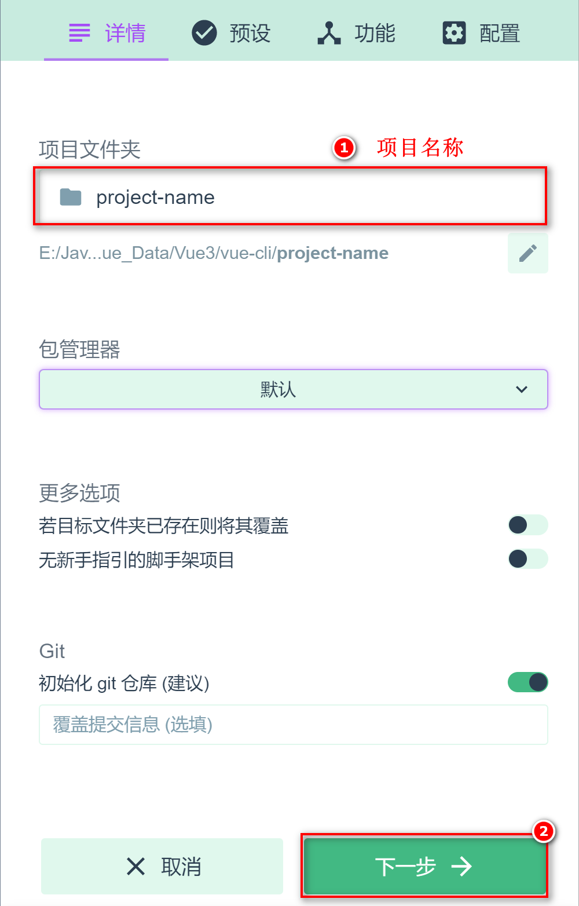</left>

3. ***预设`Presets`***

   + <left>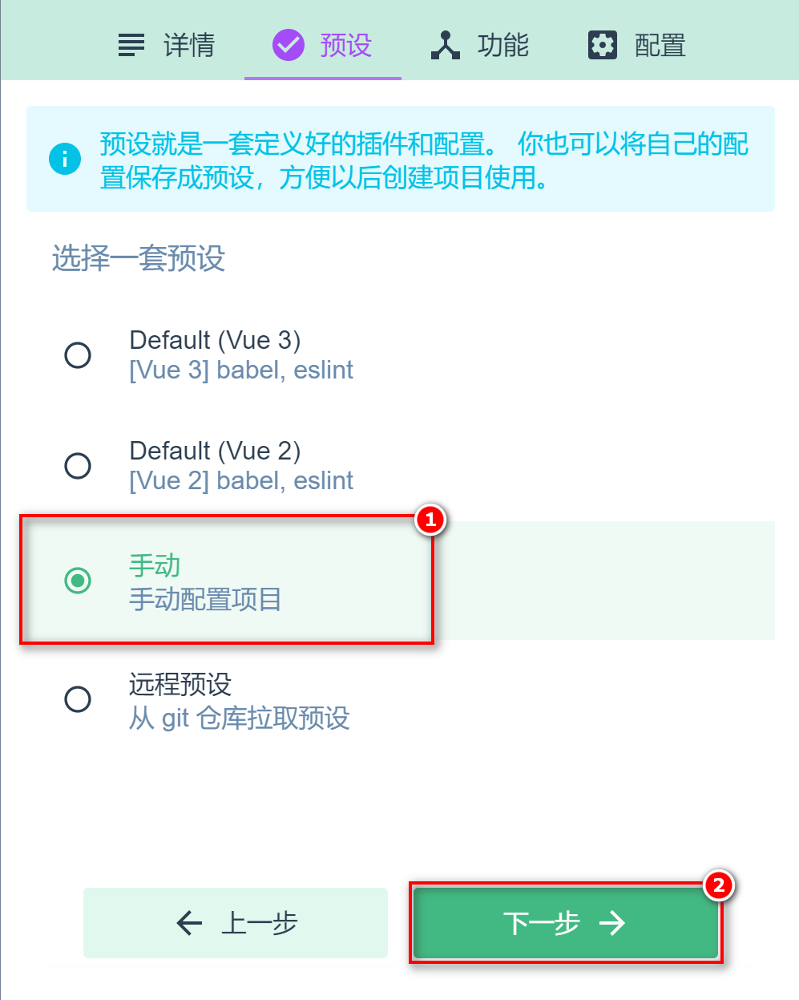</left>

4. ***功能`Features`***

   + <left></left>

5. ***配置`Configuration`***

   + <left>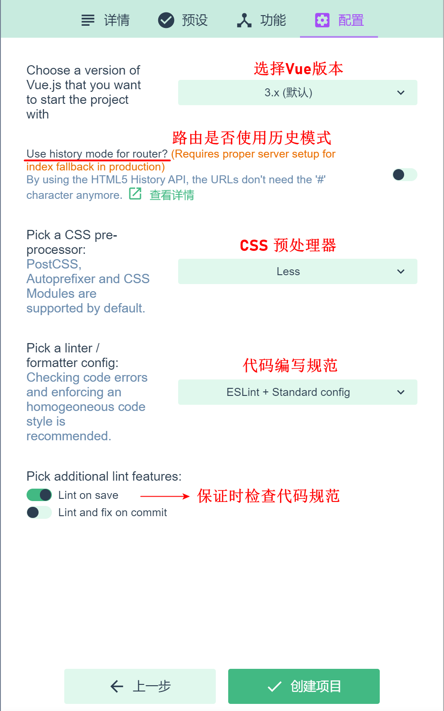</left>

6. ***保证新预设`Save new preset`***

   + <left>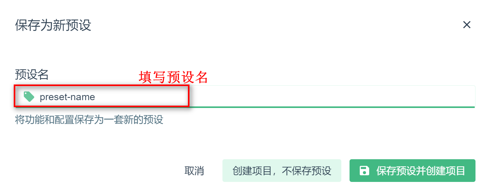</left>

7. ***创建成功，自动进入<span style=color:red;>项目仪表盘</span>***

   + <left>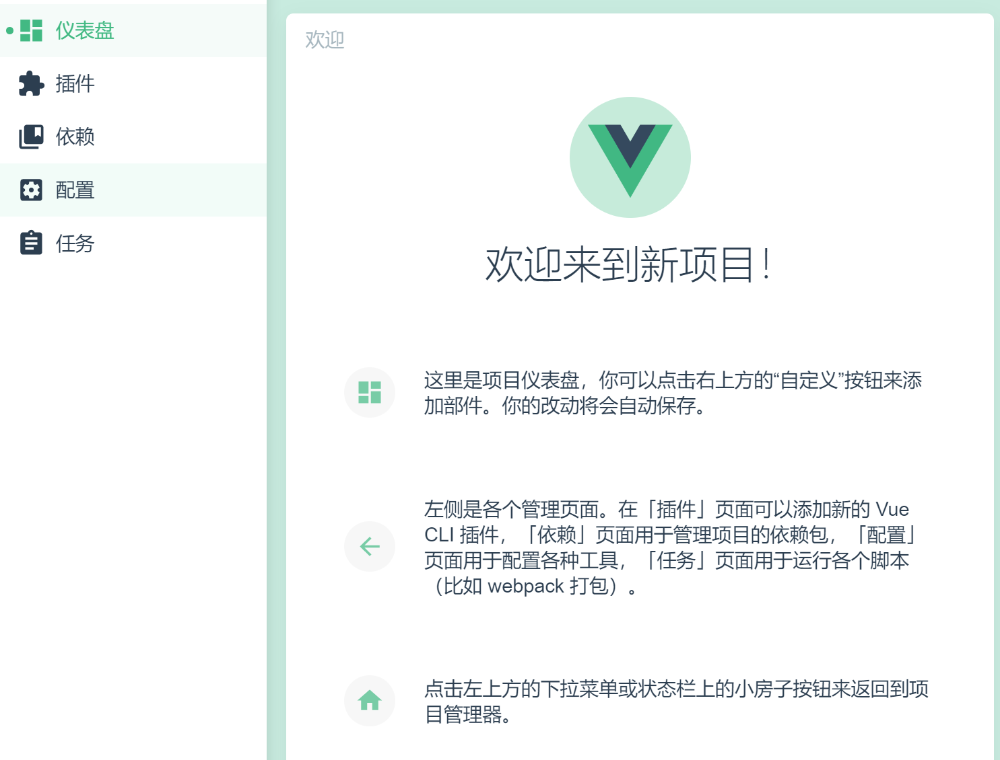</left>


## :zap:Vite

==***[Vite](https://cn.vitejs.dev/)：基于原生`ES`模块 提供了丰富的内建功能，速度快模块热更新，下一代前端开发与构建工具***==

<center></center>


### 🔷创建项目步骤

1. 1️⃣***在需要创建项目的目录终端中输入命令***

   + ~~~cmd
     npm init vite-app 项目的名称
     ~~~

2. 2️⃣***需要安装创建 `vite-app` 是否继续***

   + <left>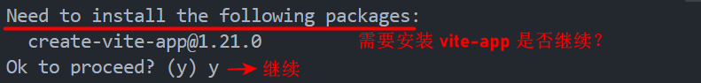</left>

3. 3️⃣***创建项目成功***

   + <left>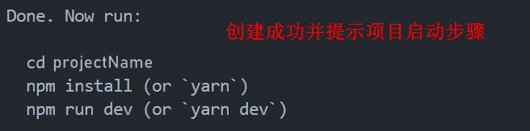</left>


### main.js

~~~js
// 导入 createApp 函数,用于创建 vue 的单页面应用程序
import { createApp } from 'vue'
// 导入 App 根组件
import App from './App.vue'
// 导入全局样式
import './index.css'

/* 创建 SPA 应用的实例,并将App组件传递给createApp函数
createApp(rootComponent, [rootProps])
	rootComponent : 根组件
	rootProps : 要传递给根组件的 props，可选
*/
const app = createApp(App)

// 将其渲染到mount()指定的挂载点
app.mount('#app')
~~~


## 应用实例

### config

> ==***每个应用实例都会暴露一个 `config` 对象，对这个对象的配置设定***==

~~~js
console.log(app.config)
~~~


### globalProperties

> ==***用于注册能够被应用内所有组件实例访问到的全局属性的对象***==

~~~js
app.config.globalProperties.$http = 'axios'
~~~


### use()

> ~~~js
> app.use(Plugin);
> ~~~
>
> ==***安装一个插件***==


### component()

>~~~js
>app.component(componentName[, component]);
>~~~
>
>​        **`componentName`**  ：全局组件的**注册名称**
>
>​        **`component`**  ：需要全局注册的**组件**
>
>==***注册或获取一个全局组件***==

~~~js
// 注册一个选项对象
app.component('my-component', {
    /* ... */
})

// 得到一个已注册的组件
const MyComponent = app.component('my-component')
~~~


### directive()

> ~~~js
> app.directive(directiveName, [definition]);
> ~~~
>
> ​		**`definitionName`**	：全局自定义指令的名称
>
> ​		**`definition`**	：全局自定义指令的配置对象
>
> ==***注册或获取一个全局指令***==

~~~js
// 注册（对象形式的指令）
app.directive('my-directive', {
    /* 自定义指令钩子 */
})

// 注册（函数形式的指令）
app.directive('my-directive', () => {
    /* ... */
})

// 得到一个已注册的指令
const myDirective = app.directive('my-directive')
~~~


### mixin()

> ~~~js
> app.mixin(mixin);
> ~~~
>
> ==***应用一个全局 `mixin`***==


### mount()

> ~~~js
> app.mount(rootContainer)
> ~~~
>
> ​		**`rootContainer`**	：一个实际的 `DOM` 元素或一个 `CSS` 选择器
>
> ==***将应用实例挂载在一个容器元素中***==


### unmount()

> ~~~js
> app.unmount()
> ~~~
>
> ==***卸载一个已挂载的应用实例***==


## 🔩组件

### 组件的运行过程

<center></center>


### template

> ==***`<template>` 是 `vue` 提供的容器标签，只起到包裹性质的作用，它不会被渲染为真正的 `DOM` 元素***==
>
> ###### :grey_exclamation:==***`vue3` 中，`<template>` 中支持定义多个根节点***==

~~~vue
<template>
	<h2>Title</h2>
	<div>Content ...</div>
</template>
~~~


### 注册组件

+ ==***局部注册***==
+ ==***全局注册***==


#### 局部注册

~~~js
// 导入组件
import Test from './components/Test.vue'

export default {
    name: 'App',
    components: { // components 节点中注册局部组件
        Test
    }
}
~~~

~~~vue
<template>
	<!-- 使用局部注册的组件 -->
	<Test/>
</template>
~~~


#### 全局注册

~~~js
/* main.js */
import { createApp } from 'vue'
import App from './App.vue'

// (1)导入组件
import Test from './components/Test.vue'

const app = createApp(App)

// (2)全局注册组件
app.component('ke-test', Test);

app.mount('#app')
~~~

~~~vue
<template>
	<!-- 使用全局注册的组件 -->
	<ke-test/>
</template>
~~~


### name 注册组件名

~~~js
export default {
    name: 'KeTest' // name属性为当前的组件名
}
~~~

~~~js
import Test from './components/Test.vue'

// 使用组件的name 属性注册
app.component(Test.name, Test);
~~~


### emits

> ==***用于声明由组件触发的自定义事件***==

+ ~~~js
  export default {
      emits: ['init'],
      created() {
          this.$emit('init')
      }
  }
  ~~~


### 🔹依赖注入

> ==***父组件相对于其所有的后代组件，会作为<span style=color:red;>依赖提供者</span>，任何后代的组件树，无论层级有多深，都可以<span style=color:red;>注入</span>由父组件提供给整条链路的依赖***==

<center>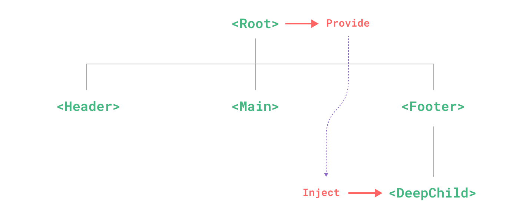</center>


#### Provide (提供)

> ==*要为组件后代提供数据，需要使用到 **`provide`** 选项*==

+ ###### *对象形式*

  + ~~~js
    export default {
        provide: {
            message: 'hello ke!'
        }
    }
    ~~~

+ ###### *函数形式*

  + ~~~js
    export default {
      data() {
          return {
              message: 'hello ke!'
          }
      },
      provide() {
          // 使用函数的形式，可以访问到 this
          return {
              message: this.message
          }
      }
    }
    ~~~


#### Inject (注入)

> ==*要注入上层组件提供的数据，需使用 **`inject`** 选项来声明*==

+ ###### *数组形式*

  + ~~~js
    export default {
        inject: ['message'],
        created() {
            console.log(this.message) // injected value
        }
    }
    ~~~

+ ###### *对象形式*

  + ~~~js
    export default {
        inject: {
            msg: { // msg 本地属性名
                from: 'message', // 注入的来源名
                default: 'default value' // 声明注入的默认值
            }
        }
    }
    ~~~


### 组件上使用 v-model

> ==***同步组件内外的数据***==

+ ==*子组件*==

  + ~~~html
    <button type="button" @click="$emit('update:number',number + 1)">{{ number }}++</button>
    ~~~

  + ~~~js
    export default {
        name: 'Counter',
        props: ['number'],
        emits: ['update:number'] // 格式 update:属性名
    }
    ~~~

+ ==*父组件*==

  + ~~~vue
    <Counter v-model:number='count' />
    ~~~

  + ~~~js
    data() {
        return {
            count: 0
        }
    },
    components: {
        Counter
    }
    ~~~


### 🔄组件之间的数据共享

#### :arrow_down:父向子共享

> ==***父向子共享数据  ：需要使用<span style=color:red;>自定义属性</span>***==

+ ==*父组件*==

  ```html
  <!-- 通过 Prop 向子组件传值 -->
  <Son :msg="message" :user="userinfo"></Son>
  ```

  ```js
  data() {
      return {
          message: "Hello Vue ...",
          userinfo: { username: "linke", age: 19 },
      };
  }
  ```

+ ==*子组件*==

  ```html
  <div>{{ msg }}</div>
  <div>{{ user }}</div>
  ```

  ```js
  export default {
      props: ["msg", "user"],
  };
  ```


#### :arrow_up:子向父共享

> ==***子向父共享数据 ：需要使用<span style=color:red;>自定义事件</span>***==

+ ==*子组件*==

  ~~~html
  <input type="text" v-model="text" @change="changeText"/>
  ~~~

  ~~~js
  emits: ["getText"],
  data() {
      return {
          text: "",
      };
  },
  methods: {
      changeText() {
          this.$emit('getText', this.text);
      },
  }
  ~~~

+ ==*父组件*==

  ~~~vue
  <!-- 传递自定义事件 -->
  <Son @get-text="getText"></Son>
  ~~~

  ~~~js
  data() {
      return {
          textFromSon: "",
      };
  },
  methods: {
      // 自定义事件的处理函数
      getText(val) {
          this.textFromSon = val;
      },
  }
  ~~~

  


#### 🔁父子双向数据同步

> ==***父子双向数据同步：需要使用 `v-model` 指令***==

+ ==*子组件*==

  ~~~html
  <button type="button" @click="add">{{ number }}++</button>
  ~~~

  ~~~js
  name: 'Counter',
  props: ['number'],
  emits: ['update:number'],
  methods: {
      add() {
          this.$emit('update:number', this.number + 1)
      }
  }
  ~~~

+ ==*父组件*==

  ~~~vue
  <!-- 使用子组件 -->
  <Counter v-model:number='count' />
  ~~~

  ~~~js
  data() {
      return {
          count: 0
      }
  },
  components: {
      Counter
  }
  ~~~


#### :twisted_rightwards_arrows:兄弟组件共享

> ==***兄弟组件共享数据  ：使用 `EventBus` 方案***==

<center>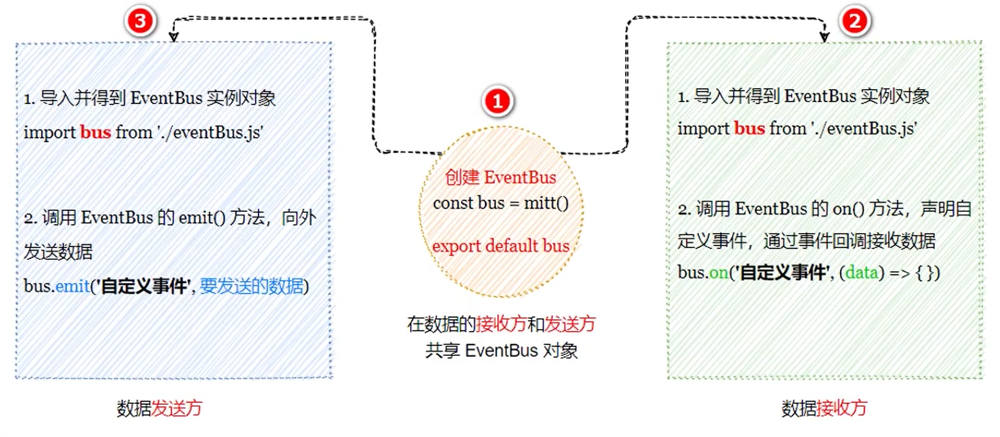</center>

+ ==*创建 `eventBus.js` 模块*==

  + ~~~js
    // 1.安装 mitt 包
    /* npm i mitt */
    
    // 2.导入 mitt 包
    import mitt from 'mitt'
    
    // 3.创建并导出 eventBus 实例对象
    export default mitt()
    ~~~

+ ==***在数据<span style=color:red;>发送方</span>，<span style=color:red;>触发自定义事件</span>***==

  + ~~~js
    import bus from "./eventBus.js";
    
    data() {
        return {
            // 定义发送兄弟组件数据
            text: "",
        };
    },
    watch: {
        text(newVal) {
            // bus.emit('事件名称', 要发送的数据)
            bus.emit("textChange", newVal);
        },
    }
    ~~~

+ ==*在数据<span style=color:red;>接收方</span>，<span style=color:red;>注册一个自定义事件</span>*==

  + ~~~js
    import bus from "./eventBus.js";
    
    data() {
        return {
            // 定义变量接收兄弟组件传递的数据
            textFrom: "",
        };
    },
    created() {
        // 定义自定义数据 bus.$on('事件名称', 事件处理函数)
        bus.on("textChange", (val) => {
            this.textFrom = val;
        });
    }
    ~~~


#### ⏬后代组件共享

>==***后代组件关系数据 ：可以使用 `provide` 和 `inject` 实现后代关系组件之间的数据共享***==

+ ==*父组件*==

  + ~~~js
    data() {
        return {
            count: 0
        }
    },
    provide() { // provide 函数返回的对象中定义需要向子孙组件共享的数据
        return {
    		num: computed(() => this.count), // 使用 computed 函数将数据包装为响应式数据
            msg: 'info ..' // 默认情况下共享的数据不是响应式的
        }
    }
    ~~~

+ ==*后代组件*==

  + ~~~js
    /* 在 inject 中声明需要接收的数据
    	(1)num 数据是响应式的，在使用时必须使用 ".value" 获取数据值
    	(2)可配置以下让 computed 函数不再自动解包,不需要 ".value" 以获取 computed 计算后的值
    	    app.config.unwrapInjectedRef = true
    */
    inject: ['num', 'msg'],
    ~~~

    ~~~html
    num={{num.value}},msg={{msg}}
    
    <!-- 渲染结果 -->
    num=0,msg=info ...
    ~~~


## 💠自定义指令

+ ###### *<span style=color:red;>局部</span>自定义指令*

+ ###### *<span style=color:red;>全局</span>自定义指令*


### 局部自定义指令

>==***在 `directives` 节点之中定义局部自定义指令***==

```js
export default {
    directives: { // 局部自定义指令的节点
        focus: { // 定义名为 focus 的指令,指向配置对象
            mounted: function (el) { // 当被绑定的元素插入到 DOM 中时
                el.focus(); // 聚焦元素
            },
        },
	},
};
```

```vue
<!-- 使用(需要加上 v- 前缀) -->
<input v-focus />
```


### 全局自定义指令

> ~~~js
> app.directive(name, [directive])
> ~~~
>
> ​		**`name`**：全局自定义指令名
>
> ​		**`directive`**：全局自定义指令的配置对象
>
> ==***注册或获取全局指令***==

~~~js
const app = createApp({})

app.directive('focus', {
    // 当被绑定的元素插入到 DOM 中时
    mounted: function (el) {
        el.focus()
    },
});
~~~


### 钩子函数

==***一个指令定义对象可以提供如下几个钩子函数 <span style=color:red;>(均为可选)</span>***==

:grey_exclamation:==***钩子函数中的 `this` 均指向 `window`***==

+ `created`：只调用一次，指令第一次绑定到元素时调用
+ `beforeMount`：在元素被插入到 `DOM` 前调用
+ `mounted`：被绑定元素插入父节点时调用
+ `beforeUpdate`：所在组件的更新之前调用
+ `updated`：所在组件的更新之后调用
+ `beforeUnmount`：绑定元素的父组件卸载前调用
+ `unmounted`：只调用一次，指令与元素解绑时调用


### 钩子函数参数

==***指令钩子函数会被传入以下参数***==

+ `el`：指令绑定到的元素
+ `binding`：一个对象，包含以下属性
  + `value`：传递给指令的值
  + `oldValue`：之前的值
  + `arg`：传递给指令的参数
  + `modifiers`：一个包含修饰符的对象
  + `instance`：使用该指令的组件实例
  + `dir`：指令的定义对象
+ `vnode`：代表绑定元素的底层


### 函数简写

==***仅仅需要在 `mounted` 和 `updated` 上实现相同的行为***==

~~~js
app.directive('color', (el, binding) => {
    // 这会在 `mounted` 和 `updated` 时都调用
    // ...
});
~~~


## 🚩路由

### 安装

~~~cmd
npm i vue-router@next	# vue3对应版本
~~~


### 基本使用

1. ***创建路由模块 `src/router/index.js`***

   + ~~~js
     /* 导入 createRouter, createWebHashHistory 方法
         createRouter 用于创建路由实例对象
         createWebHashHistory 用于指定路由的工作模式(hash模式)
      */
     import { createRouter, createWebHashHistory } from 'vue-router'
     
     // 导入路由组件
     import Header from '@/components/Header.vue'
     import Main from '@/components/Main.vue'
     import Footer from '@/components/Footer.vue'
     
     // 创建路由对象,并配置路由匹配规则
     const router = createRouter({
         history: createWebHashHistory(), // 指定路由的工作模式
         routes: [ // 定义 "hash地址" 与 "组件" 之间的对应关系
             // path 表示匹配的 hash 地址, component 表示对应的路由组件
             { path: '/header', component: Header },
             { path: '/main', component: Main },
             { path: '/footer', component: Footer }
         ]
     })
     
     // 导出对象
     export default router
     ~~~

2. ***导入并挂载路由模块 `src/main.js`***

   + ~~~js
     import { createApp } from 'vue'
     import App from './App.vue'
     // 导入路由模块
     import router from './router'
     
     const app = createApp(App)
     
     // 挂载路由模块
     app.use(router)
     
     app.mount('#app')
     ~~~

3. ***声明路由链接和占位符***

   + ~~~vue
     <!-- 1.定义路由链接 -->
     <router-link to="/header">header</router-link>
     <router-link to="/main">main</router-link>
     <router-link to="/footer">footer</router-link>
     
     <!-- 2.定义路由占位符 -->
     <router-view></router-view>
     ~~~


### 路由高亮

1. ==***默认高亮 `class` 类***==
2. ==***自定义高亮 `class` 类***==


#### 默认高亮

> ==***被激活的路由链接，默认会应用一个叫做 `router-link-active` 的类名***==
>
> ==***路由链接被精准激活时，默认会应用一个叫做 `router-link-exact-active` 的类名***==

~~~css
/* 
方式(1): 在 index.css 全局样式表中设置全局样式
方式(2): 在当前文件中设置局部样式
*/
.router-link-active {
    color: #42b983;
}

/* 用于精准激活的路由链接(<a>) */
.router-link-exact-active {
    // CSS ...
}
~~~


#### 自定义高亮

> ==***`linkActiveClass` ：用于激活的路由的默类，默认 `router-link-active`***==
>
> ==***`linkExactActiveClass` ：用于精准激活的路由的默认类，默认 `router-link-exact-active`***==

~~~js
const router = VueRouter.createRouter({
    history: VueRouter.createWebHashHistory(),
    linkActiveClass: 'router-active', // 方式(1)指定被激活的路由会全局应用该类名
    routes,
})
~~~

~~~vue
<!-- 通过路由链接的 active-class 属性局部应用类名 -->
<router-link active-class="footer" to="/footer">footer</router-link>
~~~


### :stop_sign:导航守卫

~~~js
const router = createRouter({ ... })

// 注册一个全局前置守卫
router.beforeEach((to, from) => {
    // ...
    // 返回 false 以取消导航
    return false

    // 返回 一个路由字符串
    /* return to.path === '/header' ? next() : '/header' */

    // 返回 一个路由对象
    /* return to.path === '/main' ? next() : { path: '/main' } */
    
    // 如果什么都没有 undefined 或返回 true，则导航是有效的
})
~~~


#### 可选的第三个参数 next

~~~js
router.beforeEach((to, from, next) => {
    next() // 导航放行
    // 其他参考 vue2 中导航守卫
}
~~~


## 📚Composition API

==***组合式 `API`***==


### 📙setup()

> ==***`setup()` 钩子是在组件中使用组合式 `API` 的入口***==
>
> :grey_exclamation:==***在 `setup()` 函数中返回的对象会暴露给模板和组件实例***==
>
> :grey_exclamation:==***也可以通过组件实例来获取 `setup()` 暴露的属性***==
>
> ❗==***`setup` 钩子在 `beforeCreate` 之前执行***==

~~~js
export default {
    setup() {
        const count = 0
        // 返回值会暴露给模板和其他的选项式 API 钩子
        return {
            count
        }
    },
    mounted() {
        console.log(this.count) // 0
    }
}
~~~


#### 返回渲染函数

> ==***`setup` 也可以返回一个<span style=color:red;>渲染函数</span>，自定义渲染内容***==

~~~js
// 引入渲染函数
import { h } from 'vue'

export default {
    setup() {
        return () => h('div', 'value')
    }
}
~~~


#### Props

> ==***`setup` 函数的第一个参数是组件的 `props`，`setup` 函数的 `props` 是响应式的***==
>
> :grey_exclamation:==***如果解构了 `props` 对象，解构出的变量将会丢失响应性***==

~~~js
export default {
    props: {
        title: String
    },
    setup(props) {
        console.log(props.title)
    }
}
~~~


#### 上下文

> ==***`setup` 函数的第二个参数是一个 `Setup 上下文`对象***==

~~~js
export default {
    setup(props, context) { // 该上下文对象是非响应式的，可以安全地解构
        // 透传 Attributes（非响应式的对象，等价于 $attrs）
        console.log(context.attrs)
        
        // 插槽（非响应式的对象，等价于 $slots）
        console.log(context.slots)
        
        // 触发事件（函数，等价于 $emit）
        console.log(context.emit)
          
        // 暴露公共属性（函数）
        console.log(context.expose)
    }
}
~~~


#### ❕❕注意

+ ❕==***`data, methods, ...` 中可以访问到 `setup` 中的属性，方式***==
+ ❕==***`setup` 中不能访问到 `data, methods, ...` 的数据***==
+ ❕==***如果存在重名，`setup` 数据优先级高***==
+ ❕==***`setup` 函数不能被 `async` 修饰***==


### 📘ref()

> ~~~js
> // 引入 ref 函数
> import { ref } from 'vue'
> 
> ref(vlaue|Object);
> ~~~
>
> ==***接受一个内部值，返回一个响应式的、可更改的 `ref` 对象，需要使用 `.value`获取属性值***==
>
> :grey_exclamation:==***在 `template` 中使用无需 `.value`***==
>
> + ==***基本类型**的数据：响应式依旧依赖 `Object.defineProperty()`的 `set/get`完成*==
> + ==***对象类型**的数据：在内部调用 `Vue3`的 `reactive`新函数*==

~~~html
<h2>count={{ count }}</h2>
<button @click="count++">count++</button>
<button @click="addCount">count+2</button>
~~~

~~~js
setup() {
    let count = ref(0) // 创建响应式的对象
    console.log(count) // RefImpl{__v_isShallow, dep, __v_isRef, _rawValue, _value}
    
   	function addCount() {
		count.value += 2 // 通过 .value 赋予新的值
    } 
    
    return {
        count,
        addCount
    }
}
~~~


### 📔reactive()

> ~~~js
> // 导入 reactive 函数
> import { reactive } from 'vue'
> 
> reactive(Object);
> ~~~
>
> ==***返回一个对象的响应式代理 `(Proxy)`，会影响到所有嵌套的属性保持响应性***==
>
> :grey_exclamation:==***内部基于 `ES6` 的 `Proxy`实现，通过代理对象操作源对象内部数据***==

~~~html
<h2>obj={{ obj }}</h2>
<button @click="obj.status++">obj-status++</button>
<button @click="updObj">updateObj</button>
~~~

~~~js
setup(props, context) {
    let obj = reactive({
        type: 'success',
        status: 0
    })
    console.log(obj) // Proxy{type, status}
   
    function updObj() {
        obj.status++
    }

    return {
        obj,
        updObj
    }
}
~~~


### 📓computed ()

> ~~~js
> // 导入 computed 函数
> import { computed } from 'vue'
> 
> computed(Function|Object);
> ~~~
>
> ==***接受一个 `getter` 函数，返回一个只读的响应式 `ref` 对象；也可以接受一个带有 `get` 和 `set` 函数的对象来创建一个可写的 `ref` 对象***==

+ ==*函数形式*==

  ~~~js
  const count = ref(1)
  const plusOne = computed(() => count.value + 1)
  
  plusOne.value // 2
  ~~~

+ ==*对象形式*==

  ~~~js
  const count = ref(1)
  const plusOne = computed({
  	get: () => count.value + 1,
      set: (val) => {
          count.value = val - 1
      }
  })
  
  plusOne.value = 1
  count.value // 0
  ~~~


### 📗watch()

> ~~~js
> // 导入 wattc 函数
> import { watch } from 'vue'
> 
> watch(source, callback[, config]);
> ~~~
>
> ==***侦听一个或多个响应式数据源，并在数据源变化时调用所给的回调函数***==
>
> + **`source` ：侦听器的的数据**
>   + 一个函数，返回一个值
>   + 一个 `ref`
>   + 一个响应式对象
>   + 由以上类型的值组成的数组
> + **`callback` ：侦听的数据在发生变化时要调用的回调函数，函数接受二个参数`(新值、旧值)`**
> + **`config` ：配置对象，<span style=color:red;>可选</span>**
>   + **`immediate`**：在侦听器创建时立即触发回调
>   + **`deep`**：如果源是对象，深度监听所有嵌套的属性
>   + **`flush`**：调整回调函数的刷新时机，`post/sync`
>     + `post` 将会使侦听器延迟到组件渲染之后再执行
>     + `sync` 在响应式依赖发生改变时立即触发侦听器
>
> :grey_exclamation:==***当直接侦听一个响应式对象时，侦听器会自动启用深层模式***==

~~~js
setup() {
    let count = ref(0)
    let obj = reactive({
        type: 'success',
        status: 0,
        data: {
            username: 'linke'
        }
    })
    
    // 侦听一个 ref
    watch(count, (newVal, oldVal) => {
        console.log(newVal, oldVal) // 新值, 旧值
    })
    
    // 侦听多个
    watch([count, obj], (newVal, oldVal) => {
        console.log(newVal, oldVal) // [...], [...]
    })
    
    // 侦听一个 getter 函数
	watch(() => obj.status, (newVal, oldVal) => {
		// ...
    })
    
   	// 配置对象
    watch(count, (newVal, oldVal) => {
		// ...
    }, { immediate: true })
    
    /*
    直接监听 reactive 所定义的响应式数据
    	*无法获取正确的旧值*
        *强制开启深层监听,deep配置无效*
     */
    watch(obj, (newVal, oldVal) => {
		// ...
    }, { deep: false }) // 此处配置无效
    
    // 监听 reactive 定义的对象中的属性为对象时, deep配置才有效
    watch(() => obj.data, (newVal, oldVal) => {
        // ...
    }, { deep: true })
}
~~~


### 📒watchEffect()

> ~~~js
> // 导入 watchEffect 函数
> import { watchEffect } from 'vue'
> 
>  watchEffect(Function);
> ~~~
>
> ==***立即运行一个函数，同时响应式地追踪其依赖，并在依赖更改时重新执行***===

~~~js
const count = ref(0)

watchEffect(() => console.log(count.value))
// -> 输出 0

count.value++
// -> 输出 1
~~~


### 📖readonly()

> ~~~js
> // 导入 readonly 函数
> import { readonly } from 'vue'
> 
> readonly(person)
> ~~~
>
> ###### ==***接受一个对象，返回一个原值的只读代理***==

~~~js
const original = reactive({ count: 0 })

const copy = readonly(original)

watchEffect(() => {
    // 用来做响应性追踪
    console.log(copy.count)
})

// 更改源属性会触发其依赖的侦听器
original.count++

// 更改该只读副本将会失败，并会得到一个警告
copy.count++ // warning!
~~~


### ✨生命周期钩子

|    Composition API    |                  调用时机                  |
| :-------------------: | :----------------------------------------: |
|  **`onBeforeMount`**  |           **在挂载开始之前调用**           |
|    **`onMounted`**    |            **在挂载组件时调用**            |
| **`onBeforeUpdate`**  | **在响应性数据更改时以及重新渲染之前调用** |
|    **`onUpdated`**    |             **重新渲染后调用**             |
| **`onBeforeUnmount`** |           **在卸载实例之前调用**           |
|   **`onUnmounted`**   |            **在卸载销毁后调用**            |
|   **`onActivated`**   |     **激活 `keep-alive` 的组件时调用**     |
|  **`onDeactivated`**  |     **停用 `keep-alive` 的组件时调用**     |
| **`onErrorCaptured`** |         **从子组件捕获错误时调用**         |

~~~vue
<template>
	<div ref="el"></div>
</template>

<script setup>
import { ref, onMounted } from 'vue'

// 使用组合式 API, 引用将存储在与名字匹配的 ref 里
const el = ref()

onMounted(() => {
    el.value // <div>
})
</script>
~~~


### 🍴工具函数

+ ==***isRef***==

  + > ~~~js
    > import { isRef } from 'vue'
    > 
    > isRef(preson)
    > ~~~
    >
    > ***检查某个值是否为 `ref`***

+ ==***unref***==

  + > ~~~js
    > import { unref } from 'vue'
    > 
    > unref(preson)
    > ~~~
    >
    > ***如果参数是 `ref`，则返回内部值，否则返回参数本身***

+ ==***toRef***==

  + > ~~~js
    > import { toRef } from 'vue'
    > 
    > toRef(preson, prop)
    > ~~~
    >
    > ***基于响应式对象上的一个属性，创建一个对应的 `ref`***
    >
    > ==***创建的 `ref` 与其源属性保持同步：改变源属性的值将更新 `ref` 的值，反之亦然***==

    ~~~js
    const state = reactive({
        foo: 1,
        bar: 2
    })
    
    const fooRef = toRef(state, 'foo')
    
    // 更改该 ref 会更新源属性
    fooRef.value++
    console.log(state.foo) // 2
    
    // 更改源属性也会更新该 ref
    state.foo++
    console.log(fooRef.value) // 3
    ~~~

+ ==***toRefs***==

  + > ~~~js
    > import { toRefs } from 'vue'
    > 
    > toRefs(preson)
    > ~~~
    >
    > ==***将一个响应式对象转换为一个普通对象，这个普通对象的每个属性都是指向源对象相应属性的 `ref`***==

    ~~~js
    const state = reactive({
      foo: 1,
      bar: 2
    })
    
    const stateAsRefs = toRefs(state)
    
    state.foo++
    console.log(stateAsRefs.foo.value) // 2
    
    stateAsRefs.foo.value++
    console.log(state.foo) // 3
    
    // 可以解构而不会失去响应性
    let { foo, bar} = stateAsRefs
    foo.value++
    console.log(state.foo) // 4
    ~~~

+ ==***shallowRef / shallowReactive***==

  + > ~~~js
    > import { shallowRef, shallowReactive } from 'vue'
    > 
    > shallowRef(person)
    > shallowReactive(person)
    > ~~~
    >
    > ***是`ref()`与 `reactive()` 的浅层作用形式***
    >
    > + ==*不改变响应式对象中的属性，只生成新的对象替换，可使用 `shallowRef`*==
    > + ==*只改变响应式对象的顶层数据变化，可使用 `shallowReactive`*==

+ ==***shallowReadonly***==

  + > ~~~js
    > import { shallowReadonly } from 'vue'
    > 
    > shallowReadonly(person)
    > ~~~
    >
    > ***`readonly()` 的浅层作用形式***

+ ==***toRaw***==

  + > ~~~js
    > import { toRaw } from 'vue'
    > 
    > toRaw(person)
    > ~~~
    >
    > ***根据一个 `Vue` 创建的代理返回其原始对象***

    ~~~js
    const foo = {}
    const reactiveFoo = reactive(foo)
    
    toRaw(reactiveFoo) === foo // true
    ~~~

+ ==***markRaw***==

  + > ~~~js
    > import { markRaw } from 'vue'
    > 
    > markRaw(person)
    > ~~~
    >
    > ***将一个对象标记为不可被转为代理，返回该对象本身***

    ~~~js
    const foo = markRaw({})
    isReactive(reactive(foo)) // false
    
    // 也适用于嵌套在其他响应性对象
    const bar = reactive({ foo })
    isReactive(bar.foo) // false
    ~~~

+ ==***customRef***==

  + > ==***创建一个自定义的 `ref`，显式声明对其依赖追踪和更新触发的控制方式***==

    ~~~vue
    <template>
    	<input v-model="text">
    	<h2>{{ text }}</h2>
    </template>
    
    <script setup>
    import { customRef } from 'vue'
    
    // 定义自定义防抖 ref
    function useDebouncedRef(value, delay = 1500) {
        let timeout
        return customRef((track, trigger) => {
            return {
                get() {
                    track() // 追踪数据的变化
                    return value
                },
                set(newValue) {
                    clearTimeout(timeout)
                    timeout = setTimeout(() => {
                        value = newValue
                        trigger() // 触发重新解析模块
                    }, delay)
                }
            }
        })
    }
    
    // 使用自定义 ref
    let text = useDebouncedRef(1)
    </script>
    ~~~


### 🔷provide 与 inject

<center></center>

#### provide()

> ~~~js
> import { provide } from 'vue'
> 
> provide(key, value);
> ~~~
>
> ​		`key`：注入的 `key`
>
> ​		`value`：注入的值

~~~vue
<script setup>
import { ref, provide } from 'vue'

// 提供静态值
provide('foo', 'bar')

// 提供响应式的值
const count = ref(0)
provide('count', count)
</script>
~~~


#### inject()

> ~~~js
> import { inject } from 'vue'
> 
> inject(key[, defaultValue]);
> ~~~
>
> ​		`key`	：注入的 `key`
>
> ​		`defaultValue`	：默认值
>
> ==*`Vue` 会遍历父组件链，通过匹配 `key` 来确定所提供的值，如果父组件链上多个组件对同一个 `key` 提供了值，那么采用就近原则，如果没有能通过 `key` 匹配到值，`inject()` 将返回 `undefined`，除非提供了一个默认值*==

~~~vue
<script setup>
import { inject } from 'vue'

// 注入值的默认方式
const foo = inject('foo')

// 注入响应式的值
const count = inject('count')

// 注入一个值，若为空则使用提供的默认值
const bar = inject('foo', 'default value')

// 注入时为了表明提供的默认值是个函数，需要传入第三个参数
const fn = inject('function', () => {}, false)
</script>
~~~


## 🟣hook函数

> ==***`hook` 本质上是一个函数，把 `setup` 函数中使用的 `Composition API` 进行封装***==

+ ==*创建 `src/hooks/useIndex.js`*==

  ~~~js
  import { onMounted } from 'vue'
  
  export default function userIndex() {
      onMounted(() => {
          console.log('use index ...')
      })
  }
  ~~~

+ ==*使用*==

  ~~~vue
  <script setup>
  // 引入 useIndex.js    
  import useIndex from '@/hooks/useIndex.js'
  
  useIndex() // use index ...
      
  // ...
  </script>
  ~~~

  


## 🧩组件

### Fragment

> *在 `vue3` 中，如果组件中有多个根元素节点，那么编译时 `vue` 会在这些元素节点上包含在一个 `<Fragment>` 标签中*


### Teleport

> *将一个组件内部的一部分模板内容渲染到 `DOM` 中的另一个位置*
>
> + `to` ：指定传送的目标，`CSS选择器/DOM元素`
> + `disabled` ：是否禁用 `Teleport`

~~~vue
<button @click="open = true">Open Modal</button>

<Teleport to="body">
    <div v-if="open" class="modal">
        <p>Hello from the modal!</p>
        <button @click="open = false">Close</button>
    </div>
</Teleport>
~~~

~~~vue
<script setup>
import { ref } from 'vue'

const open = ref(false)
</script>
~~~


### Suspense

> ###### ==*异步依赖*==
>
> ==***`<Suspense>` 组件有两个插槽：`#default` 和 `#fallback`，两个插槽都只允许一个直接子节点***==

~~~vue
<Suspense>
    <!-- 具有深层异步依赖的组件 -->
    <Dashboard />

    <!-- 在 #fallback 插槽中显示 “正在加载中” -->
    <template #fallback>
		Loading...
    </template>
</Suspense>
~~~


### Transition

> ==***过渡动画组件***==

~~~vue
<button @click="show = !show">Toggle</button>
<Transition>
    <p v-if="show">hello</p>
</Transition>
~~~

~~~css
/* 进入与离开的动画生效状态 */
.v-enter-active,
.v-leave-active {
    transition: opacity 0.5s ease;
}

/* 进入动画的起始状态 与 离开的动画的结束状态 */
.v-enter-from,
.v-leave-to {
    opacity: 0;
}
~~~


### CSS 过渡 class

<center>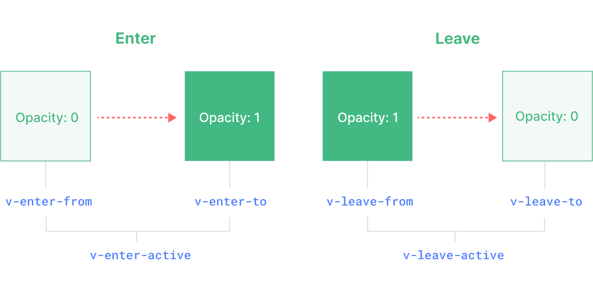</center>

+ `v-enter-from`：**进入**动画的**起始**状态
+ `v-enter-active`：**进入**动画的**生效**状态
+ `v-enter-to`：**进入**动画的**结束**状态
+ `v-leave-from`：**离开**动画的**起始**状态
+ `v-leave-active`：**离开**动画的**生效**状态
+ `v-leave-to`：**离开**动画的**结束**状态


## 🥕script-setup

> ~~~vue
> <script setup>
> 	console.log('hello script setup')
> </script>
> ~~~
>
> ==***需要在 `<script>` 代码块上添加 `setup`属性，里面的代码会被编译成组件 `setup()` 函数的内容，同时顶层的绑定会被暴露给模板***==

~~~vue
<template>
	<button @click="log">{{ msg }}</button>
</template>

<script setup>
// 变量
const msg = 'Hello!'

// 函数
function log() {
    console.log(msg)
}
</script>
~~~


### 响应式

> ==***响应式状态需要明确使用 `响应式 API`来创建***==

~~~vue
<template>
	<button @click="count++">{{ count }}</button>
</template>

<script setup>
import { ref } from 'vue'

const count = ref(0)
</script>
~~~


### 顶层 await

> ==***`<script setup>` 中可以使用顶层 `await`***==

~~~vue
<script setup>
	const post = await fetch(`/api/post`).then((res) => res.json())
</script>
~~~


### defineProps() 和 defineEmits()

> ==***可以使用 `defineProps` 和 `defineEmits` API 来获得 `props` 和 `emits` ，它们将自动地在 `<script setup>` 中可用***==
>
> :grey_exclamation:==***`defineProps` 接收与 `props` 选项相同的值，`defineEmits` 接收与 `emits` 选项相同的值***==

~~~vue
<script setup>
// props
const props = defineProps({
    name: String
})

// emit
const emit = defineEmits(['change', 'delete'])
</script>
~~~


### useSlots() 和 useAttrs()

> ==***`useSlots` 和 `useAttrs` 返回与 `setupContext.slots` 和 `setupContext.attrs` 等价，同样也能在普通的`组合式 API` 中使用***==

~~~vue
<script setup>
import { useSlots, useAttrs } from 'vue'

const slots = useSlots() // 等价 context.slots
const attrs = useAttrs() // 等价 context.attrs
</script>
~~~


## 🍬响应性语法糖

==***响应性语法糖目前默认是关闭状态，需要你显式选择启用***==

### 启用

+ ==***Vite***==

  + ~~~js
    // vite.config.js
    export default {
        plugins: [
            vue({
                reactivityTransform: true
            })
        ]
    }
    ~~~

+ ==***vue-cli***==

  + ~~~js
    // vue.config.js
    module.exports = {
        chainWebpack: (config) => {
            config.module
                .rule('vue')
                .use('vue-loader')
                .tap((options) => {
                return {
                    ...options,
                    reactivityTransform: true
                }
            })
        }
    }
    ~~~


### 宏函数

> ==***宏函数都是全局可用的、无需手动导入，不是一个真实的、在运行时会调用的方法。而是用作 `Vue` 编译器的标记***==

|       API        |       宏函数       |
| :--------------: | :----------------: |
|    **`ref`**     |     **`$ref`**     |
|  **`computed`**  |  **`$computed`**   |
| **`shallowRef`** | **`$shallowRef`**` |
| **`customRef`**  | **`$customRef`**`  |
|   **`toRef`**    |    **`toRef`**     |

~~~vue
<template>
	<button @click="increment">{{ count }}</button>
</template>

<script setup>
let count = $ref(0)

console.log(count) // -> 0

function increment() {
    count++
}
</script>
~~~


### 🎐$() 宏

~~~js
$(...)
~~~

#### 解构

> ==***可用于解构在响应式对象***==

~~~js
const position = reactive({
    z: 1,
    y: 2
})

// 解构而不会失去响应性
const { x, y } = $(position)
~~~


#### 将 ref 转换为响应式对象

~~~js
let countRef = ref(0)

let count = $(countRef)
~~~


#### 作为函数返回值

~~~js
function useMouse() {
    let x = $ref(0)
    let y = $ref(0)

    // 将响应式变量直接放在返回值表达式中会丢失掉响应性
    // 使用以下方式后起效
    return $$({
        x,
        y
    })
}
~~~


## :snowflake:Vuex

==***[Vuex](https://vuex.vuejs.org/zh/) 是一个专为 `Vue` 应用程序开发的<span style=color:red;>状态管理模式 + 库</span>***==


### 安装

~~~cmd
npm i vuex@3 	# vue2对应版本
npm i vuex		# vue3对应版本
~~~


### 🔅工作原理

<center></center>


### 基本使用

+ ###### ***v2***

  ```js
  /* src/store/index.js */
  
  import Vue from 'vue'
  // 引入 vuex
  import Vuex from 'vuex'
  
  // 安装
  Vue.use(Vuex)
  
  // 创建一个 store,并暴露 store对象(必须在use方法之后创建store)
  export default new Vuex.Store({
      state: { // state 对象用于存储数据
          // ...
      },
      actions: { // actions 对象用于响应组件中的动作
          // ...
      },
      mutations: { // mutations 用于操作 state对象的数据
          // ...
      },
      getters: { // getters 用于定义 store 的计算属性
          // ...
      }
  })
  ```

  ~~~js
  /* src/main.js */
  
  import Vue from 'vue'
  // 导入 store
  import store from '@/store'
  
  new Vue({
      store, // 配置 store
  }).$mount('#app')
  ~~~

+ ###### ***v3***

  ~~~js
  import { createApp } from 'vue'
  // 引入 createStore
  import { createStore } from 'vuex'
  
  // 创建一个新的 store 实例
  const store = createStore({
      state () {
          return {
              // ...
          }
      },
      actions: {
          // ...
      },
      mutations: {
          // ...
      },
      getters: {
          // ...
      }
  })
  
  const app = createApp({ /* 根组件 */ })
  
  // 将 store 实例作为插件安装
  app.use(store)
  ~~~
  
  


### State

> ==***`store` 实例的数据源***==

~~~js
new Vuex.Store({
    state: {
        count: 0
    }
})
~~~

```js
const Counter = {
    template: `<div>{{ count }}</div>`,
    computed: {
        count () {
            return store.state.count // 获取 state 中的数据
        }
    }
}
```


#### mapState

> ***`mapState` 辅助函数***

~~~js
// 导入 mapState 辅助函数
import { mapState } from 'vuex'

export default {
	// ...
    computed: mapState({ // 方式(1)对象形式
    // 箭头函数
    count: state => state.count,

    // 传字符串参数, 等同于 state => state.count
    countAlias: 'count',

    // 为了能够使用 this 获取局部状态，必须使用常规函数
    countPlusLocalState(state) {
        return state.count + this.localCount
    }
}
~~~

> ==***当映射的计算属性的名称与 `state` 的子节点名称相同时，可以给 `mapState` 传一个字符串数组***==

~~~js
computed: mapState([ // 方式(2)数组形式
    // 映射 this.count 为 store.state.count
    'count'
]) 
~~~

> ==***对象展开运算符***==

~~~js
computed: {
    localComputed () { /* ... */ },
    // 使用对象展开运算符将此对象混入到外部对象中
    ...mapState({
        // ...
    })
}
~~~


### Mutations

> ***更改 `Vuex` 的 `store` 中的状态的唯一方法是提交 `mutation`***
>
> :grey_exclamation:***每个 `mutation` 都有一个字符串的<span style=color:red;>事件类型 `(type)`</span>和一个<span style=color:red;>回调函数 `(handler)`</span>***

~~~js
const store = new Vuex.Store({
    state: {
        count: 0
    },
    mutations: {
        increment (state, value) { // 第一个参数为 state
            console.log(state, value); // {count, …}, 1
            state.count++ // 变更状态
        }
    }
})
~~~

~~~js
/* 触发
commit(type, [arg])
	type : 事件名
    arg : 可选参数
*/
created() {
    this.$store.commit('increment', 1);
}
~~~


#### mapMutations

> ***`mapMutations` 辅助函数，在组件中提交 `Mutation`***

~~~js
// 导入 mapMutations 辅助函数
import { mapMutations } from 'vuex'

export default {
    // ...
    methods: {
        ...mapMutations([ // 数组形式
            'increment', // 将 this.increment() 映射为 this.$store.commit('increment')
            // ...
        ]),
	    ...mapMutations({ // 对象形式
            add: 'increment', // 将 this.add() 映射为 this.$store.commit('increment')
            // ...
        })
    }
}
~~~


### Actions

> ==***`Action` 类似于 `mutation`，不同在 `Action` 提交的是 `mutation`，而不是直接变更状态***==
>
> :grey_exclamation:==***`Action` 函数接受一个与 `store` 实例具有相同方法和属性的 `context` 对象***==

~~~js
const store = new Vuex.Store({
    state: {
        count: 0
    },
    mutations: {
        increment (state, value) {
            console.log(state, value); // {count, …}, 1
            state.count++
        }
    },
    actions: {
        increment (context) { // 第一个参数为 上下文对象(context),可使用 ES6 参数解构 { commit }
            console.log(context, value); // {getters, state, dispatch, commit, …}, 1
            context.commit('increment', value)
        }
    }
})
~~~

~~~js
/* 触发
dispatch(type, [arg])
	type : 事件名
    arg : 可选参数
*返回值一个Promise对象*
*/
created() {
    this.$store.dispatch('increment', 1)
}
~~~


#### mapActions

>==***`mapActions` 辅助函数***==

~~~js
// 导入 mapActions 辅助函数
import { mapActions } from 'vuex'

export default {
    // ...
    methods: {
        ...mapActions([ // 数组形式
            'increment', // 将 this.increment() 映射为 this.$store.dispatch('increment')
            // ...
        ]),
        ...mapActions({ // 对象形式
            add: 'increment', // 将 this.add() 映射为 this.$store.dispatch('increment')
            // ...
        })
    }
}
~~~


### Getters

> ==***定义 `store`实例中 `state` 的计算属性***==

~~~js
const store = new Vuex.Store({
    state: {
        count: 0
    },
    getters: { // 定义计算属性
        count(state) {
            return `count值=${state.count}`;
        }
    }
})
~~~

~~~js
created() {
	console.log(this.$store.getters.count) // 获取
}

// => "count值=0"
~~~


#### mapGetters

> ***`mapGetters` 辅助函数，用法相同 `mapState`***

~~~js
// 导入 mapGetters 辅助函数
import { mapGetters } from 'vuex'

export default {
    // ...
    computed: {
        // 使用对象展开运算符将 getter 混入 computed 对象中
        ...mapGetters([ // 数组形式
            'count',
            // ...
        ]),
        ...mapGetters({ // 对象形式
            size: 'count',
            // ...
        })
    }
}
~~~


### Modules

> :grey_exclamation:***`Vuex` 允许我们将 `store` 分割成模块`（module）`，每个模块拥有自己的 `state`、`mutation`、`action`、`getter`、甚至是嵌套子模块***

~~~js
const moduleA = {
    state: () => ({ ... }),
	mutations: { ... },
	actions: { ... },
	getters: { ... }
}

const moduleB = {
	state: () => ({ ... }),
	mutations: { ... },
	actions: { ... }
}

const store = new Vuex.Store({
    modules: { // 模块化
        a: moduleA,
        moduleB // 对象简写形式
    }
})

this.$store.state.a 		// -> moduleA 的状态
this.$store.state.moduleB	// -> moduleB 的状态
~~~


#### 命名空间

> ==***可以通过添加 `namespaced: true` 的方式使其成为带命名空间的模块***==

~~~js
const store = new Vuex.Store({
    modules: {
        moduleA { // 模块a
        	namespaced: true, // 设置为带命名空间的模块
	        // ...
    	},
	    // ...
    }
})    
~~~


##### 带命名空间的绑定函数

~~~js
// 方式(1)
computed: {
    ...mapState({
        name: state => state.a.name,
    })
},
methods: {
    ...mapActions([
        'a/fun',  // -> this['a/fun']()
    ])
}

// 方式(2),将模块的空间名称字符串作为第一个参数传递给辅助函数
computed: {
    ...mapState('a', {
		name: state => state.name,
    })
},
methods: {
    ...mapActions('a', [
        'fun', // -> this.fun()
    ])
}
~~~


##### createNamespacedHelpers

> ==***`createNamespacedHelpers` 用于创建基于某个命名空间辅助函数***==

~~~js
// 导入 createNamespacedHelpers 辅助函数
import { createNamespacedHelpers } from 'vuex'

// 创建 模块a 的辅助函数
const { mapState, mapActions } = createNamespacedHelpers('a')

export default {
    computed: {
        // 在模块 a 中查找
        ...mapState({
            name: state => state.name,
        })
    },
    methods: {
        // 在模块 a 中查找
        ...mapActions([
            'fun',
        ])
    }
}
~~~


## 🌟改变

- [x] :grey_exclamation:***移除 `keyCode` 修饰符，不支持  `config.keyCodes`***
- [x] :grey_exclamation:***移除 `.native` 修饰符，`click`默认原生事件***
- [x] :grey_exclamation:***移除 `Filter(过滤器)`***
- [x] ▫▫▫▫


## ▫▫▫终

<center><b><i><u>- 我想成为你刻骨铭心之人 -</u></i></b></center>

