[TOC]

# Web

****

==***移动 Web***==


## 🍁PC网页与移动网页的区别

- PC屏幕大，网页***<span style="color:red;">固定版心</span>***
- 移动端屏幕小，网页宽度通常***<span style="color:red;">100%</span>***


### 对角线

*<u>指的是**屏幕对角线的长度**，一般使用**英寸**来度量</u>*

<center></center>


### 💠分辨率分类

1. **<span style="color: red;">物理分辨率</span>** : *<u>生产屏幕时就固定的，是不可改变的</u>*
2. **<span style="color:red;">逻辑分辨率</span>** : *<u>由软件(驱动) 决定的</u>*


### 视口

*<u>**<span style='color:skyblue;'>实现网页宽度与设备宽度一致</span>**</u>*

```css
<meta name="viewport" content="width=device-width, initial-scale=1.0">
```

<center></center>


#### 属性

|        属性         |                       作用                       |
| :-----------------: | :----------------------------------------------: |
|     ***width***     | 控制视区的宽度大小，可以设置像素，`device-width` |
|    ***height***     | 控制视区的高度大小，可以设置像素，`device-width` |
| ***initial-scale*** |              初始缩放比，`0.1 ~ 10`              |
| ***minimum-scale*** |              最小缩放比，`0.1 ~ 10`              |
| ***maximum-scale*** |              最大缩放比，`0.1 ~ 10`              |
| ***user-scalable*** |          页面是否可缩放，`yes(默认)/no`          |


### 🎴二部图

***为高分辨率下图片不会模糊失真***

|     手机型号     | 物理分辨率  | 逻辑分辨率 |   比例    |
| :--------------: | :---------: | :--------: | :-------: |
|   iPhone6/7/8    | 750 * 1334  | 375 * 667  |  2  :  1  |
| iPhone6/7/8 Plus | 1080 * 1920 | 414 * 736  | 2.6  :  1 |
| iPhone12 Pro Max | 1284 * 2778 | 428 * 926  |  3  :  1  |
|     **...**      |   **...**   |  **...**   |  **...**  |


## 流式布局

***<span style='color:red;'>宽度自适应，高度固定</span>***

```css
  /* 流式布局(百分比布局) */
  width: 100%;
  height: 100px;
```

> *为了适配手机端不同尺寸的屏幕，我们在<u>定义元素宽度的时候可以写百分比，百分比是相对于屏</u>*
>
> *<u>幕的宽度，所有宽度就可以做到**自适应**</u>，而在<u>高度方向，由于网页的高度是不定的，所以我们可</u>*
>
> *<u>以把**高度写成固定的值(px)**</u>，这种布局方式叫做**<u><span style='color:red;'>流体布局</span></u>***


## 📱移动适配

***<span style='color:red;'>网页元素的宽高都要随着设备的宽高等比例缩放</span>***


### 方式

- ### rem

- ### vm / vh


### 🎋rem

***rem是一种<u><span style='color:red;'>相对长度单位</span></u>，<u>通过这个长度单位可以实现元素宽高等比例缩放，从而完成不同宽度屏幕的适配</u>***


> **rem 是个相对单位 <u>root em</u>。*<span style='color:red;'>rem就是root（根元素的大小）相对于html元素的字体大小的单位</span>***
>
> ❗❗***css3规定：1rem的大小就是根元素<html>的<code>font-size</code>的值***


#### 相对单位计算结果

$$
1rem = 1HTML字号大小
$$


#### 媒体查询

***<u><span style='color:red;'>媒体查询能够检测视口的宽度，然后编写差异化的 CSS 样式；当某个条件成立, 执行对应的CSS样式</span></u>***


##### 🎍语法

```css
@media (媒体特性) {
    选择器 {
        CSS属性..
    }
}
```


##### ✨计算不同设备宽度公式

1. $$
   rem单位的尺寸 = px单位数值 / (1/10设备宽度)
   $$


##### flexible.js

> ***flexible.js是手淘开发出的一个用来适配移动端的js框架; 就是来代替很多个<code>@media</code>的***
>
> ***核心原理就是根据不同的视口宽度给网页中html根节点设置不同的<code>font-size</code>;***

[Flexible.js](./js/flexible.js)


### 🎐vw / vh

***<span style='color:red;'>相对视口的尺寸计算</span>***

- #### vw

  - > ***viewport widht***
    > $$
    > 1vm = 1/100视口宽度
    > $$

- #### vh

  - > ***viewport hiegth***
    > $$
    > 1vh = 1/100视口高度
    > $$


#### ✨计算公式

$$
vw单位的尺寸 = px单位数值 / (1/100视口宽度)
$$


## 🔅响应式

> ```css
> @media (媒体特性) {
>  选择器 {
>      CSS属性..
>  }
> }
> ```
>
> ​	**<code>max-width</code>**	 :	最大宽度**(<=)**
> ​	**<code>min-width</code>**	  :	最小宽度**(>=)**


### 书写顺序

```css
max-width (从大到小写)
min-width (从小到大写)
```


### 媒体查询完整写法

> ```css
> @media 关键字 媒体类型 and (媒体特性) {
>  选择器 {
>      // CSS..
>  }
> }
> ```

<center></center>


#### 关键字

***<span style='color:red;'>判断设备宽度的变化</span>***

|  关键字  |       描述       |
| :------: | :--------------: |
| **and**  |       并且       |
| **only** | 即(一个判断条件) |
| **not**  |        非        |


#### 媒体类型

***用来<span style='color:red;'>区分设备类型</span>的***

|  类型名称  |           值            |                       描述                       |
| :--------: | :---------------------: | :----------------------------------------------: |
|    屏幕    | **<code>screen</code>** |                   带屏幕的设备                   |
|  打印预览  | **<code>print</code>**  |                   打印预览模式                   |
|   阅读器   | **<code>speech</code>** |                   屏幕阅读模式                   |
| 不区分类型 |  **<code>all</code>**   | 任何(**<span style='color:red;'>默认值</span>**) |


#### 媒体特征

***主要用来<span style='color:red;'>猫叔媒体类型的具体特征</span>***

|    特征名称    |                  属性                  |               值                |
| :------------: | :------------------------------------: | :-----------------------------: |
|   视口的宽高   |     **<code>width，height</code>**     |              数值               |
| 视口的最大宽高 | **<code>max-width，min-height</code>** |              数值               |
| 视口的最小宽高 | **<code>min-width，min-height</code>** |              数值               |
|    屏幕方向    |      **<code>orientation</code>**      | portrait(竖屏)，landscape(横屏) |


#### link写法

```css
<link rel="stylesheet" media="(min-width:789px)" href="style.css">
```

<center></center>


# ⭐CSS预处理器

****

## 🍀概念

> ==***`CSS` 预处理用一种<span style=color:red;>专门的编程语言</span>.，进行 `Web`页面样式设计，然后再编译成正常的 `CSS`文件***==

<center></center>


## 常用CSS预处理器

+ ***`Sass(Scss)`***

+ ###### ***`Less`***

+ ***`Stylus`***


## 📘Less

***[Less](https://less.bootcss.com/)是一个<span style='color:red;'>CSS预处理器</span>，Less文件后缀是<span style='color:red;'>.less</span>***。***扩充了CSS语言，使 CSS 具有一定的逻辑性，计算能力***

<center></center>


> ❕***浏览器无法识别`Less`代码，需要引入对应的`CSS`文件***

<center>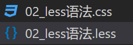</center>


### 🔰使用方式

1. #### *js*

   1. ***引入 less文件***

      1. ```html
         <link rel="stylesheet/less" href="需要引入less文件的路径">
         ```

   2. ***引入 less.js文件***

      1. ```html
         <script src="less.js文件的路径"></script>
         ```

2. ##### 第三方插件

   1. ◽◽◽◽◽◽◽


### 注解

- 单行注释

  - ```less
    // 内容
    ```

- 块注释

  - ```less
    /* 内容 */
    ```


### 🖥计算表达式

**<u><span style='color:red;'>*一个数必须带单位*</span></u>**

| 运算符 |         表达式         |
| :----: | :--------------------: |
|  加➕   | ***<u>x + y(px)</u>*** |
|  减➖   |    ***x - y(px)***     |
|  乘✖   |    ***x \* y(px)***    |
|  除➗   |  ***（x / y(px)）***   |

<center></center>


### 💠嵌套语法

***<span style='color:red;'>为了快速生成后代选择器</span>***

```less
父选择器 {
	// 父级样式
    子选择器 {
        // 子级样式
    }
}
```

<center></center>


### 🍂& 符号

***表示不生成后代选择器，表示当前选择器***

```less
父级选择器 {
    &[选择器]{
        // CSS...
    }
}
```

<center></center>


### 🌲变量

***<span style='color:red;'>存储数据，方便使用和修改</span>***

|     类型      |                             语法                             |                             使用                             |
| :-----------: | :----------------------------------------------------------: | :----------------------------------------------------------: |
|   *🌵值变量*   | <code><span style='color:red;'>@变量名</span>: **属性值**;</code> | <code>*CSS属性名: <span style='color:red;'>@变量名</span>;*</code> |
| *🌴选择器变量* | <code><span style='color:red;'>@变量名</span>: **选择器**;</code> | <code>*<span style='color:red;'>@{变量名} { CSS.. }</span>*</code> |
|  *🍃属性变量*  | <code><span style='color:red;'>@变量名</span>: **属性名**;</code> | <code>*@{变量名}: <span style='color:red;'>属性值</span>;*</code> |
|  *🌾url变量*   | <code><span style='color:red;'>@变量名</span>: **'url'**;</code> | <code>***<span style='color:red;'>url('@{images}/\filename.png')</span>;***</code> |

> ❗***变量不能在被定义区域外使用***


#### 声明变量

- ###### *语法*

  - ```less
    @变量名: {属性:值;}
    ```

- ###### *使用*

  - ```less
    @变量名();
    ```


#### 用变量定义变量

```less
@@变量名;
```


### 导入导出

#### 💾导入

```less
@import "文件路径"; // 导入less文件可以省略后缀
```


#### 📃导出

***<u><span style='color:red;'>在文件的第一行添加</span></u>***

```less
// out: 导出路径
// out: 导出路径/导出文件名.后缀
```


#### 🚫静止导出

***<u><span style='color:red;'>在文件的第一行添加</span></u>***

```less
// out: false
```


### 🍪混合

#### 无参数

```less
选择器1 {
	// CSS..
	选择器2;
}
```

>  ❕*`.` 与 `#` 皆可作为 方法前缀*
>  ❕ *方法后写不写 `()`，都可* 


#### 有参数

- ###### *语法*

  - ```less
    选择器(@参数名) { // 多个使用 "," 隔开
    	// 可使用传入的变量名
    }
    // 参数可设置默认值
    选择器(@参数名:默认值) {
    	// ...
    }
    ```

- ###### *使用*

  - ```less
    选择器(参数);
    // 单独修改默认值
    选择器(@参数名:值); // 个使用 "," 隔开
    // 修改全部
    选择器(值1,值2,值n);
    ```


#### 默认参数

> <code>***<span style='color:red;'>@arguments</span>***</code>: 代表全部参数，传的参数中 必须带着单位


### ⭕匹配模式

```less
/* less */
.triangle(top,@w:20px,@color: pink) {
    border-width: @w;
    border-color: transparent transparent @color transparent;
    border-style: dashed dashed solid dashed;
}

.triangle(right,@w:20px,@color: pink) {
    border-width: @w;
    border-color: transparent transparent transparent @color;
    border-style: dashed dashed dashed solid;
}

.triangle(bottom,@w:20px,@color: pink) {
    border-width: @w;
    border-color: @color transparent transparent transparent;
    border-style: solid dashed dashed dashed;
}

// 如果匹配的参数"@_"(后面的参数与上面保持一致)，则将携带自身样式继续去匹配
.triangle(@_,@w:20px,@color: pink) {
    width: 0;
    height: 0;
}

.box {
    .triangle(right); // 匹配一个相同的
}

/* CSS */
.box {
  width: 0;
  height: 0;
  border-width: 20px;
  border-color: transparent transparent transparent pink;
  border-style: dashed dashed dashed solid;
}
```


### 避免编译

> ❗❗<span style="color:red;">*<u>在不需要编译的内容前面加上 "<code>**~**</code>"，然后再将内容以 **单引号** 包裹</u>*</span>


## 📕Sass

***[Sass: Syntactically Awesome Style Sheets ](https://sass-lang.com/)是CSS(层叠样式表)的语法的一种扩充，文件后缀名为`.scss`***

<center>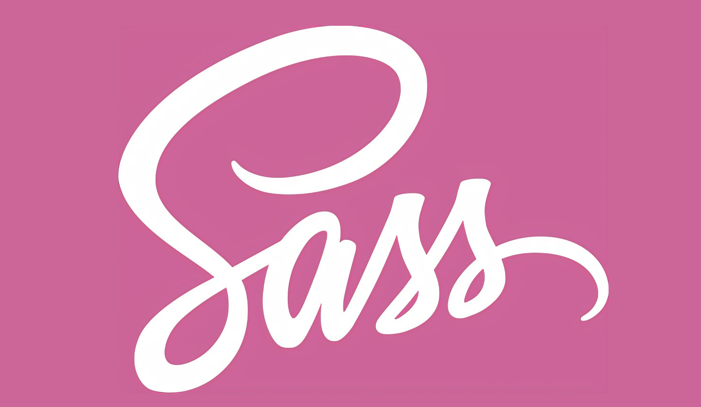</center>


### 文件后缀名

+ *`.sass`是缩进格式*
  1. ***缩进**表示选择器的嵌套*
  2. ***换行**表示分隔属性*

+ *`.scss`是非缩进格式*

<center>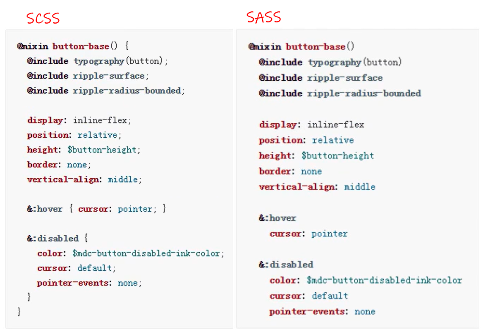</center>


### vscode插件

1. *安裝 [Live Sass Compiler](https://github.com/glenn2223/vscode-live-sass-compiler/blob/HEAD/docs/settings.md)*

2. *`setting.json`中添加配置*

   ~~~json
   {
       /* 压缩设置 */
       "liveSassCompile.settings.formats":[
           // This is Default.
           {
               "format": "compressed", // expanded(扩展), compressed(压缩)
               "extensionName": ".min.css",
               "savePath": "~/../css"  // 为 null 表示当前目录
           }
       ],
       /* 排除目录 */
       "liveSassCompile.settings.excludeList": [ "/**/node_modules/**", "/.vscode/**" ],
       /* 是否生成对应的map */
       "liveSassCompile.settings.generateMap": false,
       /* 是否添加兼容前缀 如： -webkit- , -moz- ... */
       "liveSassCompile.settings.autoprefix": [
           "> 1%",
           "last 2 versions"
       ],
       "liveSassCompile.settings.showOutputWindowOn": "Information"
   }
   ~~~


### 📑格式

> ==*`Live Sass Compiler(v5.5.1)`插件对 `format`配置项只提供了两种格式：`expanded`或 `compressed`*==
>
> <span style=color:black;>***默认`expanded`，以下代码分别使用两种配置项生成的文件的输出样式***</span>
>
> ~~~scss
> // scss 代码编辑
> .container {
>     font-size: 15px;
>     .header {
>         margin: 10px;
>     }
> }
> ~~~

+  ***`expanded`(扩展)***

  + ~~~css
    /* 使用 expanded 项编译后的 css */
    
    @charset "UTF-8";
    .container {
        font-size: 15px;
    }
    .container .header {
        margin: 10px;
    }
    ~~~

+ ***`compressed`(压缩)***

  + ~~~css
    /* 使用 compressed 项编译后的 css */
    
    .container{font-size:15px}.container .header{margin:10px}
    ~~~


### 代码注释

> ==***支持标准的 Css 的注释语法，单行注释 `//` 与多行注释 `/* */`，注释在 .`scss` 中的规则***==
>
> + <span style=color:black;>*单行注释，不会解析到 `.css` 文件中*</span>
> + <span style=color:black;>*如果选择 `compressed` 输出格式，任何注释都不会出现在编译后的 `css` 文件中*</span>
>
> + <span style=color:black;>*在多行注释中添加 `!`，则可保留这条注释到压缩文件中，此方法主要用于文件的版权声明；*</span>
> + <span style=color:black;>*多行注释中可以添加插值语句*</span>

~~~scss
// 单行注释

/*
 * 多行注释 */

/*!
 * 版权声明
 * 作者: #{#author} */
~~~


### 📄文件导入

> ==***使用 `@import` 进行文件的导入***==


#### 导入 .scss 文件

~~~scss
// 方法(1)
@import 'style.scss';

// 方法(2) 可省略.scss后缀
@import 'style';
~~~

> :grey_exclamation:==*导入的 `.scss` 文件，由于该文件内的代码会重新在发生导入的文件中生成，所以无需再单独生成一个被导入的文件的 `.css` 文件，解决的方法是在被导入的文件名前增加一个下划线 `_` 的符号，这样可以保证该文件不会被重新生成 `.css` 文件，而在导入该文件时，前面的下划线可以写入也可以省略*==

~~~scss
// 以下代码表示将导入一个名为 “_style.scss” 的文件
// 方法(1)
@import 'style';

// 方法(2)
@import '_style';
~~~

> :grey_exclamation:==*导入文件同样也可以写入选择器中，写入选择器后，导入的文件中的所有变量将只适用于该选择器，同时导入的文件中的所有选择器前也会增加发生导入的选择器前的名称*==

~~~scss
.container {
    @import 'style';
    color: $color;
}
~~~


#### 导入 .css 文件

> ==***将文件作为普通的 `css` 语句进行引入***==
>
> + <span style=color:black;>*文件拓展名为 `.css`*</span>
> + <span style=color:black;>*文件名以 `http://` 或 `https://` 开头*</span>
> + <span style=color:black;>*文件由 `url()` 的形式引入*</span>
> + <span style=color:black;>*`@import` 包含 `media queries`*</span>

~~~scss
@import 'style.css';
@import 'http://localhost/style.css';
@import url(style); // 推荐该方式引入css文件
@import 'landscape' screen and (orientation: landscape);
~~~


### 🌲变量

==***使用符号 `$` 定义变量，变量名称可自己命名，赋值方法与 Css 相同***==


#### 声明变量

+ ***语法***

  + ~~~scss
    $变量名: 变量值;
    ~~~

+ ***使用***

  + ~~~scss
    CSS属性: $变量名;
    ~~~


#### 命名规则

+ *用符号 `$` 开头，后面跟随变量名称*
+ *变量名称需使用字母开头，中间可使用字母、数字、中横线（连接符）、下划线*
+ *支持大/小写字母*

> ==*如果多个单词的连接，可以使用横线 “`-`“、下划线 “`_`” 或驼峰式的命名形式*==
>
> :grey_exclamation:==***如果同样的单词，分别采用横线与下划线来连接，此名称相当于是同一个名称，在解析时，会采用最后一个声明的变量来解析***==

~~~scss
// scss 代码编辑
$color: #f00;
$border_color: #0ff;
$border-color: #ff0;
$borderColor: #00f;
.container {
    color: $color;
    border-color: $border_color;
}

// 编译后的 css
.container {
    color: #f00;
    border-color: #ff0;
}
~~~


#### 🔵默认值

> ==*可以使用 `!default` 为每个变量设置一个默认值*==
>
> ==***如果该变量没有被重新定义过，则会将该变量解析为默认值，如果已经有过定义，则会取其以定义过的值***==

~~~scss
// scss 代码编辑
$color: #333;
$color: #666 !default; // 定义默认值
.container {
    color: $color;
}

// 编译后的 css
.container {
    color: #333;
}
~~~


#### 🔳作用域

##### 局部变量

> ==*在选择器中定义的变量，只能在该选择器或该选择器的子选择器中使用*==

~~~scss
// scss 代码编辑
.container {
    $font-size: 16px;
    font-size: $font-size;
    .wrapper {
        font-size: $font-size;
    }
}
~~~


##### 全局变量

> ==*定义后的变量，可以在全局范围内使用，全局变量的定义有两种形式*==
>
> 1. *直接定义在最外面的变量，即是全局变量*
> 2. *在选择器中定义的变量后面增加 `!global`*

~~~scss
$font-size: 16px; // 方式(1)
.container {
    $color: #000 !global; // 方式(2)
    font-size: $font-size;
}
.footer {
    color: $color;
    font-size: $font-size;
}
~~~


### 🔷数据类型

> :grey_exclamation:==***判断数据类型的方式: `type-of($value)`***==
>
> :grey_exclamation:==***判断数据的长度: `length($value)`***==

#### 字符串 (Strings)

> ==*支持有引号的字符串与无引号的字符串，由多个单词组成，并且包含空格，需要将引号加上*==

~~~scss
$string1: "Sample 1";
$string2: 'Sample 2';
$string3: skyblue;
~~~


#### 数字 (Numbers)

> ==*支持数字，带单位的数字，整数，小数，正数，负数*==

~~~scss
$number1: 30;
$number2: 6.9;
$number3: 16px;
~~~


#### 颜色 (Colors)

> ==*支持 `Css` 原有颜色类型，包括十六进制、RGB、RGBA、HSL、HSLA和色彩单词*==


#### 布尔型 (Booleans)

> ==*只有两个值 `true` 和 `false`，只有自身是 `false` 或 `null` 才会返回 `false`，其他一切都会返回 `true`，主要用于逻辑判断*==


#### 空值 (Null)

> ==*只有一个值 `null`，不能使用它与任何类型进行运算，主要用于逻辑判断*==


#### 数组 (Lists)

> ==*通过空格或半角逗号分割的一系列的值，数组中还可以包含子数组*==
>
> + *<a href="#list">`sass` 提供内置`list`函数</a>*

~~~scss
$list1: 1px 2px 3px 4px; //一维数字
$list2: 1px 2px, 3px 4px; //二维数字
$list3: (1px 2px) (3px 4px); //二维数字

.container {
	// 指定数组中的某个值进行调用
	margin: nth($list3, 2);
}
~~~


#### 映射 (Maps)

> ==*`Maps` 必须被圆括号包裹，可以映射任何键值对*==
>
> + *<a href="#map">`sass` 提供内置`map`函数</a>*

~~~scss
$map: ( // 定义 map
    key1: value1,
    key2: value2,
    key3: value3
)
    
.container {
	// 返回 map 中指定的key对应的value
	content: map-get($map, key1);
}
~~~


### 🖥运算符

#### 相等运算符

|  运算符  |    作用    |
| :------: | :--------: |
| **`==`** |  **表示**  |
| **`!=`** | **不等于** |

~~~scss
$theme: blue;
.container {
    @if $theme == blue {
        background-color: lightblue;
    }
    @else {
        background-color: lightpink;
    }
}
~~~


#### 比较运算符

|  运算符  |   作用   |
| :------: | :------: |
| **`>`**  |   大于   |
| **`<`**  |   小于   |
| **`>=`** | 大于等于 |
| **`<=`** | 小于等于 |

~~~scss
$is: 1 > 2; 	// false
$is: 1 < 2;		// true
$is: 1 >= 2;	// false
$is: 1 <= 2;	// true
~~~


#### 布尔运算符

|  运算符   |   作用   |
| :-------: | :------: |
| **`and`** | **并且** |
| **`or`**  | **或者** |
| **`not`** |  **非**  |

~~~scss
$w: 200px;
$h: 150px;
$mode: false;

.container {
    @if $w >= 200 and $h <= 150 {
	    color: steelblue;
	}

	@if not $mode {
	     display: block;
	}
	@else {
	    display: none;
	}
}
~~~


#### 数字运算符

| 运算符  |   作用   |
| :-----: | :------: |
| **`+`** |  **加**  |
| **`-`** |  **减**  |
|   `*`   |  **除**  |
| **`/`** |  **除**  |
| **`%`** | **取模** |

~~~scss
// scss 代码编辑
$width: 100px;
div {
    width: $width / 2; // 使用变量
    z-index: round($number: 10) / 2; // 使用函数
    height: (500px / 2); // 使用圆括号
    margin-left: 5px + 8/2; // 使用了+表达式
}
~~~

~~~scss
width: 50 - 20;		// 30
width: 50 - 20px;	// 30px
width: 50 - 20%;	// 30%
width: 50% + 20%;	// 70%
width: 50px + 20pt;	// 76.6666666667px
width: 5% * 10;		// 50%
width: 50 % 3px;	// 2px
width: 50px % 3px;	// 2px

// 以下运算会出现错误
// width: 50% + 20px;
// width: 50% * 10%;
// width: 10 / 2;
~~~


#### 字符串运算

> ==*使用加号 `+` 可连接字符串，相加时，如果前面一个值带引号，计算的结果同样带引号，反之；*==

~~~scss
// scss 代码编辑
.container {
    content: "Foo" + bar;
    font-family: sans- + "serif";
}

// 编译后的 css
.container {
    content: "Foobar";
    font-family: sans-serif;
}
~~~


#### 三元表达式

> ~~~scss
> if($condition, $if-true, $if-false);
> ~~~
>
> ==*如果`$condition`，则返回`$if-true`，否则返回`$if-false`*==

~~~scss
// scss 代码编辑
$w: 200px;
.container {
	top: if(true, 0, 1px);
    left: if(false, 0, 1px);
    right: if($w > 100, 0, 1px);
}

// 编译后的 css
.container {
	top: 0;
    left: 1px;
    right: 0;
}
~~~


### 🧬选择器嵌套

> ==***可以使用不同的选择器进行嵌套***==

~~~scss
// scss 代码编辑
.container {
    width: 1200px;
    margin: 0 auto;
    .header {
        height: 100px;
        .logo {
            background-color: #000;
        }
    }
    .footer {
        height: 300px;
        text-align: center;
    }
}
~~~


### 🍃属性嵌套

> ==***属性名称前都具有相同的字符时，可使用属性嵌套的方法***==
>
> ~~~scss
> 属性名: {} // 冒号后与花括号中间需有空格进行隔开
> ~~~

~~~scss
// scss 代码编辑
.container {
    color: #333;
    font: {
        size: 20px;
        weight: 900;
    }
}

// 编译后的 css
.container {
    color: #333;
    font-size: 20px;
    font-weight: 900;
}
~~~


### 父选择器添加内容 &

> ==***添加符号 `&` ，表示在该父容器后面添加相应的后缀***==

~~~scss
// scss 代码编辑
.container {
    // ...
    a {
        // ...
        &:hover {
            text-decoration: underline;
        }
    }
    .top {
        // ...
        &-left {
            float: left;
        }
    }
}

// 编译后的 css
.container a:hover {
    text-decoration: underline;
}
.container .top-left {
    float: left;
}
~~~


### 🔰插值语句

> ~~~scss
> #{$value}
> ~~~
>
> ==*当两个变量使用 `/` 时，程序会自动运算出值，如使用插值语句，则可避免运算出结果*==

~~~scss
// scss 代码编辑
$author: 'linke';
$class-name: danger;
$font-size: 15px;
$line-height: 25px;
$attr: weight;

/*
 * @author: #{$author} */
a.#{$class-name} {
    font: #{$font-size} / #{$line-height} Helvetica;
    font-#{$attr}: 900;
}

// 编译后的 css
/* 
 * @author: linke */
a.danger {
    font: 15px/25px Helvetica;
    font-weight: 900;
}
~~~


### 🪑占位符选择器

> ==*有时需要定义一套样式，但并不给某个元素使用，必须在需要调用的时候才启用此样式库*==
>
> ==***使用 `%name` 占位，通过 `@extend` 进行调用；`name` 名称可自己定义，前面需加上符号 `%`***==

~~~scss
// scss 代码编辑
.button%buttonStyle { // 占位符选择器
    width: 100px;
    height: 36px;
    color: #fff;
}

.btn-default {
    @extend %buttonStyle; // 调用
    background-color: lightcyan;
}

.btn-success {
    @extend %buttonStyle;
    background-color: lightgreen;
}

// 编译后的 css
.button.btn-success, .button.btn-default {
    width: 100px;
    height: 36px;
    color: #fff;
}

.btn-default {
    background-color: lightcyan;
}

.btn-success {
    background-color: lightgreen;
}
~~~


### 💠混合指令

> ==***混合指令用于定义可重复使用的样式***==


#### 定义与使用混合指令

+ *使用 `@mixin` 定义混合指令*
+ *使用 `@include` 进行调用*


#### 基础写法

~~~scss
// scss 代码编辑
// 定义混合指令
@mixin name {
    width: 1200px;
    margin: 0 auto;
    height: 600px;
}

.container {
    @include name; // 调用混合指令
}

// 编译后的 css
.container {
    width: 1200px;
    margin: 0 auto;
    height: 600px;
}
~~~


#### 指令中添加选择器

~~~scss
// scss 代码编辑
// 定义混合指令
@mixin name {
    .wrap {
        width: 1200px;
        margin: 0 auto;
        height: 600px;
    }
}

.container {
    @include name; // 调用混合指令
}

// 编译后的 css
.container .wrap {
    width: 1200px;
    margin: 0 auto;
    height: 600px;
}
~~~


#### 指令中带参数

> ==***使用 `$name` 给参数命名，在调用的时候给参数赋值***==
>
> + <span style=color:black;>*参数可以写一个也可写多个，参数的数目与顺序需一一对应*</span>
> + <span style=color:black;>*给指定参数赋值，顺序可随意调整*</span>
> + <span style=color:black;>*给参数添加默认值后，在调用时指定参数，未指定的参数将使用默认值*</span>
> + <span style=color:black;>*混合指令中的参数可设置为一个数组形式 `$name…`*</span>

~~~scss
// scss 代码编辑
// 定义混合指令
@mixin flex-align($alignDirect) {
    justify-items: $alignDirect;
    align-items: $alignDirect;
}

// 多个参数
@mixin flex($justify, $align) {
    justify-content: $justify;
    align-items: $align;
}

// 带默认值参数
@mixin block-padding($top:0, $right:0, $bottom:0, $left:0) {
  padding: $top, $right, $bottom, $left;
}

// 参数为一个数组形式
@mixin linear-gradient($direction, $gradients...) {
  background-color: nth($gradients, 1);
  background-image: linear-gradient($direction, $gradients);
}

// 调用混合指令
.container {
    @include flex-align(center);
    @include flex(space-between, center);
    @include flex($align:center, $justify:space-between); // 指定参数赋值
    @include block-padding($top: 5px, $bottom:10px);
    @include linear-gradient(to right, #f00, orange, yellow)
}
~~~


### :snowflake:继承指令

> ==***在不同的元素具有完全相同的样式与 `Css` 属性时，可以使用继承指令 `@extend` 实现***==
>
> + <span style=color:black;>*可<u>多个继承</u>形式*</span>
> + <span style=color:black;>*可<u>多层继承</u>形式*</span>
> + <span style=color:black;>*配合占位符选择器使用*</span>

~~~scss
// scss 代码编辑
.alert {
    margin: 8px 12px;
    width: 100%;
    font-size: 16px;
}

.important {
    color: aquamarine;
}

// 继承
.alert-success {
    @extend .alert;
    background: rgb(225, 250, 242);
}

// 多个继承
.alert-info {
  @extend .alert;
  @extend .important;
  background: rgb(238, 238, 238);
}

// 多层继承
.min-alert {
    @extend .alert-success;
    width: 100px;
}

// 编译后的 css
.alert,
.alert-info,
.alert-success,
.min-alert {
    font-size: 16px;
}

.important,
.alert-info {
    color: aquamarine;
}

.alert-success,
.min-alert {
    background: rgb(225, 250, 242);
}

.alert-info {
    background: rgb(238, 238, 238);
}

.min-alert {
    width: 100px;
}
~~~

#### 使用占位符选择器

~~~scss
// scss 代码编辑
%alert {
    font-size: 16px;
}

.alert-success {
    @extend %alert;
    background: rgb(225, 250, 242);
}

.alert-error {
    @extend %alert;
    background: rgb(250, 225, 225);
}

// 编译后的 css
.alert-error,
.alert-success {
    font-size: 16px;
}

.alert-success {
    background: rgb(225, 250, 242);
}

.alert-error {
    background: rgb(250, 225, 225);
}
~~~


### 🚩内置模块

#### color

|                        函数                         |               作用               |
| :-------------------------------------------------: | :------------------------------: |
|             **`adjust-hue(颜色,角度)`**             |         增加或减少的色调         |
|               **`ie-hex-str(颜色)`**                | 返回不带引号的`#color`形式字符串 |
|               **`darken(颜色,数量)`**               |            使颜色更深            |
|            **`desaturate(颜色, 数量)`**             |           使饱和度降低           |
|              **`saturate(颜色,数量)`**              |           使饱和度更高           |
|                **`grayscale(颜色)`**                |  返回与 `color` 亮度相同的灰色   |
|         **`mix(color1, color2[, weight])`**         |      返回两个颜色的混合颜色      |
|     **`opacify(颜色,数量)/fade-in(颜色,数量)`**     |          使颜色更不透明          |
| **`transparentize(颜色,数量)/fade-out(颜色,数量)`** |           使透明度更高           |


#### string

|                 函数                  |              作用               |
| :-----------------------------------: | :-----------------------------: |
|          **`quote(string)`**          |    以带引号的字符串形式返回     |
| **`str-insert(string,insert,index)`** | 返回字符串在 `index` 插入的副本 |
|       **`str-length(string)`**        |      返回字符串中的字符数       |
|         **`unquote(string)`**         |   以不带引号的字符串形式返回    |


#### math

|           函数           |             作用             |
| :----------------------: | :--------------------------: |
|    **`ceil(number)`**    |         向上舍入整数         |
|   **`floor(number)`**    |         向下舍入整数         |
|   **`max(number...)`**   | 返回一个或多个数字中的最高值 |
|   **`min(number...)`**   | 返回一个或多个数字中的最小值 |
|   **`round(number)`**    |      舍入到最接近的整数      |
|    **`abs(number)`**     |       返回数字的绝对值       |
| **`percentage(number)`** |  将无单位的数字转换为百分比  |
|  **`random([limit])`**   |       返回随机十进制数       |


#### <div id="list" name="list">list</div>

|                           函数                            |                作用                 |
| :-------------------------------------------------------: | :---------------------------------: |
|          **`append(list,val,$separator: auto)`**          | 返回 `var` 添加到 `list` 末尾的副本 |
|                  **`index(list,value)`**                  |        返回 `list` 的索引值         |
| **`join(list1,list2,$separator: auto,$bracketed: auto)`** |      将两个列表合并为一个列表       |
|                    **`length(list)`**                     |         返回 `list` 的长度          |
|                    **`nth(list,$n)`**                     |        返回 `at` 索引的元素         |


#### <div id="map" name="map">map</div>

|             函数              |                  作用                  |
| :---------------------------: | :------------------------------------: |
|    **`map-get(map,key)`**     |  返回 `Map` 中 `key` 所对应的 `value`  |
|  **`map-has-key(map,key)`**   |     判断 `Map` 是否有对应的 `key`      |
|      **`map-keys(map)`**      |  返回 `Map` 中所有的 `key` 组成的队列  |
|     **`map-values(map)`**     | 返回 `Map` 中所有的 `value` 组成的队列 |
|  **`map-merge(map1,map2)`**   |    合并两个 `Map` 形成一个新 `Map`     |
| **`map-remove(map,keys...)`** |         移除 `Map` 中的 `keys`         |


#### selector

|                    函数                    |    作用    |
| :----------------------------------------: | :--------: |
|    **`selector-append(selectors...)`**     | 组合选择器 |
|     **`selector-nest(selectors...)`**      | 嵌套选择器 |
| **`selector-unify(selector1, selector2)`** | 合并选择器 |


### :traffic_light:控制指令

#### ***@if***

1. ~~~scss
   // @if
   @if 1 + 1 == 2 { /* .. */ }	// true
   @if 5 < 3 { /* .. */ }		// false
   @if null  { /* .. */ }		// false
   ~~~

2. ~~~scss
   // @if, @else
   $type: success;
   @if $type == success  {
   	// true
   } @else {
   	// false
   }
   ~~~

3. ~~~scss
   // @if, @else-if, @else
   $type: success;
   @if $type == success  {
       // ..
   } @else if $type == info {
       // ..
   } @else {
       // ..
   }
   ~~~


#### ***@for***

> <span style=color:black;>*`@for` 指令可以在限制的范围内重复输出格式*</span>

1. `@for $var from <start> through <end>`

   ~~~scss
   // 当使用 through 时，条件范围包含 <start> 与 <end> 的值
   @for $i from 1 through 3 {
       .item-#{$i} { width: 2em * $i; }
   }
   
   // 编译后的 css
   .item-1 { width: 2em; }
   .item-2 { width: 4em; }
   .item-3 { width: 6em; }
   ~~~

2. `@for $var from <start> to <end>`

   ~~~scss
   // 使用 to 时条件范围只包含 <start> 的值不包含 <end> 的值
   @for $i from 1 to 3 {
       .col-#{$i} { width: 2em * $i; }
   }
   
   // 编译后的 css
   .col-1 { width: 2em; }
   .col-2 { width: 4em; }
   ~~~


#### ***@each***

+ ***`$var in <list>`***

  ~~~scss
  // $var 可以是任何变量名, 而 <list> 是一连串的值，也就是值列表
  @each $animal in one, two, three {
      .#{$animal}-icon {
          background-image: url('/images/#{$animal}.png');
  	}
  }
  
  // 编译后的 css
  .one-icon {
      background-image: url("/images/one.png");
  }
  .two-icon {
      background-image: url("/images/two.png");
  }
  .three-icon {
      background-image: url("/images/three.png");
  }
  ~~~

+ ~~~scss
  // 形式(2)
  @each $animal, $color, $cursor in (keke, black, default),
                                    (dudu, white, pointer) {
  	.#{$animal}-icon {
          background-image: url('/images/#{$animal}.png');
          border: 2px solid $color;
          cursor: $cursor;
  	}
  }
  
  // 编译后的 css
  .keke-icon {
    background-image: url("/images/keke.png");
      border: 2px solid black;
      cursor: default;
  }
  .dudu-icon {
      background-image: url("/images/dudu.png");
      border: 2px solid white;
      cursor: pointer;
  }
  ~~~

+ ~~~scss
  // 形式(3)
  @each $header, $size in (h1: 2em, h2: 1.5em, h3: 1.2em) {
      #{$header} {
          font-size: $size;
      }
  }
  
  // 编译后的 css
  h1 { font-size: 2em; }
  h2 { font-size: 1.5em; }
  h3 { font-size: 1.2em; }
  ~~~


####  ***@while***

> <span style=color:black;>*`@while` 指令重复输出格式直到表达式返回结果为 `false`*</span>

+ ~~~scss
  // @while
  $i: 6;
  @while $i > 0 {
      .item-#{$i} { width: 2em * $i; }
      $i: $i - 2;
  }
  
  // 编译后的 css
  .item-6 { width: 12em; }
  
  .item-4 { width: 8em; }
  
  .item-2 { width: 4em; }
  ~~~


### 🔲自定义函数

> ==***将一些比较复杂或常用的内容进行抽离(封装)，以便重复使用***==
>
> ~~~scss
> @function <name>(<arguments...>) {
>     // ...
>     @return $result;
> }
> ~~~
>
> + ==*:grey_exclamation: 参数可设置默认值*==
> + ==*:grey_exclamation: 可采用任意参数*==
> + ==*:grey_exclamation: `@return` 用作调用函数的结果的值，并且每个函数必须以有 `@return`*==

~~~scss
// 定义函数(采用任意参数)
@function sum($numbers...) {
    $sum: 0;
    @each $number in $numbers {
        $sum: $sum + $number;
    }
    @return $sum;
}

$heights: 50px, 30px, 100px;

main {
    width: sum(1px, 2px, 3px); // 调用
    height: sum($heights...); // 传递任意参数
}

// 编译后的 css
main {
    width: 6px;
    height: 180px;
}
~~~


### 🥕@use

> ==***该规则从其他 `Sass` 样式表中加载 `mixin`、`function`和 `变量`，并将多个样式表中的 CSS 组合在一起；***==
>
> + :grey_exclamation:==*加载的样式表称为<span style=color:red;>模块</span>，输出仅包含一次*==
>
> + ==:grey_exclamation:<span style=color:black;>*如果在文件夹中写入 `_index.scss`，则在加载文件夹本身的 `URL` 时，将自动加载索引文件*</span>==
>
> ~~~scss
> @use "<url>" [as alias|namespace]
> ~~~

~~~scss
// _style.scss
.box {
    padding: .25em;
    line-height: 0;
}

// 引入
@use './style';

ul, ol {
    text-align: left;
}

// 编译后的 css
.box {
    padding: 0.25em;
    line-height: 0;
}

ul, ol {
    text-align: left;
}
~~~


#### 加载成员

> ==***可以通过 <u><span style=color:red;>文件名</span></u> 或 <u><span style=color:red;>命名空间</span></u> 从另一个模块访问变量、`function` 和 `mixin`***==

~~~scss
// _style.scss
$radius: 3px;

@mixin rounded {
    border-radius: $radius;
}

// 引入
@use './style';

div {
    @include style.rounded;
    padding: style.$radius;
}

// 编译后的 css
div {
    border-radius: 3px;
    padding: 3px;
}
~~~


#### 命名空间

> :grey_exclamation:==***默认情况下，模块的命名空间是文件名，没有文件扩展名***==
>
> ==*可以通过 `@use "<url>" as <namespace>` 指定命名空间*==
>
> :grey_exclamation:==*如果将引入方式为 `@use "<url>" as *`，则可直接使用模块中的成员*==

~~~scss
// _style.scss
$size: 15px;

// _code.scss
$color: skyblue;

@mixin bgc {
    background-color: $color;
}

// 引入, 同时指定命名空间
@use './style' as *;
@use './code' as c;

code {
    @include c.bgc;
    color: c.$color;
    font-size: $size;
}

// 编译后的 css
code {
    background-color: skyblue;
    color: skyblue;
    font-size: 15px;
}
~~~


#### 私有成员

> ==***私有成员不会被引入，以 `-` 或 `_` 开头来定义私有成员***==

~~~scss
// _style.scss
$-w: 100px; // 方式(1)
$_h: 150px; // 方式(2)
~~~


#### 配置模块

> ==***样式表可以使用 `！default` 标志定义变量，以使其可配置；***==
>
> ==***在加载具有配置的模块，使用 `@use <url> with (<variable>: <value>, ...)`配置的值将覆盖变量的默认值***==

~~~scss
// _btns.scss
$color: skyblue !default;
$border-radius: 3px !default;
$box-shadow: 0 0.5rem 1rem rgba($color, 0.15) !default;

.btn {
    border-radius: $border-radius;
    box-shadow: $box-shadow;
}

// 引入, 同时配置模块默认值
@use './btns' with (
    $color: lightpink,
    $border-radius: 5px
);

// 编译后的 css
.btn {
    border-radius: 5px;
    box-shadow: 0 0.5rem 1rem rgba(255, 182, 193, 0.15);
}
~~~


### 🔄@forward

> ==***`@forward` 可以跨多个文件组织 `Sass` 库，同时允许用户加载单个入口点文件***==
>
> + :grey_exclamation:<span style=color:black;>*在模块内 `@forward` 成员后，该成员在当前的模块中不可用，如果要使用该模块成员，则需要在 `@forward` 之后面 `@use`*</span>
>
> ~~~scss
> @forward "<url>"
> ~~~

 ~~~scss
 // src/_list.scss
 $color: skyblue;
 @mixin list-reset {
     margin: 0;
     padding: 0;
     list-style: none;
 }
 
 // bootstrap.scss
 @forward "src/list";
 
 // styles.scss
 @use "bootstrap";
 
 li {
     @include bootstrap.list-reset;
     color: bootstrap.$color;
 }
 
 // 编译后的 css
 li {
     margin: 0;
     padding: 0;
     list-style: none;
     color: skyblue;
 }
 ~~~


#### 添加前缀

> ==*通过 `@forward "<url>" as <prefix>-*`给添加到模块转发的每个`mixin`，`function`和变量名称的前缀开头*==

~~~scss
// src/_list.scss
$color: skyblue;
@mixin reset {
    margin: 0;
    padding: 0;
    list-style: none;
}

// bootstrap.scss
@forward "src/list" as list-*;

// styles.scss
@use "bootstrap";

li {
    @include bootstrap.list-reset;
    color: bootstrap.$list-color;
}

// 编译后的 css
li {
    margin: 0;
    padding: 0;
    list-style: none;
    color: skyblue;
}
~~~


#### 控制可见性

+ 🚫*`@forward "<url>" hide <members...>`：设置隐藏成员后，该成员无法转发*
+ ⭕*`@forward "<url>" show <members...>`：设置显示成员后，只转发指定成员*

~~~scss
// src/_list.scss
$color: skyblue;
$border-radius: 3px;
@mixin reset {
    margin: 0;
    padding: 0;
    list-style: none;
}

// bootstrap.scss
@forward "src/list" hide reset, $color;
// 转发时设置前缀，如有再控制可见性时，也应当添加前缀
@forward "src/list" as list-* hide list-reset, $list-color;
~~~


#### 配置模块

> ==***规则的配置可以在其配置中使用 `!default` 标志，允许模块更改上游样式表的默认值，同时仍允许下游样式表覆盖它们***==
>
> ~~~scss
> @forward <url> with (<variable>: <value>, ...)
> ~~~

~~~scss
// _btns.scss
$color: skyblue !default;
$border-radius: 3px !default;
$box-shadow: 0 0.5rem 1rem rgba($color, 0.15) !default;

.btn {
    border-radius: $border-radius;
    box-shadow: $box-shadow;
}

// _opinionated.scss
@forward './btns' with (
	$color: lightpink !default, // 覆盖模块默认值
    $border-radius: 5px !default
);

// style.scss
@use 'opinionated' with ($color: #333);
~~~


### 🌱@at-root

> ==***其中的所有内容在文档的根目录处发出***==

~~~scss
// scss 代码编辑
.parent {
    font-size: 13px;
    
    // 方式(1)
    @at-root .child {
        font-size: 14px;
        @at-root .son {
            font-size: 15px;
        }
    }
    
    // 方式(2)
    @at-root {
        .item-1 {
            font-size: 13px;
        }
        .item-2 {
            font-size: 14px;
        }
    }
}

// 编译后的 css
.parent {
    font-size: 13px;
}
.child {
    font-size: 14px;
}
.son {
    font-size: 15px;
}

.item-1 {
    font-size: 13px;
}

.item-2 {
    font-size: 14px;
}
~~~

> ==*高级嵌套*==

~~~scss
// scss 代码编辑
@mixin unify-parent($child) {
    @at-root #{selector-unify(&, $child)} {
        @content;
	}
}

.wrapper .field {
    @include unify-parent("input") {
        /* ... */
    }
    @include unify-parent("select") {
        /* ... */
    }
}

// 编译后的 css
.wrapper input.field {
    /* ... */
}

.wrapper select.field {
    /* ... */
}
~~~


#### 超越样式规则

+ *`@at-root (with: <rules...>) { ... }`：包括*
+ *`@at-root (without: <rules...>) { ... }`：不包括*

==***规则***==

1. `all`所有
2. `rule` 常规`CSS`
3. `media` 媒体查询

~~~scss
// scss 代码编辑
@media print {
    .page {
        width: 8in;

        @at-root (without: media) {
            color: #111;
        }

        @at-root (with: rule) {
            font-size: 1.2em;
        }
    }
}

// 编译后的 css
@media print {
    .page {
        width: 8in;
    }
}
.page {
    color: #111;
}
.page {
    font-size: 1.2em;
}
~~~


# 🍱布局方式

****

## 🟪Flex布局

***<span style='font-family:FZShuTi;'>Flex</span> 是<u>Flexible Box</u>的缩写，意为'<span style='color:red;'>弹性布局</span>'，用来为盒状模型提供最大的灵活性。***


### 🍀概念

***<u>采用Flex布局的元素</u>，称为<span style='color:red;'>Flex容器（flex container）</span>，简称”<u><span style='color:skyblue'>容器</span></u>”。它的<u>所有子元素自动成为容器成员</u>，称为<span style='color:red;'>Flex项目（flex item）</span>，简称”<u><span style='color:skyblue'>项目</span></u>”。***


### 🌲组成部分

<center>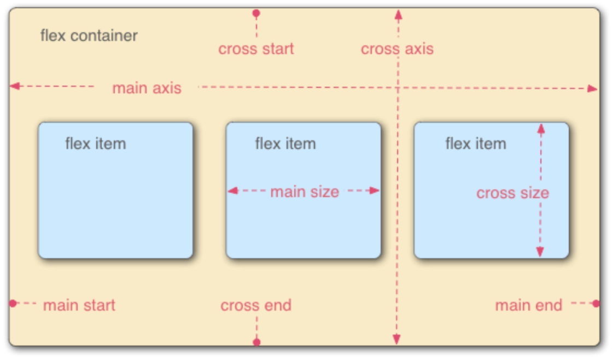</center>

|                             单词                             |                 含义                 |
| :----------------------------------------------------------: | :----------------------------------: |
|  ***<span style='font-family:STXihei ;'>main axis</span>***  |           ***水平的主轴***           |
| ***<span style='font-family:STXihei ;'>cross axis</span>***  |          ***垂直的交叉轴***          |
| ***<span style='font-family:STXihei ;'>main start</span>***  | ***主轴的开始位置(与边框的交叉点)*** |
|  ***<span style='font-family:STXihei ;'>main end</span>***   |         ***主轴的结束位置***         |
| ***<span style='font-family:STXihei ;'>crooss start</span>*** |        ***交叉轴的开始位置***        |
| ***<span style='font-family:STXihei ;'>crooss end</span>***  |        ***交叉轴的结束位置***        |
|  ***<span style='font-family:STXihei ;'>main size</span>***  |     ***单个项目占据的主轴空间***     |
| ***<span style='font-family:STXihei ;'>crooss size</span>*** |    ***单个项目占据的交叉轴空间***    |


### 💡设置方式

***<span style='color:red;'>给父元素设置`display: flex/inline-flex; ` 子元素可以自动的挤压或者拉伸</span>***

```css
display: flex; // 块级
display: inline-flex; // 行内块
```

> ❗❗***<u>设为Flex布局以后，子元素的`float`、`clear`和`vertical-align`属性将失效</u>***


### 🌳容器属性

#### 主轴方向

***<span style='color:red;'>修改项目的排列方向</span>***

> ```css
> flex-direction: [可选];
> ```
>
> ​		**<code>row</code>**  				 ：*主轴为水平方向，起点在左端(**默认**)*
>
> ​		**<code>row-reverse</code>**  ：*主轴为水平方向，起点在右端*
>
> ​		**<code>column</code>**			 :   *主轴为垂直方向，起点在上沿*
>
> ​		**<code>column-reverse</code>**	:   *主轴为垂直方向，起点在下沿*

<center>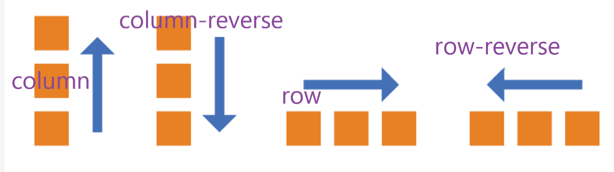</center>


#### 主轴项目对齐方式

> ```css
> justify-content: [可选];
> ```
>
> ​		**<code>start</code>**	:  *左对齐(**默认**)*
>
> ​		**<code>end</code>** 	:  *右对齐*
>
> ​		**<code>center</code>**	:	*居中*
>
> ​		**<code>space-between</code>**	:	*两端对齐，项目之间的间隔都相等*
>
> ​		**<code>space-around</code>**	  :    *两侧的间隔相等，项目之间的间隔比项目与边框的间隔大一倍*
>
> ​		**<code>space-evenly</code>**		:	*项目之间和项目与边框间隔均匀排列*

<center>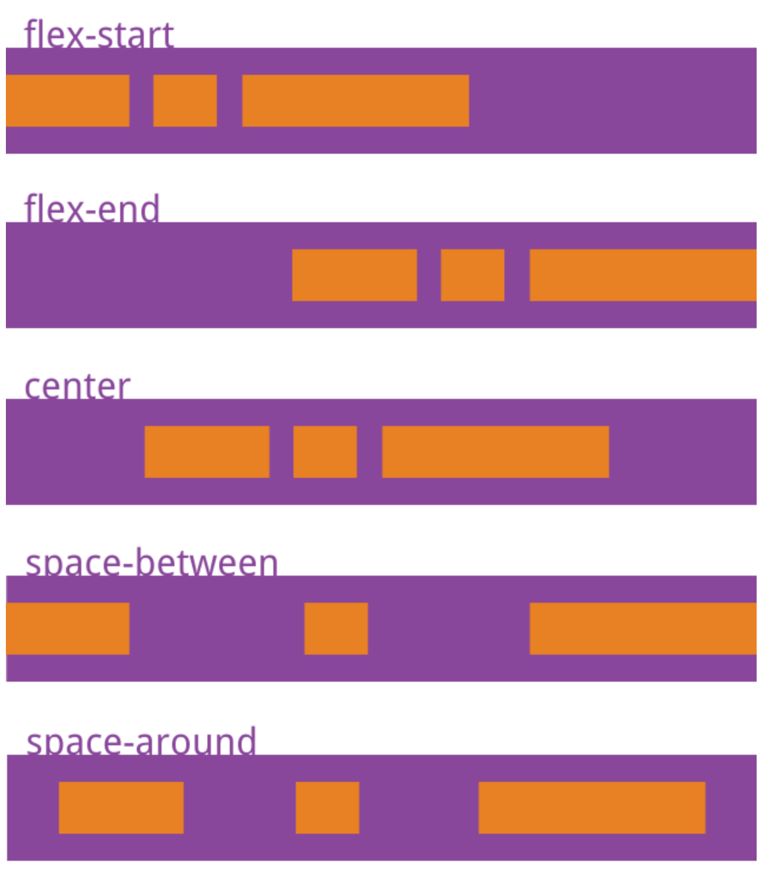</center>


#### 交叉轴项目对齐方式

> ```css
> align-items: [可选];
> ```
>
> ​		**<code>flex-start</code>**  :   *交叉轴的起点对齐(**默认**)*
>
> ​		**<code>flex-end</code>** 	:	*交叉轴的终点对齐*	
>
> ​		**<code>center</code>**		 :	*交叉轴的中点对齐*
>
> ​		**<code>baseline</code>**	 :	*项目的第一行文字的基线对齐*
>
> ​		**<code>stretch</code>**		:	 *如果项目未设置高度或设为auto，将占满整个容器的高度*

<center>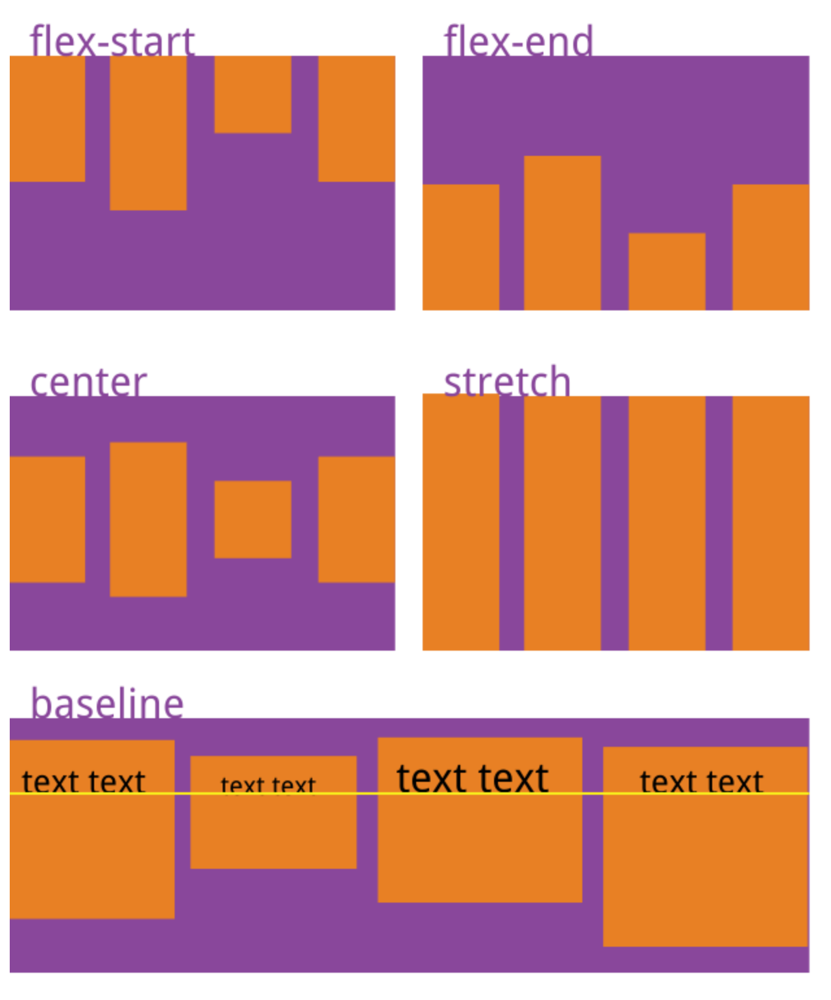</center>


#### 交叉轴多行项目对齐方式

***属性在<u><span style='color:red;'>弹性容器内的各项没有占用交叉轴上所有可用的空间时对齐容器内的各项（垂直）</span></u>***

> ```css
> align-content: [可选];
> ```
>
> ​			**<code>flex-start</code>**  :	*交叉轴的起点对齐*
>
> ​			**<code>flex-end</code>**	:	*交叉轴的终点对齐*
>
> ​			**<code>center</code>**		:	*交叉轴的中点对齐*
>
> ​			**<code>space-between</code>**	:	*交叉轴两端对齐，轴线之间的间隔平均分布*
>
> ​			**<code>space-around</code>**	  :	*每根轴线两侧的间隔相等，轴线之间的间隔比轴线与边框的间隔大一倍*
>
> ​			**<code>space-evenly</code>**		:	*项目之间和项目与边框间隔均匀排列*
>
> ​			**<code>stretch</code>**	  :	*轴线占满整个交叉轴(**默认**)*
>
> ❕***<u>容器内必须有多行的项目，该属性才能渲染出效果</u>***

<center>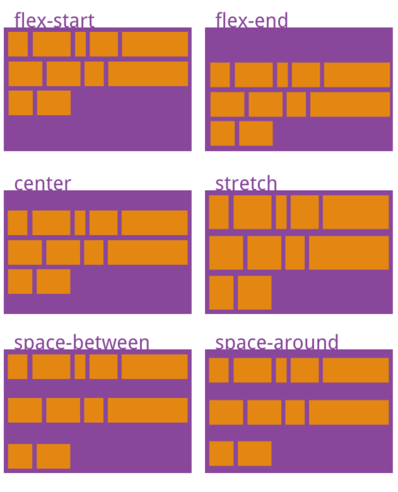</center>


#### 项目在轴线上是否换行

***默认情况下，项目都排在一条线（又称”<span style='color:red;'>轴线</span>”）上。<u>如果一条轴线排不下，该属性如何换行</u>***

> ```css
> flex-wrap: [可选];
> ```
>
> ​			**<code>nowrap</code>**  :	*不换行(**默认**)*
>
> ​			**<code>wrap</code>**		 :	*换行，第一行在上方*
>
> ​			**<code>wrap-reverse</code>**	:	*换行，第一行在下方*

<center></center>


#### flex-flow

***flex-flow属性是<u>flex-direction属性和flex-wrap属性的简写形式</u>，默认值为<span style='color:red;'>row nowrap</span>。***

```css
 flex-flow: <flex-direction> <flex-wrap>;
```


### 🌱项目属性

#### 项目排序顺序

***<u>定义项目的排列顺序</u>。<span style='color:red;'>数值越小，排列越靠前，默认为0。</span>***

```css
order: <number>;
```

<center>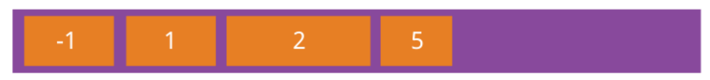</center>


#### 项目放大比例

***<u>定义项目的放大比例</u>，<u>默认为0，即如果存在剩余空间，也不放大</u>。***

```css
flex-grow: <number>; /* default 0 */
```

> ❕*如果所有项目的flex-grow属性都为1，则它们将等分剩余空间（如果有的话）。*
>
> ❕*如果一个项目的flex-grow属性为2，其他项目都为1，则前者占据的剩余空间将比其他项多一倍。*

<center>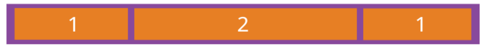</center>


#### 项目缩小比例

***<u>定义项目的缩小比例</u>，<u>默认为1，即如果空间不足，该项目将缩小</u>。***

```css
flex-shrink: <number>; /* default 1 */
```

> ❕*如果所有项目的<code>flex-shrink</code>属性都为1，当空间不足时，都将等比例缩小。*
>
> *如果一个项目的<code>flex-shrink</code>属性为0，其他项目都为1，则空间不足时，前者不缩小。*
>
> ❗***负值对该属性无效***

<center>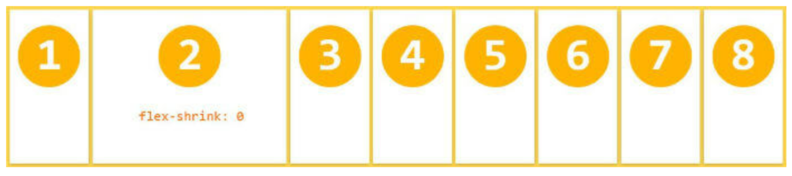</center>


#### 单个项目的交叉轴对齐方式

```css
align-self: [auto | flex-start | flex-end | center | baseline | stretch];
```

> ❕*<u><code>align-self</code>属性允许单个项目有与其他项目不一样的对齐方式，可覆盖<code>align-items</code>属性</u>*
>
> ❕*<u>默认<code>auto</code>，表示继承父元素的<code>align-items</code>属性，如果没有父元素，则等同于<code>stretch</code></u>*
>
> ❕*该属性可能取6个值，除了<code>auto</code>，其他都与<code>align-items</code>属性完全一致*


#### 收缩率

***<u>当伸缩项目设置宽度，比容器宽度还要大时，元素并没有发生溢出的情况</u>，那此时就出现一个东西叫 <span style='color:red;'>收缩因子（收缩率）</span>***

> ```css
> flex-shirnk: <number>;
> ```
>
> ​			**<code>0</code>**	:	不收缩
>
> ​			**<code>1</code>**	：收缩
>
> ​			**`number`**	：收缩系数
>
> **<span style=color:red;>:grey_exclamation:*<u>负值无效</u>*</span>**


#### 设置项目初始大小

***设置 flex 项目的初始主大小。它设置内容框的大小，除非另有设置`box-sizing`***

> ```css
> flex-basis: [可选];
> ```
>
> ​		**`number`** ：数值，单位：`px`，`%`
>
> ​		**`auto`**	：自动增长以吸收柔性容器中的任何额外可用空间
>
> ​		**`content`·**	：自动调整大小
>
> **<span style=color:red;>:grey_exclamation:*<u>负值无效</u>*</span>**
>
> *如果主轴是在 `x` 轴上，那么设置的是<u>元素的宽</u>，*
>
> *如果主轴是在 `y` 轴，那么设置的是<u>元素的高度</u>*
>
> *并且属性优先级大于`width`，`height`*


### flex

***<span style=color:red;>设置 flex 项目如何增长或收缩以适合其 flex 容器中的可用空间</span>***

```css
flex: <flex-shrink> <flex-basis>;
flex: <flex-grow> <flex-shrink> <flex-basis>;
```

> ​		**`一个值`**	:	***<u>设置盒子占用父盒子剩余尺寸的 `number` 份数</u>***


## 🟧Grid布局

***<span style='color: red;'>CSS Grid(网格) 布局</span>，是一个<span style='color: red;'>二维</span>的基于网格的布局系统。将容器划分为"<span style='color:red;'>行</span>"和"<span style='color:red;'>列</span>"，<u>产生单元格</u>，然后指定"<span style='color:red;'>项目所在</span>"的单元格。***


### 🍀概念

***采用grid布局的元素，被称为<span style='color: red;'>grid容器(grid container)</span>，简称“<u><span style='color: skyblue;'>容器</span></u>”。其所有直接子元素（直接子***

***<u>素的子元素不包含在内）自动成为容器成员</u>，称为<span style='color:red;'>grid项目(grid item)</span>，简称“<span style='color: skyblue'><u>项目</u></span>”。***


### 🌲组成部分

<center>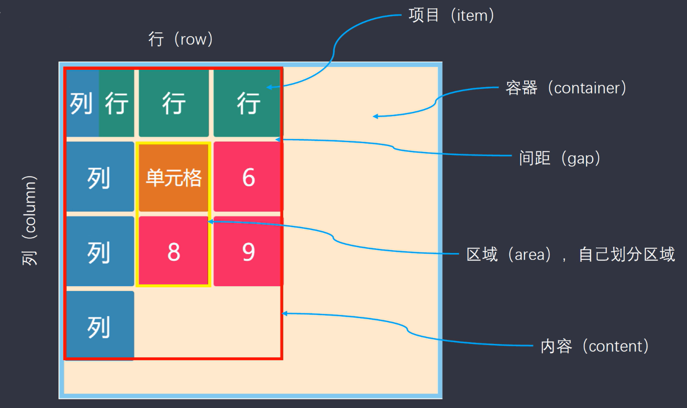</center>


#### 🌱行和列

***容器里面的<span style='color: skyblue;text-decoration: underline;'>水平区域</span>称为"<<span style='color: red;'>行"（row）</span>，<span style='color: skyblue;text-decoration: underline;'>垂直区域</span>称为"<span style='color: red;'>列"（column）</span>***

<center></center>


#### 🍃单元格

***<u>行和列的交叉区域</u>，称为<span style="color: red;">"单元格"（cell）</span>***。

> ***正常情况下，`n`行和`m`列会产生`(n * m)`个单元格***


#### 🍂网格线

***<u>划分网格的线</u>，称为<span style='color:red;'>"网格线"（grid line）</span>。<span style="color:skyblue;text-decoration:underline;">水平网格线划分出行</span>，<span style="color:skyblue;text-decoration:underline;">垂直网格线划分出列</span>***。

> ***正常情况下，`n`行有`(n + 1)`根水平网格线，`m`列有`(m + 1)`根垂直网格线。***

<center></center>


### 💡设置方式

***<code style='color: red;'>给父元素设置display: grid/inline-grod;</code>*** 

> ```css
> display: [可选];
> ```
>
> ​		<code>grid</code>	:	块级网格
>
> ​		<code>inline-grid</code>	:	行级网格
>
> ❗<u>❗***设为网格布局以后，容器子元素（项目）的`float`、`display: inline-block`、`display: table-cell`、`vertical-align`和 <code>column-</code> 等设置都将失效***</u>

<center></center>


<hr>

### 🌳容器属性

#### 定义网格的行与列

> ```css
> grid-template-columns: <number-list>; // 定义列的列宽
> grid-template-rows: <number-list>; // 定义行的行高
> ```
>
> ​		<code>number-list</code>	: 	**定义列数且行大小，单位%，px**
>
> ​		<code>repeat(重复次数,开始行的高/宽 [n的行列的高/宽])</code>	:  <span style='color: red;font-weight: 700;'>函数，</span><u>重复绘制</u>
>
> ​					<code>auto-fill</code>	:	<span style='color: red;font-weight: 700;'>关键字，</span><u>单元格大小固定，容器大不确定，属性将自动填充</u>
>
> ❕**<u>*通用*</u>**
>
> ​					<code>fr</code> :	<span style='color: red;font-weight: 700;'>单位，</span><u>等比例占网格容器剩余可用空间的等分</u>
>
> ​					<code>minmax(min,max)</code>	:	<span style='color: red;font-weight: 700;'>关键字，</span><u>产生一个长度范围，表示长度只能在这个范围之中</u>
>
> ​					<code>auto</code>	:	<span style='color: red;font-weight: 700;'>关键字，</span><u>由浏览器自己决定长度</u>

<center>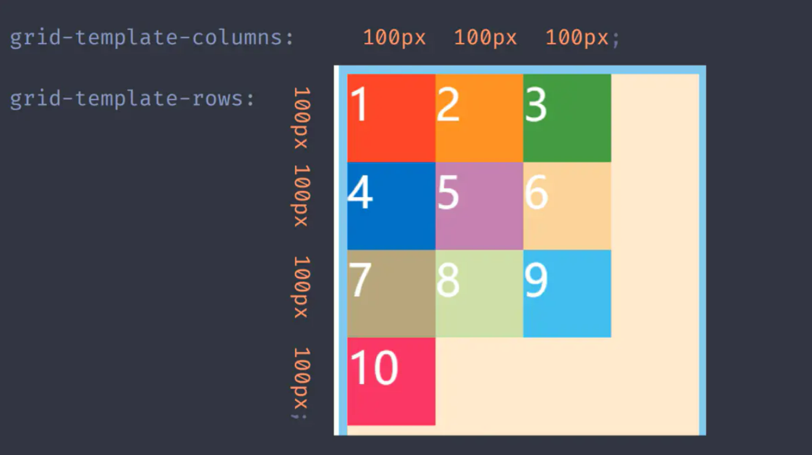</center>


#### 定义网格线名称

> ```css
> grid-template-columns: [可选];
> grid-template-rows: [可选];
> ```
>
> ​			<code>[linen-start] number [line-end]</code>	:	***可使用方括号，指定设置每一根网格线的名字***
>
> ​			`repeat(重复次数,[line-start] number [line-end])`	:	***可使用方括号，设置每网格相同名称***
>
> ❕<span style="color: red;">*<u>可以设置每个单元格的四根网格线名称，网格线名称**可重复，可多个**</u>*</span>

<center></center>


#### 定义行与列的间距

> ```css
> columns-gap: <line-size>; // 设置列间距
> row-gap: <line-size>; // 设置行间距
> gap: <row-size> <column-size>; // 复合属性,只有一个值时,第二个值默认是第一个值
> ```
>
> ​			<code>line-size</code>	:	间距距离，**单位: % px**

<center>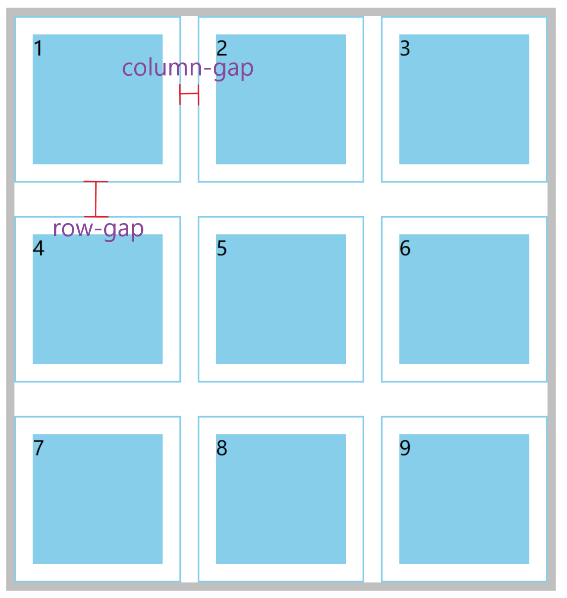</center>


#### 定义网格区域

> ```css
> grid-template-areas: [可选];
> ```
>
> ​		<code>gird-area-name</code>	:	由网格项<code>grid-area</code>指定的网格区域名称
>
> ​		<code>.</code>	:	代表一个空网格单元，不是属于任何区域
>
> ❕❕***区域的命名会影响到网格线。每个区域的起始网格线，会自动命名为`区域名-start`，终止网格线自动命名为`区域名-end`***


#### 项目的排版顺序

> ```css
> grid-auto-flow: [可选];
> ```
>
> ​		<code>row</code>	:	先行后列(**默认值**)
>
> ​		<code>column</code>	:	先列后行
>
> ​		<code>dense</code>	:	换行时留下的空间可以由下面的元素填补上去，***可配合前两个属性使用***

<center>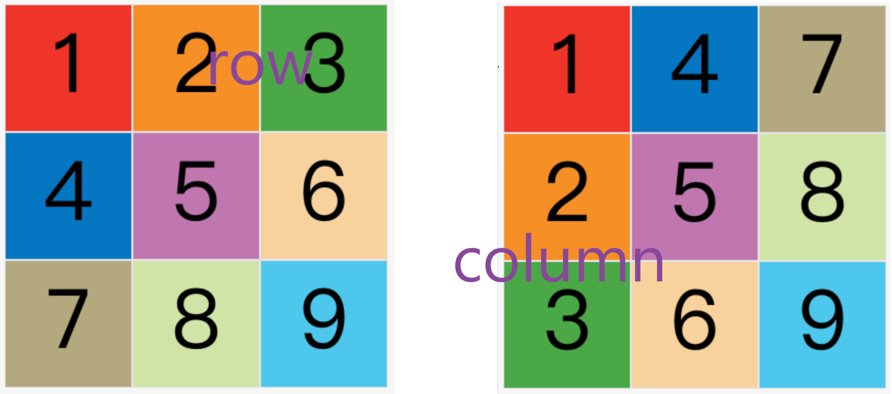</center>

<center>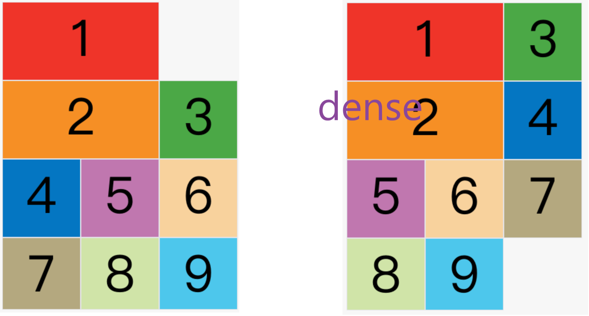</center>


#### 项目的内容对齐方式

> ```css
> justify-items: [可选]; // 水平对齐方式
> align-items: [可选]; // 垂直对齐方式
> place-items: <justify-items> <align-items>; // 复合属性,只有一个值时,第二个值默认第一个值
> ```
>
> ​		<code>start</code>	:	左/上对齐
>
> ​		<code>end</code>	:	右/下对齐
>
> ​		<code>center</code>	:	居中对齐
>
> ​		<code>stretch</code>	:	占满整个单元格

<center>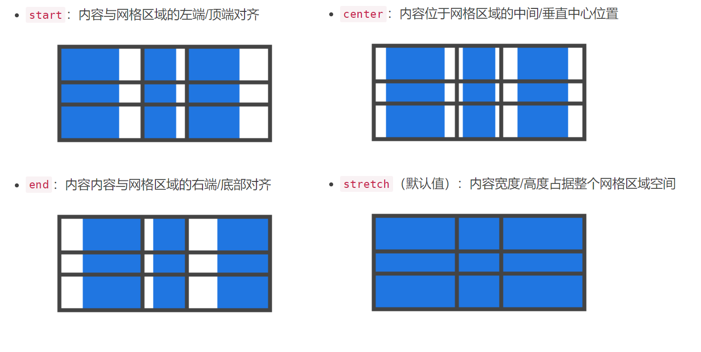</center>


#### 容器内容区域的对齐方式

> ```css
> justify-content: [可选]; // 水平对齐方式
> align-content: [可选]; // 垂直对齐方式
> place-content: <justify-content> <align-content>; // 复合属性,只有一个值时,第二个值默认第一个值
> ```
>
> ​			<code>start</code>	:	左/上对齐
>
> ​			<code>end</code>	:	右/下对齐
>
> ​			<code>center</code>	:	居中对齐
>
> ​			<code>strech</code>	:	占满网格容器
>
> ​			<code>space-around</code>	:	单元格之间设置均等宽/高度的空白间隙，其外边缘间隙为中间空白间隙宽度的50%
>
> ​			<code>space-between</code>	:	单元格之间设置均等宽/高度空白间隙，其外边缘无间隙
>
> ​			<code>space-evenly</code>	:	单元格之间设置均等宽/高度的空白间隙，包括外边缘

<center>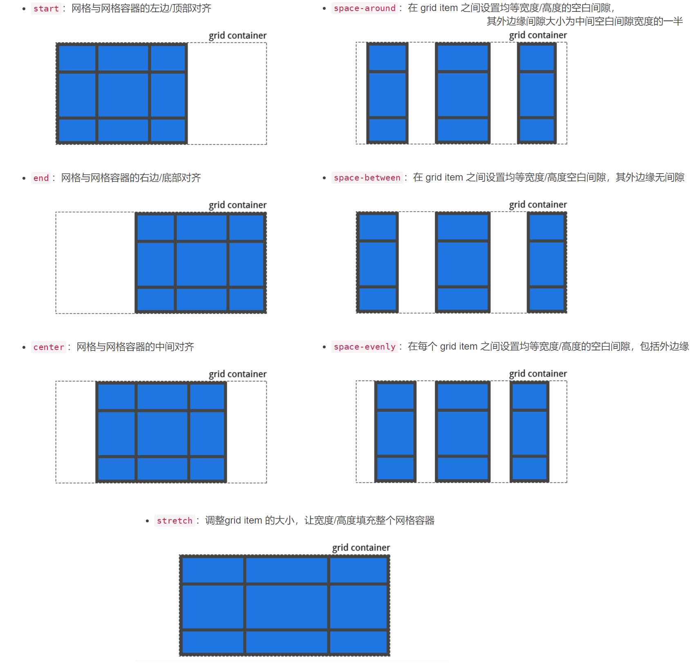</center>


#### 指定隐式网格轨道的大小

❕*<u>指定自动生成的网格轨道（又名隐式网格轨道）的大小，隐式网格轨道在你显式的定位超出指定网格范围的行或列时被创建</u>*

> ```css
> grid-auto-rows: <track-size>; // 隐式行轨道的大小
> grid-auto-columns: <track-size>; // 隐式列轨道的大小
> ```
>
> ​		<code>track-size</code>	:	数值，**单位：px，%，<code>fr</code>**

<center>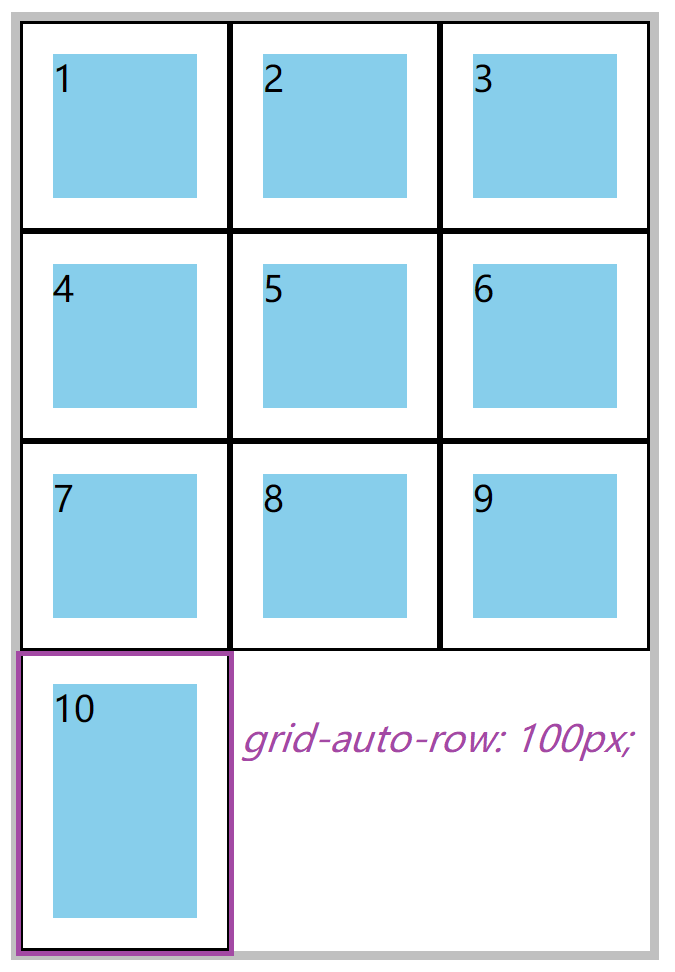</center>


### 🌱项目属性

#### 跨列

> ```css
> grid-column-start: [可选]; // 左边框所在的垂直网格线
> grid-column-end: [可选]; // 右边框所在的垂直网格线
> grid-column: <start-line> / <end-line>; // 复合属性,没有指定结束行值，则默认跨越1个轨道
> ```
>
> ​			<code><liune></code>	:	数值来指代相应编号的网格线，也可以使用名称指代相应命名的网格线
>
> ​			<code>span <number></code>	:	网格项将跨越指定数量的网格轨道
>
> ​			<code>span <name></code>	:	网格项将跨越一些轨道，直到碰到指定命名的网格线
>
> ​			`name number`	:	相同`name`的`number`个
>
> ​			<code>auto</code>	:	<span style='color: red;'>**关键字**</span>，自动布局，或者自动跨越
>
> ​			`span` 	:	**<span style='color: red;'>关键字</span>**，当前单元格

<center>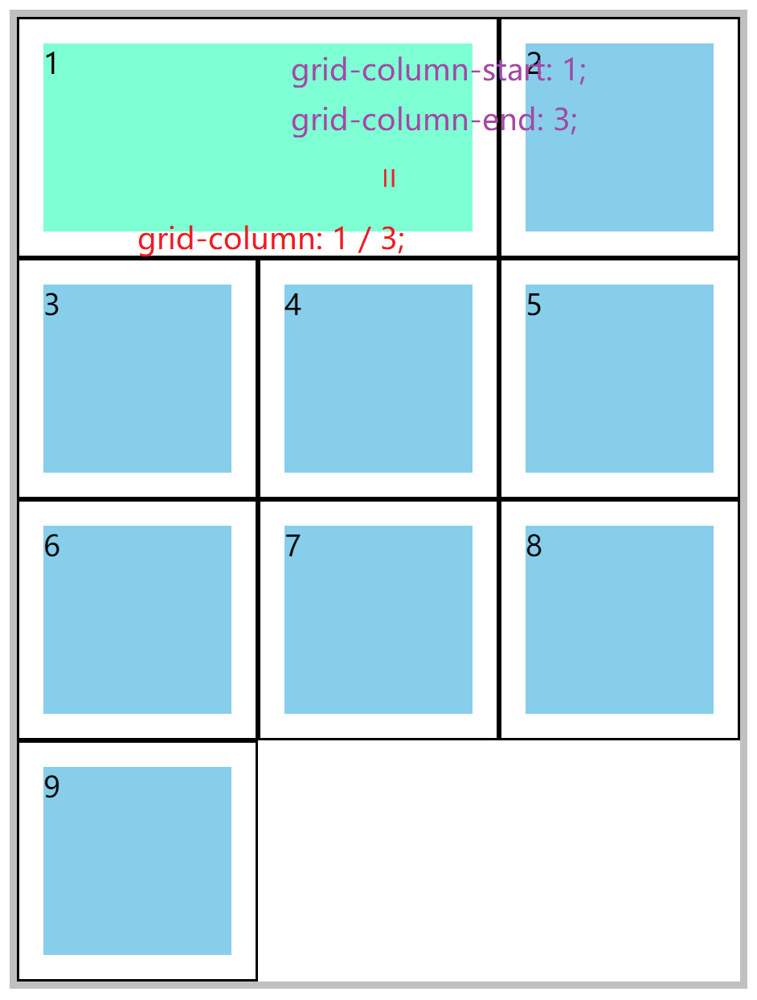</center>


#### 跨行

> ```css
> grid-row-start: [可选]; // 上边框所在的水平网格线
> grid-row-end: [可选]; // 下边框所在的水平网格线
> grid-row: <start-line> / <end-line>; // 复合属性,没有指定结束行值，则默认跨越1个轨道
> ```
>
> ​			<code><liune></code>	:	数值来指代相应编号的网格线，也可以使用名称指代相应命名的网格线
>
> ​			<code>span <number></code>	:	网格项将跨越指定数量的网格轨道
>
> ​			<code>span <name></code>	:	网格项将跨越一些轨道，直到碰到指定命名的网格线
>
> ​			`name number`	:	相同`name`的`number`个
>
> ​			<code>auto</code>	:	<span style='color: red;'>**关键字**</span>，自动布局，或者自动跨越
>
> ​			`span` 	:	**<span style='color: red;'>关键字</span>**，当前单元格

<center>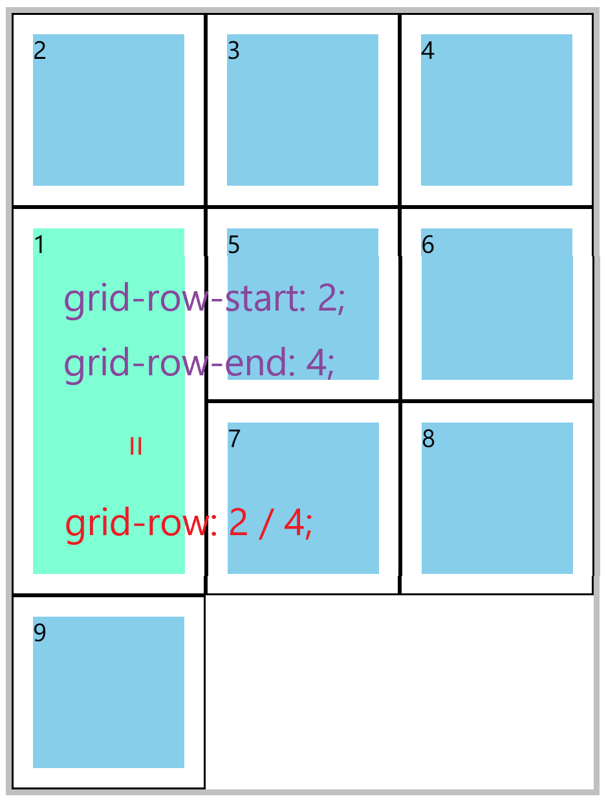</center>


#### 🔅grid-area

> ```css
> grid-area: [可选];
> ```
>
> ​			<code><name></code>	:	指定项目放在哪一个区域，如果区域不存在则对区域的命名
>
> ​			`<row-start> / <column-start> / <row-end> / <column-end>`	:	复合属性***<u>(上，左，下，右)</u>***

<center>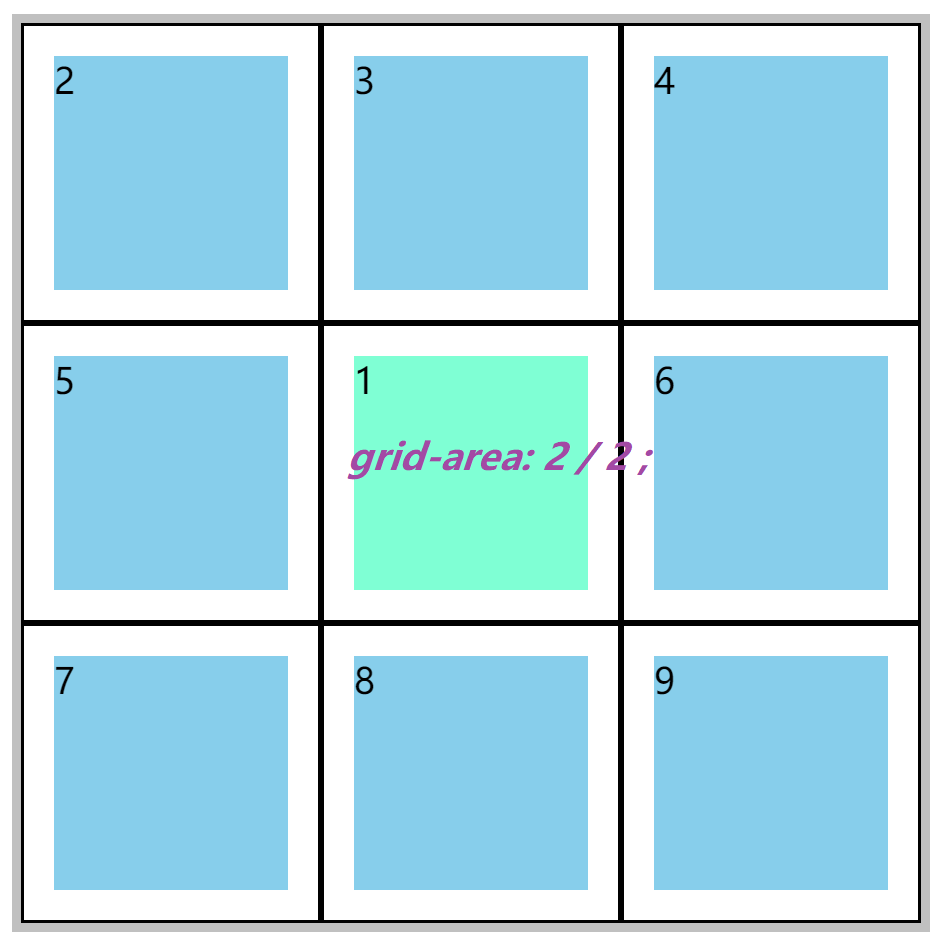</center>


#### ❗❗注意

> ***网格项可以相互重叠，可以使用`z-index`来控制它们的堆叠顺序***


#### 设置单个项目内容对齐方式

> ```css
> justify-self: [可选]; // 单个项目内容的水平对齐
> align-self: [可选]; // 单个项目内容的垂直对齐
> place-self: <justify-self> <align-self>; // 复合属性,有一个值时,第二个值默认第一个值
> ```
>
> ​			`start`	:	对齐单元格的起始边缘
>
> ​			`end`	:	对齐单元格的结束边缘
>
> ​			`center`	:	单元格内部居中
>
> ​			`stretch`	:	拉伸，占满单元格的整个宽度(**默认**)

<center>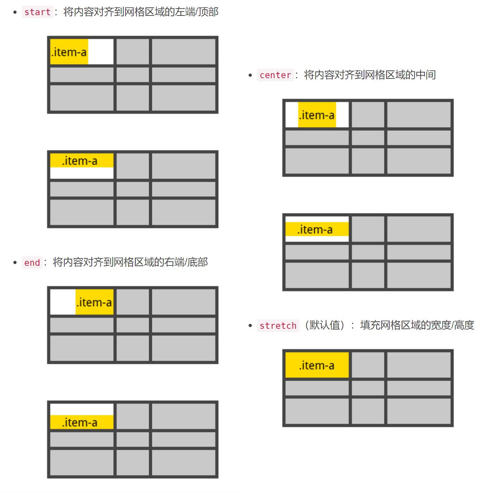</center>


# ▫▫▫终

<center><b><i><u>- 我想成为你刻骨铭心之人 -</u></i></b></center>

