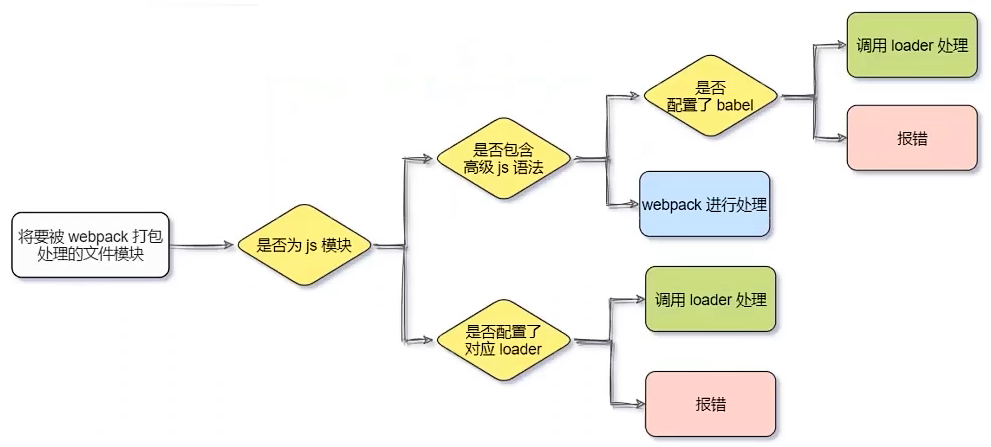
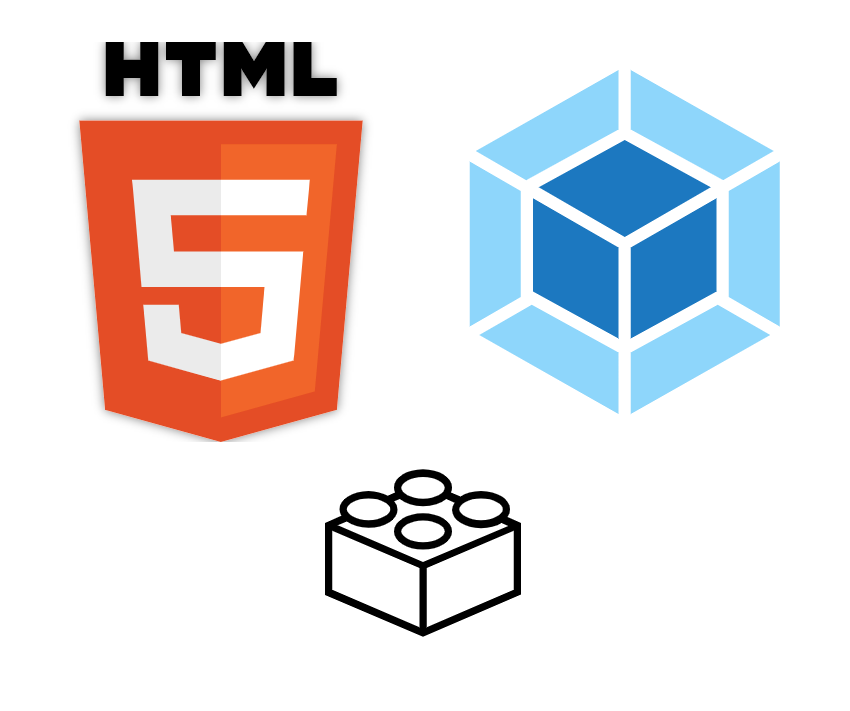

[TOC]

# Webpack

****

🔗[webpack](https://www.webpackjs.com/)

==***`webpack` 是一个现代 `JavaScript` 应用程序的静态模块打包器`(module bundler)`***==

<center></center>


## 🧱前端工程化

> ==***在<span style=color:red;>企业级的前端项目开发</span>中，把前端开发所需的<span style=color:red;>工具</span>、<span style=color:red;>技术</span>、<span style=color:red;>流程</span>、<span style=color:red;>经验</span>等进行<u>规范化</u>、 <u>标准化</u>。***==
>
> ==***<span style=color:red;>自成体系</span>，有一套标准的开发方案和流程***==

- ***<span style=color:red;>模块化</span>（`js` 的模块化、`css` 的模块化、资源的模块化）***
-  ***<span style=color:red;>组件化</span>（复用现有的 `UI` 结构、样式、行为）***
- ***<span style=color:red;>规范化</span>（目录结构的划分、编码规范化、接口规范化、文档规范化、 `Git` 分支管理）***
- ***<span style=color:red;>自动化</span>（自动化构建、自动部署、自动化测试）***


## 安装

```cmd
# npm
npm i --save-dev webpack webpack-cli

# yarn
yarn add webpack webpack-cli --dev
```


## 基本使用

1. ***在项目根目录中，创建 `webpack.config.js` 配置文件，并配置***

   + ```js
     // 导出 webpack 配置对象
     module.exports = {
         mode: 'development' // 用于指定构建模式(开发)
     };
     ```

2. ***在 `package,json`的`scripts`节点下，新增 `dev`脚本***

   1. ```json
      "scripts": {
          "dev": "webpack" // 可通过 npm run 执行
      }
      ```

3. ***在终端中执行 `npm run dev` 命令，对项目进行打包构建***


## 🩺配置

### 📄webpack.config.js

> ***`webpack.config.js` 是 `webpack` 的配置文件***
>
> ***`webpack` 在真正开始打包构建之前，会先读取这个配置文件， 从而基于给定的配置，对项目进行打包***


### 模式(mode)

```js
module.exports = {
    mode: 'production' // 用于指定构建模式(生产)
};
```

+ ###### ***`mode: development`	：开发模式***

  + ###### *<span style=color:red;>不会</span>对打包生成的文件<span style=color:red;>进行代码压缩</span>和<span style=color:red;>性能优化</span>*

  + ###### *打包<span style=color:red;>速度快</span>*

+ ###### ***`mode: production`	：生产模式***

  + ###### *<span style=color:red;>会</span>对打包生成的文件<span style=color:red;>进行代码压缩</span>和<span style=color:red;>性能优化</span>*

  + ###### *打包<span style=color:red;>速度慢</span>*


### ➡入口起点(entry)

> ==*来指定一个入口起点（或多个入口起点），**默认值**为 `./src/index.js`*==

```js
const config = {
    entry: 'index.js' // 打包入口文件的路径
};

module.exports = config;
```


### ⬅出口(output)

> ==*指定`webpack` 在哪里输出它所创建的 `bundles`，以及如何命名这些文件，**默认值**为 `./dist/main.js`*==

```js
const path = require('node:path');

module.exports = {
    entry: 'index.js',
    output: {
        path: path.resolve(__dirname, 'dist'), // 目标输出目录 path 的绝对路径
        filename: 'index_bundle.js' // 输出文件的文件名
    }
};
```


### 🔧加载器(loader)

> ==*`loader` 让 `webpack` 能够去处理那些非 `JavaScript` 文件（`webpack` 自身只理解 `JavaScript`）*==
>
> ==**:grey_exclamation:*`loader` 可以将所有类型的文件转换为 `webpack` 能够处理的有效模块，然后你就可以利用 `webpack` 的打包能力，对它们进行处理***==
>
> ❗<span style=color:red;>***协助 `webpack` 打包处理特定的文件模块***</span>

+ *`css-loader` 可以打包处理 `css` 相关的文件*
+ *`less-loader` 可以打包处理 `less` 相关的文件*
+ *`babel-loader` 可以打包处理 `webpack` 无法处理的 `高级JS` 语法*


#### 🚥loader 的调用过程

**<span style=font-size:20px;>(1)</span>**

<center></center>

**<span style=font-size:20px;>(2)</span>**

<center></center>


#### 🔌配置属性

> :grey_exclamation:==*一个单独的 `module` 对象定义了 `rules` 属性，里面包含两个必须属性：`test` 和 `use`*==
>
> ❗==***<span style=color:red;>多个 `loader`的 调用顺序是：从后往前调用</span>***==

1. *`test` 属性，用于标识出应该被对应的 `loader` 进行转换的某个或某些文件*
2. *`use` 属性，表示进行转换时，应该使用哪个 `loader`*
3. *`exclude`属性，表示排除特定条件==(可选)==*

```js
const config = {
    output: {
        filename: 'index_bundle.js'
    },
    module: {
        rules: [
            { 
                test: /\.js$/, // 可使用正则校验判断
                use: 'babel-loader', // 一个值可使用字符串形式,多个必须使用数组
                exclude: '/node_modules/' // 一个值可使用字符串形式,多个必须使用数组
            }
        ]
    }
};

module.exports = config;
```


#### 处理 css 文件

1. ###### *安装*

   + ```cmd
     npm i style-loader css-loader --save-dev
     ```

2. ###### *在 `webpack.config.js` 的 `module.rules` 的节点中配置*

   + ```json
     module: { // 配置所有第三方模块的匹配规则
         rules: [ // 文件后缀名的匹配规则
             { test: /\.css$/, use: ['style-loader', 'css-loader'] }
         ]
     }
     ```


#### 处理 less 文件

1. ###### *安装*

   + ```cmd
     npm i less-loader less --save-dev
     ```

2. ###### *在 `webpack.config.js` 的 `module.rules` 的节点中配置*

   + ```js
     module: {
         rules: [
             { test: /\.less$/, use: ['style-loader', 'css-loader', 'less-loader'] }
         ]
     }
     ```


#### 处理 url 路径相关的文件

🔗[url-loader](https://www.npmjs.com/package/url-loader)

1. ###### *安装*

   + ```cmd
     npm i url-loader file-loader --save-dev
     ```

2. ###### *在 `webpack.config.js` 的 `module.rules` 的节点中配置*

   + ```js
     module: {
         rules: [
             {
                 test: /\.(png|jpg|gif)$/i,
                 // use: 'url-loader?limit=22229' // 方式(1): 以查询字符串的形式配置参数
                 // limit 用来指定图片的大小(字节byte); 默认true,反之false(不限制文件大小)
                 // 只要 ≤ limit 大小的图片,就会被转为 base64 格式的图片
                 use: [ // 方式(2)
                     {
                         loader: 'url-loader', // 处理的 loader
                         options: {
                             limit: 22229,
                             mimetype: 'image/png', // 设置要转换的文件的 MIME 类型
                             outputPath: 'images', // 设置文件输出的 path 位置
                         }
                     }
                 ]
             }
         ]
     }
     ```


#### 处理 js 高级语法

1. ###### *安装*

   + ```cmd
     npm i babel-loader @babel/core @babel/plugin-proposal-decorators -D
     ```

2. ###### *在 `webpack.config.js` 的 `module.rules` 的节点中配置*

   + ```js
     module: {
         rules: [
             // 必须使用 exclude 指定排除项(因为node_modules目录下的第三方包不需要打包)     
             { test: /\.js$/, use: 'babel-loader', exclude: '/node_modules/' }
         ]
     }
     ```

3. ###### *在项目根目录下，创建 `babel.config.js` 配置文件，定义 `Babel` 的配置项*

   + ```js
     module.exports = {
         // 声明 babel 可用的插件
         plugins: [
             // 🔗https://babeljs.io/docs/en/babel-plugin-proposal-decorators
             ['@babel/plugin-proposal-decorators', { legacy: true }]
         ]
     }
     ```


## 📦打包发布

> ==***项目开发完成之后，需要使用 `webpack` 对项目进行打包发布***==
>
> :grey_exclamation:==***<u>为了让项目能够在生产环境中高性能的运行</u>，需要对项目进行打包发布***==


### 💡步骤

1. ***在 `package.json` 文件的 `scripts` 节点下，新增 `build` 命令***

   + ```json
     "scripts": {
         "dev": "webpack serve", // 开发环境时运行
         "build": "webpack --mode production" // 打包发布时运行
     }
     
     /*
     	"build": "webpack --mode production"
     		--mode : 用来指定 webpack 的运行模式,会覆盖 webpack.config.js 中的 model 选项
     */
     ```

2. ***将 `JavaScript` 文件统一生成到 `js` 目录`(webpack.config.js)`***

   + ```js
     output: {
         path: path.join(__dirname, 'dist'),
         filename: 'js/index_bundle.js'
     }
     ```

3. ***将图片文件统一生成到 `images` 目录`(webpack.config.js)`***

   + ```js
     {
         test: /\.(png|jpg|gif)$/i,
         use: [
             {
                 loader: 'url-loader',
                 options: {
                     limit: 22229,
                     outputPath: 'images', // 设置文件输出的 path 位置
                 }
             }
         ]
     }
     ```


## 🧩插件(Plugins)

==***`Webpack`具有丰富的插件接口，使得`webpack`变得灵活***==


### webpack-dev-server

++++

> ==***可以让 `webpack` 监听项目源代码的变化，从而进行自动打包构建***==
>
> :grey_exclamation:==***`webpack-dev-server` 会启动一个实时打包的 `http` 服务器***==

1. ***安装***

   + ```cmd
     npm i webpack-dev-server -D
     ```

2. ***修改 `package.json`的 `scripts` 节点中的 `dev`命令***

   + ```json
     "scripts": {
         "dev": "webpack serve"
     }
     
     /* // 更多配置
     	"dev": "webpack-dev-server --open --port 8080 --contentBase src"
     		--open : 表示自动打开浏览器
     		--port 8080 : 设置端口号
     		--contentBase src : 把src目录设定为被webpack-dev-server服务器直接托管的目录
     */
     ```

3. ***在`webpack.config.js`文件中添加`devServer`节点进行配置***

   + ```json
     devServer: {
         static: "./",
         open: true,	// 初次打包完成后，自动打开浏览器(可选)
     	host: '127.0.0.1',	// 实时打包所使用的主机地址(可选)
     	port: 8080 	// 实时打包锁使用的端口号(可选)
     }
     ```

4. ***终端运行 `npm run dev` 命令进行打包，可通过 `http://localhost:8080/`查询自动打包结果***


#### 📃打包生成的文件

+ ###### *配置了 `webpack-dev-server` 之后，<u><span style="color:black;">打包生成的文件存放到了内存中</span></u>*

  + <span style="color:black;">*不再根据 `output` 节点指定的路径，存放到实际的物理磁盘上*</span>
  + <span style="color:black;">*提高了实时打包输出的性能，因为内存比物理磁盘速度快很多*</span>

+ ###### *生成到内存中的文件，<u><span style="color:black;">默认放到了项目的根目录中</span></u>，而且是虚拟的、不可见的*

  + <span style="color:black;">*可以直接用 `/` 表示项目根目录，后面跟上要访问的文件名称，即可访问内存中的文件*</span>


### html-webpack-plugin

****

<center></center>

1. ***安装***

   + 🔗[html-webpack-plugin - GitHub](https://github.com/jantimon/html-webpack-plugin)

   + ```cmd
     npm i --save-dev html-webpack-plugin
     ```

2. ***配置 `webpack.config.js` 文件***

   + ```js
     // 1.导入 html-webpack-plugin 插件
     const HtmlWebpackPlugin = require('html-webpack-plugin');
     
     // 2.创建插件实例对象
     const htmlWebpackPlugin = new HtmlWebpackPlugin({
         // title: 'INDEX', // 用于生成的 HTML 文档的标题
         template: './src/index.html', // 指定原文档的相对路径或绝对路径
         filename: './index.html' // 指定要将生成的文件的存放路径, 缺省值为 index.html
     });
     
     // 导出 webpack 配置对象
     module.exports = {
         entry: 'index.js',
         output: {
             path: __dirname + '/dist',
             filename: 'index_bundle.js'
         },
         plugins: [ // 3.在 plugins 节点中,配置 html-webpack-plugin 插件生效
             htmlWebpackPlugin
         ]
     };
     ```

3. ***终端运行 `npm run dev` 命令进行打包，可通过 `http://localhost:8080/`查询自动打包结果***


#### 📃插件生成的文件

+ ###### *通过 `HTML插件`复制到项目根目录中的 `html` 页面，<u><span style="color:black;">也被放到了内存中</span></u>*

+ ###### *`HTML插件`在生成的 `html` 页面时，<u><span style="color:black;">自动注入</span></u>了打包的文件*


### clean-webpack-plugin

++++

> ==***用于每次打包发布时自动清理掉 `dist` 目录中的旧文件***==

1. ***安装***

   + ```cmd
     npm i --save-dev clean-webpack-plugin
     ```

2. ***配置 `webpack.config.js` 文件***

   + ```js
     // 导入 clean-webpack-plugin 插件
     const { CleanWebpackPlugin } = require('clean-webpack-plugin');
     
     // 创建插件实例对象
     const cleanWebpackPlugin = new CleanWebpackPlugin();
     
     // 在 plugins节点中配置插件
     plugins: [ cleanWebpackPlugin, ... ]
     ```


## Source Map

==***`Source Map` 就是一个信息文件，里面<span style=color:red;>存储着压缩混淆后的代码，所对应的<u>转换前的位置</u></span>***==


### 配置

==***在 `webpack.config.js` 中添加的配置，可保证<span style=color:red;>运行时报错的行数</span>与<span style=color:red;>源代码的行数</span>保持一致***==

```js
const webpackConfig = {
    mode: 'development',
    devtool: 'eval-source-map', // 仅推荐在 "开发环境" 下使用,不建议在 "生成环境" 下使用
}

module.exports = webpackConfig;
```


