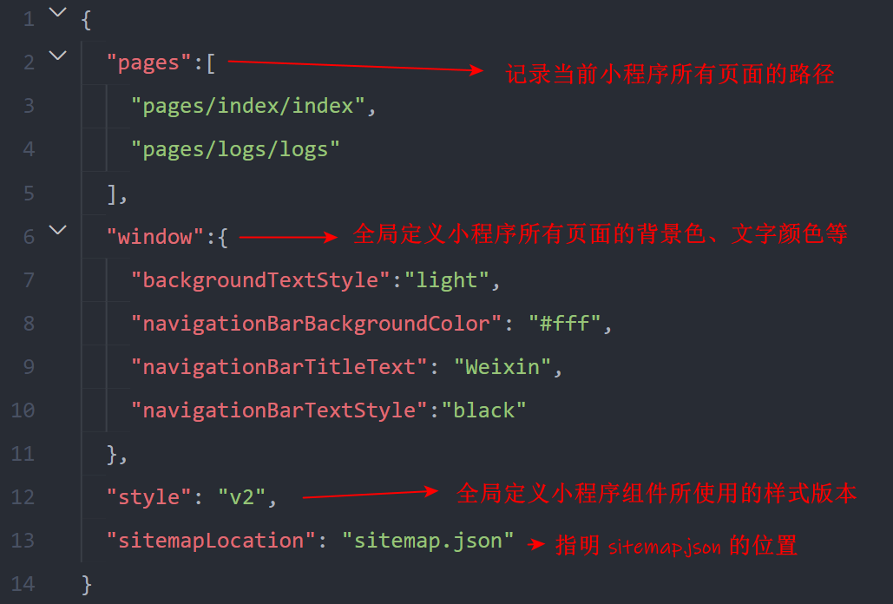
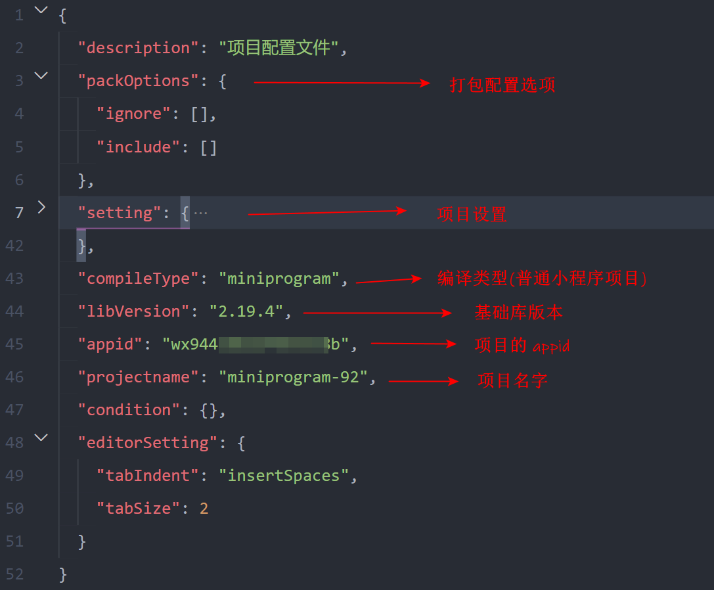
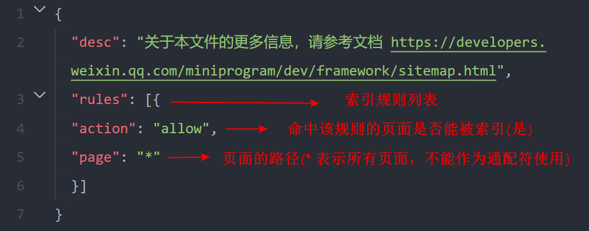

[TOC]

# 微信小程序

## 简介🎈

> *:grey_exclamation:**小程序与普通网页开发的区别***

1. **运行环境不同**

   > 网页运行在浏览器环境中
   >
   > 小程序运行在微信环境中

2. **API不同**

   >由于运行环境的不同，所以小程序中，无法调用`DOM`和`BOM`的`API`
   >
   >小程序中可以调用微信环境提供的各种`API(地理定位，扫码，支付)`

3. **开发模式不同**

   > 网页的开发模式：**浏览器 + 代码编辑器**
   >
   > 小程序有自己的一套标准开发模式：
   >
   > + **申请小程序开发账号**
   > + **安装小程序开发者工具**
   > + **创建和配置小程序项目**

## 小程序官方组件🚩

> :grey_exclamation:**使用<u>微信</u>扫码下方小程序码，体验小程序**

## 开发模式📋

### 注册开发账号🌠

1. 浏览器打开🔗[微信公众平台 (qq.com)](https://mp.weixin.qq.com/),点击右上角的**“立即注册“**

   <left></left>

2. **选择注册账号的类型**

   <left></left>

3. **填写账号信息**

   <left></left>

4. **邮箱激活**

   <left></left>

5. **点击链接激活账号**

   <left></left>

6. **选择主体类型**

   <left></left>

7. **获取小程序的`AppID`**

   <left></left>

### 安装开发者工具🔧

1. **下载🔗[微信开发者工具（稳定版 Stable Build）](https://developers.weixin.qq.com/miniprogram/dev/devtools/stable.html)**

2. **微信扫码登录**

3. **设置代理**

   <left></left>

### 创建小程序项目🔨

1. **创建项目**

   <left></left>

2. **逻辑项目信息**

   <left></left>

3. **项目创建完成**

   <left></left>

## 项目结构🔩

<left></left>

### 页面的组成📃

<left></left>

### JSON配置文件📜

> :heavy_exclamation_mark:==**`JSON`是一种数据格式，在实际开发中，`JSON`总是以配置文件的形式出现，<u>通过不同的`.json`配置文件，可以对小程序项目进行不同级别的配置</u>**==

***:grey_exclamation:小程序项目中有`4`种`json`配置文件:***

1. **项目根目录中的`app.json`配置文件**

   <left></left>

2. **项目根目录中的`project.config.json`配置文件**

   <left></left>

3. **项目根目录中的`sitemap.json`配置文件**

   + > :grey_exclamation:**`sitemap.json`文件用来配置小程序页面是否允许微信索引**
     >
     > ==*当开发者允许微信索引时，微信会通过爬虫的形式，为小程序的页面内容建立索引。当用户的搜索关键字和页面的索引匹配成功的时候，小程序的页面将可能展示在搜索结果中*==
     >
     > <left></left>
     >
     > :heavy_exclamation_mark:`sitemap`的索引提示是默认开启的，如需要关闭`sitemap`的索引提示，可在小程序项目配置文件`project.config.json`的`setting`中配置字段`checkSiteMap`为`false`

4. **每个页面文件夹中的`.json`配置文件**

   + > :heavy_exclamation_mark:==**小程序中的每一个页面，都可以使用`.json`文件来对本页面的窗口外观进行配置，页面中的配置项会覆盖`app.json`的`window`中相同的配置项**==

#### 创建页面📄

> :grey_exclamation:==**只需要在`app.json`文件的`pages`中新增页面的存放路径，小程序开发者工具即可自动创建对应的页面文件**==
>
> ~~~json
> {
>     "pages":[
>     	"pages/index/index",
>         "pages/logs/logs",
>         "pages/home/home"
>     ],
> }
> ~~~

#### 修改项目首页🔖

> :grey_exclamation:==**只需要调整`app.json`文件中`pages`数组中页面路径的前后顺序，即可修改项目的首页。小程序会把排在第一位的页面，当作项目首页进行渲染**==
>
> ~~~json
> {
>     "pages":[
>         "pages/home/home",
>     	"pages/index/index",
>         "pages/logs/logs"
>     ],
> }
> ~~~

### WXML模板📘

> `WXML（WeiXin Markup Language）`是小程序框架设计的一套标签语言，用来构建小程序页面的结构，其作用类似于网页开发中的 HTML

### 📕
